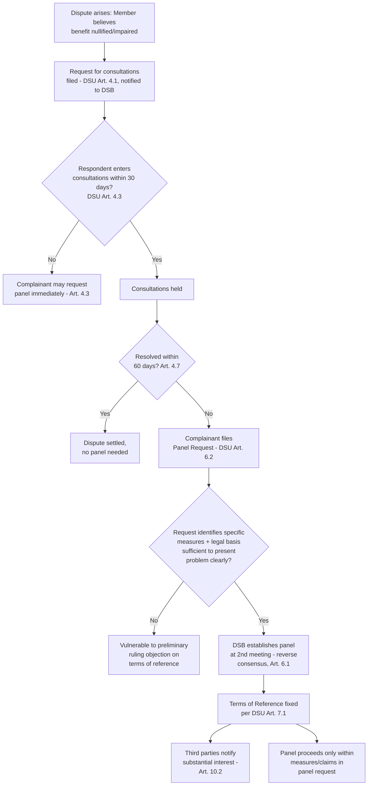

## Consultations, Panel Requests, and the Terms of Reference Under DSU Articles 4 and 6

### Legal Basis: Consultations as a Mandatory Precondition

DSU Article 4.1 obligates Members to "afford adequate opportunity for consultation" regarding any measure a complainant considers to nullify or impair benefits under a covered agreement. Article 4.3 requires consultations to be entered into within 30 days of the request, and Article 4.7 permits the complainant to request establishment of a panel if consultations fail to resolve the dispute within 60 days of the original consultation request. Consultations are a jurisdictional precondition, not a formality: a panel lacks authority to hear claims that were never the subject of consultations.

**Definition on first use — "nullification or impairment":** The foundational injury standard under GATT Article XXIII:1 and incorporated into DSU Article 3.8, meaning a benefit reasonably expected under a covered agreement has been undermined, whether or not the challenged measure formally breaches a specific provision (this underlies the distinct category of "non-violation" complaints under DSU Article 26).

### The Function and Limits of Consultations

Consultations serve three purposes recognized in WTO jurisprudence: (1) allowing parties to clarify the factual and legal basis of the dispute, (2) providing an opportunity for a negotiated settlement without adjudication, and (3) — critically for later stages — defining the outer boundary of what can subsequently be litigated.

The Appellate Body addressed the relationship between consultations and later panel proceedings in **Mexico – Corn Syrup (Article 21.5 – US)** (WT/DS132/AB/RW, 2001) and, more directly on scope, in **Brazil – Aircraft** (WT/DS46/AB/R, 1999). The general principle: a panel's terms of reference cannot exceed the scope of the dispute as it existed at consultations, but the legal claims in the panel request need not be identical word-for-word to the consultation request, since consultations are expected to be more general and exploratory while the panel request must be legally precise.

**Practitioner note:** A common strategic error is treating consultations as perfunctory. Since a claim never raised — even implicitly — in consultations is vulnerable to a jurisdictional objection at the panel stage, experienced counsel use the consultation request to preserve maximum flexibility for the eventual panel request, without yet committing to a final legal theory.

### DSU Article 6.2: The Panel Request as the Foundational Pleading

If consultations fail, DSU Article 6.1 provides that a panel shall be established at the second Dispute Settlement Body (DSB) meeting at which the request appears, unless the DSB decides by consensus not to (the "reverse consensus" or "negative consensus" rule that replaced GATT-era unanimity, meaning a single Member can no longer block a panel by refusing to consent).

Article 6.2 sets the pleading standard for the panel request itself, requiring it to:

1. Identify the specific measures at issue; and
2. Provide a brief summary of the legal basis of the complaint sufficient to present the problem clearly.

This second requirement is the single most heavily litigated procedural threshold in WTO dispute settlement, because it simultaneously defines the panel's terms of reference under DSU Article 7.1 and the respondent's due-process notice of the case it must defend.

### The Controlling "Sufficient to Present the Problem Clearly" Standard

The Appellate Body's leading interpretation comes from **EC – Bananas III** (WT/DS27/AB/R, 1997) and was refined substantially in **Thailand – H-Beams** (WT/DS122/AB/R, 2001) and **US – Carbon Steel** (WT/DS213/AB/R, 2002). The operative test:

- A panel request must at minimum *list* the specific provisions of the specific agreements claimed to have been violated. Simply citing an agreement generally (e.g., "the GATT") without identifying the article is ordinarily insufficient.
- Whether the request is "sufficient to present the problem clearly" is assessed on the face of the request itself, considered as a whole, and evaluated as of the time of filing — a defect cannot ordinarily be cured by later submissions, though the Appellate Body has recognized that subsequent submissions can be used to *confirm or clarify* the meaning of words already used in the request.
- The standard is objective: it asks whether the respondent and third parties were placed on notice of the legal basis of the complaint, not whether the specific respondent subjectively understood the claim.

**Case illustration — Thailand – H-Beams:** The Appellate Body found that the EC's panel request, which cited Article 2 of the Anti-Dumping Agreement broadly without identifying which specific sub-paragraphs were at issue on the calculation of dumping margins, failed to meet the Article 6.2 standard for those specific sub-claims, even though other claims in the same request were adequately pleaded. This illustrates that adequacy is assessed claim-by-claim, not as an all-or-nothing determination for the whole request.

### Terms of Reference: DSU Article 7 and Its Jurisdictional Effect

DSU Article 7.1 establishes the standard terms of reference: "To examine, in the light of the relevant provisions of [the covered agreement(s) cited by the parties], the matter referred to the DSB by [the complainant] in document [the panel request]." Unless the parties agree to special terms of reference (Article 7.3), the panel request *is* the panel's jurisdictional charter.

**Key Points:**

- A panel exceeding its terms of reference commits reversible legal error; the Appellate Body has vacated or refused to address findings that strayed beyond the measures or claims properly identified in the panel request.
- "Measures" and "claims" are treated distinctly: the panel request must identify both the challenged measure with precision (including, where relevant, amendments or successor measures — see **Chile – Price Band System**, WT/DS207/AB/R, 2002, on whether a panel may address a measure that evolved after the panel request date) and the specific legal claims against that measure.
- Evolving or amended measures present a recurring jurisdictional problem: panels have generally held that a measure enacted after the panel request but that does not change the "essence" of the originally challenged measure can still fall within the terms of reference, whereas a materially different successor measure requires a fresh panel request.

### Third-Party Rights

DSU Article 4.11 allows Members with a "substantial trade interest" to join consultations with the consulting party's agreement; Article 10.2 allows Members having "a substantial interest" in the matter to participate as third parties in panel proceedings upon notifying the DSB, without needing to have joined consultations. Third-party participation rights (written submissions, attendance at the first substantive panel meeting) are narrower than party rights but confer standing to make oral and written arguments and, since **US – 1916 Act** (WT/DS136, WT/DS162, 2000) and later systemic practice, to receive expanded procedural rights in some panels ("enhanced third-party rights") at the panel's discretion.

### Procedural Flow

### Practitioner Implications

For a complainant's counsel, the discipline required at the Article 6.2 stage is front-loaded: because the panel request effectively cannot be amended once filed (absent starting a new WT/DS proceeding), drafting practice has converged on listing every plausibly relevant provision of every plausibly relevant covered agreement, even at the cost of a lengthy request, since omitted claims are lost for that proceeding. For a respondent's counsel, the first available line of defense — often litigated as a preliminary ruling request before submissions on the merits — is testing whether the panel request meets the Article 6.2 threshold, since a successful jurisdictional objection can eliminate specific claims (or the whole case) without reaching substance. [Inference] This dynamic means Article 6.2 objections are raised in the substantial majority of contested WTO disputes as a low-cost, high-value procedural motion, though outcomes vary heavily based on the specificity of the underlying request.

### Related Topics

- DSU Article 21.5 compliance proceedings and their distinct terms-of-reference questions
- Preliminary ruling procedures and working procedures adopted under DSU Appendix 3
- The distinction between violation and non-violation nullification-or-impairment claims (DSU Article 26)
- Special and additional consultation/panel timelines under specific covered agreements (e.g., SCM Agreement Article 4 for prohibited subsidies)
- Third-party "enhanced rights" practice and its procedural variation across panels