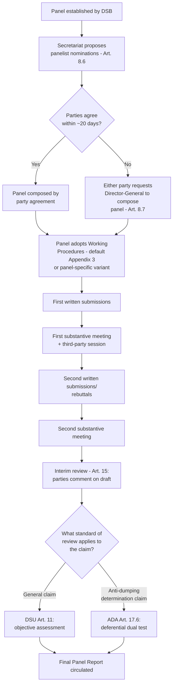

## Panel Composition, Working Procedures, and the Applicable Standard of Review

### Legal Basis: Panel Composition Under DSU Article 8

DSU Article 8.1 requires panels to be composed of "well-qualified governmental and/or non-governmental individuals," including persons who have served on or presented a case to a panel, served as a representative of a Member, taught or published in international trade law or policy, or served as a senior trade-policy official. Article 8.3 disqualifies nationals of parties or third parties from serving absent agreement of the parties, reflecting an independence requirement rather than a formal recusal regime modeled on judicial courts.

**Definition on first use — "panel" versus "Appellate Body":** A panel is an ad hoc, dispute-specific body (typically three individuals, exceptionally five under Article 8.5) constituted anew for each dispute; this contrasts with the Appellate Body, a standing body of members serving fixed terms — a structural distinction relevant because panel composition, unlike Appellate Body composition, is negotiated or imposed fresh in every case.

### The Composition Process and the Director-General's Role

Article 8.6 provides that the WTO Secretariat proposes nominations to the parties, who "shall not oppose nominations except for compelling reasons." In practice, parties frequently cannot agree on nominees within the default 20-day window contemplated by Article 8.7, at which point either party may request the Director-General to determine the composition, in consultation with the Chairman of the DSB and the relevant Council or Committee chairman.

**Practitioner note:** Director-General-composed panels are common, not exceptional — in a significant share of disputes, parties fail to agree on panelists within the statutory window, particularly where the dispute involves politically sensitive measures. Counsel should treat the composition stage as a substantive strategic phase: proposing well-qualified nominees with relevant sectoral expertise (e.g., customs valuation experience for a valuation dispute) increases the likelihood the Secretariat's subsequent list draws from a favorable pool, even though outright rejection of a nominee without compelling reason is discouraged by DSU practice.

### Working Procedures: Appendix 3 and Panel-Specific Adjustments

DSU Appendix 3 sets out the default Working Procedures governing panel proceedings — the sequence of written submissions, the first and second substantive meetings with the parties, third-party sessions, and the interim review stage (DSU Article 15, allowing parties to comment on descriptive and, ultimately, substantive aspects of the panel's draft report before circulation). Panels are permitted under DSU Article 12.1 to depart from the Appendix 3 default after consulting the parties, and most panels today adopt supplementary working procedures addressing matters Appendix 3 does not resolve in detail, such as:

- Treatment of business confidential information (BCI), increasingly significant in disputes involving trade-remedy calculations or subsidy data;
- Procedures for open or public hearings (adopted in several high-profile disputes, e.g., **US – Continued Suspension** and **Canada – Continued Suspension**, both WT/DS320 and WT/DS321, 2008, where hearings were opened to public observation by agreement of the parties);
- Deadlines and formats for amicus curiae submissions from non-parties, a practice the Appellate Body confirmed panels have discretion to accept or reject under Article 13's general authority to seek information, following **US – Shrimp** (WT/DS58/AB/R, 1998).

### DSU Article 11: The General Standard of Review

Article 11 DSU is the textual anchor for the panel's standard of review across all disputes not otherwise governed by a more specific standard: a panel "should make an objective assessment of the matter before it, including an objective assessment of the facts of the case and the applicability of and conformity with the relevant covered agreements."

The Appellate Body's leading gloss on Article 11 is **EC – Hormones** (WT/DS26/AB/R, WT/DS48/AB/R, 1998), which held that the objective-assessment standard sits between the extremes of *de novo review* (fully re-examining fact and law without deference) and "total deference" to the responding Member's own determinations. A panel errs under Article 11 if it fails to consider all relevant evidence, disregards evidence without explanation, or engages in an assessment so wide of the mark that it constitutes a "disregard," "distortion," or "misrepresentation" of the evidence — the formulation used in subsequent cases including **US – Wheat Gluten** (WT/DS166/AB/R, 2001) to describe the high threshold for successfully alleging an Article 11 violation on appeal.

### The Specialized Standard of Review Under the Anti-Dumping Agreement

**Key Points:**

- Article 17.6 of the Anti-Dumping Agreement supplies a *different*, more deferential standard than Article 11 DSU for panels reviewing anti-dumping determinations specifically: Article 17.6(i) directs panels to assess whether the investigating authority's establishment of facts was proper and its evaluation unbiased and objective — and if so, the panel shall not overturn the evaluation even if it might have reached a different conclusion.
- Article 17.6(ii) further directs panels to interpret the Anti-Dumping Agreement's provisions in accordance with customary rules of treaty interpretation, but where more than one permissible interpretation exists, the panel shall find the investigating authority's measure to be in conformity if it rests on one of those permissible interpretations — a rule some commentators describe as importing a *Chevron*-style deference concept into WTO law, though the Appellate Body has been careful not to equate the two frameworks directly.
- This dual-standard problem — Article 11 DSU generally, Article 17.6 ADA specifically for dumping determinations — means a panel handling an anti-dumping dispute alongside other claims (e.g., a parallel Safeguards Agreement claim, which is reviewed under ordinary Article 11) must apply materially different levels of deference to different parts of the same underlying determination.

### The SPS Agreement Standard: Independent Scientific Assessment

Disputes under the Agreement on the Application of Sanitary and Phytosanitary Measures (SPS Agreement) apply ordinary Article 11 DSU review, but the substantive obligation being reviewed — SPS Article 5.1's requirement that measures be "based on" a risk assessment — has generated its own standard-of-review jurisprudence. **EC – Hormones** held that panels are not confined to the scientific evidence the respondent Member considered at the time of its determination; panels may consult independent scientific experts under DSU Article 13.2 and consider evidence beyond the administrative record, a materially more searching posture than the ADA Article 17.6 approach to trade-remedy determinations.

### Comparing the Two Deference Regimes

| Feature | General Standard (DSU Art. 11) | Anti-Dumping Standard (ADA Art. 17.6) |
| --- | --- | --- |
| Applies to | All claims not otherwise specified | Only dumping-determination claims under the ADA |
| Factual review | Objective assessment; failure = disregard/distortion/misrepresentation | Panel defers if authority's fact-finding was "proper" and evaluation "unbiased and objective" |
| Legal interpretation | Ordinary customary treaty interpretation (VCLT Arts. 31–32) | If more than one permissible interpretation exists, authority's chosen interpretation is upheld |
| Leading case | EC – Hormones | US – Hot-Rolled Steel (WT/DS184/AB/R, 2001) |

### Composition and Review Flow

### Practitioner Implications

For counsel litigating a trade-remedy dispute, the choice of which standard of review governs a given claim is not academic: an argument framed as challenging the investigating authority's factual determination invites the deferential Article 17.6(i) test, whereas the same underlying grievance reframed as a challenge to the authority's *legal interpretation* of an ambiguous ADA provision invites the "permissible interpretation" test of Article 17.6(ii) — and skilled advocates select the framing that maximizes the chance a panel finds no permissible basis for the authority's approach. For counsel navigating panel composition, timely, well-substantiated objections to a nominee (grounded in Article 8.3's independence concern or genuine conflicts) preserve credibility for the "compelling reasons" standard, since frivolous objections consume goodwill that may be needed at a later procedural juncture, such as requesting supplementary working procedures for confidential information.

### Related Topics

- DSU Article 13 authority to seek information and the use of independent experts and expert review groups
- Appellate Body review under DSU Article 17 and the "issues of law" limitation distinguishing it from panel-level fact review
- Business confidential information protocols in trade-remedy disputes
- The SPS Agreement Article 5.7 precautionary/provisional measures standard as a further variant on evidentiary review
- Amicus curiae practice and the boundaries of panel discretion under Article 13