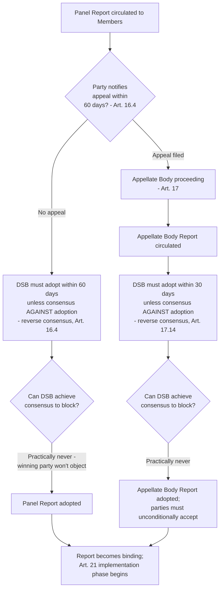

## The Reversed Consensus Rule for Adopting Panel and Appellate Body Reports

### Legal Basis: Where Reverse Consensus Appears in the DSU

The reverse consensus rule (also called "negative consensus" or "reversed consensus") is not stated as a single freestanding provision; it is embedded at three distinct procedural junctures in the DSU, each phrased as an action the Dispute Settlement Body (DSB) "shall" take "unless the DSB decides by consensus not to":

- **Panel establishment** — DSU Article 6.1: a panel shall be established at the DSB meeting following the one at which the request first appears, unless the DSB decides by consensus not to establish it.
- **Panel report adoption** — DSU Article 16.4: the DSB shall adopt the panel report within 60 days of circulation unless a party formally notifies its decision to appeal, or the DSB decides by consensus not to adopt it.
- **Appellate Body report adoption** — DSU Article 17.14: the DSB shall adopt the Appellate Body report and the parties shall unconditionally accept it, unless the DSB decides by consensus not to adopt it.

**Definition on first use — "consensus" (DSU footnote 1):** A decision is deemed taken by consensus if no Member formally objects, when present at the meeting where the decision is made. Ordinary consensus decision-making, as used elsewhere at the WTO for rule-making and accessions, requires the affirmative absence of objection to *approve* an action. Reverse consensus inverts this: it requires the affirmative absence of objection to *block* an action that otherwise proceeds automatically.

### Why the Mechanism Was Created: The GATT-Era Blocking Problem

Under the pre-1995 GATT dispute settlement practice, panel reports required positive consensus for adoption — meaning any single contracting party, including the losing respondent, could block adoption simply by withholding consent. This created chronic non-enforcement: a Member found to have violated its obligations retained a unilateral veto over whether that finding ever became legally operative. The Uruguay Round negotiators addressed this directly by re-engineering the default: since the complainant, as a WTO Member, would be present at the DSB meeting and would not join a consensus against its own favorable ruling, and the respondent alone cannot constitute a "consensus" against adoption (a consensus requires the absence of objection from *everyone* present, including the very Member seeking to block it), reports adopt automatically as a practical matter in every case that reaches the DSB adoption stage.

**Practitioner note:** The functional effect is that reverse consensus makes report adoption *quasi-automatic*. In the entire history of the DSU, the reverse-consensus threshold to block adoption has, as a practical matter, never been met, because doing so would require the prevailing party to vote against its own victory. This is the single most consequential structural difference between GATT-era and WTO-era dispute settlement, converting a diplomatic, consent-based system into what is frequently described as a rules-based, quasi-judicial one.

### The Interaction With the Right to Appeal

Reverse consensus for panel report adoption (Article 16.4) is qualified by the automatic right to appeal under DSU Article 16.4 and Article 17.4: any party to the dispute may appeal a panel report as of right, and doing so suspends the 60-day adoption clock pending completion of the appeal. This means reverse consensus at the panel stage functions less as the operative adoption mechanism in contested cases and more as a default that is frequently superseded by appeal — since a losing party dissatisfied with a panel's legal reasoning need not attempt to block consensus (which would fail) but can instead exercise the unconditional right to appeal, which the Appellate Body has confirmed cannot be denied or conditioned by the DSB.

By contrast, Appellate Body report adoption under Article 17.14 has no further right of appeal within the WTO system, making reverse consensus at that stage the true final procedural gate — and, because of the automaticity described above, effectively guarantees adoption.

### Consequences for the Legitimacy Debate

The reverse consensus mechanism is central to both sides of the debate over whether WTO dispute settlement structurally advantages certain Members.

**The case that reverse consensus strengthened rules-based multilateralism:** By eliminating the unilateral veto, reverse consensus is widely credited with transforming the WTO dispute settlement system into what the Appellate Body itself, in **US – Shrimp** (WT/DS58/AB/R, 1998) and elsewhere, has characterized as a more "security and predictability"-oriented system, tracking the objective stated in DSU Article 3.2. Empirically, this is credited with enabling smaller and developing-country Members to obtain enforceable rulings against major trading powers (e.g., **Antigua and Barbuda – US Gambling**, WT/DS285, where a small Member secured and had adopted findings against the United States) in a way that would have been structurally impossible if the respondent could block adoption.

**The case that reverse consensus, paradoxically, entrenched a different vulnerability:** Critics — including the position taken by the United States since roughly 2016–2019 in blocking Appellate Body appointments — argue that automaticity of adoption, combined with the absence of any political check on the *content* of Appellate Body rulings, allowed the Appellate Body to engage in what US trade officials characterized as impermissible "overreach" (for example, on issues such as the interpretation of "public body" in subsidy disputes, at issue in **US – Anti-Dumping and Countervailing Duties (China)**, WT/DS379/AB/R, 2011). Because no Member can practically block an adverse ruling once issued, the argument runs, the automaticity that protects small Members from a losing respondent's veto simultaneously removes any corrective mechanism against a panel or the Appellate Body exceeding its interpretive mandate under DSU Article 3.2's injunction not to "add to or diminish the rights and obligations provided in the covered agreements." This dissatisfaction is the immediate proximate cause of the US blockade of Appellate Body member appointments beginning in 2017, which by December 2019 left the Appellate Body without a quorum.

### Reverse Consensus and the Present Appellate Body Impasse

[Inference] The reverse consensus rule's automaticity, while solving the GATT-era blocking problem for report *adoption*, created no equivalent constraint preventing a Member from blocking the *appointment* of new Appellate Body members, since appointments under DSU Article 17.2 require positive consensus of the DSB — the ordinary, non-reversed decision rule. The US exploited this asymmetry: rather than attempting to block adoption of unfavorable reports (a practical impossibility under reverse consensus), it blocked the entirely separate, positive-consensus appointments process, achieving a comparable practical effect (undermining binding appellate review) through a procedural avenue reverse consensus does not reach. This illustrates that reverse consensus, however effective at solving the specific problem of adoption-blocking it was designed for, did not immunize the broader dispute settlement architecture from being constrained through adjacent procedural levers.

### Procedural Flow

### Practitioner Implications

For a negotiator or dispute-settlement lawyer, the operative lesson is that the DSB adoption meeting itself is rarely a site of genuine contest — the real battleground has shifted upstream, to the panel and Appellate Body proceedings on the merits, and (since 2019) to the separate, positive-consensus process for Appellate Body appointments, which remains the live procedural chokepoint despite reverse consensus's success in solving the adoption-blocking problem it was designed to address. Counsel advising a government considering whether to resist an adverse finding should understand that attempting to block adoption via the DSB is not a realistic strategy; the available levers are appeal (at the panel stage), non-compliance followed by Article 21.5/22 sequencing disputes, or — as the recent Appellate Body impasse demonstrates — targeting the composition of the adjudicative body itself rather than the adoption of its output.

### Related Topics

- The Appellate Body appointments crisis (2017–2019) and the Multi-Party Interim Appeal Arbitration Arrangement (MPIA) as a workaround
- DSU Article 21.5 compliance panels and Article 22 suspension of concessions following non-implementation
- The distinction between positive consensus (used for WTO rule-making and accessions) and reverse consensus as competing DSB decision rules
- DSU Article 3.2's "not to add to or diminish rights and obligations" limitation and the overreach debate
- Historical GATT-era panel adoption practice and blocked reports (e.g., **US – Tuna/Dolphin**) as the baseline reverse consensus was designed to replace