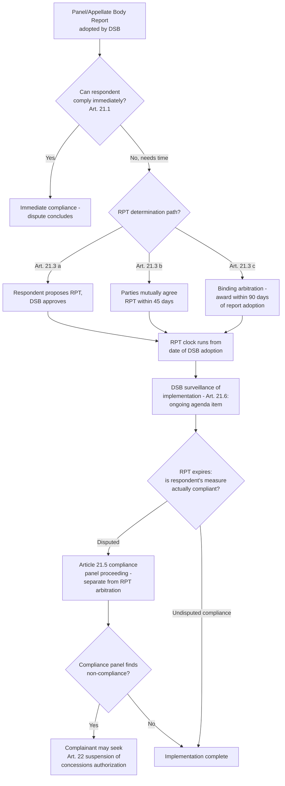

## Implementation and the "Reasonable Period of Time" Under DSU Article 21

### Legal Basis: The Implementation Obligation

DSU Article 21.1 establishes that "prompt compliance with recommendations or rulings of the DSB is essential in order to ensure effective resolution of disputes to the benefit of all Members." Article 21.3 operationalizes this: where immediate compliance is impracticable, the implementing Member "shall have a reasonable period of time" (RPT) to bring the offending measure into conformity, established by one of three mechanisms:

- **Article 21.3(a):** the RPT proposed by the implementing Member and approved by the DSB;
- **Article 21.3(b):** the RPT mutually agreed by the parties within 45 days of DSB adoption of the report, absent DSB approval under (a); or
- **Article 21.3(c):** absent agreement under (a) or (b), the RPT determined through binding arbitration, to be completed within 90 days of report adoption.

**Definition on first use — "reasonable period of time" (RPT):** The DSU term of art for the window a losing respondent is granted to achieve compliance before the prevailing Member gains recourse to compensation negotiations or retaliation under Article 22. It is not a fixed statutory duration; it is either negotiated or arbitrated case-by-case based on what compliance the specific measure requires (e.g., legislative amendment versus administrative regulatory change).

### Article 21.3(c) Arbitration: The Governing Benchmark

In practice, RPT arbitration under Article 21.3(c) is the most frequently invoked route when parties cannot agree, and it has generated a substantial body of arbitral awards functioning as de facto precedent, even though Article 21.3(c) awards are not "adopted" by the DSB in the same sense as panel or Appellate Body reports.

The controlling benchmark comes from **Japan – Alcoholic Beverages II (Article 21.3(c))** (WT/DS8, WT/DS10, WT/DS11, 1997), the first RPT arbitration, which established that the RPT should be the *shortest period possible within the implementing Member's legal system* to achieve compliance — not the period the implementing Member would prefer for political or administrative convenience. The arbitrator in that award also articulated the widely cited (though not strictly binding) guideline that 15 months is a common benchmark for legislative implementation, derived from Article 21.3(c)'s own text stating that the arbitrated period "should not exceed 15 months from the date of adoption" as a guideline, not a ceiling — arbitrators have both shortened and lengthened this depending on the complexity of the required legislative or regulatory process.

**Practitioner note:** Because the "shortest period possible within its legal system" standard requires the implementing Member to actually demonstrate the procedural steps its domestic legal system requires (e.g., the number of legislative readings, notice-and-comment rulemaking timelines, or the involvement of federal versus sub-federal authorities in a federal system), RPT arbitration submissions function partly as a technical showing of domestic legislative process, and losing respondents frequently overstate procedural complexity to secure a longer runway, requiring the arbitrator to test claimed timelines against comparable past domestic legislative history.

### Factors Influencing the Length of the RPT

Arbitral awards under Article 21.3(c) have identified several recurring factors bearing on the appropriate RPT, including:

- Whether implementation requires primary legislation versus subordinate regulation (legislative amendment ordinarily justifies a longer RPT than administrative action, as recognized in **US – Section 110(5) Copyright Act (Article 21.3(c))**, WT/DS160, 2001);
- The complexity of the measure and the number of affected sectors;
- Whether the implementing Member has proposed a specific, credible legislative or regulatory path rather than an open-ended intention to comply;
- In federal systems, the constitutional division of competence between federal and sub-federal authorities (raised, for example, in disputes implicating US state-level measures).

**Key Points:**

- The RPT clock runs from the date of DSB adoption of the panel and/or Appellate Body report (as applicable), not from the date of the original panel request or the underlying measure's enactment.
- A Member's own prior statements about how quickly it *could* legislate (e.g., statements made during the underlying dispute or in unrelated domestic political contexts) have been used by arbitrators and complainants to challenge subsequent claims of necessary delay.
- An RPT arbitrator's mandate is strictly to determine the *length* of the period, not to prescribe or evaluate the *substance* of the compliance measure the respondent intends to adopt — that assessment occurs later at the Article 21.5 compliance-review stage.

### Surveillance of Implementation: DSU Article 21.6

Article 21.6 requires the DSB to keep implementation "under surveillance" once the RPT has been established, meaning any Member may raise the matter of implementation at the DSB at any time following adoption, and — unless the DSB decides otherwise — the implementation issue remains on the DSB's agenda until resolved. This creates an ongoing multilateral transparency mechanism distinct from the adjudicative machinery: the losing Member is expected to report on its progress toward compliance, and any Member can use the DSB floor to press for accelerated action even before the RPT technically expires.

### The Problem of Disputed Compliance: Setting Up Article 21.5

Article 21.3's RPT mechanism is legally and procedurally distinct from the question of whether a Member's eventual implementing measure actually *achieves* compliance — a separate and frequently contested question resolved through a DSU Article 21.5 compliance panel (colloquially, "Article 21.5 proceedings"). The two stages are sequential but conceptually independent: the RPT arbitration under Article 21.3(c) fixes only *how long* the respondent gets; whether what the respondent actually does within that period satisfies its WTO obligations is litigated separately, often years later, and frequently reaches its own Appellate Body review, as occurred in extended sequences such as the **US – Upland Cotton** dispute (WT/DS267), where implementation and compliance review spanned years beyond the original RPT determination.

[Inference] This sequential structure has been a recurring point of practitioner criticism, since a respondent that allows the RPT to expire without full compliance forces the complainant to initiate an entirely new, multi-stage compliance panel process (subject to its own briefing schedule and possible further appeal) before gaining any right to suspend concessions under Article 22 — a sequence that can extend total dispute resolution timelines well beyond the original panel-and-appeal phase.

### Procedural Flow

### Practitioner Implications

For a respondent government's trade ministry, the Article 21.3(c) arbitration stage is a genuine opportunity to secure a defensible, realistic implementation runway — but the "shortest period possible" standard means the submission must credibly document actual domestic legislative or regulatory constraints rather than asserting a preferred political timetable, since arbitrators (drawing on the accumulated **Japan – Alcoholic Beverages II** line of awards) will test claimed necessity against the complexity actually required. For a complainant's counsel, Article 21.6 DSB surveillance is an underused low-cost tool: raising implementation status at successive DSB meetings during the RPT builds a public, multilateral record of the respondent's stated progress (or lack thereof) that becomes useful evidentiary context if the dispute proceeds to an Article 21.5 compliance panel, since it documents the respondent's own representations against its ultimate implementing measure.

### Related Topics

- DSU Article 21.5 compliance panels and the "sequencing" controversy with Article 22 retaliation authorization
- DSU Article 22 suspension of concessions, cross-retaliation, and arbitration over the level of nullification or impairment
- Federal-system implementation complexities in disputes implicating sub-national measures
- The distinction between legislative and administrative implementation and its effect on RPT length
- Historical RPT benchmarks across the Article 21.3(c) arbitral award series (e.g., **Japan – Alcoholic Beverages II**, **EC – Hormones**, **US – Section 110(5)**)