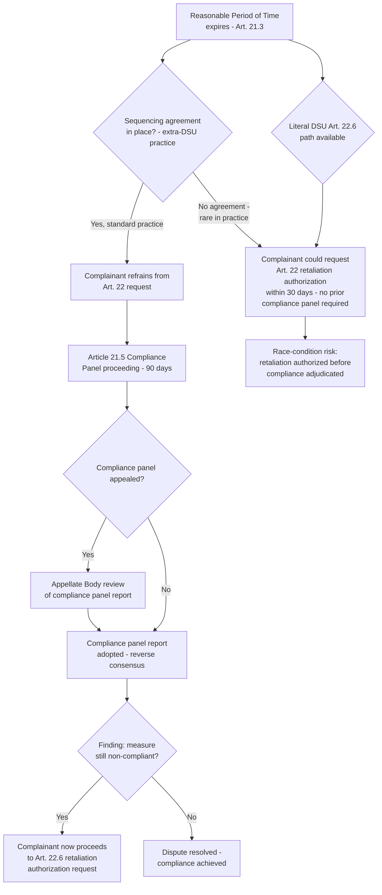

## Compliance Review Under Article 21.5 and the Sequencing Controversy

### Legal Basis: The Article 21.5 Compliance Panel

DSU Article 21.5 provides that where there is "disagreement as to the existence or consistency with a covered agreement of measures taken to comply" with the recommendations and rulings adopted by the DSB, that disagreement "shall be decided through recourse to these dispute settlement procedures, including wherever possible resort to the original panel." The compliance panel must circulate its report within 90 days of referral, a substantially compressed timeline compared to an original panel's typical proceeding.

**Definition on first use — "measures taken to comply":** The domestic legislative, regulatory, or administrative action a losing respondent adopts, purportedly to bring itself into conformity with the original adopted findings. Article 21.5 review does not re-litigate the original violation; it asks a narrower, forward-looking question — does the *new* measure achieve conformity — while treating the original panel/Appellate Body findings on the underlying obligation as res judicata for that dispute.

### Scope of Compliance Review: What Article 21.5 Does and Does Not Reach

The Appellate Body has repeatedly confronted the boundary between (a) genuinely new claims about a new measure and (b) attempts to relitigate matters already resolved in the original proceeding. The leading authority is **US – Softwood Lumber IV (Article 21.5 – Canada)** (WT/DS257/AB/RW, 2005) and, on the broader "measures taken to comply" concept, **Chile – Price Band System (Article 21.5 – Argentina)** (WT/DS207/AB/RW, 2007).

**Key Points:**

- A compliance panel has jurisdiction over the *new* implementing measure and its WTO-consistency, evaluated as of the compliance panel proceeding, not the original measure.
- Where the "new" measure is, in substance, materially unchanged from the original (a cosmetic or non-substantive amendment), a compliance panel can and has found continued non-compliance notwithstanding formal legislative amendment.
- Article 21.5 panels apply the same standard of review as original panels (ordinarily DSU Article 11, or the ADA Article 17.6 standard where dumping-determination claims recur), and their reports are equally subject to appeal to the Appellate Body under Article 17, with the same reverse-consensus adoption mechanism under Article 17.14.
- A persistent textual gap: Article 21.5 does not explicitly state whether a compliance panel may examine claims under provisions *not* raised in the original proceeding, when the new measure raises genuinely new legal questions the original panel never had occasion to address. Panel and Appellate Body practice has generally permitted this where the new claim arises from the new measure itself, consistent with the object of securing a "positive solution" under DSU Article 3.7.

### The Sequencing Problem: The Article 21.5/Article 22 Textual Conflict

The single most consequential procedural defect identified in the DSU — one that negotiators have never formally resolved through amendment — is the apparent conflict between Article 21.5's compliance-review timeline and Article 22's timeline for authorizing retaliation.

**The textual problem:** DSU Article 22.6 permits a prevailing complainant to request DSB authorization to suspend concessions ("retaliate") if the respondent has not complied by the expiry of the reasonable period of time (RPT) established under Article 21.3, and provides that such authorization shall be granted by the DSB within 30 days of RPT expiry unless the DSB decides by consensus to reject the request (itself a reverse-consensus mechanism) or unless the respondent objects to the *level* of suspension proposed, triggering arbitration under Article 22.6–22.7. Read literally, Article 22 contemplates that retaliation authorization can proceed on this 30-day clock immediately upon RPT expiry — with no textual requirement that a compliance panel first determine whether the respondent has actually failed to comply.

This creates a race-condition: a respondent that adopts an implementing measure by the RPT deadline and genuinely believes it has achieved compliance faces the prospect that the complainant could seek Article 22 retaliation authorization before any neutral body (a compliance panel) has adjudicated whether compliance was actually achieved — precisely the disagreement Article 21.5 exists to resolve.

**Definition on first use — "sequencing":** The negotiated, DSU-extraneous practice by which disputing parties agree, typically through an ad hoc Article 25 arbitration-style side agreement or a simple bilateral procedural understanding, that any Article 21.5 compliance panel proceeding will be completed (including appeal) *before* the complainant pursues Article 22 retaliation authorization — deliberately overriding the literal, race-condition-prone sequence the DSU text appears to permit.

### How Sequencing Agreements Work in Practice

Since there is no DSU provision authorizing an explicit "sequencing agreement," parties have developed a standardized workaround: bilateral agreements (sometimes styled as an exchange of letters, sometimes using the mechanism of DSU Article 25 arbitration by agreement) in which the parties commit that:

1. The complainant will not request Article 22 authorization until the Article 21.5 compliance panel (and any appeal) has concluded and been adopted;
2. If the compliance panel finds continued non-compliance, the parties treat the RPT as having effectively been extended for purposes of the Article 22.6 30-day clock, so that the complainant's eventual Article 22 request is not time-barred or otherwise procedurally irregular for having been filed outside the original 30-day window.

This practice originated in disputes including **EC – Bananas III** and became close to uniform practice by the early 2000s; virtually every dispute reaching the implementation-dispute stage since has used some variant of a sequencing agreement, despite its extra-textual character.

[Inference] The near-universal reliance on sequencing agreements is frequently cited as evidence that the DSU's own text contains an unresolved structural flaw that the membership has never formally corrected through the (stalled) DSU Review process, instead relying on consistent but non-binding practice to paper over the gap case by case. Because sequencing agreements are negotiated bilaterally rather than mandated by the DSU itself, a respondent that refuses to enter one retains, in principle, the literal textual right to face an Article 22 authorization request immediately upon RPT expiry — a leverage point that has occasionally been used in negotiating posture, though in practice virtually all parties have found it in their mutual interest to sequence rather than litigate the ambiguity itself.

### Illustrative Case: EC – Bananas III's Sequencing Legacy

The **EC – Bananas III** dispute (WT/DS27) is frequently cited as the origin point for sequencing practice because the EC's implementing measures were contested by multiple complainants (Ecuador, the United States, and others) across a prolonged multi-year period, generating overlapping RPT, compliance-review, and retaliation-authorization requests that exposed the practical unworkability of applying Article 21.5 and Article 22 literally and sequentially without an explicit ordering agreement. The complexity of managing parallel complainants each at different procedural stages accelerated the membership's convergence on the informal sequencing solution now treated as standard practice.

### Procedural Flow: Literal DSU Text vs. Sequencing Practice

### Practitioner Implications

For counsel representing a respondent nearing RPT expiry, proposing a sequencing agreement is close to standard defensive practice, since it forecloses the (admittedly rare) risk that a complainant attempts to exploit the literal Article 22.6 timeline to seek retaliation authorization before a neutral compliance panel evaluates the new measure — but negotiating the agreement's terms (particularly the treatment of the Article 22.6 clock once the compliance panel concludes) requires care, since the sequencing agreement itself is not a DSU instrument and its enforceability rests entirely on the parties' mutual undertaking rather than adopted DSU text. For a complainant's counsel, the practical lesson from the accumulated **EC – Bananas III**-style multi-complainant precedent is that compliance disputes involving several complainants at different procedural stages require careful multilateral coordination to avoid one complainant's Article 22 request undermining another's ongoing Article 21.5 proceeding on the same underlying measure.

### Related Topics

- DSU Article 22 suspension of concessions, cross-retaliation, and Article 22.6 arbitration over the level of nullification or impairment
- DSU Article 25 arbitration as an alternative dispute resolution mechanism and its procedural borrowing for sequencing agreements
- The stalled DSU Review negotiations and proposals to codify sequencing directly into DSU text
- Multiple-complainant coordination in parallel disputes challenging the same measure
- DSU Article 3.7's "positive solution" objective as interpretive context for compliance-stage jurisprudence