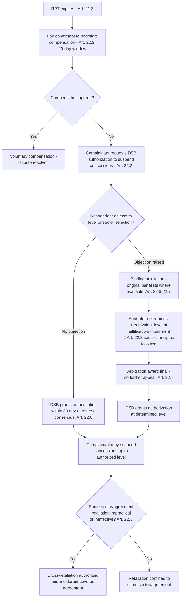

## Retaliation and Suspension of Concessions Under Article 22 Arbitration

### Legal Basis: The Structure of Article 22

DSU Article 22.1 establishes suspension of concessions as a measure of last resort, available only where the respondent has failed to bring a WTO-inconsistent measure into conformity within the reasonable period of time (RPT) established under Article 21.3, and only pending full implementation. Article 22.2 requires the parties to first attempt to negotiate mutually acceptable compensation; compensation is voluntary and WTO-consistent by definition (it cannot itself violate other obligations), and if no agreement on compensation is reached within 20 days of RPT expiry, the complainant may request DSB authorization to suspend concessions or other obligations under the covered agreements.

**Definition on first use — "suspension of concessions":** The DSU's term for what is colloquially called "retaliation" — the prevailing Member's authorized withdrawal of trade concessions (typically increased tariffs above bound rates) against the non-complying respondent, calibrated to a specific authorized level, intended as a temporary inducement toward compliance rather than a punitive sanction.

### Authorization: Reverse Consensus and the Arbitration Trigger

Article 22.6 requires the DSB to grant authorization to suspend concessions within 30 days of RPT expiry, unless the DSB decides by consensus to reject the request (a reverse-consensus mechanism structurally identical to report adoption) — or unless the respondent objects that the level of suspension proposed is not equivalent to the level of nullification or impairment, or that the complainant has not followed the principles and procedures in Article 22.3 for selecting the sector to target. Either objection triggers binding arbitration under Article 22.6–22.7, ordinarily conducted by the original panelists (where available) rather than a newly constituted body.

**Key Points:**

- The Article 22.6 arbitrator's mandate is narrow: it determines whether the *level* of proposed suspension is equivalent to the level of nullification or impairment, and whether the complainant followed the cross-retaliation sequencing principles of Article 22.3 — it does not revisit the underlying finding of non-compliance, which is a matter for Article 21.5 review.
- Arbitration awards under Article 22.6 are final; DSU Article 22.7 states the parties shall accept the arbitrator's decision as final and shall not seek a second arbitration.
- Once the arbitrator determines the equivalent level, the DSB grants authorization upon request, again via reverse consensus, consistent with the automaticity pattern running through Article 16.4, 17.14, and 22.6.

### Calculating "Equivalence": Methodology in Practice

The Article 22.4 standard — that the level of suspension authorized "shall be equivalent to the level of nullification or impairment" — has generated a substantial body of arbitral methodology, since the DSU itself provides no calculation formula. Arbitrators have generally approached equivalence as a counterfactual trade-effects exercise: estimating the value of trade lost or distorted by the non-complying measure, often using economic modeling of price and quantity effects in the complainant's export markets.

The leading early authority is the **EC – Bananas III (Article 22.6 – EC)** arbitration (WT/DS27, 1999), which set out an approach to quantifying the trade effect of the EC's banana import regime on the US complainant's commercial interests, notwithstanding the complexity of the US having no significant banana export trade itself (raising, but not resolving cleanly, the relationship between trade-flow-based calculation and a complainant's actual economic stake). **Brazil – Aircraft (Article 22.6 – Brazil)** (WT/DS46, 2000) and the extended **US – Upland Cotton** (WT/DS267) sequence further developed methodology for prohibited-subsidy cases under the SCM Agreement, where Article 4.10–4.11 SCM establishes an accelerated, "appropriate countermeasures" standard arguably distinct from the ordinary Article 22.4 equivalence standard — a distinction litigated extensively in that dispute.

### Cross-Retaliation Under Article 22.3

Article 22.3 establishes a hierarchy of principles for selecting which sector or agreement a complainant may target with suspension: the general rule is that the complainant should first seek to suspend concessions in the same sector as the one affected by the violation; if impractical or ineffective, it may seek to suspend in a different sector under the same agreement; and if that too is impractical or ineffective, it may pursue "cross-retaliation" — suspending concessions under an entirely different covered agreement (e.g., suspending TRIPS obligations to respond to a goods-related violation).

**Definition on first use — "cross-retaliation":** Authorization to suspend obligations under an agreement different from the one under which the original violation occurred, permitted only where the complainant demonstrates that same-sector or same-agreement retaliation is impractical or ineffective, and that the circumstances are serious enough to justify crossing agreement boundaries (Article 22.3(f)–(g)).

The landmark cross-retaliation authorization is **US – Gambling (Article 22.6 – US)** (WT/DS285, 2007), where Antigua and Barbuda — a small economy with negligible capacity to impose meaningful tariff retaliation on US goods given the asymmetry in bilateral trade volumes — was authorized to suspend obligations under TRIPS (specifically, intellectual-property enforcement obligations, opening the door to authorized non-enforcement of US copyrights) as a practically meaningful alternative to conventional tariff retaliation that would have had negligible coercive effect given Antigua's tiny import market.

**Practitioner note:** Cross-retaliation authorizations, though rare, are disproportionately significant for smaller developing-economy complainants, since ordinary tariff retaliation is only coercive if the complainant's market is large enough that increased tariffs meaningfully harm the respondent's exporters — a condition frequently unmet for small Members facing large-economy respondents. The **US – Gambling** award functions as the template precedent for arguing that conventional retaliation is "impractical or ineffective" under Article 22.3(c)–(d) whenever the complainant's economy is too small relative to the respondent's for tariff-based retaliation to generate meaningful pressure.

### The Practical and Political Limits of Retaliation

[Inference] Even where authorized, suspension of concessions has well-documented practical limits as a compliance-inducing tool: authorized retaliation raises costs for the retaliating Member's own importers and consumers (since higher tariffs on imports from the respondent are a domestically-absorbed cost), meaning complainants sometimes decline to fully exercise authorized retaliation levels even after winning the arbitration, particularly where domestic industries depend on inputs from the respondent Member. This has fed a broader critique that Article 22 functions imperfectly as an enforcement mechanism against very large economies, since the economic pain of authorized retaliation may fall as heavily or more heavily on the retaliating Member's own economy — a dynamic distinct from, though related to, the separate legitimacy debate about whether WTO enforcement structurally favors developed economies with larger, more diversified trade profiles capable of absorbing retaliation costs.

### Procedural Flow

### Practitioner Implications

For a complainant's counsel, the Article 22.6 arbitration stage requires building a credible economic model of trade effects, since the arbitrator's equivalence determination is fundamentally an empirical exercise — overreaching on the requested suspension level invites a reduced award, while underestimating it forfeits leverage the complainant is legally entitled to. For counsel representing a small-economy complainant against a disproportionately large respondent, the **US – Gambling** cross-retaliation precedent is the essential authority for demonstrating, under Article 22.3(c)–(d), why conventional same-sector retaliation would be "ineffective" given market-size asymmetry, opening the path to more commercially meaningful (if diplomatically sensitive) cross-agreement suspension, such as intellectual-property-based retaliation.

### Related Topics

- DSU Article 21.5 compliance panels and the sequencing relationship with Article 22 authorization
- The SCM Agreement's accelerated "appropriate countermeasures" standard for prohibited subsidies as a variant on ordinary Article 22.4 equivalence
- Economic modeling methodologies used in nullification-or-impairment quantification
- The special and differential treatment considerations for developing-country complainants under DSU Article 21.7–21.8 and Article 24
- Historical retaliation authorizations and their actual implementation rates as a measure of Article 22's real-world coercive effect