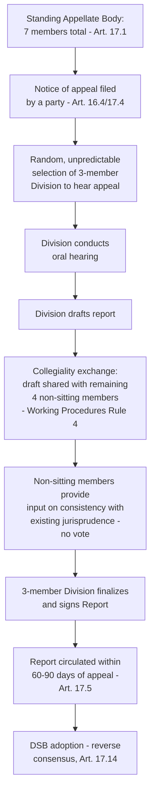

## The Appellate Body's Original Design as a Standing Four-Member Division System

### Legal Basis: DSU Article 17 and the Standing Body Concept

DSU Article 17.1 established the Appellate Body as "a standing body" of seven persons, three of whom serve on any one case, with those three rotating among the full membership in a manner "random and unpredictable," as elaborated in the Appellate Body's Working Procedures for Appellate Review, so that the composition of a given division could not be anticipated or manipulated by the parties in advance. Article 17.2 sets four-year terms, renewable once, with appointments made by the DSB — a positive-consensus decision, distinguishing appointment from the reverse-consensus mechanism governing report adoption.

**Definition on first use — "division":** The three-member panel drawn from the seven standing Appellate Body members to hear a specific appeal. The item title's reference to a "four-member" division system reflects the Working Procedures' collegiality practice (discussed below) rather than the size of the adjudicating panel itself, which Article 17.1 fixes at three.

### Clarifying the "Four-Member" Framing: Divisions of Three Plus Collegiality

[Inference] The premise embedded in this item's title — a "standing four-member division system" — does not track the DSU's actual textual design, which specifies divisions of *three* members deciding each appeal, drawn from a *standing body of seven*. It is possible this framing conflates two distinct structural features that are easy to elide: (1) the three-member adjudicating division for any single appeal, and (2) the practice of "exchanging views" with the other four non-sitting members before a division finalizes its report — a collegiality norm (not a voting requirement) set out in Rule 4 of the Working Procedures for Appellate Review, intended to promote consistency and coherence across the Appellate Body's jurisprudence as a whole, given that different divisions might otherwise develop inconsistent interpretive lines. Under this collegiality practice, a three-member division shares its draft report with the remaining four members of the seven-person body and considers their input, but the four non-sitting members do not vote and the division of three alone signs the report. This section proceeds on the correct DSU design (seven standing members, three-member deciding divisions, collegiality exchange with the remaining four) since that is the accurate legal architecture the item is evidently probing.

### Why a Standing Body: The Structural Departure From Ad Hoc Panels

The Uruguay Round negotiators' decision to create a standing appellate body was a deliberate structural departure from the ad hoc panel system (see the companion coverage of DSU Article 8 panel composition), motivated by several design goals:

- **Doctrinal consistency:** Unlike panels, which are freshly constituted for each dispute and have no obligation of formal precedent, a standing body of repeat adjudicators was expected to develop and maintain coherent interpretive doctrine across disputes, reducing the risk of conflicting rulings on the same legal question by different ad hoc panels.
- **Legal specialization:** Article 17.3 requires Appellate Body members to be "persons of recognized authority, with demonstrated expertise in law, international trade and the subject matter of the covered agreements generally," a more specialized qualification standard than the broader "well-qualified" language governing ordinary panelists under Article 8.1.
- **Confined scope of review:** Article 17.6 limits appeals to "issues of law covered in the panel report and legal interpretations developed by the panel" — the Appellate Body does not review panels' factual findings de novo (subject to the narrow DSU Article 11 "objective assessment" exception discussed in the companion item on standard of review), a structural choice that assumed a specialized, legally-focused standing body was better positioned to police legal-interpretive consistency than to re-try facts.

### Independence Safeguards in the Original Design

Article 17.3 further requires Appellate Body members to be unaffiliated with any government and broadly representative of WTO membership, and DSU Article 17.9's Working Procedures (drafted by the Appellate Body itself in consultation with the DSB Chairman and Director-General, per Article 17.9) include confidentiality and independence rules modeled loosely on international judicial ethics standards, reflecting an intent to insulate the Appellate Body from the kind of governmental influence that could compromise a standing, semi-permanent adjudicative body in a way less acute for ad hoc panels dissolved after each case.

**Key Points:**

- The four-year, once-renewable term structure (Article 17.2) was designed to balance continuity (allowing members to develop expertise and contribute to doctrinal consistency across their tenure) against entrenchment (the renewal cap prevents indefinite incumbency).
- Appointments require DSB consensus, meaning — unlike panel composition, which can be resolved by Director-General determination if parties cannot agree — there is no fallback appointment mechanism if the DSB cannot achieve consensus on a nominee. This design feature, unremarkable when the system was functioning normally, became the specific structural vulnerability exploited during the appointments blockade beginning in 2017 (addressed as its own item in this chapter).
- The confined "issues of law" scope of review (Article 17.6) was intended to prevent the Appellate Body from becoming a second fact-finding instance, preserving the panel stage as the sole venue for evidentiary development — a division of institutional labor that assumed continuous, functioning appellate capacity as the system's steady-state condition.

### Illustrative Operation: How a Case Moved Through the Original System

In the system's intended steady-state operation (illustrated by any of the routine appeals decided through the early 2000s, such as **EC – Hormones**, WT/DS26/AB/R and WT/DS48/AB/R, 1998, one of the earliest major Appellate Body reports), an appeal would be assigned to a randomly selected three-member division from the seven standing members; the division would conduct oral hearings, exchange views with the remaining four members per the collegiality practice, and issue a report within the Article 17.5 target of 60 days (extendable to 90 in complex cases) from the date of the notice of appeal — a considerably faster and more predictable timeline than typical panel proceedings, itself a design feature intended to encourage confidence in the appellate stage as a genuine, efficient check on panel error rather than a source of indefinite delay.

### Structural Diagram

### Practitioner Implications

For a lawyer advising a party considering appeal, the original design's random division-assignment rule meant that, unlike some domestic appellate systems where panel composition can be anticipated and factored into litigation strategy, WTO appellants historically could not select or predict their division, and case strategy was built around substantive legal argument on the "issues of law" standard rather than any attempt to anticipate adjudicator disposition — a discipline reinforced by the collegiality practice's aim of cross-division doctrinal consistency, which reduced (though did not eliminate) the practical significance of which specific three members happened to be assigned. Understanding this original design is the necessary baseline for evaluating what specifically broke down during the 2017–2019 appointments blockade discussed elsewhere in this chapter: the crisis was not a failure of the division/collegiality mechanics themselves, but a failure of the positive-consensus appointment mechanism that was assumed, but never guaranteed, to reliably replenish the seven-member standing body as terms expired.

### Related Topics

- The DSU Article 17.2 appointment process and its positive-consensus requirement
- The Appellate Body appointments blockade (2017–2019) and its structural origins in the appointment mechanism
- Working Procedures for Appellate Review and the collegiality practice under Rule 4
- The Multi-Party Interim Appeal Arbitration Arrangement (MPIA) as a post-crisis workaround
- The Article 17.6 "issues of law" limitation and its relationship to the DSU Article 11 standard of review for panels