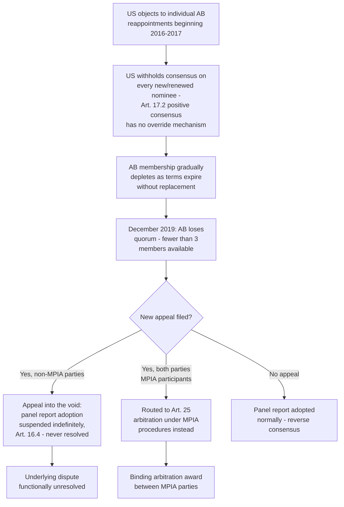

## The United States' Blockade of Appellate Body Appointments Since December 2019

### Framing Note on the Timeline

The item title anchors the blockade's start to December 2019; the more precise institutional history is that US objections to individual Appellate Body reappointments began in 2016–2017, with the blockade's most consequential effect — loss of quorum — materializing on December 10, 2019, when the terms of two of the three remaining Appellate Body members expired, leaving only one member and rendering the Appellate Body unable to hear new appeals (Article 17.1 requires three members to hear any appeal, and Rule 6 of the Working Procedures generally requires the seven-member body to maintain enough sitting members to staff divisions). This section treats December 2019 as the quorum-loss milestone within a blockade that began earlier and has continued since.

### Legal Basis for the Vulnerability: The Appointment Mechanism

DSU Article 17.2 requires Appellate Body appointments to be made by the DSB — a positive-consensus decision, meaning appointment (unlike panel composition under Article 8.7, which has a Director-General fallback, and unlike report adoption under Articles 16.4/17.14, which use reverse consensus) has no mechanism to proceed over a single Member's objection. A lone dissenting Member can block any nominee indefinitely, since consensus requires the absence of formal objection from every Member present.

**Definition on first use — "blockade" in this institutional context:** The sustained practice, beginning under the Obama administration and continuing through the Trump and Biden administrations, of the United States refusing to join DSB consensus on any new or renewed Appellate Body appointment, regardless of the individual nominee's qualifications, as leverage to force discussion of asserted systemic problems with Appellate Body practice rather than objecting to specific candidates on personal grounds.

### The Substantive US Objections

The United States Trade Representative's office articulated its objections in a series of position papers beginning in 2018, centering on several recurring claims about Appellate Body practice that the US characterized as exceeding the bounds of DSU Article 17.6 and Article 3.2 (which provides that DSB recommendations and rulings "cannot add to or diminish the rights and obligations provided in the covered agreements"):

- **Exceeding the 90-day deadline:** Article 17.5 sets a target of 60 days (extendable to 90) for circulating an appellate report; the US argued the Appellate Body had made routine, unauthorized practice of exceeding this deadline without the DSB's agreement, treating a hard procedural limit as merely aspirational.
- **Continuing to serve past term expiration ("Rule 15" practice):** Appellate Body Rule 15 of the Working Procedures allowed an outgoing member, with Appellate Body authorization, to complete disposition of an appeal already under consideration even after their term formally expired. The US argued this practice let the Appellate Body extend individual members' authority beyond the fixed terms set by Article 17.2 without DSB approval.
- **Issuing advisory opinions on moot or unnecessary issues:** The US argued the Appellate Body had ruled on legal questions not necessary to resolve the specific dispute, in tension with the principle of judicial economy recognized in **US – Wool Shirts and Blouses** (WT/DS33/AB/R, 1997).
- **Treating prior reports as binding precedent:** The US contended the Appellate Body had, in practice, treated its own prior interpretations as de facto binding precedent (particularly evident in disputes over the "public body" definition under the SCM Agreement, e.g., **US – Anti-Dumping and Countervailing Duties (China)**, WT/DS379/AB/R, 2011), when WTO dispute settlement reports are not formally a source of binding precedent under a stare decisis doctrine, only "clarifying" existing obligations under DSU Article 3.2.
- **Review of facts and domestic law characterization:** The US argued the Appellate Body had, in some disputes, reviewed panels' characterization of a Member's domestic law as a question of fact (ordinarily outside Article 17.6's "issues of law" scope) rather than deferring to the panel's factual determination.

### Institutional Response and the Countervailing View

The Appellate Body and many other Members disputed elements of this critique, and a substantial body of academic and practitioner commentary treats the US objections as, at least in part, a pretext for a broader policy dissatisfaction with the substance of specific adverse rulings — particularly trade-remedy determinations disfavoring US anti-dumping and countervailing duty methodologies — rather than a genuine, narrowly procedural concern. [Inference] The proximate cause frequently cited in this counter-narrative is that Appellate Body rulings had, across a sequence of trade-remedy disputes, repeatedly found aspects of US Commerce Department dumping-margin methodologies (including "zeroing," addressed elsewhere in this curriculum) inconsistent with the Anti-Dumping Agreement, generating a cumulative pattern of adverse findings that some observers argue drove the underlying US institutional dissatisfaction more than the stated procedural concerns did. This is a genuinely contested characterization; the US position papers themselves frame the objections as systemic and procedural rather than outcome-driven, and evaluating which framing is more persuasive requires weighing both the specific procedural claims (some of which — the Article 17.5 deadline point, in particular — have substantial textual support) against the pattern of disputes in which the objections were raised.

### Consequences: Functional Paralysis of Binding Appellate Review

**Key Points:**

- Since the loss of quorum in December 2019, any party wishing to prevent a panel report from being adopted can do so unilaterally simply by filing a notice of appeal "into the void" — because DSU Article 16.4 suspends adoption pending appeal, and because there is no functioning Appellate Body to hear that appeal, the appeal is never resolved, leaving the panel report indefinitely un-adopted and legally inert. This tactic became widely known as an "appeal into the void."
- This inverts the pre-2019 dynamic: whereas reverse consensus was designed to make report adoption automatic and difficult to block, the loss of appellate capacity created a new, functionally unilateral blocking tool available to any losing party willing to appeal without any real prospect (or intention) of the appeal being decided.
- The practical result is a bifurcated system: disputes between Members willing to forgo the appeal right (or bound by an alternative arrangement) can still reach binding, adopted outcomes at the panel stage; disputes where a losing party exercises the appeal right into the void functionally terminate without a binding resolution.

### The Workaround: The Multi-Party Interim Appeal Arbitration Arrangement (MPIA)

A subset of WTO Members (initially around 20, including the EU, China, and Canada, though not the United States) established the Multi-Party Interim Appeal Arbitration Arrangement (MPIA) in 2020, using DSU Article 25's pre-existing arbitration mechanism as an alternative appellate-like review pending resolution of the appointments crisis.

**Definition on first use — MPIA mechanics:** Rather than appealing to the (non-functional) Appellate Body, MPIA participants agree in advance that any dispute between them will, if a party wishes to appeal a panel report, be routed instead to ad hoc arbitration under DSU Article 25, using a pool of ten arbitrators selected by MPIA participants, applying procedures deliberately modeled closely on the original Appellate Body's Working Procedures (three-member panels, similar timelines, similar standard of review) so that participating Members preserve a functional two-tier, binding dispute settlement relationship among themselves despite the underlying Appellate Body's paralysis. An MPIA arbitration award is binding on the parties to that specific dispute as a matter of their Article 25 agreement, though it does not restore DSB-level Appellate Body adoption machinery generally.

**Practitioner note:** MPIA coverage is bilateral/plurilateral by subscription, not universal — a dispute between an MPIA participant and a non-participant (notably, any dispute involving the United States, which has not joined) has no MPIA fallback, meaning the "appeal into the void" tactic remains fully available and has been used in disputes involving the United States and other non-MPIA Members.

### Status and Outlook

As of this content's preparation, the Appellate Body remains without quorum, the US blockade of appointments has continued across multiple administrations, and WTO Members have engaged in periodic, so-far inconclusive negotiations (including at Ministerial Conferences) toward a broader reform of the dispute settlement system, sometimes discussed as part of a "reformed" two-stage system, without having reached a final agreement restoring a universally binding standing appellate body. [Unverified] Given the pace of change in this area and the possibility of further developments after this material's preparation, a practitioner should verify the current status of any specific reform negotiations, MPIA membership, or appointment developments against current WTO sources before relying on this account for time-sensitive purposes.

### Structural Diagram

### Practitioner Implications

For counsel advising a client considering whether to bring a WTO dispute against the United States, or against another non-MPIA Member, the practical reality since December 2019 is that binding, appeal-proof resolution can no longer be assumed even after prevailing at the panel stage, since the losing party retains an effectively unilateral tool (appeal into the void) to prevent adoption — a structural consideration that may counsel toward exhausting bilateral or plurilateral resolution channels before committing to full panel litigation, or toward negotiating an ad hoc Article 25 arbitration agreement with the specific counterparty as a bespoke substitute for MPIA coverage where the counterparty is amenable. For counsel whose client's dispute involves only MPIA participants, joining or invoking the MPIA framework preserves a meaningfully binding two-tier outcome despite the broader systemic paralysis, and should be considered a standard element of pre-dispute strategic assessment.

### Related Topics

- The Multi-Party Interim Appeal Arbitration Arrangement (MPIA) mechanics and membership under DSU Article 25
- The original Appellate Body design (seven-member standing body, three-member divisions) as the baseline the crisis disrupted
- "Zeroing" in anti-dumping margin calculations and its role in the pattern of US-adverse Appellate Body rulings
- Ongoing WTO dispute settlement reform negotiations and Ministerial Conference outcomes on this subject
- DSU Article 3.2's "not to add to or diminish rights and obligations" standard as the legal frame for the US systemic objections