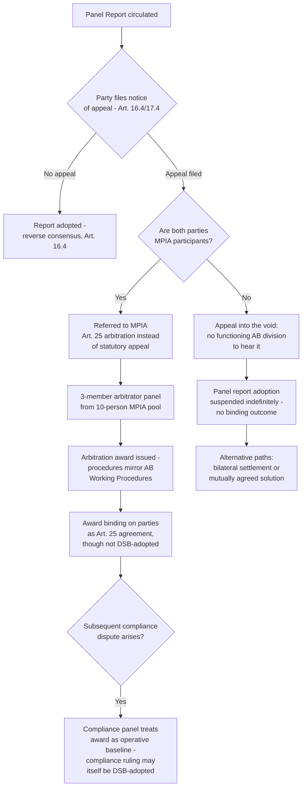

## Consequences: "Appeals Into the Void" and the Loss of Binding Two-Tier Review

### Legal Mechanism Producing the Void

The "appeal into the void" phenomenon is a direct textual consequence of two DSU provisions interacting with a non-functioning Appellate Body. DSU Article 16.4 provides that a panel report shall not be considered for adoption by the DSB until after the appeal period has expired, and if appealed, adoption is deferred until after completion of the appeal. DSU Article 17.14 requires that an Appellate Body report be adopted (and unconditionally accepted by the parties) before a dispute reaches binding closure at the appellate stage. Where a party files a notice of appeal under Article 16.4/Article 17.4 but no functioning Appellate Body division exists to hear it, the appeal is filed but never resolved — the panel report remains suspended in adoption limbo indefinitely, and the dispute has no binding outcome at either tier.

**Definition on first use — "appeal into the void":** The practice of filing a notice of appeal from an adverse panel report with no intention or expectation that the appeal will actually be heard, since no functioning Appellate Body division exists to hear it — using the automatic suspensive effect of Article 16.4 to block adoption indefinitely rather than to obtain genuine appellate review.

### Scale of the Consequence

By the time of the WTO's MC12 Ministerial Conference, more than 20 panel rulings had been appealed into the void, with the WTO's own briefing materials noting that a resolution of these dispute proceedings is not possible until new Appellate Body members are appointed, and all future panel rulings also face the risk of being appealed into the void unless a solution is found to the impasse. This is not a hypothetical or marginal risk: it describes the default legal exposure of every panel report issued since the Appellate Body lost quorum, absent an alternative arrangement between the specific parties. [WTO](https://www.wto.org/english/thewto_e/minist_e/mc12_e/briefing_notes_e/bfwtoreform_e.htm)

**Key Points:**

- A prevailing complainant's victory at the panel stage carries no guarantee of binding effect if the losing respondent chooses to appeal into the void — reversing the pre-2019 assumption that reverse consensus made adoption close to automatic.
- The tactic is available to *either* party in a dispute, meaning a losing respondent and, in principle, a complainant dissatisfied with only part of a panel's findings can each use the same mechanism.
- Because the appeal is never withdrawn or resolved, the underlying panel findings have no formal legal status as adopted DSB rulings — they exist as persuasive, unadopted legal reasoning, but the losing party bears no formal legal obligation to implement them, and the DSU's Article 21 implementation machinery (RPT, surveillance, eventual Article 22 retaliation) never activates.

### The Institutional Response: The MPIA as a Structural Countermeasure

The Multi-Party Interim Appeal Arbitration Arrangement (MPIA), established in 2020 under a subset of WTO Members, was designed with preventing exactly this consequence as its primary stated purpose. As the arrangement's own framing documents make clear, MPIA participants wanted, above all, to preserve the functioning of WTO dispute settlement, with the main goal being to prevent "appeals into the void," that is, blocking of the dispute resolution process by appealing a panel report to an Appellate Body that no longer functions. Structurally, MPIA participants committed ex ante not to pursue appeals under Articles 16.4 and 17 of the DSU among themselves, with the arrangement's primary objective being to preserve the system's binding character and two-tier structure by substituting Article 25 arbitration for the non-functional statutory appeal. [Cambridge Core](https://www.cambridge.org/core/journals/world-trade-review/article/wtos-multiparty-interim-appeal-arbitration-arrangement-mpia-whats-new/B279E8A106380A510AAA28F4E1A4130F)[ResearchGate](https://www.researchgate.net/publication/371583288_The_WTO's_Multi-Party_Interim_Appeal_Arbitration_Arrangement_MPIA_What's_New)

**Definition on first use — the MPIA's operative substitution:** Rather than eliminating the right to a second-tier review, MPIA participants redirect it: any MPIA-covered dispute that would otherwise generate an appeal is instead referred to arbitration under DSU Article 25, using a standing pool of ten arbitrators nominated and elected by MPIA participants, applying procedures deliberately mirroring the original Appellate Body's Working Procedures.

### Testing the MPIA's Bindingness: Recent Practice

A live question since the MPIA's creation has been whether its arbitral awards carry genuinely binding legal effect comparable to an adopted Appellate Body report, given that MPIA awards are not "adopted" by the DSB under Article 17.14's reverse-consensus mechanism — DSB adoption is simply inapplicable to Article 25 arbitration. Recent practice has clarified this in the *China – Enforcement of Intellectual Property Rights* dispute, the MPIA's second arbitral award: this was the first case to use the MPIA arbitration route as an alternative to a proper appeal, and also the only MPIA case so far to end up with a ruling adopted by the WTO membership — though only the ruling on compliance, not the MPIA arbitration award itself. Commentary on this development concludes that if there was any doubt about whether the MPIA appeal-by-arbitration system is binding on WTO members, the answer now appears to be a clear yes, since the parties' subsequent compliance-stage conduct treated the underlying MPIA award as the operative legal baseline notwithstanding its non-adoption. [Wordpress](https://tradebetablog.wordpress.com/2025/11/26/ruling-adoption-binding-appeal-arbitration/)[Wordpress](https://tradebetablog.wordpress.com/2025/11/26/ruling-adoption-binding-appeal-arbitration/)

### Current Status and Institutional Framing

As of the most recent WTO ministerial-level reporting, the Appellate Body blockade remains unresolved, and the Director-General has continued to characterize the MPIA as an interim bridge rather than a permanent substitute: the MPIA has been described as a "practical, confidence-building bridge" pending a dispute-reform deal, with the mechanism's value lying not in any formal WTO structure but in the commitment of members that have joined it to refrain from appealing cases into the void. The Director-General has also emphasized that the system continues to function through channels other than binding two-tier adjudication: despite the Appellate Body blockage, members brought 22 new dispute cases to the WTO in the past two years, with panel reports in five disputes adopted without appeal and eight other disputes resolved by the parties themselves, including through mutually agreed solutions — reflecting a trend since 2019 of members exploring different approaches to reach mutually acceptable outcomes. [WTO](https://www.wto.org/english/news_e/news26_e/mc14_28mar26_350_e.htm)[WTO](https://www.wto.org/english/news_e/news26_e/mc14_28mar26_350_e.htm)

**Practitioner note:** This data point is significant for counsel assessing dispute strategy: a meaningful share of post-2019 disputes are being resolved either through unappealed panel adoption (suggesting the losing party calculated that appealing into the void was not worth the diplomatic cost or reputational effect) or through negotiated mutually agreed solutions, rather than through the formal appellate machinery at all. [Inference] This suggests the "void" risk, while real and structurally significant, has not fully paralyzed the system's capacity to produce resolved outcomes — it has instead shifted a meaningful share of dispute resolution away from adjudication and toward settlement or unappealed acceptance, a redistribution with its own implications for the development of WTO jurisprudence, since settled or unappealed disputes generate less interpretive doctrine than fully litigated, adopted Appellate Body reports once did.

### Persistent Limitations of the MPIA as a Systemic Fix

**Key Points:**

- MPIA coverage is voluntary and plurilateral, not universal: a dispute is only insulated from the void if *both* parties are MPIA participants; the United States, the party whose blockade caused the underlying problem, has not joined, and its stated opposition frames the arrangement as effectively replicating the very Appellate Body practices it originally objected to.
- MPIA arbitration procedures remain adjustable case-by-case: arbitration under Article 25, whether ad hoc or under the MPIA, can be adjusted and molded case-by-case by the disputing parties in their appeal arbitration agreements, meaning there is no single fixed MPIA procedure but rather a family of party-negotiated variants, evidenced by practice such as parties in Costa Rica – Avocados and Colombia – Frozen Fries revising their Article 25 procedural submissions to give MPIA arbitrators more time to review panel reports. [Cambridge Core](https://www.cambridge.org/core/journals/world-trade-review/article/wtos-multiparty-interim-appeal-arbitration-arrangement-mpia-whats-new/B279E8A106380A510AAA28F4E1A4130F)[WTO Plurilaterals](https://wtoplurilaterals.info/plural_initiative/the-mpia/)
- Because MPIA awards are not adopted by the DSB in the Article 17.14 sense, they do not formally become part of the same body of "adopted" WTO jurisprudence that, under ordinary practice, panels and the (functioning) Appellate Body treat as persuasive precedent — creating a longer-term risk of a bifurcated jurisprudential record between pre-2019 adopted Appellate Body doctrine and post-2019 MPIA arbitral awards of uncertain formal precedential weight.

### Structural Diagram

### Practitioner Implications

For counsel structuring a dispute strategy involving a non-MPIA counterparty (most significantly, any dispute involving the United States), the void risk should be treated as a near-default assumption rather than an edge case, meaning pre-litigation bilateral settlement or a bespoke ad hoc Article 25 arbitration agreement negotiated specifically with that counterparty deserves serious consideration before committing resources to full panel litigation with no realistic prospect of binding closure if the other side chooses to appeal into the void. For counsel whose dispute involves an MPIA co-participant, the *China – Enforcement of Intellectual Property Rights* precedent is significant evidence that MPIA outcomes are not merely aspirational or symbolic — parties have treated them as the real legal baseline governing subsequent compliance obligations, which should inform how heavily to weight an MPIA award in negotiating implementation.

### Related Topics

- The United States' blockade of Appellate Body appointments and its underlying substantive objections
- The MPIA's Article 25 arbitrator pool, selection process, and procedural variation across disputes
- Ongoing WTO dispute settlement reform negotiations toward a permanent two-tier solution
- Mutually agreed solutions and bilateral settlement as alternatives to full adjudication in the post-2019 landscape
- The precedential status (or lack thereof) of unadopted panel reports and MPIA arbitral awards within WTO jurisprudence