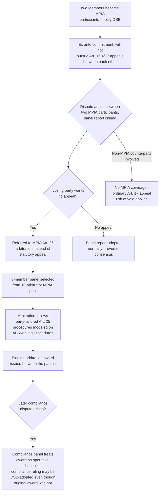

## The Multi-Party Interim Appeal Arbitration Arrangement as a Workaround Mechanism

### Legal Basis: Article 25 as the Enabling Provision

The Multi-Party Interim Appeal Arbitration Arrangement (MPIA) rests entirely on DSU Article 25, titled "Arbitration," which provides that expeditious arbitration within the WTO can facilitate the solution of certain disputes concerning issues clearly defined by both parties, and that resort to arbitration is subject to mutual agreement of the parties, who shall agree on the procedures to be followed, with agreements to arbitrate notified to all Members sufficiently in advance of commencement. Article 25 predates the Appellate Body crisis by decades and was originally conceived as a narrow, consensual alternative dispute-resolution track for discrete, well-defined disputes — not as a substitute appellate mechanism. The MPIA's innovation was repurposing this dormant, general-purpose provision into a standing, quasi-institutionalized substitute for the paralyzed statutory appeal.

**Definition on first use — "interim":** The arrangement is explicitly framed by its participants as temporary, pending resolution of the underlying Appellate Body appointments impasse; it does not purport to permanently replace Article 17 appellate review and would presumably be wound down if the standing Appellate Body were restored to function.

### Origins and Founding Objective

The MPIA was established in 2020 by an initial group of roughly twenty WTO Members (including the European Union, China, and Canada, though notably not the United States) in direct response to the Appellate Body's loss of quorum in December 2019. Its founding communication frames the arrangement's purpose unambiguously: pending negotiations to fix the situation relating to the Appellate Body, MPIA participants wanted, above all, to preserve the functioning of WTO dispute settlement, with the main goal being to prevent "appeals into the void" — the blocking of the dispute-resolution process by appealing a panel report to an Appellate Body that no longer functions.

**Key Points:**

- The MPIA is legally structured as an *open plurilateral political commitment*, not a formal amendment to the DSU: it is nested within the multilateral WTO framework and explicitly foreseen and allowed for under Article 25, but participation requires an affirmative decision by each Member to join — it does not bind non-participants and did not require multilateral consensus to establish.
- Because it operates through Article 25 rather than Article 17, MPIA arbitration formally supersedes the ordinary appeal process only between Members who have opted in; a dispute between an MPIA participant and a non-participant defaults to the ordinary, currently non-functional Article 17 appeal path (and the associated "void" risk).
- Any Member can join the MPIA at any time by notifying the Dispute Settlement Body, and the arrangement's design anticipates it will remain in place for as long as the Appellate Body remains non-functional.

### Structural Design: Mirroring the Appellate Body

The MPIA's arbitrators are deliberately structured to replicate, as closely as Article 25's flexibility allows, the substantive and procedural features of the original Article 17 appellate system:

- **Standing arbitrator pool:** MPIA appeals are heard by arbitrators selected from a pool of ten arbitrators nominated and voted on by MPIA participants, rather than fresh ad hoc selection for each case — echoing the standing-body design of the original Appellate Body discussed elsewhere in this chapter.
- **Qualification standard:** Arbitrators are required to have demonstrated expertise in law, international trade, and the subject matter of the covered agreements generally — language tracking Article 17.3's qualification standard for Appellate Body members.
- **Three-member panels:** Consistent with Article 17.1's division structure, individual MPIA appeals are heard by three-member panels drawn from the ten-person pool.
- **Procedural flexibility:** Because MPIA arbitration proceeds under Article 25 rather than a fixed statutory text, arbitration under Article 25 — whether ad hoc or under the MPIA — can be adjusted and molded case-by-case by the disputing parties in their appeal arbitration agreements, a flexibility the rigid Article 17 framework does not permit. This has been exercised in practice: parties in *Costa Rica – Avocados* (DS524) and *Colombia – Frozen Fries* (DS591) revised their Article 25 procedural submissions specifically to give MPIA arbitrators more time to digest panel reports by receiving them sooner in the process.

### Mechanics: How a Dispute Enters MPIA Arbitration

Two MPIA-participating Members involved in a dispute commit, ex ante, not to pursue appeals under DSU Articles 16.4 and 17 between themselves — effectively contracting around the ordinary statutory appeal right — and instead route any appeal to the Article 25 arbitration mechanism the MPIA establishes. This can be done either through advance blanket commitment (by virtue of both parties' MPIA membership) or through a bespoke, dispute-specific Article 25 arbitration agreement negotiated between two Members where at least one is not an MPIA participant but is willing to use MPIA-style procedures for that specific case (as occurred in the China–Australia wine-tariff dispute, where the parties pre-agreed to use the MPIA, to which both were already party, to resolve any appeals rather than have them go to the void).

### Testing the Framework: The MPIA's Bindingness in Practice

A central open question since the MPIA's creation has been whether its arbitral awards carry genuinely binding legal effect, given that — unlike an Appellate Body report — an MPIA award is never subject to DSB adoption under Article 17.14's reverse-consensus mechanism, since Article 25 arbitration operates entirely outside that adoption structure. This question was substantially clarified through the *China – Enforcement of Intellectual Property Rights* dispute, which produced the MPIA's second-ever arbitral award and was the first case to use the MPIA arbitration route as an alternative to a proper appeal. In the subsequent compliance phase of that same dispute, the parties' conduct — and the eventual DSB adoption of the compliance-stage ruling (though not the underlying MPIA arbitration award itself) — was read by commentators as answering, with a "clear yes," the question of whether the MPIA appeal-by-arbitration system is binding on WTO members, since the compliance proceeding treated the MPIA award as the operative legal baseline against which compliance was measured.

**Practitioner note:** This precedent matters directly for advising a client on whether to trust an MPIA outcome as functionally equivalent to a traditional adopted Appellate Body ruling — the practical answer emerging from recent practice is yes, notwithstanding the formal absence of DSB adoption, because subsequent compliance-stage proceedings have proceeded on the assumption that the MPIA award settled the underlying legal question.

### Persistent Limitations

**Key Points:**

- **Non-universal participation:** The MPIA's most significant structural limitation is the absence of the United States, whose objections to Appellate Body practice precipitated the crisis the MPIA was built to address; US opposition has been rooted in the view that the MPIA merely replicates the Appellate Body practices it originally found objectionable, meaning the void risk remains fully live for any dispute involving the US or other non-participants.
- **Uncertain precedential status:** Because MPIA awards are not adopted DSB rulings, some assessments describe the arrangement's outputs as occupying an uncertain space relative to the traditionally understood body of adopted WTO jurisprudence — the arrangement is voluntary, has limited participation, and its provisions are sometimes characterized as lacking the same precedent-setting power within broader WTO jurisprudence that adopted Appellate Body reports historically carried, notwithstanding the bindingness demonstrated between the specific parties to an award.
- **Explicitly interim framing, indefinite duration:** Despite its "interim" name, the MPIA has now operated for several years with no restoration of the standing Appellate Body in sight; WTO leadership has continued to describe it as a bridge rather than a destination, with the Director-General characterizing it as a "practical, confidence-building bridge" pending a broader dispute-settlement reform agreement, while encouraging additional Members to join it as a source of rules-based stability, security, and predictability in the interim.

### Structural Diagram

### Practitioner Implications

For counsel advising a government considering MPIA membership, joining converts what would otherwise be an unpredictable, potentially indefinite exposure to appeals-into-the-void into a predictable, time-bound, binding two-tier process for disputes with fellow participants — a meaningful gain in legal certainty that has driven the arrangement's gradual expansion since 2020. For counsel handling a specific dispute where the counterparty is not an MPIA member, the China–Australia wine-tariff precedent demonstrates that a bespoke, dispute-specific Article 25 arbitration agreement remains available even without full MPIA membership, provided the counterparty is willing to negotiate comparable procedural terms — making a tailored Article 25 agreement a viable fallback strategy where blanket MPIA participation is not (yet) in place.

### Related Topics

- "Appeals into the void" and the structural consequences of Appellate Body paralysis
- The United States' blockade of Appellate Body appointments and its stated objections to MPIA-style practice
- DSU Article 25 arbitration as a general-purpose alternative dispute-resolution tool beyond the appellate-substitute context
- The compliance-stage adoption question and the precedential weight of unadopted MPIA awards
- Ongoing multilateral WTO dispute settlement reform negotiations toward a permanent successor arrangement