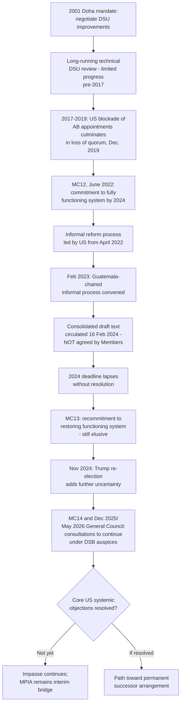

## WTO Dispute Settlement Reform Negotiations Toward a Permanent Successor

### Negotiating Mandate: From Doha to MC12

Dispute settlement reform has a negotiating history considerably longer than the Appellate Body crisis itself. At the 2001 Doha Ministerial Conference, WTO Members agreed to negotiate improvements and clarifications to the DSU — a mandate that produced two decades of largely inconclusive technical discussion on matters such as third-party rights, sequencing, and post-retaliation review, well before the appointments crisis made *reconstituting appellate capacity itself* the central reform question.

The modern reform push acquired real institutional urgency only after the Appellate Body's loss of quorum. At the Twelfth Ministerial Conference (MC12), in the outcome document adopted on 17 June 2022, Members acknowledged the challenges and concerns with respect to the dispute settlement system, including those related to the Appellate Body, and agreed to conduct discussions with the aim of having a fully and well-functioning dispute settlement system accessible to all Members by 2024. This MC12 commitment is the textual anchor for essentially all subsequent formal reform activity.

**Definition on first use — "fully and well-functioning" (MC12 formulation):** WTO negotiating shorthand for a dispute settlement system restoring genuine two-tier, binding adjudication accessible to every Member without exception — implicitly acknowledging that the MPIA's plurilateral, opt-in structure does not itself satisfy this standard, since it excludes non-participants including the United States.

### The Informal Process: Structure and Product

Following the MC12 commitment, Members intensified informal dispute settlement reform discussions, initially led by the United States beginning in April 2022 — a notable detail given that the US blockade was the proximate cause of the crisis the reform process was meant to resolve. In February 2023, a further informal process was convened under the chairmanship of the deputy permanent representative of Guatemala, reflecting a shift toward broader multilateral facilitation of the technical negotiating work.

This process produced a consolidated draft text, circulated formally to Members on 16 February 2024 for transparency purposes — but explicitly not agreed by Members. The 2024 draft text represents the most concrete documented output of the reform process to date, but its unagreed status by the 2024 target date signaled that the MC12 "by 2024" timeline had effectively lapsed without resolution.

**Key Points:**

- The MC12 target of a "fully and well-functioning" system by 2024 was not met; the reform process instead rolled forward into subsequent ministerial cycles without a change in the underlying structural impasse.
- The core substantive sticking point remains unchanged since 2017: the United States' systemic objections to Appellate Body practice (detailed in the companion item on the appointments blockade) have not been resolved to the US's satisfaction, and the US has not supported dispute-settlement reform proposals put forward through the informal process to date.
- More than 120 Members have, at various DSB meetings, issued a joint call for the Appellate Body member selection process to be started forthwith, with many warning that the continued impasse denies all WTO Members their legal right to a binding, two-stage dispute settlement process — a framing that treats restoration, not merely reform, as the objective, in some tension with the US position that structural changes to Appellate Body practice are a precondition to any new appointments.

### Post-MC13 and MC14 Developments

At the Thirteenth Ministerial Conference (MC13), Members reaffirmed their commitment to restoring a fully functioning dispute settlement system by 2024 — restating rather than meeting the original MC12 deadline. By the end of that year, commentary assessing the state of negotiations concluded that some progress had been made, but agreement remained elusive, with the re-election of Donald Trump as US President in November 2024 adding further uncertainty to the reform effort given the first Trump administration's role in originating the blockade.

The reform question was carried forward into the Fourteenth Ministerial Conference (MC14). Briefing materials following MC14 record that at the December 2025 General Council meeting, the then-Dispute Settlement Body chair reported that many Members had underlined the importance of ministers instructing officials to continue dispute settlement reform discussions after MC14. Following MC14 itself, at the May 2026 General Council meeting, the General Council chair noted that the draft Declaration and Work Plan on WTO Reform annexed to the MC14 Chair's Summary acknowledges that consultations on dispute settlement reform should continue following MC14 under the auspices of the DSB. As of the most recent reporting available, this places the negotiations in a continued, open-ended consultative phase under DSB auspices, without a concluded permanent successor arrangement.

**Practitioner note:** The recurring pattern across MC12, MC13, and MC14 — a restated commitment to continue discussions, without a substantive breakthrough on the core US objections — is itself informative for a negotiator assessing near-term prospects: the reform process has demonstrated durable multilateral engagement and repeated high-level political attention, but no ministerial cycle to date has produced a resolution mechanism the US has accepted, suggesting the structural impasse is unlikely to resolve through incremental ministerial reaffirmation alone.

### Proposed Solutions Under Discussion

Beyond the consolidated 2024 draft text (whose specific provisions remain formally unagreed), academic and policy proposals have continued to circulate addressing the appointments deadlock specifically, several converging on variations of an alternative appointment mechanism. One notable line of scholarship has revisited the proposal for the WTO General Council to appoint Appellate Body members through majority voting rather than the consensus mechanism of DSU Article 17.2, arguing that customary rules of interpretation applicable to the constituent instruments of international organizations justify the legality of such a vote to support the WTO's effective functioning. Variants of this proposal — including appointing fewer than the full seven-member complement to bring incremental certainty even short of a complete restoration — have been advanced as ways to break the deadlock while acknowledging Members' broader concerns about departing from consensus-based decision-making and about losing negotiating leverage for substantive Appellate Body reforms if appointments simply resumed unconditionally.

[Inference] The persistence of majority-voting proposals in the academic and policy literature, without apparent multilateral traction in the formal DSB-led process, suggests a structural tension between the legal availability of an alternative appointment path and the political reality that most Members remain reluctant to set a precedent of overriding consensus decision-making on a matter as consequential as Appellate Body composition, even to resolve an acknowledged crisis.

### Broader Reform Linkages

Dispute settlement reform is frequently discussed as one of several interlocking components of a broader WTO institutional reform agenda, alongside improving disciplines on subsidies, facilitating the integration of plurilateral agreements into the WTO framework, and addressing the treatment of non-market economic practices — with some external policy analysis characterizing dispute settlement reform as the culmination of, rather than an isolated strand within, this wider reform process, on the view that a credible enforcement mechanism is what gives any substantive rule reached elsewhere in the WTO reform agenda practical effect.

### Procedural and Institutional Flow

### Practitioner Implications

For a trade negotiator following this file, the operative reality is that "reform" and "restoration" are not the same negotiating objective, and proposals under discussion span a spectrum from purely restorative (resuming ordinary Article 17.2 appointments once US objections are addressed) to structurally alternative (General Council majority-vote appointment, partial-membership restoration) — a negotiator's position on which category of solution to support should track their government's own view of the substantive merit in the US systemic objections, not merely a general preference for resolving the impasse. For a dispute-settlement lawyer advising clients on multi-year planning, the honest assessment as of the most recent reporting is that no concluded permanent successor exists, the informal process's most concrete product (the 2024 draft text) remains unagreed, and the MPIA continues to function as the operative interim bridge — meaning near-term dispute strategy should continue to be built around MPIA membership, bespoke Article 25 agreements, and settlement-oriented approaches rather than an assumption of imminent restoration.

### Related Topics

- The United States' blockade of Appellate Body appointments and its stated systemic objections
- The Multi-Party Interim Appeal Arbitration Arrangement (MPIA) as the operative interim bridge pending reform
- Proposals for General Council majority-vote appointment of Appellate Body members as an alternative to Article 17.2 consensus
- The broader WTO institutional reform agenda (subsidies disciplines, plurilateral integration, non-market economy practices)
- The Doha-era DSU review mandate as the longer historical baseline for dispute settlement reform efforts