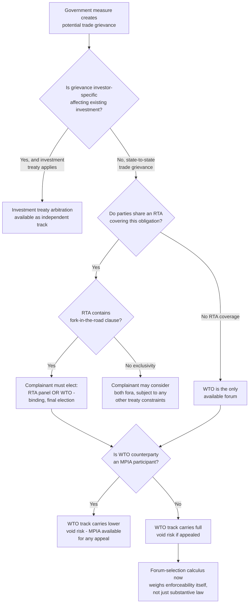

## Forum Shopping and the Rise of Alternatives to WTO Adjudication

### Framing the Concept: Forum Shopping in the Trade Context

**Definition on first use — "forum shopping":** The strategic selection by a prospective claimant of the dispute resolution venue most likely to produce a favorable outcome, when more than one legally available forum could plausibly hear a substantively overlapping claim. In the WTO context, forum shopping has taken on heightened significance since the Appellate Body's loss of quorum, because the calculus a complainant faces now includes not only which forum offers the most favorable substantive law, but which forum offers any realistic prospect of a *binding, enforceable* outcome at all.

This is a structural departure from the pre-2019 baseline, where WTO adjudication was widely regarded as the most credible, binding, and well-developed forum for trade disputes, and forum-shopping discussions centered mainly on overlapping subject-matter jurisdiction between the WTO and preferential/regional trade agreements (RTAs) rather than on the WTO's own enforceability.

### Legal Basis for Overlapping Fora: RTA Dispute Settlement Clauses

Most modern regional and bilateral trade agreements contain their own dispute settlement chapters, frequently modeled structurally on the DSU (consultations, panels, sometimes an appellate mechanism) but operating as legally independent treaty regimes. Many such agreements — including, illustratively, the United States-Mexico-Canada Agreement (USMCA) and numerous EU bilateral agreements — contain **fork-in-the-road** or **forum-exclusivity** clauses, requiring a complainant to elect between RTA dispute settlement and WTO dispute settlement for a given measure and precluding recourse to the other forum once that election is made, precisely to prevent duplicative or inconsistent proceedings over the same substantive violation.

**Key Points:**

- Where a challenged measure could plausibly violate obligations under both a bilateral/regional agreement and the WTO covered agreements (a common scenario, since RTA substantive disciplines frequently track or exceed WTO baseline obligations), the complainant's forum election is typically final and binding once dispute settlement proceedings are formally initiated in one forum.
- The strategic calculus for this election has always considered the substantive strength of each forum's applicable legal standard, the makeup and independence of prospective adjudicators, and the forum's own enforcement mechanism — but the WTO's post-2019 appellate paralysis has now added forum reliability itself as a first-order consideration, not merely a secondary one.
- [Inference] A complainant considering a dispute against a WTO Member with whom it also shares an RTA containing a binding, appeal-capable (or single-tier but genuinely enforceable) dispute mechanism may now have a structural incentive to route the claim through the RTA channel specifically to avoid the risk of an "appeal into the void" foreclosing a binding WTO outcome — a consideration that would have carried much less independent weight before December 2019.

### The WTO's Comparative Position Post-Appellate Body Crisis

Recent commentary from policy analysts has framed the stakes of the reform impasse squarely in these terms: enforcement of Members' obligations was heralded as one of the most important achievements of the Uruguay Round, built on an adjudicatory process at the end of which parties would accept outcomes and conform their behavior to findings, or else face rebalancing through authorized retaliation — an architecture that depended on the credibility of binding, appealable adjudication that the current impasse has substantially undermined for any dispute lacking MPIA coverage.

This has generated visible practical consequences: WTO's own dispute settlement gateway materials and Congressional Research Service analysis both note that panels can continue to hear cases, but those that are appealed may remain unresolved, and retaliation cannot be authorized where the underlying dispute is stuck in appellate limbo — directly linking the appellate paralysis to a degraded enforcement value proposition for WTO adjudication relative to alternatives that do not share this structural vulnerability.

### Categories of Alternative Fora Gaining Relative Prominence

**1. RTA/FTA dispute settlement mechanisms.** As noted above, bilateral and regional agreements with independently functioning (and, in some cases, appeal-capable) dispute settlement chapters offer complainants a route immune to the WTO's specific appellate paralysis, provided the underlying substantive obligation is also covered by the RTA — a condition satisfied more often as RTA substantive coverage has deepened over successive negotiating rounds.

**2. Investor-state dispute settlement (ISDS) and investment treaty arbitration.** Where the underlying grievance involves a government measure affecting an existing foreign investment rather than a border measure affecting only prospective trade flows, an aggrieved investor may have an entirely separate cause of action under a bilateral investment treaty or investment chapter, adjudicated through arbitration mechanisms (such as ICSID) with no relationship to WTO consensus or appointment dynamics whatsoever. This has always been a distinct legal track from WTO state-to-state dispute settlement, but its comparative attractiveness rises when the WTO alternative faces enforceability uncertainty.

**3. The Multi-Party Interim Appeal Arbitration Arrangement (MPIA).** Though technically a workaround *within* the WTO's own Article 25 framework rather than an external forum, the MPIA functions in practice as the closest substitute to a genuinely alternative binding mechanism for the subset of disputes where both parties are participants — and its availability is itself now a factor a complainant must weigh when deciding whether to initiate WTO proceedings at all against a given counterparty.

**4. Bilateral and diplomatic settlement outside formal adjudication.** Reflecting a documented trend, WTO leadership has noted that a meaningful share of recent disputes have been resolved through mutually agreed solutions between the parties themselves rather than through full adjudication — a pattern plausibly incentivized, at least in part, by the diminished certainty that full adjudication will produce a binding result if either party chooses to appeal into the void.

### Structural Consequences for the Development of Trade Law

[Inference] A less visible but potentially significant consequence of this shift is its effect on the future development of multilateral trade jurisprudence itself: to the extent that disputes migrate toward RTA panels, MPIA arbitration, or negotiated settlement rather than full WTO panel-and-Appellate-Body adjudication, the accumulated body of *multilaterally authoritative, adopted* WTO case law may grow more slowly and more unevenly than it did during the 1995–2019 period, since RTA panel awards and unadopted MPIA arbitration outputs do not automatically feed into the same interpretive tradition that adopted Appellate Body reports built. This could, over time, produce a more fragmented global trade law landscape in which the substantive content of similar obligations is interpreted somewhat differently across different RTA panels and MPIA tribunals, compared to the more centralized interpretive authority the Appellate Body exercised during its period of full function.

### Practitioner Considerations in Forum Selection

**Practitioner note:** Counsel advising a client on which forum to pursue for a given grievance should now systematically map, at the outset, (1) which fora have jurisdiction over the substantive claim at all (WTO covered agreements, applicable RTA chapters, any relevant investment treaty), (2) whether a fork-in-the-road clause forecloses pursuing more than one, (3) whether the prospective WTO respondent is an MPIA participant (materially changing the enforceability calculus of the WTO track specifically), and (4) the comparative timeline and remedy structure each forum offers, since RTA panels and investment arbitration frequently offer materially different remedies (including, in the investment context, monetary damages, which WTO state-to-state dispute settlement does not provide) than the prospective-only, compliance-oriented remedies characteristic of the WTO system.

### Comparative Forum Overview

| Forum | Binding Absent Appeal-Into-Void Risk? | Typical Remedy | Availability |
| --- | --- | --- | --- |
| WTO Article 17 appeal (ordinary) | No — subject to void risk since Dec. 2019 | Prospective compliance; authorized retaliation | All Members, but appellate stage non-functional |
| MPIA Article 25 arbitration | Yes, between participants | Prospective compliance; underlying DSU remedies structure preserved | Only between MPIA participants (or bespoke Art. 25 agreement) |
| RTA/FTA dispute settlement | Depends on the specific agreement's mechanism | Varies; some include appeal-capable panels | Only between RTA parties, subject to fork-in-the-road election |
| Investment treaty arbitration (ISDS) | Yes, generally | Monetary damages typically available | Only for qualifying investor-state disputes under an applicable treaty |

### Structural Diagram

### Practitioner Implications

For a trade ministry legal team, the emergence of forum-reliability as an independent forum-selection factor represents a genuine shift in practice from the pre-2019 baseline, where the WTO's comparative advantage in binding, appeal-capable adjudication was largely taken for granted relative to most RTA mechanisms. Counsel should now treat the MPIA-participation status of a prospective WTO respondent as a threshold due-diligence item, comparable in importance to confirming which substantive agreements plausibly cover the grievance, before committing to a WTO-first strategy. For negotiators drafting new RTAs, the WTO's own enforcement uncertainty has plausibly strengthened the negotiating case for robust, appeal-capable RTA dispute settlement chapters as a hedge against continued multilateral appellate paralysis, a consideration increasingly reflected in the dispute settlement design of agreements concluded during this period.

### Related Topics

- The Multi-Party Interim Appeal Arbitration Arrangement (MPIA) and its role in mitigating void risk for participating Members
- Fork-in-the-road and forum-exclusivity clauses in modern RTA dispute settlement chapters
- Investor-state dispute settlement (ISDS) as a substantively and procedurally independent track from WTO state-to-state adjudication
- The fragmentation-of-international-trade-law debate and its relationship to declining centralized WTO jurisprudential authority
- WTO dispute settlement reform negotiations and their bearing on restoring the WTO's comparative forum advantage