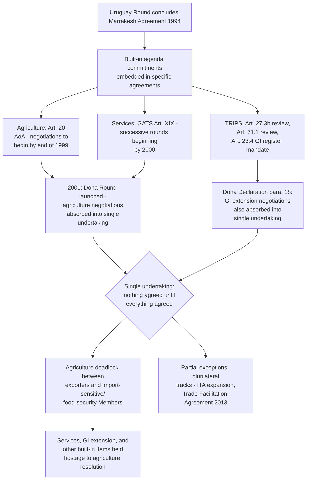

## The Uruguay Round's Unfinished Built-In Agenda and Its Legacy Commitments

### Legal Basis: The Concept of a "Built-In Agenda"

**Definition on first use — "built-in agenda":** A set of negotiating obligations written directly into specific Uruguay Round agreements, committing Members to conduct further negotiations, reviews, or rule development on named subjects at specified future dates or intervals, as a condition of the original agreement's acceptance. Unlike the general Article III:2 WTO Agreement mandate for the WTO to provide a forum for negotiations, built-in agenda items are textually specific commitments embedded in individual covered agreements, reflecting subjects the Uruguay Round negotiators could not fully resolve by the 1994 Marrakesh signing but agreed to revisit on a defined institutional timetable.

The built-in agenda exists because the Uruguay Round (1986–1994) achieved a historically unprecedented expansion of multilateral trade rules — bringing services (GATS), intellectual property (TRIPS), and agriculture comprehensively within binding multilateral disciplines for the first time — but did so under significant negotiating time pressure, leaving several politically sensitive subjects addressed only partially, with a commitment to continue negotiating embedded in the relevant agreement's own text.

### Agriculture: Article 20 of the Agreement on Agriculture

The most consequential built-in agenda commitment is found in **Article 20 of the Agreement on Agriculture**, which commits Members to initiate negotiations for continuing the agricultural reform process one year before the end of the implementation period (i.e., by the end of 1999), taking into account the experience gained from implementing reduction commitments, the effects of agricultural reform on world trade, non-trade concerns, special and differential treatment for developing-country Members, and the objective of establishing a fair and market-oriented agricultural trading system.

**Definition on first use — "special and differential treatment" (S&DT):** A body of provisions throughout WTO agreements affording developing-country and least-developed-country Members longer implementation periods, lower reduction commitments, or technical assistance, reflecting the principle that formally identical obligations can impose asymmetric practical burdens given differing levels of economic development. Agriculture's built-in agenda explicitly names S&DT as a subject the continuation negotiations must address.

Article 20 negotiations formally began in 2000 and were subsequently folded into the broader Doha Development Round launched in 2001, meaning agriculture's built-in mandate did not proceed as an isolated, self-contained negotiation but became the central and most contentious pillar of the Doha Round itself — a merger that is directly responsible for agriculture's outsized role in the Doha stalemate discussed elsewhere in this chapter.

### Services: Article XIX of GATS

**GATS Article XIX** contains a parallel built-in commitment: Members agreed to enter into successive rounds of negotiations, beginning not later than five years from the date of entry into force of the WTO Agreement (i.e., by 2000), with a view to achieving a progressively higher level of liberalization, conducted with due respect for national policy objectives and the level of development of individual Members, and with appropriate flexibility for developing-country Members to open fewer sectors and liberalize fewer transaction types consistent with their development situation.

**Key Points:**

- GATS Article XIX negotiations, like the Agriculture Article 20 negotiations, formally commenced around 2000 and were likewise absorbed into the Doha Round's single undertaking framework.
- The GATS built-in mandate also specifically addresses Mode 4 (movement of natural persons supplying services), a mode of supply of particular interest to developing-country Members seeking greater market access for their skilled and unskilled labor abroad — a subject that has remained one of the least liberalized areas of GATS commitments schedules relative to the other three modes of supply.
- Progress on services negotiations within the Doha framework has been markedly slower than on goods-related market access, reflecting both the domestic political sensitivity of labor-mobility commitments in developed-country Members and the technical complexity of negotiating commitments across GATS's request-offer, positive-list scheduling architecture.

### TRIPS: Built-In Review and Negotiation Commitments

TRIPS contains several distinct built-in commitments rather than a single consolidated mandate:

- **TRIPS Article 27.3(b) review:** Members committed to review the provision permitting exclusion of plants and animals (other than microorganisms) from patentability, and the protection of plant varieties, four years after the WTO Agreement's entry into force — a review that has become entangled with the broader, unresolved debate over the relationship between TRIPS and the Convention on Biological Diversity, particularly disclosure-of-origin requirements for genetic resources and associated traditional knowledge used in patented inventions.
- **TRIPS Article 71.1 general review:** A broader council-level review of TRIPS implementation, also commencing after the initial transition periods.
- **Geographical indications extension:** Paragraph 18 of the 2001 Doha Ministerial Declaration (itself building on TRIPS Article 23.4's built-in negotiating mandate on a multilateral register for wine and spirit geographical indications) directed negotiations on extending the higher, TRIPS Article 23 level of geographical-indication protection — currently limited to wines and spirits — to other products, a subject of particular interest to the EU and several developing-country Members with distinctive agricultural and craft products, and of corresponding resistance from Members (including the United States) whose producers use similarly-named terms generically.

[Inference] The TRIPS built-in items illustrate a recurring pattern across the built-in agenda generally: subjects left open in 1994 because they implicated deep, unresolved distributional disagreements (in this case, between Members favoring expanded protection for traditional-knowledge and place-based products and Members favoring narrower IP obligations preserving generic-term usage) have proven no easier to resolve in subsequent negotiating rounds than they were in 1994, since the underlying economic interests at stake have not converged over time.

### Absorption Into the Doha Round: The "Single Undertaking" Consequence

**Definition on first use — "single undertaking":** The Doha Round's negotiating principle, itself carried over from Uruguay Round practice, that "nothing is agreed until everything is agreed" — meaning individual negotiating items (including the built-in agenda subjects) cannot be concluded and locked in independently but must await a comprehensive final package covering the entire negotiating agenda.

The built-in agenda's absorption into Doha's single-undertaking structure is the direct mechanical link between the Uruguay Round's unfinished business and the Doha Round's own two-decade stalemate (addressed in its own item elsewhere in this chapter): because agriculture and services liberalization — the two largest built-in agenda items — became components of a single, indivisible Doha package rather than proceeding as separable, independently conclude-able negotiations under their own textual mandates, the persistent agriculture deadlock between major agricultural exporters (seeking deep subsidy and tariff cuts) and import-sensitive and food-security-conscious Members (seeking to preserve domestic support flexibility) has had the effect of holding the services and other built-in items hostage to a resolution that has never fully materialized.

**Practitioner note:** For a negotiator assessing why seemingly narrower, more technical built-in agenda items (such as the TRIPS geographical-indications extension or specific GATS sectoral commitments) have made so little independent progress despite lacking the same scale of political controversy as agriculture, the single-undertaking structure is the direct institutional explanation: these items are not free-standing negotiations that could conclude on their own merits, but hostage components of the broader Doha package, meaning their fate is coupled to resolution of the disputes over agriculture and non-agricultural market access that have proven most intractable.

### Partial Exceptions: Plurilateral and Sectoral Progress Outside the Single Undertaking

Not all built-in or Doha-era negotiating activity has remained locked in the single-undertaking impasse. Some subjects have advanced through plurilateral tracks involving a subset of the WTO membership (such as the Information Technology Agreement expansion, negotiated among a critical mass of Members and later multilateralized via most-favored-nation extension) or through post-Doha standalone agreements, such as the Trade Facilitation Agreement concluded at the 2013 Bali Ministerial Conference — itself often described as the most significant multilateral outcome since the Uruguay Round precisely because it was negotiated and concluded as a discrete package outside the fully deadlocked single undertaking.

### Structural Diagram

### Practitioner Implications

For a trade negotiator working on any subject connected to the built-in agenda, understanding this lineage is essential to correctly diagnosing why a given item remains unresolved: the relevant question is rarely whether the specific proposal on the table is technically sound, but whether it can realistically proceed given its structural coupling to the single undertaking and, ultimately, to the agriculture deadlock that has anchored Doha's stalemate since the early 2000s. This has practical strategic implications: proposals framed as freestanding, plurilateral, or otherwise decoupled from the full single undertaking (following the Trade Facilitation Agreement and ITA-expansion precedents) have demonstrated a materially higher probability of actual conclusion than proposals still formally tied to comprehensive Doha Round resolution.

### Related Topics

- The Doha Development Round's stalemate and the single-undertaking negotiating principle
- The Agreement on Agriculture's domestic support pillars and ongoing negotiating positions on subsidy disciplines
- GATS Mode 4 (movement of natural persons) and its comparatively limited liberalization
- The TRIPS–Convention on Biological Diversity disclosure-of-origin debate
- Plurilateral agreements and critical-mass negotiating tracks as alternatives to single-undertaking gridlock (e.g., Trade Facilitation Agreement, Information Technology Agreement)