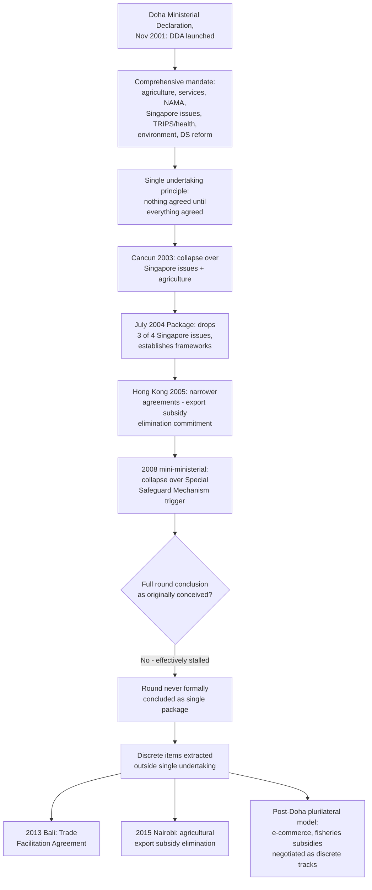

## The Doha Development Agenda: Launch, Ambition, and the Single Undertaking Trap

### Legal and Political Basis for Launch

The Doha Development Agenda (DDA) was launched by the Fourth Ministerial Conference's **Doha Ministerial Declaration**, adopted on 14 November 2001 in Doha, Qatar. Its launch followed the failed Seattle Ministerial Conference of 1999, where an attempt to open a new round collapsed amid procedural disputes over transparency and substantive disagreement, particularly between developed and developing-country Members, over the proposed agenda's scope. The successful 2001 launch is frequently attributed in part to the post-September 11 diplomatic climate, which created political pressure to demonstrate multilateral cooperation, and to the deliberate "Development" framing of the round's name and content — an explicit signal that this round would center the concerns and negotiating priorities of developing-country Members more centrally than the Uruguay Round had.

**Definition on first use — "Doha Development Agenda":** The formal name for the ninth round of multilateral trade negotiations under GATT/WTO auspices, distinguished from prior rounds by its explicit foregrounding of development concerns as a cross-cutting theme rather than a discrete negotiating item, reflecting developing-country Members' view that Uruguay Round outcomes had imposed disproportionate implementation burdens relative to the market-access benefits they received.

### Scope and Ambition of the Mandate

The Doha Ministerial Declaration's negotiating mandate was comprehensive, absorbing the Uruguay Round's built-in agenda items on agriculture (under Agreement on Agriculture Article 20) and services (under GATS Article XIX) while adding substantial new negotiating subjects, including:

- **Non-agricultural market access (NAMA):** Reduction or elimination of tariffs and non-tariff barriers on industrial goods, with particular attention to tariff peaks, tariff escalation, and barriers facing developing-country exports.
- **The "Singapore issues":** Four subjects originally proposed at the 1996 Singapore Ministerial Conference — trade and investment, trade and competition policy, transparency in government procurement, and trade facilitation — provisionally included in the Doha mandate subject to explicit consensus on modalities before full negotiations would begin, a conditionality that proved consequential (discussed below).
- **TRIPS and public health:** The Doha Declaration produced, alongside the main negotiating mandate, the separate **Doha Declaration on the TRIPS Agreement and Public Health**, clarifying Members' right to use TRIPS flexibilities (including compulsory licensing) to protect public health, and mandating further work on the particular problem facing Members with insufficient or no pharmaceutical manufacturing capacity — work that subsequently produced the August 2003 decision and the eventual TRIPS Article 31bis compulsory-licensing-for-export amendment.
- **Trade and environment; dispute settlement reform; special and differential treatment review:** Additional named negotiating items, several themselves inheriting unresolved threads from the Uruguay Round.

**Practitioner note:** The sheer breadth of the Doha mandate — spanning agriculture, services, industrial tariffs, IP, environment, dispute settlement, and the contingent Singapore issues — is itself frequently cited as a structural vulnerability: a mandate this expansive maximized the number of politically sensitive linkages between subjects, increasing the surface area across which any single intractable disagreement (most consequentially, agriculture) could stall the entire package under the single-undertaking principle.

### The Single Undertaking Principle as Structural Trap

**Definition on first use — "single undertaking":** The negotiating principle, carried forward from Uruguay Round practice and made explicit in the Doha mandate, that "nothing is agreed until everything is agreed" — meaning no individual negotiating item, however close to resolution on its own technical merits, can be locked in and implemented independently of a comprehensive final agreement covering the entire round.

The single undertaking was originally adopted (in the Uruguay Round context) as a device to enable cross-issue package deals — allowing Members with strong interests in different subjects to trade concessions across the full negotiating agenda rather than negotiating each subject to conclusion in isolation, on the theory that a broader package creates more opportunities for mutually acceptable trade-offs than narrower, sequential negotiations would. Applied to the far more heterogeneous and larger (post-accession-wave) Doha-era membership, however, the same mechanism functioned differently: because full consensus was required not just within each subject but across the entire package simultaneously, a single major fault line — agriculture — was sufficient to prevent conclusion of the whole round, regardless of how much convergence had been achieved on other, less contentious items.

**Key Points:**

- The single undertaking meant that even where Members had achieved substantial convergence on subjects such as trade facilitation or specific NAMA tariff formulas, those provisional agreements had no independent legal effect and could not be implemented while agriculture remained unresolved.
- This structural feature transformed agriculture — a subject where the underlying distributional conflict between agricultural-exporting Members (seeking deep cuts to domestic support and export subsidies) and import-sensitive, food-security-conscious, and smallholder-heavy developing Members (seeking to preserve policy flexibility) proved unusually resistant to compromise — into a de facto veto point over the entire round's ambition.
- The Singapore issues' conditional inclusion (subject to explicit consensus on negotiating modalities) proved to be an early, smaller-scale preview of the same dynamic: at the 2003 Cancún Ministerial Conference, disagreement over whether and how to proceed with the Singapore issues contributed directly to that ministerial's collapse, and three of the four Singapore issues (all except trade facilitation) were subsequently dropped from the Doha agenda entirely by the 2004 "July Package" framework agreement — an early illustration that the single undertaking could produce subtraction from the mandate as well as paralysis of the whole.

### Key Collapse Points in the Negotiating Timeline

- **Cancún Ministerial Conference (2003):** Collapsed principally over the Singapore issues and persistent agriculture disagreements, with a coalition of developing countries (the G20, led by Brazil, India, and others) taking a more assertive negotiating posture on agricultural subsidy disciplines than developed-country Members had anticipated.
- **July Package / "July 2004 Framework":** Restored some momentum by dropping most Singapore issues and establishing broad frameworks for agriculture and NAMA negotiations, but did not resolve the core substantive disagreements, only postponing their resolution to subsequent technical negotiations.
- **Hong Kong Ministerial Conference (2005):** Achieved narrower agreements, including a commitment to eliminate agricultural export subsidies by 2013, but did not resolve the core domestic-support and market-access disagreements.
- **2008 "mini-ministerial" collapse:** An attempt at Geneva to finalize modalities for agriculture and NAMA broke down principally over the design of a Special Safeguard Mechanism (SSM) for developing countries — a mechanism allowing temporary tariff increases in response to import surges or price falls — with the United States and India, among others, unable to agree on the SSM's trigger thresholds, widely regarded as the effective end of serious momentum toward concluding the round as originally conceived.

**Practitioner note:** The 2008 collapse over the SSM is a particularly instructive case study in how the single undertaking magnifies the stakes of narrow technical disagreements: the specific numerical trigger threshold for a safeguard mechanism — a comparatively narrow technical question relative to the Doha Round's overall scope — became sufficient to end serious prospects for concluding the entire round, precisely because the single undertaking meant no other progress could be banked independently of resolving it.

### Legacy: Partial Achievements Outside Full Conclusion

**Key Points:**

- The Doha Round has never been formally concluded as a single comprehensive package, and by the 2010s WTO Members and observers had broadly acknowledged that the round, in its originally conceived comprehensive form, was unlikely to conclude.
- Discrete elements have nonetheless been extracted and concluded outside the full single undertaking, most significantly the **Trade Facilitation Agreement**, concluded at the 2013 Bali Ministerial Conference and entering into force in 2017 — widely regarded as the most significant multilateral achievement to emerge from the Doha process, precisely because it was negotiated and locked in as a discrete outcome rather than held hostage to agriculture resolution.
- The 2015 Nairobi Ministerial Conference produced a further significant discrete outcome: the agreed elimination of agricultural export subsidies, addressing one specific item from the original Doha agriculture mandate even as the broader domestic-support negotiations remained unresolved.
- [Inference] This pattern — meaningful progress achieved specifically by decoupling individual items from the single undertaking, rather than through eventual full-package conclusion — has become the dominant model for post-Doha multilateral achievement, and has directly informed subsequent negotiating strategy, including the more explicitly plurilateral, issue-specific approach favored in recent WTO initiatives on subjects such as e-commerce and fisheries subsidies.

### Structural Diagram

### Practitioner Implications

For a negotiator or analyst assessing why the Doha Round's ambition and its ultimate fate diverged so sharply, the single-undertaking principle is the necessary analytical lens: the round's failure was not primarily a failure of technical negotiation on any single subject, but a structural design choice that made the entire, unusually broad mandate hostage to resolution of its single most intractable component. This has direct strategic relevance for evaluating any future comprehensive-round proposal: a negotiator should weigh whether a genuinely comprehensive single undertaking is likely to replicate Doha's paralysis, versus whether a narrower, discrete, or explicitly plurilateral structure (following the Trade Facilitation Agreement precedent) offers a more realistic path to concluded, binding outcomes.

### Related Topics

- The Uruguay Round's built-in agenda (Agreement on Agriculture Article 20, GATS Article XIX) absorbed into the Doha mandate
- The Special Safeguard Mechanism (SSM) dispute and the 2008 mini-ministerial collapse
- The Doha Declaration on the TRIPS Agreement and Public Health and the Article 31bis compulsory-licensing amendment
- The Trade Facilitation Agreement as a post-Doha plurilateral/discrete-outcome model
- Contemporary WTO negotiating initiatives on e-commerce and fisheries subsidies as successors to the single-undertaking approach