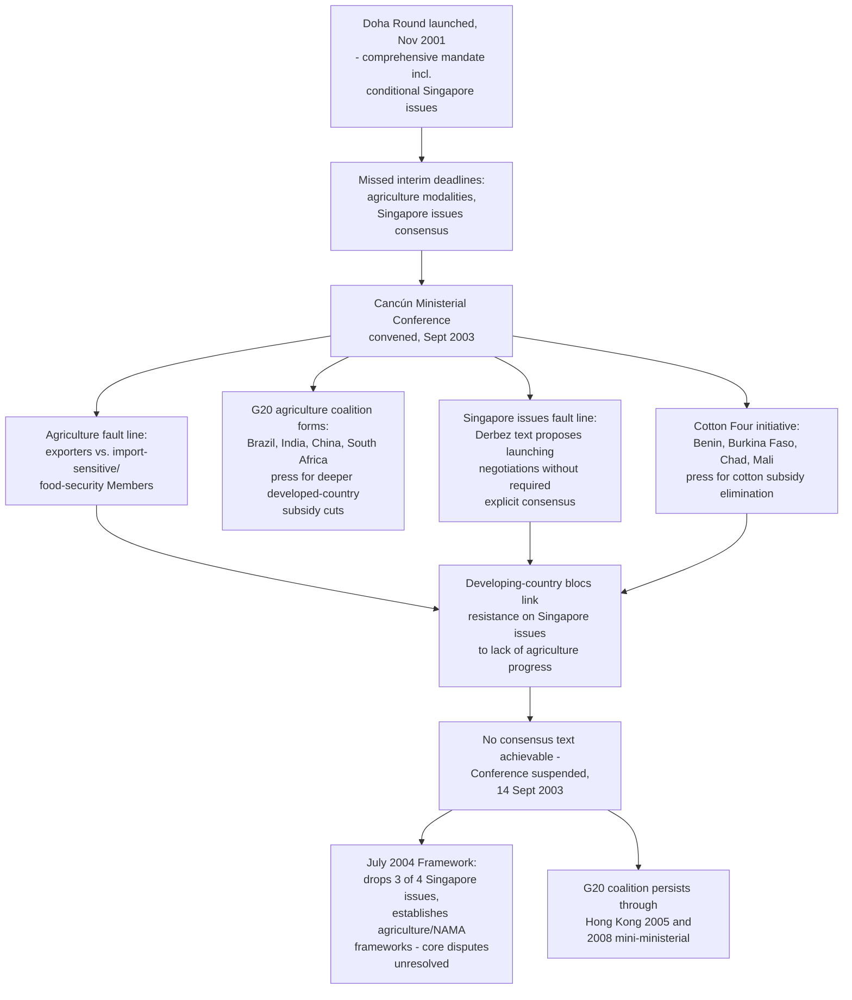

## The 2003 Cancún Ministerial Collapse Over Agriculture and the Singapore Issues

### Institutional Context: Cancún's Place in the Doha Round Timeline

The Fifth WTO Ministerial Conference, held in Cancún, Mexico, from 10–14 September 2003, was convened as the scheduled mid-round stocktaking and decision point for the Doha Development Agenda, launched at Doha in November 2001. Under the Doha mandate, several substantive negotiating deadlines had already been missed in the intervening two years — including a March 2003 deadline for agriculture modalities and a target date for resolving the conditional status of the Singapore issues — meaning Cancún carried unusually high stakes as the moment at which Members would need to either bridge these gaps or acknowledge the round was falling seriously behind schedule.

**Definition on first use — "modalities":** In WTO negotiating usage, the specific technical formulas, targets, and rules (e.g., tariff-cutting formulas, subsidy reduction percentages, timelines) that Members must agree upon before a negotiating subject can move from general framework discussion to concrete, legally scheduled commitments. The absence of agreed agriculture modalities by the time of Cancún meant the round's largest and most contentious subject remained at a purely conceptual stage.

### The Agriculture Fault Line

Agriculture entered Cancún as the Doha Round's central unresolved conflict, inherited directly from the Uruguay Round's built-in agenda under Agreement on Agriculture Article 20. The core disagreement pitted two broad negotiating coalitions against each other:

- **Agricultural-exporting Members** (including the Cairns Group of exporting nations, and, on export-subsidy elimination specifically, a substantial developed-country and developing-country coalition) sought deep, binding reductions in trade-distorting domestic support and the elimination of agricultural export subsidies, viewed as primarily benefiting a small number of wealthy Members (principally the EU and the United States) at the expense of exporters excluded from such support.
- **Import-sensitive and food-security-conscious Members**, including the EU (defending its Common Agricultural Policy) and Japan and others defending multifunctional agricultural policy objectives, sought to preserve greater domestic policy flexibility, resisting the depth of cuts sought by exporters.

**Key Development — the emergence of the G20 (agriculture):** In the immediate run-up to and during Cancún, a new negotiating coalition of developing countries — the G20 (agriculture), led prominently by Brazil, India, China, and South Africa, and distinct from the G20 finance-ministers grouping — formed to press for more ambitious developed-country agricultural subsidy cuts than developed Members had proposed, while simultaneously resisting reciprocal market-access concessions on their own agricultural sectors on food-security and rural-livelihood grounds. This coalition's emergence is widely regarded as a structural turning point in WTO negotiating dynamics: it represented a materially more assertive and cohesive developing-country negotiating bloc than had existed during the Uruguay Round, altering the basic two-sided (developed-versus-developed, or developed-versus-fragmented-developing) bargaining dynamic that had characterized most prior GATT/WTO rounds.

**Practitioner note:** The G20's formation at Cancún is frequently cited by trade historians as the moment developing-country coalitional bargaining power became a durable structural feature of multilateral trade negotiations rather than an occasional, issue-specific alignment — a dynamic that has persisted in various forms (with shifting membership and issue focus) through subsequent ministerials and remains directly relevant to understanding contemporary WTO negotiating dynamics on agriculture, fisheries subsidies, and other subjects.

### The Singapore Issues Fault Line

Running alongside and interacting with the agriculture deadlock was the unresolved status of the four **Singapore issues** — trade and investment, trade and competition policy, transparency in government procurement, and trade facilitation — named for their original proposal at the 1996 Singapore Ministerial Conference and included in the 2001 Doha mandate only on the express condition that negotiations on modalities for each would begin only after "explicit consensus" on how to proceed, a conditionality inserted at developing-country Members' insistence precisely because many developing-country Members viewed investment, competition, and procurement disciplines as imposing significant new regulatory and administrative burdens with uncertain development benefit.

By the time of Cancún, the required "explicit consensus" to move the Singapore issues into full negotiation had not been achieved, and the conference's draft ministerial text (the so-called Derbez text, after conference chair Luis Ernesto Derbez) proposed launching negotiations on at least some of the four issues — a proposal that a substantial bloc of developing-country Members, including many African, Caribbean, and Pacific (ACP) Members, rejected as exceeding what they had agreed to at Doha.

**Key Points:**

- The Singapore issues dispute at Cancún was not merely a technical disagreement over four discrete negotiating subjects; it functioned as a proxy for a broader developing-country grievance about the pace and process of the round, reinforcing the same underlying dynamic — resistance to being pressed into new disciplines without commensurate market-access gains — animating the agriculture standoff.
- The African Group and other developing-country coalitions explicitly linked their resistance on the Singapore issues to the absence of adequate progress on agriculture, illustrating how the single undertaking's cross-issue linkage operated not only as an abstract structural principle but as an active, deliberate negotiating tactic: developing-country Members used lack of agriculture progress as grounds to resist concessions elsewhere in the package.

### The Collapse Itself

The ministerial conference ended on 14 September 2003 without agreement, when the conference chair suspended proceedings after it became clear no consensus text could be produced bridging the agriculture and Singapore issues divides. Cotton subsidies were a further, closely related flashpoint: a coalition of West African cotton-producing Members (Benin, Burkina Faso, Chad, and Mali, the "Cotton Four") had specifically pressed for the elimination of cotton subsidies paid by developed-country producers (principally the United States), arguing these subsidies caused severe, quantifiable harm to their export-dependent economies — a claim developed-country Members did not resolve to the Cotton Four's satisfaction, adding further momentum to the developing-country bloc's collective resistance to advancing on other fronts absent progress on subjects of direct concern to them.

**Practitioner note:** The cotton initiative at Cancún is a frequently cited case study in how a comparatively narrow, well-evidenced developing-country grievance (the Cotton Four's economic argument regarding cotton subsidies was widely regarded, including by independent economic analysis, as unusually well-substantiated) can nonetheless fail to secure resolution within a single-undertaking structure, since developed-country Members had no structural obligation to resolve it independently of the broader agriculture package.

### Immediate and Longer-Term Consequences

**Key Points:**

- Cancún's collapse did not formally terminate the Doha Round, but it substantially damaged negotiating momentum and confirmed, for many observers, that the round's original 1 January 2005 target conclusion date (set at Doha) was unrealistic.
- The **July 2004 Framework Agreement** (the "July Package"), negotiated at the WTO General Council roughly ten months after Cancún, restored some momentum by formally dropping three of the four Singapore issues (retaining only trade facilitation, which developing-country resistance had been comparatively milder toward, and which was eventually concluded as the standalone 2013 Trade Facilitation Agreement) and establishing broad negotiating frameworks for agriculture and non-agricultural market access — but did not resolve the underlying substantive disagreements over agriculture that had driven the Cancún collapse.
- The G20 (agriculture) coalition formed at Cancún persisted as an active negotiating bloc through subsequent ministerials, including the 2005 Hong Kong Ministerial Conference and the 2008 Geneva mini-ministerial, continuing to shape agriculture negotiating dynamics well beyond the immediate Cancún collapse.

### Structural Diagram

### Practitioner Implications

For a negotiator studying coalition dynamics, Cancún is the essential case study for understanding how the single undertaking's cross-issue linkage can be actively weaponized by a negotiating bloc, rather than functioning merely as a passive structural constraint: the developing-country coalitions at Cancún deliberately used resistance on the Singapore issues (and cotton) as leverage to press for agriculture concessions, a tactic that has recurred in various forms in subsequent negotiations. For counsel or analysts assessing the durability of any future multilateral coalition, the G20 (agriculture) precedent demonstrates that ad hoc negotiating coalitions formed around a specific ministerial crisis can evolve into durable, multi-round institutional actors, meaningfully altering the basic bargaining structure of subsequent negotiations well beyond the episode that produced them.

### Related Topics

- The Doha Development Agenda's single undertaking structure and its role in transmitting the agriculture deadlock across the entire mandate
- The July 2004 Framework Agreement and the narrowing of the Singapore issues to trade facilitation alone
- The Cotton Initiative and West African producer interests in agricultural subsidy disciplines
- The G20 (agriculture) coalition's continued role in subsequent ministerials (Hong Kong 2005, the 2008 Geneva mini-ministerial)
- The Trade Facilitation Agreement (2013) as the eventual standalone conclusion of the sole surviving Singapore issue