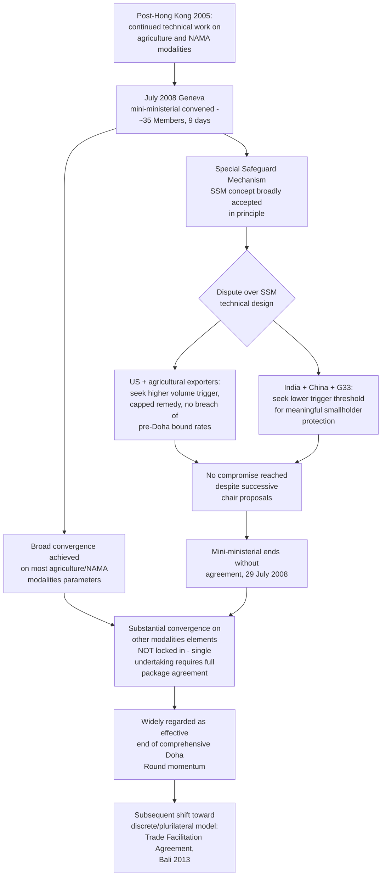

## The 2008 Modalities Collapse and the Special Safeguard Mechanism Dispute

### Institutional Context: The July 2008 Geneva Mini-Ministerial

The July 2008 Geneva mini-ministerial meeting convened senior trade officials from roughly 35 WTO Members over nine days (21–29 July 2008) in an effort to finalize agreed "modalities" — the specific technical formulas, thresholds, and reduction schedules — for agriculture and non-agricultural market access (NAMA), the two negotiating pillars that had remained unresolved through the July 2004 Framework Agreement and the 2005 Hong Kong Ministerial Conference. Reaching agriculture and NAMA modalities was understood by participants as the essential precondition for concluding the Doha Round as a whole, given the single undertaking's requirement that no element of the comprehensive package could be locked in independently.

**Definition on first use — "modalities" (recap):** The specific negotiating formulas and numerical parameters — tariff-cutting bands, subsidy reduction percentages, product exemption categories, and safeguard trigger thresholds — that convert general framework commitments into concrete, legally implementable obligations. By 2008, agriculture and NAMA modalities negotiations had progressed through successive draft texts (informally numbered revisions circulated by the chairs of the respective negotiating groups) without final agreement.

### The Special Safeguard Mechanism: Legal and Policy Background

**Definition on first use — "Special Safeguard Mechanism" (SSM):** A proposed new instrument, distinct from the existing Special Safeguard provisions under Agreement on Agriculture Article 5 (available only to Members that reserved the right to use them during the Uruguay Round tariffication process) and from the general Safeguards Agreement, that would have allowed *all* developing-country Members to temporarily raise bound agricultural tariffs above their normal WTO-bound rates in response to import surges or import price declines below specified reference levels, intended to protect smallholder and subsistence farmers in developing countries from sudden import shocks.

The SSM concept emerged directly from developing-country negotiating priorities articulated since the Cancún Ministerial Conference of 2003 and the subsequent rise of the G20 (agriculture) coalition: because most developing-country Members had not reserved access to the existing Article 5 Special Safeguard during the original Uruguay Round tariffication exercise (that mechanism being available mainly to Members, chiefly developed, that converted non-tariff agricultural barriers into tariffs at that time), a new, more broadly available safeguard was proposed as a form of asymmetric flexibility appropriate to the "special and differential treatment" principle running throughout the agriculture negotiating mandate.

### The Core Technical Dispute: Trigger Thresholds

By July 2008, the general concept of an SSM had gained broad acceptance in principle; the negotiations broke down over the specific numerical design of its triggering mechanism — precisely the kind of narrow technical parameter that modalities negotiations exist to resolve, and precisely the kind of narrow disagreement the single undertaking structure was capable of elevating into a round-ending dispute.

**Key Points:**

- The central disagreement was over the **volume trigger** — the percentage increase in import volume, relative to a specified historical base period, that would permit a developing-country Member to invoke the SSM and raise tariffs above bound rates — and the **remedy cap**, the maximum permissible tariff increase once the trigger was activated.
- The United States, joined by several other agricultural-exporting Members, argued that the trigger thresholds under discussion (particularly a proposed 40% import-surge trigger allowing a Member to raise tariffs above its pre-Doha bound rate) were low enough, and the remedy generous enough, that the SSM risked functioning as a routinely available protectionist tool rather than the narrowly targeted emergency safeguard its proponents described — potentially disrupting normal trade flows and undermining the market-access gains the United States and other exporters sought from the broader agriculture package.
- India, joined by China and other developing-country Members within the G20 (agriculture) and G33 (a coalition specifically focused on food-security and special-products issues) coalitions, argued that a higher trigger threshold would render the SSM practically useless for its intended protective purpose, since import surges large enough to threaten smallholder livelihoods needed a correspondingly responsive, low-threshold mechanism to provide meaningful protection.
- A particular flashpoint concerned whether SSM-triggered tariff increases could, in some circumstances, raise applied tariffs above a Member's *pre-Doha-Round* bound rate (rather than merely up to that pre-existing bound level) — a design feature the United States viewed as effectively reneging on existing market-access commitments rather than merely preserving flexibility within the new round's reduction schedule.

**Practitioner note:** The US–India standoff over the SSM is frequently cited as the paradigmatic illustration of how the single undertaking magnifies the stakes of a narrow technical parameter: the specific numerical difference between competing proposed trigger thresholds was, in isolation, a comparatively modest technical gap, yet it proved sufficient to end serious prospects of concluding the entire Doha Round, because no alternative mechanism existed to bank the substantial progress achieved elsewhere in the agriculture and NAMA modalities texts independently of resolving this one dispute.

### The Collapse Itself

Despite nine days of intensive negotiation and successive compromise proposals circulated by the chair of the agriculture negotiating group, the mini-ministerial ended on 29 July 2008 without agreement, with the SSM trigger-threshold dispute between the United States and India (with China playing a closely aligned supporting role) identified by nearly all participants and subsequent WTO reporting as the specific, proximate cause of the breakdown, distinguishing this collapse from the broader, more diffuse set of grievances that had characterized the 2003 Cancún collapse.

**Key Points:**

- Unlike Cancún, where the collapse involved multiple simultaneous fault lines (agriculture, the Singapore issues, and cotton subsidies), the 2008 collapse is distinguished in most accounts by its comparatively narrow, identifiable proximate cause — the SSM trigger dispute specifically — even though the underlying agriculture and NAMA texts each still contained numerous other unresolved technical issues.
- The 2008 collapse is widely regarded by trade historians and WTO officials as the effective end of serious momentum toward concluding the Doha Round in its original, comprehensive form, even though the round was not formally declared terminated and continued to exist nominally as an active negotiating mandate for years afterward.
- Attempts to revive comprehensive modalities negotiations in subsequent years (including further technical work through 2009–2011) did not produce a breakthrough, and by the early 2010s WTO Members and outside observers had broadly converged on the assessment that the round would not conclude as originally conceived.

### Longer-Term Consequences

[Inference] The 2008 collapse's relatively narrow, identifiable proximate cause — as opposed to Cancún's more diffuse multi-issue breakdown — arguably makes it a more precise illustration of the single undertaking's structural vulnerability: it demonstrates that even after five additional years of technical negotiation following Cancún, during which enormous cumulative progress had been made narrowing the range of disagreement across the vast majority of agriculture and NAMA modalities, the single undertaking's requirement of complete agreement meant that a single remaining disputed parameter was sufficient to nullify all of that accumulated convergence. This experience directly informed the subsequent shift toward the discrete, plurilateral negotiating model that produced the Trade Facilitation Agreement at the 2013 Bali Ministerial Conference — a deliberate structural departure from the single-undertaking approach that had proven capable of allowing a single unresolved technical dispute to hold an entire round hostage.

The SSM itself has never been concluded as a multilateral agreement; the underlying tension between developing-country food-security and smallholder-protection objectives, on one hand, and agricultural-exporting Members' market-access and trade-predictability objectives, on the other, has remained a recurring and unresolved theme in subsequent WTO agriculture discussions, including in later ministerial-level discussions of public stockholding for food-security purposes, a related but textually distinct subject that has itself generated its own extended negotiating history since 2013.

### Structural Diagram

### Practitioner Implications

For a negotiator studying failure modes in multilateral trade negotiation, the 2008 collapse offers a cleaner analytical case than Cancún precisely because of its narrower proximate cause: it demonstrates that the single undertaking's vulnerability is not merely a function of the number or diversity of unresolved issues, but of the binary, all-or-nothing character of final agreement regardless of how narrow the residual gap becomes. This has direct relevance for structuring future negotiations on technically similar issues (such as ongoing public stockholding and food-security discussions descending from the same underlying tension): a negotiator should assess, early in any renewed negotiation, whether the single undertaking's binary structure risks recreating the 2008 dynamic, and whether a discrete, separable negotiating and implementation structure — following the Trade Facilitation Agreement precedent — would better preserve incremental progress against the risk of a late-stage breakdown over a single remaining technical parameter.

### Related Topics

- The 2003 Cancún Ministerial collapse and its broader, multi-issue breakdown as a contrasting failure mode
- Special and differential treatment principles underlying the SSM's asymmetric-availability design
- The G33 coalition and food-security/special-products negotiating priorities in agriculture
- Public stockholding for food security as a related, ongoing post-2013 negotiating subject
- The Trade Facilitation Agreement (2013) as the structural response to single-undertaking paralysis demonstrated by the 2008 collapse