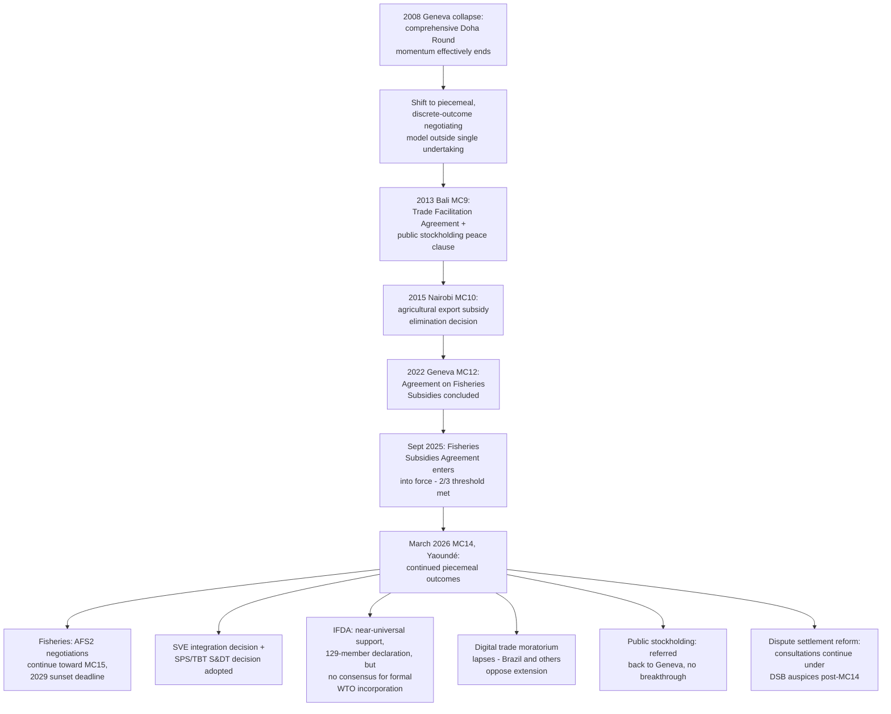

## Post-Doha Piecemeal Outcomes: The Bali Trade Facilitation Agreement Through MC14

### Framing: The Shift From Single Undertaking to Discrete Outcomes

Following the effective collapse of comprehensive Doha Round negotiations at the 2008 Geneva mini-ministerial (addressed in the companion item on the Special Safeguard Mechanism dispute), WTO Members progressively abandoned the expectation that the round would conclude as a single comprehensive package. In its place emerged a pattern of narrower, discrete agreements and decisions negotiated and concluded outside the strict single-undertaking requirement — a structural adaptation this item traces from the 2013 Bali Ministerial Conference through the 2026 Fourteenth Ministerial Conference (MC14).

**Definition on first use — "piecemeal outcome":** A negotiated agreement or ministerial decision concluded and legally locked in independently of the full, comprehensive Doha package, reflecting the post-2008 recognition that requiring simultaneous agreement across the entire original mandate had proven structurally unworkable.

### The Trade Facilitation Agreement (Bali, 2013)

The **Trade Facilitation Agreement (TFA)**, concluded at the Ninth Ministerial Conference in Bali in December 2013 and entering into force in February 2017 after two-thirds of the membership deposited instruments of acceptance, is the paradigm case of the piecemeal model and remains the most significant multilateral outcome to emerge from the Doha process. The TFA establishes binding disciplines on customs procedures, border-agency cooperation, and transit-trade simplification, structured with an unusual implementation architecture: Article 13 permits developing-country and least-developed-country Members to self-designate their own implementation categories (A, B, and C) based on their capacity, with Category C commitments tied to receipt of technical assistance — a design frequently cited as a template for accommodating special and differential treatment concerns without requiring the same provision to apply uniformly to all Members.

**Key Points:**

- The TFA succeeded, where the broader Doha Round did not, specifically because it was negotiated and locked in as a self-contained package rather than remaining coupled to resolution of agriculture and NAMA modalities under the single undertaking.
- The TFA is formally an amendment to the WTO Agreement (added as Annex 1A), meaning it forms part of the ordinary multilateral covered-agreement architecture applicable to all Members upon acceptance, distinguishing it from the plurilateral, opt-in structure of instruments like the Government Procurement Agreement.

### The Bali "Peace Clause" on Public Stockholding

Alongside the TFA, the 2013 Bali package produced an interim decision on **public stockholding for food security purposes** — a mechanism allowing developing-country Members to procure and stockpile food at administered support prices without those purchases being challenged as exceeding Agreement on Agriculture domestic-support limits, pending negotiation of a permanent solution. This "peace clause" is a direct descendant of the same underlying food-security-versus-market-access tension that produced the 2008 Special Safeguard Mechanism collapse, illustrating that even successful piecemeal outcomes have frequently addressed only the interim, procedural layer of the Doha Round's core substantive disputes rather than resolving them outright.

### The Nairobi Package (MC10, 2015)

The Tenth Ministerial Conference in Nairobi produced the **Nairobi Decision on Export Competition**, under which Members agreed to eliminate agricultural export subsidies — a specific, long-standing item from the original Agreement on Agriculture Article 20 built-in agenda, extracted and concluded independently of the broader agriculture domestic-support negotiations that remained (and remain) unresolved. Nairobi also produced decisions on special safeguard mechanisms for developing countries in a narrower form than the 2008 proposal, and further work on cotton — again illustrating the piecemeal pattern of extracting resolvable components from the larger, still-unresolved agriculture agenda.

### The Fisheries Subsidies Agreement (MC12, 2022, and Entry Into Force 2025)

The **Agreement on Fisheries Subsidies**, concluded at the Twelfth Ministerial Conference in June 2022, represents the most substantively significant piecemeal outcome after the TFA, disciplining subsidies contributing to illegal, unreported, and unregulated (IUU) fishing, subsidies for fishing already-overfished stocks without conservation measures, and subsidies for unregulated high-seas fishing. The agreement required two-thirds of the WTO membership to deposit instruments of acceptance to enter into force, a threshold reached on 15 September 2025.

**Key Points:**

- Article 12 of the Agreement on Fisheries Subsidies itself contains a built-in mandate — structurally analogous to the Uruguay Round's built-in agenda discussed elsewhere in this chapter — committing Members to continue negotiating a second, more comprehensive set of disciplines (informally referenced as "AFS2"), particularly on subsidies contributing to overcapacity and overfishing more broadly, which the 2022 agreement did not fully resolve.
- Members have set a deadline of September 2029 (four years from the first agreement's entry into force) to conclude AFS2; failure to do so would result in the 2022 agreement's termination unless the General Council decides otherwise — a built-in sunset mechanism creating a harder deadline pressure than the original, indefinitely-extended Doha built-in agenda ever carried.

### MC14 (Yaoundé, March 2026): Latest Outcomes

The Fourteenth Ministerial Conference, held in Yaoundé, Cameroon, from 26–30 March 2026 — the first full ministerial since MC13 in Abu Dhabi — continued the piecemeal pattern, producing a limited but concrete set of outcomes widely characterized by observers as modest relative to expectations, which were themselves already limited going into the conference.

**Key Points:**

- **Fisheries subsidies continuation:** Ministers formally marked the Agreement on Fisheries Subsidies' entry into force (with Paraguay, Samoa, and Saint Vincent and the Grenadines depositing instruments of acceptance at the opening ceremony, bringing total acceptances to 119) and agreed to continue negotiations toward AFS2, with the explicit aim of making recommendations to the Fifteenth Ministerial Conference (MC15) to achieve the comprehensive disciplines referenced in Article 12.
- **Development-focused decisions:** Ministers adopted two decisions, both previously endorsed by Members in Geneva ahead of the conference: one on improving the integration of small and vulnerable economies (SVEs) into the multilateral trading system, and one on enhancing the precise, effective, and operational implementation of special and differential treatment provisions specifically within the SPS and TBT Agreements.
- **Investment Facilitation for Development Agreement (IFDA) — stalled formalization:** A joint ministerial declaration was issued by 129 Members party to the IFDA, and support for incorporating the agreement into the formal WTO legal architecture was reported as nearly universal (165 of 166 Members reportedly in favor) — but formal incorporation requires consensus, and the absence of that consensus left the IFDA outside the WTO's formal legal architecture, limiting its enforceability despite the near-universal support. This is frequently cited as a notable illustration of how even overwhelming near-unanimous political support can fail to translate into formal multilateral legal effect where a single procedural objection (or a small number of holdouts) blocks the consensus required for formal incorporation.
- **Digital trade impasse:** Disagreement on digital trade policy — including the long-standing moratorium on customs duties on electronic transmissions — blocked agreement on the conference's most consequential prospective items; the moratorium itself lapsed at MC14 after Members, including Brazil, opposed its extension in order to preserve policy space, a significant reversal of the moratorium's uninterrupted renewal at every ministerial conference since 1998.
- **Public stockholding:** Consistent with the pattern traced from Bali onward, MC14 did not deliver a breakthrough on a permanent public stockholding solution; the matter was again referred back to Geneva-based technical discussions without a clear resolution timeline, reflecting the persistence of the underlying developed-versus-developing-country trust deficit on this issue, with concerns that a permanent solution could distort global agricultural markets running alongside continued developing-country insistence on food-security flexibility.
- **Dispute settlement reform:** As detailed in the companion item on reform negotiations, the DSB chair's report to MC14 and the subsequent May 2026 General Council meeting confirmed that consultations on dispute settlement reform would continue under DSB auspices following MC14, without a substantive resolution achieved at the conference itself.

**Practitioner note:** MC14's overall assessment among trade policy observers converged on a "modest success with enduring tensions" characterization: meaningful, if narrow, progress on fisheries subsidies and development-oriented SPS/TBT provisions, alongside continued stalemate on the highest-stakes prospective items (digital trade, comprehensive public stockholding resolution, and dispute settlement reform) — a pattern consistent with the piecemeal model traced across the entire post-2008 period, in which narrower, more technically bounded items continue to advance while the largest, most politically entrenched disputes remain unresolved regardless of ministerial cycle.

### Structural Diagram

### Practitioner Implications

For a trade negotiator tracking the post-Doha landscape, the piecemeal model's consistent pattern — narrow, technically bounded agreements advancing while high-stakes, politically entrenched items (comprehensive agriculture reform, digital trade rules, dispute settlement restoration) remain stuck — should inform realistic expectations for any specific dossier: an item's prospects for near-term conclusion correlate strongly with whether it can be structured as a discrete, separable outcome along the TFA/Fisheries Subsidies model, rather than remaining tied to resolution of the broader disputes that have proven intractable since 2008. The IFDA's stalled formalization despite near-universal support is a particularly important cautionary data point: near-unanimous political backing does not guarantee formal multilateral legal effect where full consensus remains formally required for incorporation into the WTO's legal architecture, meaning proponents of any future plurilateral initiative should weigh in advance whether a formal incorporation pathway is realistically achievable or whether the initiative should instead remain designed to function on its own, outside the multilateral legal architecture.

### Related Topics

- The 2008 Geneva mini-ministerial collapse and the Special Safeguard Mechanism dispute as the proximate trigger for the piecemeal shift
- The Agreement on Fisheries Subsidies and its Article 12 built-in mandate toward AFS2
- The Information Technology Agreement expansion as an earlier plurilateral, critical-mass negotiating precedent
- The e-commerce customs-duty moratorium and its lapse at MC14
- WTO dispute settlement reform negotiations as the largest unresolved post-Doha institutional item