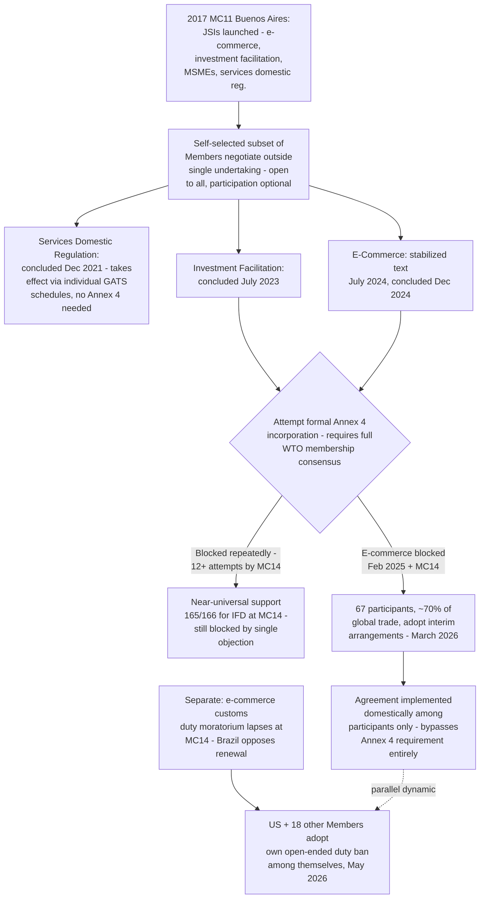

## The Turn to Plurilateralism: Joint Statement Initiatives and the Erosion of the Single Undertaking

### Legal Basis and Definitional Framing

**Definition on first use — "Joint Statement Initiative" (JSI):** A negotiating format in which a self-selected subset of WTO Members, rather than the full membership, jointly announces the launch of negotiations on a specified subject, proceeds to negotiate a substantive text among themselves, and only subsequently — and not automatically — seeks to have the resulting agreement incorporated into the formal WTO legal architecture. JSIs are explicitly framed by the WTO Secretariat as informal: the documents relating to Joint Initiatives are not part of a multilaterally agreed WTO process, distinguishing them procedurally from the negotiating groups operating under the Doha Development Agenda's single-undertaking mandate.

**Definition on first use — "plurilateral agreement" in the WTO context:** A binding agreement negotiated among and applicable only to a subset of WTO Members, contrasted with the "multilateral" agreements binding on the entire membership (the GATT, GATS, TRIPS, and the other Annex 1 agreements). The WTO Agreement's Annex 4 already contains a small number of long-standing plurilateral agreements (such as the Agreement on Government Procurement); JSIs represent a newer generation of plurilateral initiatives that, unlike Annex 4's original members, have generally sought — with mixed success — formal incorporation into that same annex.

### Origins: The 2017 Buenos Aires Launch

At the Eleventh Ministerial Conference in December 2017, groups of like-minded WTO Members issued joint statements launching four parallel initiatives: e-commerce, investment facilitation for development, a working group on micro, small, and medium-sized enterprises (MSMEs), and continued talks on domestic regulation in services trade. Each was explicitly structured as open to all WTO Members, distinguishing the format from an exclusive club while nonetheless allowing negotiations to proceed without requiring universal participation as a precondition.

**Key Points:**

- The 2017 launch occurred against the direct backdrop of the Doha Round's effective paralysis (dating to the 2008 Geneva collapse) and reflects a deliberate institutional adaptation: rather than continuing to insist that new subjects be negotiated only within the stalled single-undertaking framework, a critical mass of Members chose to proceed on a self-selected, opt-in basis.
- The JSI format's core innovation relative to the Doha Round's structure is decoupling the *negotiation* of a subject entirely from the single undertaking — participants negotiate as a genuinely separable initiative, contracting around, rather than merely carving exceptions within, the "nothing agreed until everything agreed" principle.

### Domestic Regulation in Services: The Completed Precedent

The JSI on Services Domestic Regulation concluded its negotiations in December 2021, producing disciplines on transparency and administrative procedures for licensing and qualification requirements in services trade — a comparatively technical, less politically contentious subject that became the first JSI to reach a concluded text. Unlike the e-commerce and investment facilitation initiatives discussed below, this initiative's outcome was structured to take effect through the individual services schedules of participating Members rather than requiring formal incorporation into a new WTO annex, allowing it to avoid the consensus-based incorporation obstacle that has proven decisive for the other initiatives.

### Investment Facilitation for Development: The Incorporation Impasse

The JSI on Investment Facilitation for Development (IFD) concluded its negotiations in July 2023, producing a substantive agreement focused on streamlining administrative procedures for foreign investment (transparency, predictability, and administrative efficiency measures, deliberately distinguished from investment protection or investor-state dispute settlement, which the IFD Agreement does not address). The agreement subsequently became the central test case for whether a JSI-negotiated text can be formally incorporated into the WTO's legal architecture.

**Key Points:**

- Incorporation of a new agreement into Annex 4 of the WTO Agreement requires consensus among the *entire* WTO membership, not merely agreement among the initiative's own participants — meaning a small number of objecting Members can block incorporation even where the overwhelming majority of the full membership supports it.
- The IFD Agreement's proponents attempted incorporation repeatedly and were blocked on each attempt: three-quarters of Members (126 of 166) failed at a seventh attempt to make the Investment Facilitation for Development deal an official WTO agreement at a February 2025 General Council meeting, and the initiative had been blocked a total of twelve times counting the attempt made at MC14 in Yaoundé.
- At MC14 itself, a joint ministerial declaration was issued by 129 Members party to the IFD Agreement, and support for formal incorporation was reported as nearly universal — 165 of 166 Members reportedly in favor — yet the single remaining objection was sufficient to prevent consensus, leaving the agreement outside the WTO's formal legal architecture and its enforceability correspondingly limited.

**Practitioner note:** The IFD Agreement's repeated, near-unanimous but ultimately unsuccessful incorporation attempts are the clearest available illustration of a structural paradox at the heart of the JSI model: the format was designed precisely to escape the single undertaking's requirement of full-membership agreement for the *negotiation* stage, but the WTO's Annex 4 incorporation procedure re-imports an equivalent full-consensus requirement at the *ratification* stage — meaning the JSI format has proven highly effective at producing negotiated texts among willing participants, but has not, for IFD specifically, escaped the core structural vulnerability (a single-Member veto) that constrained the Doha single undertaking itself.

### E-Commerce: Negotiation, Stabilization, and the Interim Workaround

The JSI on E-Commerce has followed a broadly parallel trajectory to investment facilitation, though with an important late-stage divergence. Negotiations, formally launched through a January 2019 Joint Statement at Davos following the 2017 exploratory mandate, proceeded over five years among a group that grew to include the substantial majority of the WTO's economically significant Members — in July 2024, the initiative's co-conveners (Australia, Japan, and Singapore) announced that participants had achieved a "stabilized text," and the agreement's negotiations were formally concluded in December 2024. As with investment facilitation, an attempt to have the resulting text annexed to WTO rules requires full-membership consensus, and this attempt was likewise blocked repeatedly, including at the February 2025 General Council meeting, where a proposal from 73 participating Members (counting the EU as its 27 member states) was blocked alongside the seventh IFD attempt.

**The interim-arrangements innovation:** Rather than continuing to wait indefinitely for a consensus that a small number of objecting Members had shown no sign of permitting, on 28 March 2026 — during MC14 in Yaoundé — 67 participating Members, together covering approximately 70% of global trade, adopted a distinct pathway: bringing the E-Commerce Agreement into force among themselves through interim arrangements, rather than through formal Annex 4 incorporation. This interim-arrangements annex is understood to imitate certain WTO institutional procedures — including establishing a committee with responsibilities that include handling disputes among participants — while applying only to the participating subset rather than the full WTO membership.

**Key Points:**

- The interim-arrangements approach represents a further structural evolution beyond the original JSI model: rather than treating formal Annex 4 incorporation as the necessary endpoint and remaining stalled indefinitely absent consensus, participants have opted to implement the substance of their agreement domestically and among themselves regardless of whether full incorporation is ever achieved.
- This closely parallels — while remaining formally distinct from — a Member-state-level workaround already used for another lapsed e-commerce-adjacent commitment: following the lapse of the broader multilateral moratorium on customs duties for electronic transmissions (discussed further below), a group of the United States and eighteen other Members separately agreed, beginning 8 May 2026, to apply an open-ended ban on imposing customs duties on electronic transactions strictly among themselves — a second, parallel instance of participants substituting a narrower, self-executing commitment for a multilateral outcome that consensus could not deliver.
- [Inference] Taken together, the IFD incorporation impasse and the E-Commerce interim-arrangements pivot illustrate a maturing second phase of the plurilateral turn: having demonstrated that JSI-style negotiation can produce substantively agreed texts among willing participants, proponents are now testing whether those texts can generate binding legal effect *without* waiting on the full-consensus incorporation procedure at all — a development that, if it persists and expands to other subjects, would represent a considerably more significant erosion of single-undertaking-style universality than the original JSI launches represented in 2017.

### The E-Commerce Moratorium's Lapse as a Related but Distinct Development

The decades-old, separately-negotiated moratorium on customs duties on electronic transmissions — first adopted in the 1998 Declaration on Global Electronic Commerce and renewed at every subsequent ministerial conference, most recently at MC13 in March 2024 — lapsed at MC14 after Members, including Brazil, opposed its further extension in order to preserve domestic policy space. This is a legally and procedurally distinct instrument from the JSI on E-Commerce (the moratorium is a multilateral General Council decision requiring full-membership renewal by consensus, not a plurilateral negotiated text), but its lapse at the same ministerial conference at which the E-Commerce JSI's interim-arrangements pathway was announced illustrates the same underlying dynamic from the opposite direction: where the moratorium required affirmative multilateral consensus to continue and could not secure it, the JSI participants' interim-arrangements response was to construct a narrower, opt-in substitute rather than continue relying on a multilateral mechanism vulnerable to a single objection.

### Structural and Institutional Critique

**Key Points:**

- Proponents of the JSI/plurilateral model — a view associated with a range of both developed and developing-country Members frustrated by the single undertaking's paralysis — regard Joint Initiatives as key mechanisms to make progress on trade liberalization in a context where multilateral rulemaking consensus has become extremely difficult to achieve, characterizing the format as a way to reinvigorate the WTO's negotiating function without waiting for resolution of the Doha Round's core disputes.
- Critics — a position articulated prominently by India, South Africa, and Namibia, including in a February 2021 communication questioning the JSI process's legitimacy — argue that Joint Initiatives run counter to the WTO's foundational consensus-based decision-making principle and risk weakening multilateralism by allowing a subset of Members to develop new trade rules affecting the broader trading system's architecture without the full membership's participation or consent in the negotiation phase itself, even before reaching the separate question of formal incorporation.
- [Inference] The IFD and E-Commerce incorporation impasses can be read as partially validating the critics' concern in an unexpected way: rather than JSIs bypassing multilateral consensus entirely, the Annex 4 incorporation requirement has in practice reasserted a consensus veto at the ratification stage — meaning the critique that JSIs "bypass" multilateralism has, for these two initiatives specifically, proven only partially accurate, while simultaneously validating a different concern: that Members frustrated by the incorporation veto would eventually construct interim, non-multilateral workarounds (as occurred in March and May 2026) that operate entirely outside the consensus-based architecture the critics sought to protect.

### Structural Diagram

### Practitioner Implications

For a negotiator assessing whether to join a current or future JSI, the accumulated experience through MC14 suggests a three-stage realistic expectation: (1) negotiation among a critical mass of willing participants is achievable and has now succeeded for three initiatives; (2) formal Annex 4 incorporation, requiring full-membership consensus, has proven to be the harder and, for investment facilitation specifically, so far insurmountable obstacle, regardless of how broad participant support becomes; and (3) participants facing a blocked incorporation path have begun constructing interim, self-executing workarounds that deliver much of the intended legal effect among themselves without waiting on incorporation — a strategy a negotiator should now treat as an available fallback design from the outset of any new JSI, rather than as an improvised last resort. For a delegation from a Member skeptical of the JSI model on legitimacy grounds, the interim-arrangements development is the more consequential recent shift to track, since it represents participants moving decisively beyond the original JSI premise (negotiate plurilaterally, then seek multilateral incorporation) toward a model that no longer depends on multilateral consensus at any stage.

### Related Topics

- The Agreement on Fisheries Subsidies as a JSI-adjacent initiative that did achieve formal multilateral (rather than plurilateral) legal status
- The Annex 4 incorporation procedure and its consensus requirement as a structural analogue to the single undertaking's veto vulnerability
- The e-commerce customs-duty moratorium's history and its lapse at MC14
- The Doha Round's single undertaking principle as the structural baseline the JSI model was designed to circumvent
- Post-Doha piecemeal outcomes (Bali TFA, Nairobi export subsidies, Fisheries Subsidies Agreement) as the multilateral counterpart to the plurilateral JSI track