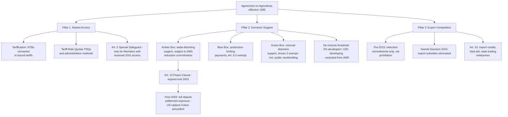

## The Agreement on Agriculture: Market Access, Domestic Support Boxes, and Export Competition

### Legal Basis and Structural Overview

The **Agreement on Agriculture (AoA)**, concluded as part of the Uruguay Round and effective 1 January 1995, was the first multilateral instrument to bring agricultural trade comprehensively within binding WTO disciplines, correcting decades of de facto GATT-era exceptionalism under which agricultural trade had remained substantially insulated from ordinary tariff-binding and subsidy disciplines through waivers and loosely enforced exceptions. The AoA is organized around three structural pillars — market access, domestic support, and export competition — each governed by distinct legal disciplines and each carrying its own built-in agenda commitment under AoA Article 20 (addressed in the companion item on the Uruguay Round's unfinished built-in agenda).

**Definition on first use — "tariffication":** The Uruguay Round process requiring Members to convert all non-tariff agricultural border measures (quotas, variable levies, minimum import price schemes) into ordinary bound tariffs, eliminating the more opaque, harder-to-discipline non-tariff barriers that had proliferated in agricultural trade under the prior GATT regime and subjecting the resulting tariffs to ordinary GATT Article II binding.

### Pillar One: Market Access

The market access pillar rests on two core commitments: the tariffication conversion described above, and binding tariff reduction schedules negotiated during the Uruguay Round (developed-country Members committing to average reductions of 36% over six years, developing-country Members to 24% over ten years, with least-developed countries exempted from reduction commitments though still required to bind their tariffs).

**Definition on first use — "tariff-rate quota" (TRQ):** A market-access mechanism, extensively used in agricultural tariff schedules, under which a specified quantity of imports enters at a lower ("in-quota") tariff rate, with any volume above that quantity subject to a higher ("out-of-quota") rate — a structure permitting Members to open limited market access without fully liberalizing at the ordinary bound rate, and one of the principal mechanisms through which the tariffication commitment was implemented for previously quota-protected products.

**Key Points:**

- AoA Article 5 establishes the **Special Safeguard (SSG)**, available only to Members that specifically reserved the right to invoke it against products subject to tariffication during the original Uruguay Round negotiations (denoted "SSG" in the Member's schedule) — a materially narrower and older instrument than the never-concluded Special Safeguard Mechanism (SSM) proposed during the Doha Round negotiations (addressed in the companion item on the 2008 modalities collapse), which would have extended a comparable tool to the broader developing-country membership that did not reserve Article 5 access in 1994.
- TRQ administration methods (first-come-first-served, licensing on demand, historical allocation, and others) have themselves generated significant dispute settlement activity, since the *method* of allocating in-quota access can itself create discriminatory or trade-restrictive effects even where the TRQ's headline volume commitment is formally respected.

### Pillar Two: Domestic Support and the "Box" System

The domestic support pillar disciplines government payments and programs supporting agricultural production, using a classification system colloquially known as the "boxes," based on each support measure's degree of production- and trade-distorting effect.

**Definition on first use — "Amber Box":** Domestic support measures considered to distort production and trade directly — principally market price support and production-linked subsidies — subject to reduction commitments under AoA Article 6 and quantified through the **Aggregate Measurement of Support (AMS)**, a calculated total of trade-distorting support a Member is permitted to maintain, bound and scheduled on a Member-specific basis (the "Total AMS" or "Final Bound Total AMS"). Support falling within a Member's **de minimis** threshold — 5% of the value of production for developed-country Members, 10% for developing-country Members, calculated separately for product-specific and non-product-specific support — is excluded from AMS calculation entirely regardless of its trade-distorting character.

**Definition on first use — "Blue Box":** Amber Box-type support that would otherwise count toward AMS reduction commitments, but is exempted under AoA Article 6.5 because it is paid under production-limiting programs (e.g., payments based on fixed area and yields, or on a fixed number of livestock, rather than on current production levels) — reflecting a negotiated compromise, particularly significant to the EU's Common Agricultural Policy reforms of the early 1990s, that certain support tied to production controls should not be treated as equivalently distorting to open-ended, production-linked support.

**Definition on first use — "Green Box":** Support measures deemed to have no, or at most minimal, trade-distorting effects or effects on production, exempted entirely from reduction commitments under AoA Annex 2 — covering categories such as general government services (research, pest control, infrastructure), public stockholding for food security purposes (subject to specific conditions), decoupled income support, and environmental and regional assistance programs, provided each qualifying measure conforms to the specific criteria set out in Annex 2 for its category.

**Key Points:**

- The Green Box's public stockholding provisions are the direct textual source of the ongoing "peace clause" and public stockholding controversy addressed in the companion item on post-Doha piecemeal outcomes: Annex 2's conditions for exempting stockholding programs (particularly the requirement that acquisition and disposal occur at current market prices) have proven difficult for several developing-country Members to satisfy using administered support prices, generating the interim and still-unresolved permanent-solution negotiations.
- The box classification system creates a structural incentive, observed extensively in Member practice since 1995, to redesign support programs to qualify for Green or Blue Box treatment rather than reduce Amber Box support outright — a dynamic critics describe as enabling continued high aggregate support levels through reclassification rather than genuine reduction, and defenders describe as successfully steering support toward less trade-distorting forms, consistent with the AoA's own stated objectives.
- Because Total AMS commitments were bound based on each Member's own historical support levels at the time of the Uruguay Round, the box system has been criticized — a strand of the broader legitimacy debate addressed elsewhere in this curriculum — as effectively locking in the high absolute support levels of the wealthiest agricultural subsidizers (principally the United States and the EU) at levels far exceeding what most developing-country Members could ever hope to provide, even before considering the additional flexibility the Blue and Green Boxes offer to precisely those same Members' most sophisticated support programs.

### Pillar Three: Export Competition

The export competition pillar, governed by AoA Articles 8–11, originally disciplined agricultural export subsidies through Member-specific reduction commitments (rather than the outright prohibition the SCM Agreement applies to industrial-goods export subsidies), reflecting agriculture's historically exceptional treatment relative to other sectors.

**Key Points:**

- This asymmetry — agricultural export subsidies subject only to reduction commitments, while equivalent industrial subsidies were prohibited outright under the SCM Agreement from the WTO's founding — was substantially eliminated by the **Nairobi Decision on Export Competition**, agreed at the Tenth Ministerial Conference in 2015 (addressed in the companion item on post-Doha piecemeal outcomes), under which developed-country Members committed to eliminate agricultural export subsidies immediately and developing-country Members committed to eliminate them by 2018, with limited additional flexibility for certain marketing and transport cost provisions.
- AoA Article 10 additionally addresses export credits, export credit guarantees, food aid, and state trading enterprises with export monopolies, since these instruments can function as disguised export subsidies achieving equivalent trade-distorting effects without meeting the formal definition of a direct export subsidy — an area where implementation and enforcement have historically been less developed than for direct export subsidies.

### Enforcement Reality: The Special Due-Restraint and Litigation Pattern

**Practitioner note:** For much of the AoA's early life, agricultural subsidy disputes were constrained by the **"Peace Clause"** under AoA Article 13 (distinct from the 2013 Bali public-stockholding peace clause, though both draw on the same terminology), which limited the availability of countervailing duty actions and certain other challenges against AoA-conforming domestic support and export subsidies for a defined period expiring at the end of 2003. Since the original Peace Clause's expiration, agricultural domestic support and export competition measures have been fully subject to ordinary WTO dispute settlement, most significantly illustrated by **US – Upland Cotton** (WT/DS267), in which Brazil successfully challenged specific US cotton subsidy programs as causing serious prejudice to Brazil's interests under the SCM Agreement's actionable-subsidy disciplines (applied in this instance because certain US cotton payments were found not to qualify for Green Box or other AoA exemptions), generating an extended, multi-year sequence of compliance and retaliation-authorization proceedings that remains a leading case study in the practical limits and possibilities of agricultural subsidy enforcement.

### Structural Diagram

### Practitioner Implications

For a trade negotiator or dispute-settlement lawyer working on an agricultural subsidy question, the box classification is the essential first analytical step in any AoA-related dispute or negotiation: whether a challenged or proposed measure sits in the Amber, Blue, or Green Box determines not only its exposure to reduction commitments but its litigation risk profile, since Green Box measures conforming to Annex 2's specific criteria are effectively insulated from AMS-based challenge, while Amber Box measures exceeding a Member's bound Total AMS or de minimis thresholds are directly actionable. The **US – Upland Cotton** precedent is essential authority for the related point that a domestic support program's formal box classification is not self-executing — a program a Member believes qualifies for Green Box or de minimis treatment can still be successfully challenged if a panel finds it fails to satisfy the specific conditions of the claimed exemption, converting what the implementing Member treated as exempt support into fully AMS-countable, and potentially serious-prejudice-generating, Amber Box support.

### Related Topics

- The Uruguay Round's built-in agenda under AoA Article 20 and its absorption into the Doha Round
- Public stockholding for food security and the Bali/post-Bali peace clause negotiations
- The 2008 Special Safeguard Mechanism dispute as the Doha-era successor to Article 5's original SSG
- The Nairobi Decision on Export Competition and the elimination of agricultural export subsidies
- **US – Upland Cotton** and the interaction between AoA exemptions and SCM Agreement actionable-subsidy disciplines