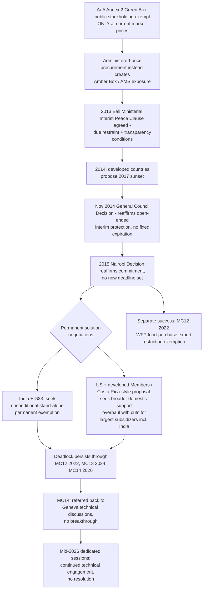

## The Peace Clause and the Public Stockholding Dispute Over Food Security

### Legal Basis: Public Stockholding Under the Agreement on Agriculture

**Definition on first use — "public stockholding for food security purposes":** A government program under which a state procures agricultural commodities from domestic producers, typically at an "administered" (government-set, above-market) price, to build reserves later distributed to vulnerable populations. Under the Agreement on Agriculture's Green Box, Annex 2 paragraph 3 exempts public stockholding programs from domestic-support reduction commitments entirely — but only if purchases and sales occur at *current market prices*, since the exemption is designed to cover genuinely non-distorting stock management rather than production-linked price support. Where a Member's program instead procures at an administered price above the prevailing market price, the resulting support is properly classified in the **Amber Box** and counted toward that Member's bound Aggregate Measurement of Support (AMS) and applicable de minimis threshold, both concepts addressed in the companion item on the AoA's box system.

**The core legal problem:** For a Member with a large agricultural sector and a large administered-price procurement program relative to the value of the relevant crop's production, market-price-support calculations under the AoA's prescribed methodology (comparing the administered price to a fixed, decades-old external reference price rather than a current world price) can generate an AMS breach even where the underlying program serves a genuine food-security or smallholder-support objective rather than an export-oriented trade-distorting one — a methodological quirk widely acknowledged, across otherwise opposed negotiating positions, as a genuine flaw in the AoA's original design.

### Origins: The 2013 Bali Interim Peace Clause

At the request of India and a group of developing-country Members, public stockholding was placed on the agenda of the Ninth Ministerial Conference in Bali in December 2013. Ministers agreed that, on an interim basis, public stockholding programs in developing countries would not be legally challenged even if a country's agreed domestic-support limits were breached as a result of that stockholding — provided the Member met specified transparency, notification, and safeguard conditions — while committing to negotiate a *permanent* solution to replace this interim arrangement.

**Definition on first use — "Peace Clause" (public stockholding context):** The colloquial name for this interim due-restraint mechanism, distinct from the original AoA Article 13 Peace Clause (which expired at the end of 2003 and covered a broader range of agricultural support and export measures). The public stockholding Peace Clause imposes ongoing, specific conditions on the invoking Member — including detailed notification requirements regarding the program's operation, its impact on food security stocks, and safeguards that stockpiled food does not distort trade or adversely affect other Members' food security — compliance with which several developing-country Members and their advocates have described as onerous and administratively burdensome.

**Key Points:**

- The Bali interim solution was, by its own text, intended to last only until a permanent solution was found — but developed-country Members subsequently indicated in 2014 that the interim protection itself would only remain valid until 2017 absent a permanent agreement, a conditionality developing-country negotiators viewed as a unilateral narrowing of the original Bali commitment.
- Following a further deadlock through mid-2014, a General Council decision in November 2014 (WT/L/939) reaffirmed and clarified the interim mechanism, averting the immediate risk of the Peace Clause's lapse and reinforcing the "until a permanent solution is found" framing over the developed-country-proposed 2017 sunset — meaning the interim clause has, mechanically, no fixed expiration date and functions as a standing protection so long as no permanent solution has been concluded.

### Reaffirmation: The 2015 Nairobi Decision

The Tenth Ministerial Conference in Nairobi in December 2015 produced a further decision on public stockholding, reaffirming the Bali and 2014 General Council commitments and encouraging Members to make all concerted efforts to agree on a permanent solution — language that, notably, set no new binding deadline, leaving the negotiating mandate open-ended in a manner that has persisted through every subsequent ministerial conference to date.

### The Enduring Deadlock: Structure of the Disagreement

**Key Points:**

- **India and the G33 coalition** (a group of developing countries focused on food-security and special-products issues in agriculture negotiations, referenced earlier in this chapter's coverage of the 2008 Special Safeguard Mechanism dispute) have consistently sought a stand-alone, unconditional permanent solution — effectively converting the interim Peace Clause's due-restraint protection into a permanent Green Box-equivalent exemption for qualifying public stockholding programs, without additional offsetting disciplines.
- **The United States and other developed-country Members** have resisted an unconditional permanent solution, and a rival negotiating approach — associated with a Costa Rica-originated initiative — has proposed instead a broader overhaul addressing trade-distorting domestic support generally, including developing countries' administered-price procurement for stocks, under which the largest subsidizers (a category into which India's own procurement volumes place it, precisely because of the scale it has built up while operating under Peace Clause protection) would be required to make the largest proportional cuts to their support entitlements.
- India has specifically resisted the broader domestic-support-overhaul framing, including declining to engage substantively with the Costa Rica-inspired proposal in at least one formal negotiating session, citing the absence of an agreed mandate to discuss that broader approach in that specific context — reflecting India's consistent position that the public stockholding permanent solution should be negotiated and resolved as its own discrete mandate item rather than folded into comprehensive domestic-support reform.
- A further complication: because the interim Peace Clause has no expiration date and imposes no cap on how much a qualifying Member's protected support can grow, other Members have raised concerns that India specifically has used the ongoing interim protection to expand its rice and wheat procurement and, by extension, its export competitiveness in global grain markets — a concern proponents of the Costa Rica-style broader-reform approach cite as justifying comprehensive disciplines rather than an unconditional permanent carve-out.

**Practitioner note:** This dynamic — where the very use of an interim, supposedly narrow food-security protection has, over more than a decade, generated a separate trade-policy grievance (competitiveness effects from unconstrained accumulated support) — is a significant illustration for a negotiator of how open-ended interim arrangements without sunset or growth constraints can shift the underlying negotiating equities over time, making the eventual "permanent solution" harder to conclude the longer the interim arrangement persists and the more entrenched the practices it protects become.

### Persistence Through MC12, MC13, and MC14

The permanent solution mandate has now survived, unresolved, across every ministerial conference since Bali: at the Twelfth Ministerial Conference (2022), Members reaffirmed their commitment to continue negotiations; the mandate was again blocked from resolution at the Thirteenth Ministerial Conference in Abu Dhabi (2024), with developed-country Members again cited as the parties declining to move the file forward; and at the Fourteenth Ministerial Conference in Yaoundé (March 2026), the matter was, consistent with this pattern, referred back to Geneva-based technical discussions without a breakthrough or a new firm timeline — the deep trust deficit between developed- and developing-country Members persisting, with concerns that an unconditional permanent solution could distort global agricultural markets running directly against developing-country insistence on preserving food-security policy flexibility.

Following MC14, WTO agriculture negotiators convened further sessions in mid-2026 dedicated specifically to public stockholding and the related Special Safeguard Mechanism file, with the negotiating chair concluding at least one such session by indicating he would carefully consider members' suggestions and inviting the WTO Secretariat to prepare a presentation on the history of domestic-support negotiations — procedural language consistent with continued technical-level engagement rather than an imminent substantive breakthrough. As of the most recent public commentary, advocates for developing-country and least-developed-country Members (including a joint demand from the African Group, the African, Caribbean and Pacific Group, and the G33, co-sponsored by Nigeria among others) have continued to press the point that thirteen years without a permanent solution, measured from the original 2013 Bali commitment, "cannot be explained as an ordinary negotiating delay."

**Key Points:**

- A related but textually distinct food-security outcome was achieved at MC12 in 2022: the Ministerial Decision on World Food Programme Food Purchases Exemption from Export Prohibitions or Restrictions, exempting WFP humanitarian food purchases from Member export restrictions — a narrower, successfully concluded measure addressing a different dimension of the trade-and-food-security relationship, illustrating the same piecemeal pattern (addressed in the companion item on post-Doha outcomes) in which discrete, less contentious food-security-adjacent items can advance even as the core public stockholding permanent solution remains stalled.
- [Unverified] Given the active, month-to-month character of this specific negotiating file — including a dedicated mid-2026 session and continued advocacy statements as recently as September 2026 — a practitioner relying on this material for a live negotiating or advisory purpose should verify the current status against the WTO's own agriculture negotiations page or recent DSB/Committee on Agriculture reporting before treating any specific procedural detail as still current.

### Structural Diagram

### Practitioner Implications

For a trade negotiator representing a food-security-focused developing-country Member, the Peace Clause's open-ended, no-sunset structure is simultaneously the file's greatest practical protection and its greatest long-term negotiating liability: it has shielded qualifying programs from legal challenge for over a decade without interruption, but its very durability has allowed accumulated program growth to become a separate point of leverage for Members pressing a broader domestic-support-overhaul framing, complicating the path to the unconditional permanent solution India and the G33 continue to seek. For counsel advising a Member on the design of a new or expanded public stockholding program, the central technical lesson from this dossier is that the Annex 2 "current market price" condition is the operative legal fault line — a program's genuine reliance on the Peace Clause's due-restraint protection, rather than qualification for the self-executing Green Box exemption, signals that the program's administered pricing already exceeds what the AoA's original food-security exemption was designed to cover, with all the negotiating exposure that implies.

### Related Topics

- The Agreement on Agriculture's box system (Amber, Blue, Green) and the Aggregate Measurement of Support methodology
- The G33 coalition and the 2008 Special Safeguard Mechanism dispute as a parallel, unresolved food-security-adjacent negotiating file
- The Nairobi Decision on Export Competition and the broader post-2015 piecemeal negotiating pattern
- The MC12 World Food Programme export-restriction exemption as a discrete, successfully concluded food-security outcome
- India's domestic Minimum Support Price and Public Distribution System programs as the primary real-world application driving this negotiating file