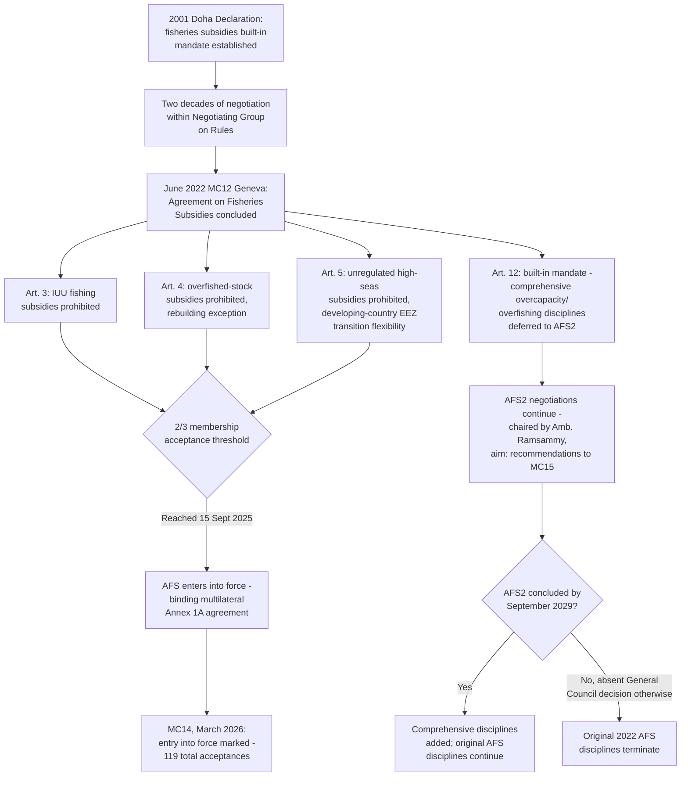

## The Agreement on Fisheries Subsidies and Its 2025 Entry Into Force

### Legal and Historical Basis: An Environmental Mandate Realized Through Trade Law

The **Agreement on Fisheries Subsidies (AFS)**, concluded at the Twelfth Ministerial Conference (MC12) in Geneva in June 2022, is the WTO's first multilateral agreement whose core disciplines are framed primarily around an environmental and conservation objective rather than a conventional trade-liberalization or market-access objective — a structural distinction from every other agreement addressed in this curriculum, whose disciplines target market distortion or discrimination as the primary legal harm.

**Definition on first use — "IUU fishing":** Illegal, unreported, and unregulated fishing — a composite term of art in international fisheries governance covering fishing conducted in violation of applicable laws, fishing not properly reported to relevant authorities, and fishing by vessels without nationality or in areas/for stocks with no applicable conservation management, all of which undermine the effectiveness of fisheries conservation measures.

The AFS negotiating mandate traces to the 2001 Doha Ministerial Declaration, which directed Members to clarify and improve WTO disciplines on fisheries subsidies, taking into account the importance of the sector to developing countries — making fisheries subsidies, like agriculture and services, technically a Doha-era built-in agenda item, though one that took over two decades to reach conclusion, reflecting the same single-undertaking-driven delay affecting most Doha-mandate subjects until Members began extracting negotiable items individually (the pattern traced in the companion item on post-Doha piecemeal outcomes).

### Structure and Core Disciplines

The AFS's substantive disciplines are organized around three prohibited categories of fisheries subsidies, each addressed in a dedicated article:

- **Article 3 — IUU fishing:** Prohibits subsidies to fishing or fishing-related activities where a vessel or operator has been found to engage in IUU fishing, determined by a coastal Member, flag Member, or relevant regional fisheries management organization (RFMO) — subject to specified due-process conditions before a prohibition attaches.
- **Article 4 — Overfished stocks:** Prohibits subsidies for fishing an overfished stock, unless such subsidies are implemented to rebuild the stock to a biologically sustainable level, reflecting an exception designed to preserve legitimate stock-recovery-linked support.
- **Article 5 — Unregulated high seas fishing:** Prohibits subsidies for fishing on the unregulated high seas — areas outside the competence of any RFMO or arrangement — where no applicable conservation and management measures exist.

**Key Points:**

- The AFS's Article 8 requires detailed notification and transparency regarding Members' fisheries subsidy programs, including the type of fishery, subsidized vessel or fleet size, catch data, and conservation status of targeted stocks — creating a substantially more granular transparency obligation than exists for most other subsidy categories under the SCM Agreement.
- Special and differential treatment provisions (Article 5.1's exception aside) permit developing-country and least-developed-country Members a transition period during which the Article 5 unregulated-high-seas-fishing prohibition does not apply to subsidies granted within their own exclusive economic zone (EEZ) or an area under the competence of a relevant RFMO to which they are a party — reflecting the built-in agenda's original Doha mandate to account for the sector's importance to developing-country livelihoods.
- The AFS deliberately left the most contentious subsidy category — subsidies contributing to overcapacity and overfishing more broadly, as distinct from the narrower IUU, overfished-stock, and unregulated-high-seas categories actually disciplined — unresolved in the 2022 text, with Article 12 establishing a built-in mandate to continue negotiating comprehensive disciplines on this remaining category.

### Economic and Environmental Stakes

The scale of the problem the AFS addresses is substantial: global fisheries subsidies total an estimated USD 35 billion annually, of which approximately USD 22 billion are considered harmful — contributing directly to marine stock depletion. Independent assessments have found that the proportion of global fish stocks classified as overfished rose from roughly 10% in 1974 to 35.5% by 2021, while the total economic losses attributable to IUU fishing specifically are estimated as high as USD 50 billion annually — figures that collectively underpin the negotiating urgency behind both the concluded 2022 disciplines and the still-pending Article 12 negotiations.

### Entry Into Force: The Two-Thirds Acceptance Threshold

Consistent with standard WTO practice for new multilateral agreements added to Annex 1A, the AFS required acceptance by two-thirds of the WTO membership (approximately 111 of 166 Members, given membership fluctuations) before entering into force. This threshold was reached on **15 September 2025**, formally activating the agreement's binding disciplines for all accepting Members.

**Key Points:**

- Entry into force was formally marked and celebrated at the Fourteenth Ministerial Conference (MC14) in Yaoundé, Cameroon, in March 2026, where Paraguay, Samoa, and Saint Vincent and the Grenadines deposited their instruments of acceptance at the opening ceremony on 26 March 2026, bringing the total number of formal acceptances to 119.
- Because the AFS entered into force as a standard multilateral amendment to Annex 1A (unlike the Joint Statement Initiative-negotiated agreements on e-commerce and investment facilitation discussed in the companion item on plurilateralism, which have struggled to achieve equivalent formal WTO legal status), its disciplines bind accepting Members as an ordinary covered agreement, subject to the DSU's ordinary dispute settlement procedures — a materially stronger legal status than the interim-arrangements pathway other recent plurilateral initiatives have been forced to adopt in the absence of full-membership consensus.
- A distinctive structural feature: the AFS's own continued existence is conditioned on further progress. Members have set a deadline of **September 2029** — four years from the 2022 agreement's entry into force — to conclude the Article 12 comprehensive disciplines (informally referenced as "AFS2"); failure to do so within that window would result in the *original* 2022 agreement's termination, unless the General Council decides otherwise. This sunset-linked structure creates a materially harder deadline pressure than the open-ended, repeatedly-missed deadlines that have characterized other built-in agenda items, such as the public stockholding permanent solution addressed in the companion item on that dispute.

### The Unfinished Article 12 Mandate: Toward AFS2

Negotiations on the remaining, more comprehensive disciplines — addressing subsidies that contribute to overcapacity and overfishing generally, beyond the three narrower categories the 2022 agreement already disciplines — continue in the WTO's Negotiating Group on Rules, chaired as of the most recent reporting by Ambassador Leslie Ramsammy of Guyana. At a February 2026 meeting, the chair reported a strong and shared determination among Members to resume substantive negotiations as soon as practicable, and at MC14 itself, ministers agreed to continue engaging in these negotiations with the explicit aim of making recommendations to the Fifteenth Ministerial Conference (MC15) toward achieving the comprehensive disciplines Article 12 contemplates.

**Practitioner note:** The AFS2 negotiations inherit substantially similar distributional tensions to those found throughout this curriculum's coverage of agriculture negotiations — developing-country Members with artisanal and small-scale fishing sectors generally seek continued flexibility and longer transition periods for capacity-related subsidies, while environmental NGOs and several developed-country and large-distant-water-fishing-fleet Members press for broader, faster-acting disciplines given the scale of documented overcapacity's contribution to stock depletion. A negotiator or analyst tracking this file should treat the September 2029 sunset deadline as a genuinely consequential structural feature (not merely aspirational language, unlike most Doha-era deadlines), since its architecture creates a real risk that the entire 2022 agreement's hard-won disciplines could lapse if AFS2 negotiations are not concluded in time — a risk not present in comparable stalled negotiating files such as public stockholding, where the interim protection persists indefinitely regardless of permanent-solution progress.

### Structural Diagram

### Practitioner Implications

For counsel advising a fishing-sector client or a government fisheries ministry, the AFS represents a genuinely new category of binding, dispute-settlement-enforceable WTO discipline distinct from conventional trade-remedy or market-access obligations, meaning compliance programs need to track not only subsidy design but the underlying conservation-status and IUU-determination inputs (coastal Member findings, RFMO determinations) that trigger the Article 3–5 prohibitions — inputs largely generated outside the WTO system itself by fisheries management bodies, requiring closer coordination between trade counsel and fisheries regulatory counsel than most other WTO compliance contexts demand. For a negotiator engaged in the AFS2 process, the hard September 2029 sunset deadline changes the strategic calculus relative to most other stalled WTO negotiating files: unlike public stockholding or the broader agriculture domestic-support file, where indefinite delay preserves the status quo, delay on AFS2 risks affirmatively unwinding the already-concluded 2022 disciplines, creating a distinct and unusually strong shared incentive across otherwise divided negotiating positions to reach some resolution before the deadline.

### Related Topics

- The Uruguay Round's built-in agenda and the Doha Development Agenda as comparable slow-maturing mandate structures
- Post-Doha piecemeal outcomes and the AFS's position within that broader pattern of extracted, discrete Doha-mandate conclusions
- The SCM Agreement's general subsidy disciplines as the conventional trade-distortion framework the AFS's environmental framing departs from
- Special and differential treatment design in the AFS's EEZ/RFMO transition provisions
- MC14 and MC15 as the institutional venues for AFS2's continued negotiation