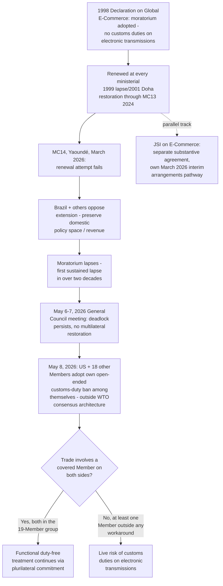

## The E-Commerce Moratorium on Customs Duties for Electronic Transmissions and Its 2026 Lapse

### Legal Basis and Origins: The 1998 Declaration

**Definition on first use — "the moratorium":** WTO shorthand for the commitment, first adopted in the **1998 Declaration on Global Electronic Commerce** at the Second Ministerial Conference, under which Members agreed to "continue their current practice of not imposing customs duties on electronic transmissions." The moratorium was never a permanent treaty obligation embedded in a covered agreement; it has instead taken the legal form of a periodically renewed General Council or Ministerial Conference decision, requiring affirmative multilateral consensus to extend at each renewal point — structurally more fragile than an ordinary bound tariff commitment under GATT Article II, since it depends on continued unanimous willingness to re-adopt it rather than functioning as a standing, self-perpetuating obligation.

**Key Points:**

- The moratorium's core practical effect has been to keep cross-border digital transmissions — software downloads, streamed media, and other electronically delivered content and services — free of the customs duties that would ordinarily apply if such transmissions were classified and taxed as imported goods.
- This is not the first time the moratorium has lapsed: it lapsed briefly following the collapsed 1999 Seattle Ministerial Conference, before being reinstated two years later at the 2001 Doha Ministerial Conference — meaning the moratorium's underlying fragility as a renewable rather than permanent commitment has been a recognized structural feature since near its inception, not a novel vulnerability that emerged only in 2026.
- The moratorium has been renewed at every ministerial conference since Doha, most recently prior to its 2026 lapse at the Thirteenth Ministerial Conference (MC13) in March 2024 — meaning it had underpinned tariff-free digital trade for approximately 26 unbroken years leading into the MC14 cycle.

### The Interaction With the Separate JSI on E-Commerce

The moratorium is legally and procedurally distinct from the Joint Statement Initiative (JSI) on E-Commerce (addressed in detail in the companion item on the turn to plurilateralism), though the two are frequently discussed together and their fates have become practically intertwined in 2026. The moratorium is a multilateral instrument requiring full-membership consensus to renew, covering the narrow question of customs duties specifically; the JSI on E-Commerce is a plurilaterally negotiated substantive agreement (concluded in December 2024) covering a much broader range of digital trade disciplines — data flows, consumer protection, digital trade facilitation, and related subjects — among a subset of participating Members. A Member's position on renewing the moratorium has not necessarily tracked its position on the JSI, though both files reflect the same underlying disagreement about how much regulatory and fiscal policy space Members should retain over digital trade.

### The MC14 Lapse

At the Fourteenth Ministerial Conference in Yaoundé, Cameroon (26–30 March 2026), the moratorium's renewal failed. Several Members, including Brazil, opposed extending the moratorium in order to preserve domestic policy space — reflecting a longer-standing position among some developing-country Members that the moratorium constrains a potentially significant future revenue source (customs duties on a growing volume of cross-border digital trade) without an adequately demonstrated corresponding benefit, particularly for Members with limited capacity to compete in digitally delivered goods and services export markets.

**Key Points:**

- Disagreement on digital trade policy generally was identified by multiple independent observers as the specific factor that blocked agreement on MC14's most consequential prospective outcomes, with the moratorium's lapse standing as the most concrete and immediately consequential manifestation of that broader impasse.
- The lapse occurred despite the moratorium's uninterrupted 26-year renewal history, marking a materially more significant rupture than the brief 1999–2001 lapse, both because of the far greater volume and economic significance of cross-border digital trade in 2026 relative to 1999, and because no clear, time-bound path back to multilateral reinstatement (comparable to the two-year gap before the original Doha-era restoration) has yet emerged.
- Continued efforts to revive the lapsed moratorium at the multilateral level were reported as unsuccessful at a subsequent General Council meeting held in Geneva on 6–7 May 2026, at which deadlock persisted over proposals to restore it — confirming the lapse was not a temporary procedural gap awaiting near-term correction but an ongoing, unresolved multilateral impasse.

### The Response: A Plurilateral Workaround Among a Subset of Members

Faced with the multilateral moratorium's lapse and the absence of an immediate path to consensus-based restoration, a subset of Members constructed a narrower, self-executing substitute. Beginning on **8 May 2026** — immediately following the failed General Council meeting — the United States and eighteen other Members announced a decision to apply an open-ended ban on imposing customs duties on electronic transmissions strictly among themselves, through a standalone commitment operating entirely outside the WTO's multilateral consensus architecture.

**Definition on first use — the mechanics of this workaround:** Unlike the lapsed multilateral moratorium (a General Council decision binding, while in force, on the entire WTO membership) or the JSI on E-Commerce's own separate interim-arrangements pathway (a plurilateral agreement among its participants, discussed in the companion item on plurilateralism), this May 2026 commitment is a narrower, single-issue arrangement addressing customs duties specifically, negotiated and adopted among a defined subset of nineteen Members without requiring — or waiting for — the broader WTO membership's consent.

**Key Points:**

- This May 2026 arrangement and the JSI on E-Commerce's own March 2026 "interim arrangements" pathway (under which 67 participants covering roughly 70% of global trade agreed to bring their broader e-commerce agreement into force among themselves) are distinct instruments addressing different scopes of subject matter, but both emerged from essentially the same underlying dynamic: participants unable to secure the full-membership consensus the WTO's formal architecture would ordinarily require, choosing instead to construct narrower, self-executing commitments binding only on willing participants.
- Because this arrangement operates outside the WTO's covered-agreement and dispute-settlement architecture, its enforceability rests entirely on the participating Members' own political commitment to the ban, rather than on the DSU's binding dispute-settlement machinery — a materially different (and generally regarded as weaker) form of legal assurance than the lapsed multilateral moratorium provided while in force.
- [Inference] The near-simultaneous emergence of two parallel, subset-based workarounds — the JSI's interim arrangements and the narrower nineteen-Member customs-duty ban — addressing overlapping but not identical digital-trade subject matter, illustrates a broader pattern traced elsewhere in this chapter's coverage of plurilateralism: where full multilateral consensus proves unachievable, willing subsets of Members have increasingly moved toward constructing their own binding arrangements rather than continuing to wait indefinitely for the wider membership's agreement, a dynamic with potentially significant long-term implications for the coherence and universality of WTO-administered trade rules.

### Broader Significance for the Single Undertaking and Multilateral Coherence

The moratorium's lapse and the plurilateral workaround that followed it function as a particularly vivid illustration of the same structural dynamic examined throughout this chapter's treatment of the Doha Round's single undertaking and its post-2008 erosion: a longstanding, previously uncontroversial multilateral commitment, once a genuine holdout position emerged (Brazil's, joined by others), proved to have no mechanism for partial or majority-based continuation — it was all-or-nothing at the point of renewal, exactly as the single undertaking's core "nothing agreed until everything agreed" logic would predict, even though the moratorium itself was never formally part of the Doha single undertaking as such.

**Practitioner note:** For a business engaged in cross-border digital trade, the practical exposure created by the 2026 lapse depends entirely on which WTO Members are involved in a given transaction: trade between two of the nineteen Members covered by the May 2026 arrangement (or, separately, trade covered by the JSI's own interim arrangements among its 67 participants, to the extent its scope reaches customs duties) retains a functional, if not equivalently robust, duty-free assurance; trade involving a Member outside both arrangements now carries a live, non-hypothetical risk of customs duties being imposed on electronic transmissions for the first time in over two decades, a risk that did not meaningfully exist for any WTO Member's trade prior to March 2026.

### Structural Diagram

### Practitioner Implications

For a company or trade counsel assessing digital-trade exposure following the lapse, the essential first step is mapping the specific counterparties and jurisdictions involved in a given transaction flow against both the nineteen-Member May 2026 customs-duty arrangement and the JSI on E-Commerce's own participant list, since neither instrument provides the universal coverage the pre-2026 multilateral moratorium did, and the two arrangements' memberships, while overlapping substantially, are not identical. For a negotiator or policy analyst tracking the broader digital-trade file, the 2026 lapse should be read alongside the JSI's own incorporation difficulties (detailed in the companion item on plurilateralism) as two faces of the same phenomenon: multilateral, universal-coverage digital trade governance at the WTO has become significantly harder to sustain, with plurilateral, subset-based arrangements increasingly filling the resulting gaps on a more fragmented, narrower-coverage basis.

### Related Topics

- The Joint Statement Initiative on E-Commerce and its own March 2026 interim-arrangements pathway
- The Investment Facilitation for Development Agreement's parallel incorporation impasse
- The single undertaking principle and its role in producing all-or-nothing outcomes for previously uncontroversial multilateral commitments
- MC14's broader outcomes and the characterization of digital trade as the conference's principal deal-breaker
- The 1999 Seattle Ministerial collapse as the moratorium's only prior lapse precedent