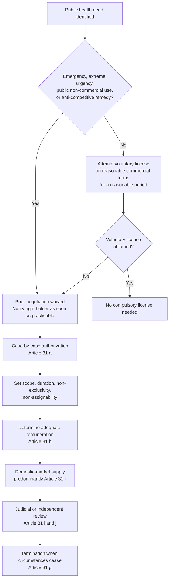

## TRIPS Flexibilities: The Doha Declaration on TRIPS and Public Health and Compulsory Licensing

### Scope and Framing

This item covers the legal architecture that permits WTO Members to limit patent exclusivity to protect public health: the built-in flexibilities of the Agreement on Trade-Related Aspects of Intellectual Property Rights (TRIPS), the interpretive clarification supplied by the 2001 Doha Declaration on the TRIPS Agreement and Public Health, the mechanics of compulsory licensing, the export-side workaround known as the Paragraph 6 System (now Article 31bis), and the enforcement and legitimacy debates surrounding them. It does not cover the broader TRIPS substantive standards (copyright, trademarks, geographical indications) except where they bear on patent flexibilities.

**Key Points**

- TRIPS sets minimum standards of protection, but it deliberately leaves Members policy space to define how those standards are implemented.
- The Doha Declaration (WT/MIN(01)/DEC/2, 14 November 2001) is not an amendment to TRIPS. It is a Ministerial Declaration that functions as an interpretive instrument under the customary rules of treaty interpretation.
- Compulsory licensing is an authorization by a government, without the patent holder's consent, allowing a third party (or the government itself) to use a patented invention, subject to conditions in Article 31.
- The Article 31(f) domestic-market limitation left countries without manufacturing capacity unable to import generics made under compulsory license; this gap was addressed by the 2003 Waiver Decision and the 2005 protocol amending TRIPS, which entered into force on 23 January 2017.
- The legal availability of flexibilities and their practical usability diverge sharply, owing to bilateral pressure, "TRIPS-plus" provisions in free trade agreements (FTAs), procedural complexity, and thin manufacturing capacity.

---

### Legal Basis: Where the Flexibilities Come From

#### Treaty Foundation

Recall that TRIPS (Annex 1C of the Marrakesh Agreement Establishing the WTO) requires all Members to give patent protection for inventions "in all fields of technology" (Article 27.1) for a minimum term of 20 years from filing (Article 33), and to grant patent holders exclusive rights to prevent others from making, using, offering for sale, selling, or importing the patented product without consent (Article 28.1). Pharmaceutical products are fully covered; the pre-TRIPS practice of many countries of excluding pharmaceutical product patents ended after the transition periods.

TRIPS balances this against public-interest language:

| Provision | Content | Relevance to public health |
| --- | --- | --- |
| Article 7 (Objectives) | IP protection should contribute to technological innovation and to the transfer and dissemination of technology, "to the mutual advantage of producers and users of technological knowledge... in a manner conducive to social and economic welfare, and to a balance of rights and obligations" | Interpretive anchor for balance |
| Article 8.1 (Principles) | Members may adopt measures "necessary to protect public health and nutrition, and to promote the public interest in sectors of vital importance," provided they are consistent with TRIPS | Policy-space clause, but qualified by the consistency proviso |
| Article 8.2 | Appropriate measures may be needed to prevent abuse of IP rights or practices that unreasonably restrain trade | Basis for competition-law remedies |
| Article 30 | Limited exceptions to exclusive rights (e.g., regulatory-review or "Bolar" exception) | Enables generic entry preparation before patent expiry |
| Article 31 | "Other use without authorization of the right holder," including compulsory licensing and government use | Core compulsory licensing provision |
| Article 40 | Control of anti-competitive practices in contractual licenses | Competition-based licensing remedies |
| Article 6 | Exhaustion is not addressed for dispute-settlement purposes | Permits parallel importation regimes |

**Defined term: TRIPS flexibilities.** The range of options within TRIPS that let Members tailor IP law to domestic policy goals. These include compulsory licensing and government use, parallel importation, the regulatory-review exception, patentability criteria (defining "invention," novelty, inventive step, industrial applicability), grounds for revocation, and transition periods for least-developed country (LDC) Members.

#### The Interpretive Problem Before 2001

Before Doha, a persistent ambiguity clouded these provisions. Article 8.1's "consistent with the provisions of this Agreement" proviso suggested that public-health measures were subordinate to patent rights rather than co-equal. Article 31 lists conditions but does not enumerate permitted grounds for compulsory licensing. Developing countries considering licensing feared WTO litigation and US trade retaliation. The immediate trigger for reform was the 1998-2001 pharmaceutical dispute in South Africa, where 39 pharmaceutical companies challenged the Medicines and Related Substances Control Amendment Act 1997 (which authorized parallel importation and generic substitution), and the parallel US-Brazil dispute (DS199), in which the United States challenged Brazil's local-working requirement under Article 68 of its Industrial Property Law (which allowed compulsory licensing of patents not locally worked). The United States withdrew its Brazil complaint in June 2001 after intense civil-society and diplomatic pressure, and the South African litigation was dropped in April 2001.

---

### The Doha Declaration on TRIPS and Public Health (2001)

#### Adoption and Legal Status

Adopted at the Fourth Ministerial Conference in Doha on 14 November 2001 by consensus, the Declaration was negotiated separately from the broader Doha Ministerial Declaration and adopted alongside it. It has no independent binding amendment effect, but it carries significant interpretive weight for two reasons:

1. Under Article IX:2 of the Marrakesh Agreement, the Ministerial Conference and General Council have exclusive authority to adopt authoritative interpretations of the WTO agreements, though the Doha Declaration was not formally adopted under that procedure.
2. Under Article 31(3)(a)-(b) of the Vienna Convention on the Law of Treaties (VCLT), as applied through Article 3.2 of the Dispute Settlement Understanding (DSU), a "subsequent agreement" between the parties regarding interpretation, or "subsequent practice" establishing agreement, is to be taken into account. The Declaration is generally treated as such an instrument. [Inference: no panel or Appellate Body report has squarely ruled on its precise formal status, so the characterization as a VCLT Article 31(3) subsequent agreement is a widely held scholarly position rather than an adjudicated one.]

#### Substantive Paragraphs

| Paragraph | Content | Practical effect |
| --- | --- | --- |
| Para 1 | Recognizes the gravity of public health problems afflicting developing and least-developed countries, especially HIV/AIDS, tuberculosis, malaria and other epidemics | Establishes context |
| Para 4 | TRIPS "does not and should not prevent Members from taking measures to protect public health"; TRIPS "can and should be interpreted and implemented in a manner supportive of WTO Members' right to protect public health and, in particular, to promote access to medicines for all" | Interpretive principle favoring public health |
| Para 5(a) | Each provision of TRIPS is to be read in light of its object and purpose, as expressed in Articles 7 and 8 | Elevates Articles 7 and 8 as interpretive context |
| Para 5(b) | Each Member has the right to grant compulsory licenses and the freedom to determine the grounds upon which such licenses are granted | Resolves the "grounds" ambiguity |
| Para 5(c) | Each Member has the right to determine what constitutes a national emergency or other circumstances of extreme urgency; public health crises, including HIV/AIDS, tuberculosis, malaria and other epidemics, can represent such circumstances | Expands the emergency waiver of prior negotiation under Article 31(b) |
| Para 5(d) | Exhaustion regime: TRIPS leaves each Member free to establish its own exhaustion regime without challenge, subject to the MFN and national treatment provisions (Articles 3 and 4) | Confirms parallel importation is permissible |
| Para 6 | Instructs the Council for TRIPS to find a solution to the problem of Members with insufficient or no manufacturing capacity in the pharmaceutical sector making effective use of compulsory licensing, and to report before the end of 2002 | Mandate for the Paragraph 6 System |
| Para 7 | Reaffirms the commitment of developed-country Members to provide incentives for technology transfer to LDCs (Article 66.2) and extends the LDC transition period for pharmaceutical patents and undisclosed information protection to 1 January 2016 | LDC pharmaceutical extension |

**Practitioner lens.** For a trade negotiator, Paragraph 4 and Paragraph 5(a) are the most frequently cited provisions in bilateral negotiations and domestic legislative debates, because they establish a "purposive" reading: when Article 31 is ambiguous, the ambiguity is resolved in favor of public-health-supportive interpretation. For a dispute-settlement lawyer, the Declaration functions as a defensive interpretive shield, supporting arguments that a licensing measure is TRIPS-consistent, but it does not supply an affirmative exception that overrides an express TRIPS obligation.

**Key Points**

- The Declaration confirms flexibilities that already existed rather than creating new ones. Its value is in removing legal uncertainty and shifting the political burden.
- Paragraph 5(c) is often misread: the Declaration does not limit compulsory licensing to emergencies. Paragraph 5(b) secures the freedom to choose grounds, and the emergency language relates only to the Article 31(b) exception from prior negotiation.
- The Declaration's reference to "access to medicines for all" (Para 4) is frequently invoked as a normative principle, but its exact interpretive weight in a hypothetical panel proceeding is unadjudicated. [Inference]

---

### Compulsory Licensing: Mechanism and Conditions

#### Definition

**Compulsory license**: an authorization granted by a government authority to a third party, without the patent holder's consent, to make, use, sell or import a patented invention, in exchange for remuneration to the patent holder. **Government use** (sometimes called "Crown use" or "public non-commercial use") is a related mechanism in which the government itself, or a contractor on its behalf, uses the patent; it is subject to a lighter set of conditions under Article 31(b).

#### Article 31 Conditions

Article 31 does not use the term "compulsory license" but regulates "other use of the subject matter of a patent without the authorization of the right holder." Its conditions are cumulative, and non-compliance with any of them can render the license TRIPS-inconsistent.

| Sub-paragraph | Requirement | Notes |
| --- | --- | --- |
| 31(a) | Authorization must be considered on its individual merits | Blanket or automatic licensing regimes are problematic; case-by-case assessment is required |
| 31(b) | Prior effort to obtain a voluntary license on reasonable commercial terms and conditions within a reasonable period | Waived in national emergency, other circumstances of extreme urgency, public non-commercial use, and anti-competitive practice remedies (31(k)); right holder must still be notified "as soon as reasonably practicable" |
| 31(c) | Scope and duration limited to the purpose for which authorized; for semi-conductor technology, only for public non-commercial use or to remedy anti-competitive practice |  |
| 31(d) | Non-exclusive | The patent holder may continue to exploit and license the patent |
| 31(e) | Non-assignable, except with the enterprise or goodwill that enjoys the use |  |
| 31(f) | Authorized predominantly for the supply of the domestic market of the authorizing Member | The export limitation that created the Paragraph 6 problem |
| 31(g) | Authorization liable to be terminated when the circumstances that led to it cease to exist and are unlikely to recur; subject to adequate protection of the legitimate interests of the licensee; competent authority may review, on motivated request, whether those circumstances continue |  |
| 31(h) | Adequate remuneration to the right holder, taking into account the economic value of the authorization | Central operational issue: how to calculate |
| 31(i)-(j) | Legal validity of the decision and remuneration decision subject to judicial or other independent review by a distinct higher authority |  |
| 31(k) | Conditions in (b) and (f) need not apply where the use is permitted to remedy a practice determined after judicial or administrative process to be anti-competitive; the need to correct anti-competitive practices may be taken into account in determining remuneration | Competition-remedy licensing |
| 31(l) | "Dependent patent" (second patent) licensing conditions: the second invention must involve an important technical advance of considerable economic significance; right holder of the first patent gets a cross-licence on reasonable terms; use authorized in respect of the first patent is non-assignable except with the second patent |  |

**Defined term: adequate remuneration.** Article 31(h) requires "adequate remuneration in the circumstances of each case, taking into account the economic value of the authorization." TRIPS does not prescribe a formula. National practice varies: Thailand's 2006-2008 licenses used a royalty of 0.5 percent of the generic's sales value (for the antiretroviral efavirenz and lopinavir/ritonavir) and about 3 percent in other cases; Canada's 2004 arrangement in the Rwanda case used a rate calibrated to the drug's value; the World Health Organization and the UN Development Programme have recommended royalty rates in the range of 0.5 to 4 percent (with the UNDP 2001 Report suggesting a base of 4 percent, adjusted by country-income). [Unverified: precise royalty percentages should be confirmed against primary licensing documents before being cited in a formal negotiation or brief.]

#### Procedural Flow

#### Government Use Example: Practitioner Notes

The government-use pathway is often faster than a third-party compulsory license because Article 31(b) already waives the prior negotiation requirement for "public non-commercial use." A trade negotiator advising on a health-ministry procurement strategy should note that "non-commercial" is not defined in TRIPS; the Doha Declaration does not resolve it. National laws vary on whether government procurement for distribution through a public health system, where the drugs are sold or subsidized, qualifies. [Inference: the more the public program resembles a commercial distribution channel, the greater the litigation risk, though no panel has tested the boundary.]

---

### Documented Cases of Compulsory Licensing

Use of compulsory licensing has been episodic rather than routine. The cases below illustrate the mechanism operating under different legal and political conditions.

#### Thailand (2006-2008)

Thailand issued government-use licenses for efavirenz (Merck, November 2006), lopinavir/ritonavir (Abbott, January 2007), and clopidogrel (Sanofi-Aventis, January 2007), among others including cancer drugs, under Section 51 of its Patents Act B.E. 2522 (1979). The Ministry of Public Health justified the measures as public non-commercial use under Article 31(b). Abbott withdrew several pending registration applications for new drugs in Thailand in retaliation, and the United States placed Thailand on its Special 301 Priority Watch List. Thailand eventually negotiated price reductions. The case illustrates that the legal right was secure but the political and commercial costs were substantial.

#### Brazil (2007)

Brazil issued a compulsory license for efavirenz (Merck) in May 2007 after negotiations over price failed, invoking public interest. Brazil imported generic efavirenz from India initially, then developed local production capacity. Brazil's earlier credible threat of licensing (used with nelfinavir and others) had already secured significant price reductions in voluntary negotiations, demonstrating the bargaining-leverage function of the flexibility.

#### Canada-Rwanda (2007-2008): The First Paragraph 6 System Use

Canada amended its Patent Act through the Jean Chrétien Pledge to Africa Act (2004) to implement the Paragraph 6 System. In 2007, Apotex obtained a Canadian compulsory license to export up to 15.6 million tablets of TriAvir (a fixed-dose combination of zidovudine, lamivudine and nevirapine) to Rwanda. Rwanda notified the WTO in July 2007 of its intention to import, and Canada notified in October 2007. The first shipment left in September 2008 and a second in 2009. The process took roughly three years from the Canadian legislation to the first shipment, and only this single transaction was completed under the system through 2016. [Inference: the procedural burdens (product-specific licensing, country-by-country notification, anti-diversion labeling and packaging requirements, and Apotex's own account of a very small scale relative to typical procurement volumes) are widely cited as the reason the system has been so little used.]

#### Colombia (2014) and Others

Colombia declared imatinib (Novartis's Glivec) to be in the public interest in 2014, but ultimately issued a compulsory license only in 2016 after prolonged dispute; the delay illustrates domestic administrative and political friction. Other notable episodes include Ecuador (2010, ritonavir), India (2012, sorafenib/Nexavar, licensed to Natco Pharma), and Malaysia (2003 and 2017, government use for antiretrovirals and hepatitis C treatment respectively). [Unverified: verify the exact dates and the status of the Colombian and Malaysian licenses against current national registries before citing.]

**Key Points**

- The most significant effect of compulsory licensing is often the credible threat rather than actual use: Brazil's negotiating strategy is the standard illustration.
- Actual invocation has triggered trade-related and commercial retaliation (Special 301 listing, product withdrawal), illustrating that formal legality does not eliminate extralegal costs.
- No WTO dispute settlement panel has ruled on the legality of a compulsory license issued for a public health reason under Article 31. The absence of adjudication means the boundaries of Article 31 remain largely untested at the panel level.

---

### The Paragraph 6 Problem and the Article 31bis Solution

#### The Problem

**Defined term: Article 31(f) limitation.** Article 31(f) requires that compulsory-license use be "authorized predominantly for the supply of the domestic market of the Member authorizing such use." A country with a pharmaceutical manufacturing sector can license a domestic producer to supply its own market. A country without such capacity, which is the situation of most LDCs and many low-income Members, cannot use compulsory licensing effectively unless it can import generic versions made under license elsewhere. But an exporting Member issuing a license to a manufacturer to export in bulk would violate the "predominantly domestic" requirement.

Paragraph 6 of the Doha Declaration recognized the problem and instructed the Council for TRIPS to find an "expeditious solution."

#### The Interim Waiver (30 August 2003)

The General Council adopted the Decision on the Implementation of Paragraph 6 of the Doha Declaration (WT/L/540 and Corr.1), often called the "Paragraph 6 Decision" or "30 August Decision." It waived the obligations of an exporting Member under Article 31(f), and the remuneration obligation under Article 31(h) as regards the exporting Member (with remuneration owed only in the importing Member) subject to conditions. It was adopted after a Chairman's statement of the General Council President (Carlos Pérez del Castillo) recording the shared understanding that the system should be used in good faith to address public health problems and not as an instrument for industrial or commercial policy goals.

#### The Permanent Amendment: Article 31bis and Annex

On 6 December 2005, the General Council adopted the Protocol Amending the TRIPS Agreement (WT/L/641), inserting a new Article 31bis, an Annex to the Agreement, and an Appendix. The amendment required acceptance by two-thirds of Members. It entered into force on 23 January 2017, the first amendment to a WTO multilateral agreement since the establishment of the WTO. [Inference: the slow ratification illustrates the difficulty of formal treaty amendment within the consensus-and-acceptance framework of Article X of the Marrakesh Agreement, even for a measure that enjoyed broad political support.]

#### Mechanics of the System

| Element | Requirement |
| --- | --- |
| Eligible importing Members | Any LDC Member; any other Member that has notified the Council for TRIPS of its intention to use the system, whether in whole or in a limited way (for example only in emergencies); some high-income Members have opted out entirely (see below) |
| Notification by importer | Specify names and expected quantities of the product needed; confirm (unless an LDC) insufficient or no manufacturing capacity in the pharmaceutical sector for the product concerned, using one of the methods in the Annex; confirm that if the product is patented in its territory, it has granted or intends to grant a compulsory license under Article 31 and the Annex |
| Exporting Member's license | Only the amount necessary to meet the importing Member's needs; product produced under license must be clearly identified through specific labeling or marking; suppliers must distinguish products through special packaging or coloring/shaping, if feasible and without significant price impact; before shipment, the licensee must post on a website the quantities and distinguishing features |
| Notification by exporter | Exporting Member notifies the Council for TRIPS of the license and its conditions, including quantities and the destination |
| Remuneration | Adequate remuneration paid in the exporting Member; where remuneration has been paid in the exporting Member, the importing Member is exempt from paying remuneration on the same product |
| Anti-diversion | Importing Members must take reasonable measures within their means to prevent re-exportation of the imported products |
| Regional trade agreements | Under Article 31bis(3), where a developing or LDC Member is party to a regional trade agreement in which at least half of the current membership consists of LDCs, the obligation on the importing Member to license may be adapted so that the product can circulate within the region, allowing scale-efficient regional procurement |

**Members that have declared they will not use the system as importers**: the 2003 Chairman's statement lists numerous high-income Members (including Australia, Canada, the EU and its Member States, Japan, New Zealand, Norway, Switzerland, and the United States) that stated they would not use the system as importers; several additional Members made the same declaration at EU accession or later. [Unverified: the list has changed over time; consult the current WTO TRIPS notifications page.]

#### Assessment of Effectiveness

The system has been used once through a completed transaction (Canada to Rwanda, described above). The arguments about why:

**The critical position.** The system is procedurally over-engineered: it demands separate licenses in exporting and importing countries for each product and each destination; imposes distinguishing-mark requirements that raise costs and reduce the economies of scale on which generic producers rely; provides no automatic mechanism to aggregate demand across importing countries (except via the regional trade agreement provision); and leaves the exporting country's manufacturer exposed to individualized litigation and reputational risk. Médecins Sans Frontières and several developing-country delegations have characterized it as unworkable in practice. Generic producers have also found it more commercially viable to supply markets where no patent exists (for example, many LDCs that had no pharmaceutical product patents through the transition-period extension to 2016), obviating the need for compulsory licenses.

**The defending position.** Supporters, including some developed-country governments and the innovator-industry associations, argue that the system was never intended to be a high-volume mechanism, that non-use reflects the widespread availability of generic medicines through voluntary licensing (for example, via the Medicines Patent Pool, established in 2010) and differential pricing, and that the legal certainty it provides has itself had a beneficial deterrent and signaling effect. On this view, low use is evidence that access needs have been met by other means, not that the system has failed.

**Practitioner lens.** A negotiator should treat the Paragraph 6 System as a legal safety net that is procedurally costly, and consequently as a backstop to voluntary licensing, tiered pricing and pooled procurement rather than as a primary instrument. A dispute-settlement lawyer should note that the system operates through a waiver (now amendment) and that measures taken in conformity with it are not subject to non-violation complaints under Article 64.3 as extended, [Inference: verify current status of the non-violation moratorium, which has been repeatedly extended by Ministerial decision and is subject to ongoing dispute among Members].

---

### Parallel Importation and Exhaustion

**Defined term: exhaustion of rights.** The doctrine that once a patented product has been sold by or with the consent of the patent holder, the holder's right to control its resale is "exhausted." A **national exhaustion** regime exhausts rights only upon first sale within the national territory; an **international exhaustion** regime treats a first sale anywhere in the world as exhausting rights, allowing **parallel importation**, meaning the import of a genuine patented product from a market where it is sold at a lower price without the patent holder's consent.

Article 6 of TRIPS provides that, for the purposes of dispute settlement, "nothing in this Agreement shall be used to address the issue of the exhaustion of intellectual property rights," subject to the national treatment and MFN provisions. Paragraph 5(d) of the Doha Declaration confirms that each Member is free to establish its own exhaustion regime "without challenge." The practical effect is that a Member may adopt international exhaustion and import lower-priced patented medicines from any source. This is a flexibility that requires no compulsory license, no compensation to the patent holder beyond that already paid in the source-market sale, and no notification. [Inference: the flexibility is widely considered to be one of the most operationally straightforward, but its effectiveness is limited when manufacturers segment markets through pricing practices, packaging differences, or restrictive distribution contracts.]

---

### Other Relevant Flexibilities

| Flexibility | Basis | Description |
| --- | --- | --- |
| Regulatory-review ("Bolar") exception | Article 30; confirmed in *Canada: Patent Protection of Pharmaceutical Products* (DS114), Panel Report 2000 | Generic manufacturers may use the patented invention to obtain marketing approval before patent expiry. The panel upheld Canada's regulatory-review exception as a valid limited exception under Article 30, but found Canada's "stockpiling" exception inconsistent, because it went beyond what was necessary for regulatory approval |
| Patentability standards | Article 27.1, definitions of novelty, inventive step and industrial applicability left to Members | India's Section 3(d) (added by the 2005 amendment) excludes from patentability new forms of known substances unless they show enhanced therapeutic efficacy; upheld by the Indian Supreme Court in *Novartis AG v. Union of India* (2013) in the Glivec case. Section 3(d) has been criticized by patent-owning states and industry as an overly restrictive interpretation of Article 27, though no WTO challenge has been brought |
| Pre-grant and post-grant opposition | Not explicitly required by TRIPS; a matter of national implementation | Allow third parties to challenge weak or evergreening patents |
| LDC transition period | Article 66.1; extended by the Doha Declaration Para 7 for pharmaceutical products to 1 January 2016 and further by a 2015 Council for TRIPS decision (IP/C/73) to 1 January 2033 | LDCs need not grant or enforce pharmaceutical product patents and protection of undisclosed information during the period |
| Competition-law remedies | Articles 8.2, 31(k), 40 | Licensing to remedy anti-competitive practices, with relaxed conditions |

**Defined term: evergreening.** The practice of obtaining additional patents on minor modifications of an existing pharmaceutical (new formulations, dosages, salts, polymorphs, or uses) to extend market exclusivity beyond the original patent term. Whether a given follow-on patent constitutes evergreening or a legitimate incremental innovation is contested, and the answer depends on the patentability standards the Member adopts under Article 27.

---

### Constraints on Use: TRIPS-Plus and Political Economy

#### TRIPS-Plus Provisions

**Defined term: TRIPS-plus.** Obligations in bilateral or regional agreements that go beyond the minimum standards of the TRIPS Agreement. Because TRIPS Article 1.1 explicitly permits Members to implement more extensive protection than required (provided it does not contravene TRIPS), such commitments are legally consistent with WTO law. Typical TRIPS-plus provisions relevant to medicines include:

- **Data exclusivity**: a fixed period (often five years or more) during which regulatory authorities may not rely on the originator's clinical-trial data to approve a generic, independent of patent status. TRIPS Article 39.3 requires only protection against "unfair commercial use" of such data, and does not mandate exclusivity, a distinction on which Members disagree. [Inference: the interpretation of Article 39.3 as not requiring exclusivity is the majority scholarly view, but the United States and the EU have treated stronger protection as a treaty standard in negotiating FTAs.]
- **Patent-term extensions** to compensate for regulatory-approval delays or patent-office delays.
- **Patent linkage**: prohibiting regulatory approval of a generic while a relevant patent is in force.
- **Limitations on grounds for compulsory licensing** or additional procedural hurdles.
- **Restrictions on exhaustion**, narrowing parallel importation.

The effect is that a Member may retain the theoretical right to issue compulsory licenses while being unable, practically or contractually, to make generic medicines available (for example, because data exclusivity prevents marketing approval even after a compulsory license authorizes production).

#### Extralegal Pressure

The US Trade Representative's annual Special 301 Report and, historically, the EU's Market Access Database and related tools have used watch-list designations and bilateral pressure in response to compulsory licensing. Documented episodes include US pressure on Thailand (2007) and on South Africa (1998-1999, before the Doha Declaration), and pressure on India after the Nexavar license (2012).

#### Structural Legitimacy Debate: Does TRIPS Structurally Favor Developed Economies?

**The strongest case that it does.** TRIPS was negotiated during the Uruguay Round as part of a "grand bargain" in which developing countries accepted stronger IP protection in exchange for market access in agriculture and textiles. Critics argue the bargain was lopsided: the IP obligations are enforceable through cross-retaliation under the Dispute Settlement Understanding, while the agriculture and textile concessions were slow, partial and, in agriculture, largely eroded by continuing subsidies. Because roughly 80-90 percent of pharmaceutical patents are held by entities headquartered in a small number of high-income economies [Unverified: precise figures vary by measurement], TRIPS transfers rents from developing-country consumers and health systems to firms in developed countries. The flexibilities, on this view, are formally available but practically constrained by TRIPS-plus commitments, retaliation risk, and capacity shortfalls.

**The strongest case that it does not.** Defenders argue that TRIPS, unlike many bilateral IP agreements, contains real flexibilities that developed and developing countries have used alike (the United States and other developed Members have themselves invoked government use, for example US threats to license ciprofloxacin during the 2001 anthrax scare, or the extensive use of compulsory licensing in US antitrust remedies historically). They argue that patents are a necessary condition for private research and development (R&D) investment, that most essential medicines are off-patent, and that the principal barriers to access in low-income countries are procurement, infrastructure and financing rather than patent rights. On this view, the flexibilities are adequate, and the Doha Declaration shows that WTO members can and do respond to legitimate concerns.

**Assessment.** Both positions capture part of the reality. The legal text is more balanced than critics allow; the operational reality is more constrained than defenders concede. The decisive factors are outside TRIPS itself: bilateral TRIPS-plus commitments, domestic implementation choices, and the manufacturing and regulatory capacity of the Member concerned.

---

### The 2022 TRIPS Waiver Decision (MC12) and Later Developments

#### Background

In October 2020, India and South Africa proposed a temporary waiver of certain TRIPS obligations (copyright and related rights, industrial designs, patents, and protection of undisclosed information) for the prevention, containment or treatment of COVID-19 (IP/C/W/669), later revised (IP/C/W/669/Rev.1, May 2021) and co-sponsored by many developing Members. The proposal relied on Article IX:3 of the Marrakesh Agreement, which allows the Ministerial Conference to waive an obligation in exceptional circumstances by a three-fourths majority of Members if consensus cannot be reached. The proposal was opposed by the EU, the United Kingdom, Switzerland, Japan and others, who argued that existing flexibilities were sufficient and that patents were not the bottleneck to vaccine supply.

#### The MC12 Ministerial Decision on the TRIPS Agreement (WT/MIN(22)/30, adopted 17 June 2022)

The outcome was narrower than the original proposal. It allows an eligible Member to authorize the use of the subject matter of a patent required for the production and supply of COVID-19 vaccines without the consent of the right holder, to the extent necessary, and it relaxes certain Article 31 conditions:

- It applies only to patents on COVID-19 vaccines (not therapeutics or diagnostics; a decision on extension to therapeutics and diagnostics was deferred for six months and was not adopted).
- Eligible Members are developing country Members; developing Members with export capacity for COVID-19 vaccines were encouraged to make a binding commitment not to avail themselves of the decision.
- The Article 31(b) requirement of prior negotiation and the Article 31(h) remuneration obligation are clarified so that a Member need not identify every relevant patent when authorizing use and remuneration is determined taking into account the humanitarian and not-for-profit purpose.
- The Article 31(f) domestic-market limitation is relaxed: products may be exported to eligible Members, and re-exportation limits are eased within regional arrangements, with no requirement for product-specific notifications on the model of the Paragraph 6 System.
- It makes explicit that eligible Members may use the flexibilities under Article 39.3 (undisclosed test data).
- It does not itself waive patent rights, and critics (for example, MSF and the original sponsors) characterized it as a clarification of existing flexibilities rather than a genuine waiver.

The decision was set for a five-year term, with the General Council to review its operation and the possibility of extension. [Unverified: consult the current WTO record for the status of any extension or the proposed extension to COVID-19 therapeutics and diagnostics.]

**Practitioner lens.** The MC12 Decision illustrates that the consensus rule, not the legal availability of the Article IX:3 waiver voting mechanism, is the binding constraint in practice. Although Article IX:3 formally permits a three-fourths majority vote, WTO practice has been to adopt waivers by consensus, and the Members supporting the waiver did not push for a vote. Recall that consensus in WTO practice means the absence of any Member present at the meeting formally objecting to a proposed decision; it does not require active agreement from every Member, but in practice a single determined objector can block adoption.

---

### Enforcement Reality: What Binds and What Does Not

#### Legal Bindingness

TRIPS obligations are enforceable through the Dispute Settlement Understanding (DSU), including the possibility of cross-retaliation: under DSU Article 22.3, a Member found to have breached TRIPS may face suspension of concessions in other sectors (goods or services) if suspension within the same sector is not practicable. For a small economy, the credibility of such a threat is a matter of the retaliating Member's market weight. [Inference: this dynamic is one reason many developing Members are reluctant to depart from TRIPS-plus commitments or to test the boundary of Article 31.]

#### Disputes Involving Pharmaceutical Flexibilities

| Dispute | Issue | Outcome | Relevance |
| --- | --- | --- | --- |
| DS114 Canada: Patent Protection of Pharmaceutical Products (EC complaint) | Regulatory-review and stockpiling exceptions under Article 30 | Panel (2000): regulatory-review exception valid under Article 30; stockpiling exception not | Established a three-step test for Article 30 exceptions (limited exception; no unreasonable conflict with normal exploitation; no unreasonable prejudice to legitimate interests of the patent owner) |
| DS153 Canada: Term of Patent Protection (US complaint) | Whether Canadian patent term satisfied the 20-year minimum of Article 33 | Panel and Appellate Body found violation | Illustrates that minimum standards are strictly enforced |
| DS199 Brazil: Measures Affecting Patent Protection (US complaint) | Local working requirement enabling compulsory license under Article 68 of Brazilian law | Settled in 2001 (mutually agreed solution, US withdrew) | Test case that never reached a ruling; political factors resolved it |
| DS408/DS409 EU and a Member State: Seizure of Generic Drugs in Transit (India and Brazil complaints against the EU and the Netherlands) | Customs seizures of generic medicines in transit through the EU on the basis of alleged patent infringement in the transit country | Consultations 2010; settled in 2011 (the EU agreed to changes to customs practices) | Demonstrates that flexibilities for access can be impeded by IP enforcement at the border |
| DS434 Australia: Plain Packaging (Ukraine, and others) | Tobacco plain-packaging measures under TRIPS (trademarks) and the TBT Agreement | Panel (2018) and Appellate Body (2020, in a related appeal) upheld Australia's measures | Not a patent case, but the panel's Article 20 analysis and its reading of Articles 7 and 8 in the context of public-health measures is instructive for the weight of public health in TRIPS interpretation |

[Inference: no compulsory license issued on public-health grounds has been the subject of a panel ruling, so the documented enforcement picture is one of deterrence and settlement rather than of adjudicated boundary-setting.]

#### Diagram: Layers of Constraint on Flexibility Use

<svg xmlns="http://www.w3.org/2000/svg" viewBox="0 0 720 420" role="img" aria-label="Layers of constraint on the use of TRIPS flexibilities (svg_diagram)">
<title>Layers of Constraint on the Use of TRIPS Flexibilities (svg_diagram)</title>
<rect x="0" y="0" width="720" height="420" fill="#ffffff" />
<text x="360" y="28" text-anchor="middle" font-family="Arial, sans-serif" font-size="16" font-weight="bold" fill="#1a1a1a">Layers of Constraint on TRIPS Flexibilities (svg_diagram)</text>
<rect x="60" y="50" width="600" height="60" rx="6" fill="#dbe9f6" stroke="#2b5c8a" stroke-width="1.5" />
<text x="360" y="75" text-anchor="middle" font-family="Arial, sans-serif" font-size="14" font-weight="bold" fill="#1a1a1a">Layer 1: TRIPS text (Articles 7, 8, 27, 30, 31, 40)</text>
<text x="360" y="97" text-anchor="middle" font-family="Arial, sans-serif" font-size="12" fill="#1a1a1a">Legal availability of flexibilities</text>
<rect x="60" y="120" width="600" height="60" rx="6" fill="#e3f1df" stroke="#3f7d32" stroke-width="1.5" />
<text x="360" y="145" text-anchor="middle" font-family="Arial, sans-serif" font-size="14" font-weight="bold" fill="#1a1a1a">Layer 2: Doha Declaration and Article 31bis</text>
<text x="360" y="167" text-anchor="middle" font-family="Arial, sans-serif" font-size="12" fill="#1a1a1a">Interpretive clarification and export-side solution</text>
<rect x="60" y="190" width="600" height="60" rx="6" fill="#fdf1d6" stroke="#b8860b" stroke-width="1.5" />
<text x="360" y="215" text-anchor="middle" font-family="Arial, sans-serif" font-size="14" font-weight="bold" fill="#1a1a1a">Layer 3: TRIPS-plus commitments in FTAs</text>
<text x="360" y="237" text-anchor="middle" font-family="Arial, sans-serif" font-size="12" fill="#1a1a1a">Data exclusivity, patent linkage, term extension</text>
<rect x="60" y="260" width="600" height="60" rx="6" fill="#fbe0dc" stroke="#a83b2e" stroke-width="1.5" />
<text x="360" y="285" text-anchor="middle" font-family="Arial, sans-serif" font-size="14" font-weight="bold" fill="#1a1a1a">Layer 4: Extralegal pressure</text>
<text x="360" y="307" text-anchor="middle" font-family="Arial, sans-serif" font-size="12" fill="#1a1a1a">Special 301 listings, commercial retaliation, litigation threats</text>
<rect x="60" y="330" width="600" height="60" rx="6" fill="#eadcf3" stroke="#6b3f8c" stroke-width="1.5" />
<text x="360" y="355" text-anchor="middle" font-family="Arial, sans-serif" font-size="14" font-weight="bold" fill="#1a1a1a">Layer 5: Domestic capacity</text>
<text x="360" y="377" text-anchor="middle" font-family="Arial, sans-serif" font-size="12" fill="#1a1a1a">Manufacturing, regulatory approval, and administrative capability</text>
</svg>

---

### Practical Worked Example: Designing a Compulsory License for a Hypothetical Patented Antiretroviral

**Example**

Assume a Member with limited generic manufacturing capacity, patented fixed-dose antiretroviral combination "X," and a domestic health emergency declaration.

**Step 1: Determine the legal pathway.**

- If the health ministry will procure and distribute the drug through a public program: assess **government use** under Article 31(b) (public non-commercial use, prior negotiation waived).
- If a private domestic firm will manufacture and sell: use a **compulsory license** and, unless emergency or extreme urgency is declared under Doha Paragraph 5(c), attempt a voluntary license on reasonable commercial terms first and document the attempt and the period allowed.

**Step 2: Confirm consistency with domestic law.** Many Members' patent statutes list permissible grounds (public interest, non-working, anti-competitive practice, dependent patents, national emergency). Doha Paragraph 5(b) confirms the freedom to determine grounds, but the licensor's domestic statute governs what an administrative body may do.

**Step 3: Structure the license terms.**

- Non-exclusive, non-assignable (Article 31(d)-(e)).
- Scope and duration tied to the purpose (Article 31(c)), for example, three years or the duration of the declared emergency, subject to review.
- Royalty: a percentage of the licensee's net sales, with reference to the range used in comparable national practice. For illustration only, a rate of 1-4 percent is within the range discussed in the WHO/UNDP guidance. [Unverified: royalty rate to be calibrated to the specific product, market and national law.]
- Notification to the patent holder as soon as reasonably practicable (Article 31(b)).

**Step 4: Provide for review.** Article 31(i)-(j) requires judicial or independent higher-authority review of both the authorization and the remuneration.

**Step 5: Address supply source.** If domestic manufacturing is infeasible, the Member notifies the Council for TRIPS under the Article 31bis system that it intends to import, specifying product name and expected quantities, and either qualifies as an LDC or provides evidence of insufficient manufacturing capacity in the Annex; an exporting Member's licensee produces under Article 31bis, with distinguishing labeling and website posting.

**Step 6: Anticipate non-legal constraints.**

- Check whether an FTA contains data-exclusivity or patent-linkage provisions that would block marketing approval of the generic even after a compulsory license.
- Prepare for a Special 301 or bilateral response and for possible commercial withdrawal by the patent holder.
- Consider parallel use of voluntary licensing (Medicines Patent Pool, direct negotiation) to reduce risk.

**Output**

A defensible authorization document identifying: the legal basis (specific Article 31 sub-paragraph and domestic statute), the patent(s) covered, the licensee, scope, duration, royalty, notification and review procedures, and the supply source (domestic or Article 31bis import).

---

### Practitioner Checklist

| Question | Legal anchor |
| --- | --- |
| Is there a domestic statutory ground for the license? | National patent law; Doha Para 5(b) |
| Is this a public non-commercial use (government use)? | Article 31(b) |
| Is there a declared emergency or extreme urgency? | Doha Para 5(c); Article 31(b) |
| Has a voluntary license on reasonable terms been sought (if required)? | Article 31(b) |
| Is the license non-exclusive and non-assignable? | Article 31(d), (e) |
| Is the supply predominantly domestic, or does Article 31bis apply for export? | Article 31(f); Article 31bis |
| Is remuneration adequate and determined under a documented method? | Article 31(h) |
| Is independent review available? | Article 31(i), (j) |
| Do FTA or other bilateral commitments constrain the license or generic approval? | FTA text; Article 1.1 |
| Has the patent holder been notified, and has the Council for TRIPS been notified where required? | Article 31(b); Article 31bis and Annex |

---

### Conclusion

The TRIPS flexibilities, clarified by the Doha Declaration, establish that WTO Members retain substantial legal authority to limit patent exclusivity to protect public health: they may choose the grounds for compulsory licensing, determine what constitutes an emergency, adopt an exhaustion regime permitting parallel imports, and design patentability standards suited to their development needs. The Article 31bis system extends this authority to importing Members lacking manufacturing capacity, though it has been used only once to completion. The gap between legal availability and practical usability arises from procedural complexity, TRIPS-plus commitments in bilateral agreements, extralegal pressure, and domestic capacity constraints, rather than from any prohibition in the multilateral text. Because no panel has adjudicated a public-health compulsory license under Article 31, the flexibilities operate largely through deterrence, negotiation and settlement, and the limits of their legal scope remain untested. The 2022 MC12 Decision on COVID-19 vaccines shows both the continuing political salience of the issue and the consensus-based constraints on institutional change.

---

### Related Topics

- Article 31bis and the Annex: procedural detail of notification, anti-diversion measures and regional trade agreement provisions
- TRIPS Article 39.3 and the debate over data exclusivity versus data protection
- The three-step test for exceptions under Article 30 and its parallel in the Berne Convention
- Non-violation and situation complaints under GATT Article XXIII:1(b) and (c) and the TRIPS moratorium (Article 64.2-64.3)
- Medicines Patent Pool and voluntary licensing as complements to compulsory licensing
- TRIPS-plus provisions in the Comprehensive and Progressive Agreement for Trans-Pacific Partnership (CPTPP), USMCA, and EU FTAs
- Technology transfer obligations under TRIPS Article 66.2 and their implementation record
- Interaction of TRIPS with the WHO Global Strategy and Plan of Action on Public Health, Innovation and Intellectual Property
- The WTO-WIPO-WHO trilateral cooperation on medical innovation and access
- Special and differential treatment and the LDC transition periods under Article 66