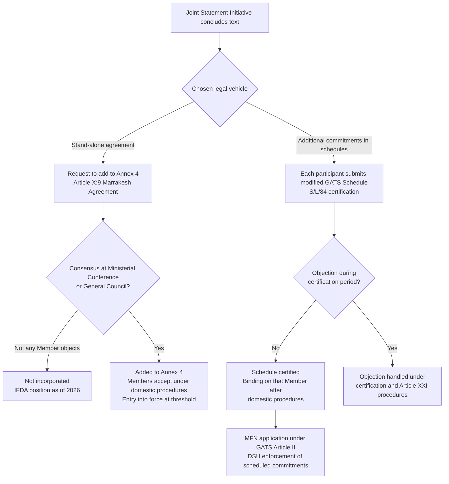

## The Investment Facilitation for Development Agreement and the Services Domestic Regulation Reference Paper

### Scope and Framing

This item covers two plurilateral outcomes that emerged from Joint Statement Initiatives (JSIs) launched at the 11th WTO Ministerial Conference (MC11, Buenos Aires, December 2017), and it is concerned with how each is legally structured, what it disciplines, and how each relates to the WTO's consensus-based rulemaking. The two instruments use different incorporation routes: the **Investment Facilitation for Development (IFD) Agreement** (IFDA) is intended to be a stand-alone treaty added to Annex 4 of the Marrakesh Agreement, whereas the **Services Domestic Regulation Reference Paper** (SDR Reference Paper) is incorporated member by member into schedules under the General Agreement on Trade in Services (GATS). That structural difference explains most of the divergence in their legal fates. The item does not cover the other JSI outcomes (the Agreement on Electronic Commerce, MSMEs, and gender), nor GATS Article VI as a whole, except where necessary for context.

**Defined term: Joint Statement Initiative (JSI).** A negotiating format in which a self-selected group of WTO Members negotiates an outcome on a topic outside the mandate of the Doha Development Agenda, without a formal multilateral negotiating mandate. Participation is voluntary, and the group seeks either to incorporate the result multilaterally or to apply it among participants.

**Key Points**

- The IFDA is a plurilateral agreement that requires a consensus decision of the Ministerial Conference to be added to Annex 4 of the WTO Agreement (Article X:9 of the Marrakesh Agreement). Since its text was finalized in February 2024, this decision has not been taken, owing to objections from a small number of Members.
- The SDR Reference Paper was designed to avoid that gateway: each participant takes on its terms unilaterally by scheduling them as "additional commitments" under GATS Article XVIII, using an existing certification procedure that requires no multilateral consensus decision.
- The IFDA explicitly excludes market access, investment protection and investor-state dispute settlement (ISDS), and its dispute-settlement coverage is limited (see below).
- Both instruments are administrative-law disciplines aimed at regulatory process, not at the substantive content of policy.
- Their contrasting trajectories are the clearest recent test of whether the WTO can produce binding plurilateral outcomes without a multilateral consensus decision.

---

### Legal Basis: The Plurilateral Toolkit in the WTO Agreement

#### Annex 4 and Article X:9

Recall that the Marrakesh Agreement Establishing the WTO distinguishes between **Multilateral Trade Agreements** (Annexes 1 to 3), which bind all Members as part of the "single undertaking," and **Plurilateral Trade Agreements** (Annex 4), which bind only Members that accept them (Article II:3). Annex 4 currently contains the Agreement on Government Procurement (GPA) 2012 and the Agreement on Trade in Civil Aircraft. Two earlier Annex 4 agreements, on dairy products and bovine meat, were terminated in 1997.

Article X:9 provides that the Ministerial Conference, "upon the request of the Members parties to a trade agreement, may decide exclusively by consensus to add that agreement to Annex 4." The decision to add an agreement therefore requires consensus, whereas the agreement's terms bind only those that accept it. **Defined term: consensus (WTO practice).** Under the footnote to Article IX:1 of the Marrakesh Agreement, a decision is taken by consensus if no Member present at the meeting formally objects to the proposed decision. In practice, a single Member's objection blocks adoption.

This produces the central structural paradox of the Annex 4 route: a non-participant with no obligations under the agreement can nevertheless veto its incorporation into the WTO's legal architecture.

#### Article XVIII and Schedules under GATS

Recall that the GATS Schedules of Specific Commitments record, for each service sector and each of the four modes of supply (Mode 1, cross-border supply; Mode 2, consumption abroad; Mode 3, commercial presence; Mode 4, presence of natural persons), the market access (Article XVI) and national treatment (Article XVII) commitments a Member has undertaken, along with any limitations. GATS Article XVIII permits Members to negotiate commitments on measures affecting trade in services that are not subject to scheduling under Articles XVI or XVII, "including those regarding qualifications, standards or licensing matters," and to inscribe such commitments as **additional commitments**. A **reference paper** is a set of regulatory principles that Members may incorporate wholesale or with exclusions into the additional-commitments column. The precedent is the Reference Paper on Basic Telecommunications (1996).

Modification of a schedule is governed by GATS Article XXI, and, for the SDR route, by the Procedures for the Certification of Rectifications or Improvements to Schedules of Specific Commitments (S/L/84, 14 April 2000), which allow a Member to submit a schedule change to the WTO Secretariat for certification, with a period for other Members to object.

#### Why the Route Matters

| Feature | IFDA (Annex 4 route) | SDR Reference Paper (schedule route) |
| --- | --- | --- |
| Legal vehicle | Stand-alone plurilateral agreement | Additional commitments in each participant's GATS Schedule |
| Gateway | Consensus decision of Ministerial Conference (Article X:9) | Unilateral submission of schedule modification for certification (S/L/84) |
| Effect of a single objector | Blocks incorporation | Does not block certification of another Member's schedule; the objector's remedy is Article XXI-type procedures affecting its own rights, [Inference: the certification procedure's objection mechanism has been used sparingly, and its treatment of a substantive objection to additional commitments has not been extensively tested] |
| Treatment of non-participants | Not bound; benefits not extended unless the agreement so provides | Applied on an MFN basis to all Members' services and suppliers, because GATS commitments are subject to Article II (MFN) |
| Dispute settlement | Depends on agreement text (see below) | GATS dispute settlement under the DSU applies to scheduled commitments |

**Practitioner lens.** For a negotiator, the choice of route is a strategic decision: the schedule route delivers legal effect faster and without a multilateral veto, but only where the disciplines can be framed as commitments a Member takes on its own schedule. The Annex 4 route is required where the subject matter cannot be expressed as scheduled commitments, or where participants want institutional infrastructure (a committee, a budget, a dispute-settlement arrangement) within the WTO.

---

### The Investment Facilitation for Development Agreement

#### Origins and Timeline

| Date | Event |
| --- | --- |
| December 2017 | Joint Ministerial Statement on Investment Facilitation for Development at MC11, Buenos Aires |
| 2018-2020 | Structured discussions among participants |
| 2020 | Text-based negotiations begin |
| July 2023 | Participants conclude negotiations on the text |
| November 2023 | Legal review finalized; text circulated to all Members |
| 25 February 2024 | Ministers of 123 WTO Members issue a Joint Ministerial Declaration marking finalization of the text |
| February 2024 (MC13, Abu Dhabi) | Request to add the agreement to Annex 4 made; consensus blocked, so it was not placed on the agenda |
| 2024-2026 | Repeated requests at General Council level (most recently WT/GC/W/927/Rev.4, December 2025) |
| March 2026 (MC14, Cameroon) | Further Joint Ministerial Declaration (WT/MIN(26)/32) and a draft Ministerial Decision (WT/MIN(26)/W/5/Rev.1); as of the sources reviewed, the agreement had not been incorporated into Annex 4 |

Participation has grown to 131 WTO Members, representing about three-quarters of the WTO membership, including 94 developing economies, 29 of them LDCs (WTO figures at the time of retrieval; [Unverified: current participant counts should be confirmed on the WTO's IFD webpage]). The initiative is co-coordinated by Chile and the Republic of Korea. [Unverified: the outcome of the MC14 decision and any subsequent General Council action should be checked against the WTO record, because the incorporation status is the most time-sensitive fact in this item.]

#### Objectives and Exclusions

Article 1 states the objective of "facilitating the flow of foreign direct investment between the Parties, particularly to developing and least-developed country Parties, with the aim of fostering sustainable development."

**Defined term: investment facilitation.** Measures that make it easier for investors to establish, operate, expand and maintain investments, principally by improving the transparency, predictability, efficiency and administrative quality of the government procedures that apply to them. It is distinguished from **investment liberalization** (market access for foreign investors), **investment protection** (substantive standards such as fair and equitable treatment and expropriation rules), and **investment dispute resolution** (ISDS).

The IFDA expressly excludes market access, investment protection and ISDS. [Inference: the exclusion is the principal political device for making the agreement acceptable to Members that regard investment rules as sovereignty-sensitive, and for distinguishing it from the failed Singapore-Issues negotiations described below.]

#### Structure and Substantive Disciplines

The agreement is organized around the following clusters. The list below is a synthesis of the WTO's published overview; article numbering should be verified against the text at INF/IFD/W/55. [Unverified]

| Cluster | Typical disciplines |
| --- | --- |
| Transparency and predictability | Publication of investment measures; online availability; enquiry points; advance notice of and opportunity to comment on proposed measures; consultation practice |
| Streamlining and speeding up administrative procedures | Application requirements and procedures for authorization; reasonable time periods; electronic applications; single windows; limits on fees and charges; reasoned decisions; review and appeal |
| Cross-border cooperation | Information sharing among Parties |
| Focal points and domestic regulatory coherence | A national focal point to assist investors; domestic coordination; treatment of investor complaints |
| Developing and LDC country provisions | Special and differential treatment (S&DT), a category system for commitments, technical assistance and capacity building, and support for implementation |
| Sustainable investment | Provisions on responsible business conduct, anti-corruption, and measures against corruption |
| Institutional arrangements | A Committee on Investment Facilitation for Development; a review; a dedicated mechanism for technical assistance |

**Defined term: single window.** A facility that allows investors to submit the documents and information required for investment-related authorizations at a single entry point, rather than separately to each of several agencies.

#### Special and Differential Treatment: The Category System

**Defined term: special and differential treatment (S&DT).** Provisions in WTO agreements that give developing and least-developed country Members greater flexibility, longer implementation periods, or technical assistance compared with developed Members.

The IFDA uses an approach modeled on the Trade Facilitation Agreement (TFA) (in force since 22 February 2017), in which a developing-country Party designates each provision as belonging to one of three categories:

- **Category A:** implemented upon entry into force (or, for LDCs, within one year);
- **Category B:** implemented after a transitional period following entry into force;
- **Category C:** implemented after a transitional period and conditional on the receipt of technical assistance and capacity-building support.

Recall that the TFA's linkage between implementation commitments and the provision of assistance was designed to make the obligations contingent on capacity. The IFDA applies the same logic, and the WTO's own material stresses that the IFD needs assessments (which have been carried out with the participation of many developing and LDC Members) are intended to help them determine their categorization before the agreement enters into force. [Inference: the IFDA's design follows TFA architecture closely, but the specific timelines and the treatment of each provision should be checked against the agreement text.]

#### Entry into Force and Dispute Settlement

According to the WTO's toolkit, once incorporated, the IFDA will enter into force following ratification by the 75th party. [Unverified: confirm against the text of the agreement.] Because it is a plurilateral agreement, it binds only Parties. The WTO's own communications describe it as open to all WTO Members to join and based on MFN treatment among Parties. The agreement's dispute settlement provisions are limited in scope: the sources reviewed describe the exclusion of investor-state dispute settlement but do not fully specify the Member-to-Member dispute-settlement arrangements, and this is a point to verify in the primary text. [Unverified]

#### Blocking of Incorporation: The Arguments

The IFDA's incorporation has been blocked repeatedly. Legal commentary indicates that India, Türkiye and South Africa opposed the incorporation at successive General Council meetings. The objections and the responses form a clear structure.

**The objectors' strongest case.**

1. *Mandate.* Investment is not sufficiently connected to trade to fall within the WTO's mandate, and the WTO's mandate cannot be enlarged except through multilateral consensus.
2. *Multilateralism and the single undertaking.* Allowing a subset of Members to add a plurilateral agreement to Annex 4 without the consent of all Members undermines the principle that the WTO's rulebook is negotiated multilaterally. If the plurilateral route becomes routine, negotiating dynamics change: coalitions will bypass the consensus that legitimizes WTO law.
3. *Process legitimacy and development.* Discussions on investment were removed from the multilateral agenda in 2004 (the Singapore Issues, see below) because developing Members had opposed them; using a plurilateral to revive the topic circumvents that decision.
4. *Slippery slope.* An investment facilitation agreement could become the foundation for later proposals that extend to investment protection or market access.
5. *Implementation burden.* Despite S&DT, commitments could impose institutional and administrative costs on developing Members.

**The proponents' strongest case.**

1. *Mandate.* The WTO already contains investment-related disciplines: the Agreement on Trade-Related Investment Measures (TRIMs) and GATS Mode 3 (commercial presence). Commentators have argued that investment was under multilateral negotiation until 2004 under a broader mandate, and its removal from the agenda was not based on a lack of WTO competence. [Inference: this is a contested legal-political characterization, not an adjudicated determination.]
2. *Consistency with Article X:9.* The Marrakesh Agreement expressly contemplates plurilateral agreements in Annex 4; the objectors' concern is a policy preference, not a legal bar.
3. *No obligations on non-participants.* Because the agreement binds only Parties, non-participants bear no obligations. The objectors are blocking an agreement that imposes nothing on them.
4. *Developing-country content.* Roughly 94 of the participating economies are developing economies, and proponents say the agreement was largely shaped by developing-country priorities, including S&DT, technical assistance and the exclusion of protection and ISDS.

**Assessment.** The dispute is only partly about the text. It is a dispute about institutional principle: whether Members that are not parties should be able to prevent the WTO from hosting agreements among others. The IFDA case is the most concrete recent illustration of a structural feature of WTO law, which is that the decision-rule for incorporating a plurilateral agreement is stricter than the decision-rule for the plurilateral's own operation.

#### Historical Context: The Singapore Issues

**Defined term: Singapore Issues.** Four topics (trade and investment, trade and competition policy, transparency in government procurement, and trade facilitation) identified at the 1996 Singapore Ministerial Conference for study and possible negotiation. The 2001 Doha Ministerial Declaration contemplated negotiations on them, subject to an explicit consensus decision on modalities at the following Ministerial Conference. Developing Members resisted, and the collapse of the Cancún Ministerial in 2003 led to the General Council's decision of 1 August 2004 (the "July Package") to drop investment, competition and transparency in government procurement from the Doha Round work programme; trade facilitation was retained and later produced the TFA.

**Practitioner lens.** For a negotiator, the significant point is that the trade facilitation topic succeeded (as the multilateral TFA) after the other three failed. The IFDA's designers have explicitly modeled it on the TFA's design and separated it from the Singapore-era proposals by excluding market access and protection.

---

### The Services Domestic Regulation Reference Paper

#### Legal Foundation: GATS Article VI

Recall that GATS Article VI (Domestic Regulation) contains six paragraphs. In the sectors in which a Member has undertaken specific commitments:

- **Article VI:1** requires that all measures of general application affecting trade in services be administered in a reasonable, objective and impartial manner.
- **Article VI:3** requires that, where authorization is required for the supply of a service on which a specific commitment has been made, the competent authorities inform the applicant of the decision concerning the application within a reasonable period after submission of a complete application.
- **Article VI:4** mandates the Council for Trade in Services to develop "any necessary disciplines" through appropriate bodies, to ensure that measures relating to qualification requirements and procedures, technical standards and licensing requirements do not constitute unnecessary barriers to trade in services. The disciplines are to ensure that such requirements are, among other things, based on objective and transparent criteria, not more burdensome than necessary to ensure the quality of the service, and, in the case of licensing procedures, not in themselves a restriction on the supply of the service.
- **Article VI:5** provides that, pending the entry into force of disciplines developed under VI:4, Members shall not apply licensing and qualification requirements and technical standards that nullify or impair specific commitments in a manner that does not comply with the criteria in VI:4(a)-(c) and could not reasonably have been expected of that Member when the specific commitments were made.

The Article VI:4 mandate had produced only one set of sectoral disciplines before 2021: the Disciplines on Domestic Regulation in the Accountancy Sector, adopted by the Council for Trade in Services in December 1998 (S/L/64). Their entry into force was tied to the conclusion of the services negotiations under the Doha Round, and they never took effect as originally planned. [Inference: that dependence on the single-undertaking outcome illustrates the systemic problem the JSI was meant to address.]

#### Negotiating History

The SDR negotiations proceeded as a JSI launched at MC11 (December 2017) after the Working Party on Domestic Regulation had made limited progress over two decades on the Article VI:4 mandate. Negotiations concluded on 26 November 2021 with the Reference Paper (INF/SDR/2), and on 2 December 2021 the participants issued the Declaration on the Conclusion of Negotiations on Services Domestic Regulation (WT/L/1129). Sixty-seven WTO Members (counting the EU as one, with its Member States), accounting for more than 90 percent of global trade in services, participated at that stage, according to the European Commission's proposal to the Council. [Unverified: participation figures should be checked against the current WTO participant list.] The participants also submitted draft Schedules of Specific Commitments (INF/SDR/3/Rev.1) as their contributions to finalize the negotiations.

#### The Incorporation Mechanism

The Declaration sets out the mechanism:

- The participants intend to incorporate the Reference Paper disciplines as additional commitments into their GATS Schedules, in accordance with Section I of the Reference Paper (paragraph 4).
- Subject to the completion of required domestic procedures, participants aim to submit their schedules for certification within twelve months of the Declaration, under the Procedures for the Certification of Rectifications or Improvements to Schedules of Specific Commitments (S/L/84) (paragraph 5).
- Participants intended to convene within six months to review progress (paragraph 6).
- Any other WTO Member may join with a view to incorporating the disciplines into its own schedule (paragraph 7).

A footnote to the Declaration notes that relevant domestic procedures may include requests for a waiver under Article IX:3(b) of the Marrakesh Agreement, where a Member's incorporation involves departing from an existing obligation. [Unverified: check the text of the footnote in WT/L/1129.]

**Defined term: additional commitments (GATS Article XVIII).** Commitments on measures affecting trade in services that are not subject to scheduling as market access or national treatment limitations, including measures relating to qualifications, standards or licensing matters.

The WTO reports that certification procedures had been concluded for a number of participants, with others ongoing, and that Members must notify the date of entry into force after completing their domestic procedures. The WTO's page lists, for example, Brazil, Costa Rica, Georgia, Kazakhstan, Paraguay and Ukraine among those completing certification at one stage. [Unverified: the count of certified schedules changes as more Members complete procedures; consult the WTO's SDR page for the current list.]

#### Substantive Content of the Reference Paper

The disciplines (from INF/SDR/2) apply to measures relating to licensing requirements and procedures, qualification requirements and procedures, and technical standards, in sectors where a Member has undertaken specific commitments. The main clusters below are a synthesis; article numbers and precise wording should be verified against the text. [Unverified]

| Cluster | Content |
| --- | --- |
| Scope and definitions | Applies to measures relating to licensing, qualification and technical standards affecting trade in services in scheduled sectors; does not cover measures that constitute market access or national treatment limitations (which are dealt with under Articles XVI and XVII) |
| Transparency | Publication (including online) of information on requirements and procedures; advance publication of measures and opportunity for comment; enquiry points |
| Application and administrative procedures | Applications to be handled within a reasonable time; electronic submission and acceptance of copies where possible; information on the status of an application; reasoned decisions; reasonable fees that do not in themselves restrict the supply of the service; procedures for review or appeal |
| Independence and impartiality | Competent authorities to act independently of service suppliers they regulate; decisions to be objective and impartial |
| Qualification requirements and procedures | Requirements based on objective and transparent criteria; procedures to be easy and to allow for a reasonable period for application; recognition of qualifications not mandated |
| Technical standards | Members are to encourage their competent bodies to use international standards, where relevant |
| Gender-neutrality | Measures relating to licensing, qualification and technical standards are not to discriminate on the basis of gender |
| Development | Provisions on technical assistance and on developing-country flexibilities |

**Defined term: licensing requirements versus qualification requirements.** *Licensing requirements* are substantive requirements, other than qualification requirements, with which a service supplier must comply to obtain, amend or renew authorization to supply a service. *Qualification requirements* are substantive requirements relating to the competence of a service supplier, such as education, examination, experience or accreditation, which must be demonstrated to obtain authorization. *Technical standards* are measures that lay down the characteristics of a service or the manner in which it is to be supplied.

**The "necessity" question.** A central historical fault line in the domestic regulation negotiations was whether the disciplines should contain a general "necessity test", meaning a requirement that measures be "not more burdensome than necessary" to ensure the quality of the service or another legitimate objective. The GATS Article VI:4(b) mandate uses this formulation, and its reading is contested. Developed Members historically pressed for tests resembling those in the TBT Agreement (Article 2.2) and GATT Article XX; some developing Members and civil-society commentators argued that a necessity test could be used to challenge legitimate public-interest regulation in areas such as health, education and financial stability. [Inference: the final Reference Paper narrowed its scope to process and procedure, and the treatment of necessity-type discipline in the final text should be verified. Commentators have generally described the outcome as more procedural than substantive.]

#### Illustrative Worked Example

**Example**

A fictional Member ("Country A") has scheduled specific commitments in engineering services in Modes 1 and 4 and has incorporated the SDR Reference Paper into its schedule. Foreign engineers seeking to supply services in Country A must obtain a licence from a professional regulatory body.

Under the Reference Paper's disciplines, and subject to verifying the exact provisions, the following consequences would follow:

- Country A must publish the licensing requirements and procedures, including the qualifying documentation, the competent authority, and the time periods, in a publicly accessible form, and maintain an enquiry point.
- The regulatory body must process an application within a reasonable period and inform the applicant of the status upon request; if refused, it must provide reasons and an avenue for review.
- Fees must be reasonable and must not in themselves restrict supply.
- The authority must be independent of the engineering firms it regulates.
- Requirements must be based on objective and transparent criteria.
- Country A cannot treat female applicants differently from male applicants as a matter of licensing and qualification rules.

**Output**

The disciplines do not require Country A to recognize foreign engineering degrees, to lower the substantive competence standard, or to open engineering services to foreign suppliers beyond what its schedule already provides. They discipline the quality of the administrative process around what the Member has already committed.

#### Effects Assessment and Critique

**The supportive position.** The Reference Paper is the first set of services domestic regulation disciplines with legal effect that applies across all service sectors where commitments exist, replacing the prior two decades of stalemate. Because it is incorporated into schedules, the commitments are enforceable through the Dispute Settlement Understanding (DSU) as with other scheduled commitments. And because commitments under GATS apply on an MFN basis under Article II, the benefits accrue to all WTO Members' service suppliers, not just to participants (subject to the sector and mode commitments). The disciplines are procedural rather than substantive, which preserves regulatory autonomy. The economic effect is concentrated in reducing regulatory friction for service suppliers, especially small businesses, that face the greatest cost from opaque licensing.

**The critical position.** Non-participation, and the MFN application of the benefits, raises a free-rider question: non-participants benefit from participants' improvements without bearing obligations, which may weaken incentives to join. Some developing Members argue that the disciplines shift regulatory design toward procedures designed for developed-country administrative capacity, and that their reach into licensing and qualification touches regulatory functions that are important for public-interest objectives. [Inference: the free-rider point is an economic argument that has been raised in the plurilateral literature generally, and its empirical size for services domestic regulation has not been established.] There is also a systemic concern, shared with critics of the IFDA, that plurilateral negotiations outside a formal multilateral mandate erode the single-undertaking principle. Finally, the disciplines' impact depends on implementation, and on whether domestic regulators are sufficiently resourced.

#### Diagram: The Two Incorporation Routes

#### Diagram: Comparative Legal Architecture

<svg xmlns="http://www.w3.org/2000/svg" viewBox="0 0 760 360" role="img" aria-label="Comparison of the IFD Agreement and SDR Reference Paper legal architecture (svg_diagram)">
<title>IFD Agreement versus SDR Reference Paper: Legal Architecture (svg_diagram)</title>
<rect x="0" y="0" width="760" height="360" fill="#ffffff" />
<text x="380" y="28" text-anchor="middle" font-family="Arial, sans-serif" font-size="16" font-weight="bold" fill="#1a1a1a">IFD Agreement vs SDR Reference Paper (svg_diagram)</text>
<rect x="30" y="50" width="335" height="290" rx="8" fill="#e8f0fa" stroke="#2b5c8a" stroke-width="1.5" />
<text x="197" y="78" text-anchor="middle" font-family="Arial, sans-serif" font-size="14" font-weight="bold" fill="#1a1a1a">IFD Agreement</text>
<text x="197" y="104" text-anchor="middle" font-family="Arial, sans-serif" font-size="12" fill="#1a1a1a">Vehicle: Annex 4 plurilateral treaty</text>
<text x="197" y="130" text-anchor="middle" font-family="Arial, sans-serif" font-size="12" fill="#1a1a1a">Gateway: consensus (Article X:9)</text>
<text x="197" y="156" text-anchor="middle" font-family="Arial, sans-serif" font-size="12" fill="#1a1a1a">Subject: investment facilitation (FDI)</text>
<text x="197" y="182" text-anchor="middle" font-family="Arial, sans-serif" font-size="12" fill="#1a1a1a">Excludes: market access, protection, ISDS</text>
<text x="197" y="208" text-anchor="middle" font-family="Arial, sans-serif" font-size="12" fill="#1a1a1a">S&amp;DT: Category A / B / C model</text>
<text x="197" y="234" text-anchor="middle" font-family="Arial, sans-serif" font-size="12" fill="#1a1a1a">Entry into force: 75th ratification</text>
<text x="197" y="270" text-anchor="middle" font-family="Arial, sans-serif" font-size="12" font-weight="bold" fill="#a83b2e">Status: not yet incorporated</text>
<text x="197" y="292" text-anchor="middle" font-family="Arial, sans-serif" font-size="12" fill="#1a1a1a">Blocked by objecting Members</text>
<text x="197" y="318" text-anchor="middle" font-family="Arial, sans-serif" font-size="12" fill="#1a1a1a">Approx. 131 participants</text>
<rect x="395" y="50" width="335" height="290" rx="8" fill="#e7f4e4" stroke="#3f7d32" stroke-width="1.5" />
<text x="562" y="78" text-anchor="middle" font-family="Arial, sans-serif" font-size="14" font-weight="bold" fill="#1a1a1a">SDR Reference Paper</text>
<text x="562" y="104" text-anchor="middle" font-family="Arial, sans-serif" font-size="12" fill="#1a1a1a">Vehicle: GATS additional commitments</text>
<text x="562" y="130" text-anchor="middle" font-family="Arial, sans-serif" font-size="12" fill="#1a1a1a">Gateway: schedule certification (S/L/84)</text>
<text x="562" y="156" text-anchor="middle" font-family="Arial, sans-serif" font-size="12" fill="#1a1a1a">Subject: licensing, qualification, standards</text>
<text x="562" y="182" text-anchor="middle" font-family="Arial, sans-serif" font-size="12" fill="#1a1a1a">Scope: sectors with specific commitments</text>
<text x="562" y="208" text-anchor="middle" font-family="Arial, sans-serif" font-size="12" fill="#1a1a1a">MFN: benefits apply to all Members</text>
<text x="562" y="234" text-anchor="middle" font-family="Arial, sans-serif" font-size="12" fill="#1a1a1a">Enforcement: DSU for scheduled commitments</text>
<text x="562" y="270" text-anchor="middle" font-family="Arial, sans-serif" font-size="12" font-weight="bold" fill="#3f7d32">Status: certification proceeding</text>
<text x="562" y="292" text-anchor="middle" font-family="Arial, sans-serif" font-size="12" fill="#1a1a1a">Member-by-member entry into effect</text>
<text x="562" y="318" text-anchor="middle" font-family="Arial, sans-serif" font-size="12" fill="#1a1a1a">Approx. 67 initial participants</text>
</svg>

---

### Comparative Analysis: Two Answers to the Plurilateral Problem

The two instruments answer the same institutional question, how a subset of Members can produce binding rules without unanimous agreement, in different ways, and the difference explains their respective progress.

**Why the schedule route succeeded where the Annex 4 route stalled.**

1. *No collective decision required.* Each Member's schedule modification is a unilateral act subject to a certification procedure that does not require affirmative consensus.
2. *Existing legal architecture.* GATS Article XVIII and the certification procedures already exist and have been used, including for the Reference Paper on Basic Telecommunications.
3. *Effect via MFN.* Because commitments benefit all Members, the objectors are not deprived of anything by participants' incorporation, which lowers the incentive to block.

**What the schedule route cannot do.**

1. It cannot create new institutions, committees, budgets or treaty-level dispute settlement.
2. It is available only where the subject matter can be framed as GATS commitments, so it cannot serve for a topic such as investment facilitation, which spans goods, services and other sectors and is not confined to scheduled services commitments.
3. It requires each participant to complete its own domestic procedures, including, for some, legislative or executive approval, which slows entry into effect.

**What the Annex 4 route offers that the schedule route does not.**

1. A single legal instrument with cross-sector reach.
2. Institutional infrastructure, including a committee and capacity-building mechanisms.
3. The signalling value of WTO endorsement.

**Assessment.** The comparison suggests that plurilateral outcomes can advance inside the WTO when they can be routed through existing scheduling mechanisms, but that agreements requiring fresh institutional standing face the consensus gate. This is an inference from two cases, and the generalization has limits: the GPA's history shows the Annex 4 route working when consensus exists.

**Practitioner lens.** A negotiator designing a new plurilateral should decide early whether the content can be expressed as schedule commitments. If it can, the schedule route avoids the incorporation veto. If it cannot, participants must either secure the consent of potential objectors through side arrangements (for example, assurances on scope, review and non-extension to protection or market access) or consider an agreement outside the WTO framework, accepting the loss of WTO institutional support.

---

### Broader Systemic Significance

**Relationship to the wider plurilateral debate.** Both instruments emerged alongside the JSI on Electronic Commerce (concluded as a stabilized text in 2024, with incorporation into Annex 4 also not achieved by the sources reviewed [Unverified]). Together, the JSIs test whether the WTO's negotiating function can migrate from the single-undertaking model toward variable geometry.

**The strongest case that plurilaterals strengthen the WTO.** Multilateral consensus among all Members on new rules has been largely unattainable since the Doha Round stalled, and plurilaterals allow willing Members to update the rulebook, keep WTO institutions relevant, and generate rules that other Members can later join. The Trade Facilitation Agreement began as a partially plurilateral discussion and became multilateral.

**The strongest case that they weaken it.** Plurilaterals risk fragmentation, marginalize Members with less negotiating capacity, undermine the principle that a WTO rule is a rule for all, and shift bargaining leverage to Members that can afford to threaten to leave. Non-participants may face pressure to join on terms they had no role in shaping, and the precedent may encourage the most powerful Members to shift more negotiating activity outside the multilateral framework.

**Enforcement reality.** Neither instrument has been the subject of WTO dispute settlement as of the sources reviewed. The SDR disciplines, once in force for a Member, are enforceable through the DSU as scheduled commitments, but the Appellate Body has been non-functioning since December 2019, which affects the finality of any panel ruling appealed "into the void" under the DSU as currently practiced. [Inference: this is a general systemic constraint on WTO dispute enforcement rather than one specific to these instruments, and interim appeal arrangements such as the Multi-Party Interim Appeal Arbitration Arrangement (MPIA) under DSU Article 25 apply only among participating Members.]

---

### Practitioner Checklist

| Question | Anchor |
| --- | --- |
| Is the outcome to be a stand-alone agreement or additional commitments? | Article X:9 versus GATS Article XVIII |
| If Annex 4: is there a realistic path to consensus among all Members? | Article IX:1 footnote, Article X:9 |
| If schedule route: which sectors and modes are scheduled, and does the reference paper apply to them? | GATS Article VI; Reference Paper |
| Does the schedule modification require domestic legislative approval or a waiver? | S/L/84; WT/L/1129 footnote |
| What S&DT and category mechanism applies to developing Parties? | IFDA categories A, B, C |
| Do the disciplines reach market access or protection? | IFDA exclusions; GATS Articles XVI-XVII |
| Are non-participants affected through MFN? | GATS Article II |
| Which dispute settlement track applies, and is the Appellate Body function relevant? | DSU; MPIA |

---

### Conclusion

The IFD Agreement and the SDR Reference Paper are two administrative-law instruments negotiated in the same institutional setting with similar goals, namely more transparent, predictable and efficient regulatory procedures, and their contrasting legal fates isolate the variable that matters most: the incorporation route. The SDR Reference Paper uses the GATS schedule mechanism to obtain legal effect without a multilateral decision. The IFDA, requiring a consensus decision under Article X:9, has been blocked despite the support of roughly three-quarters of the WTO membership. The result is a practical demonstration that, in the WTO, a plurilateral outcome's viability turns less on the strength of its coalition than on whether its legal form can bypass the consensus gateway. The systemic debate over whether this is a healthy adaptation or a threat to multilateralism remains open, and the incorporation status of the IFDA is a time-sensitive fact that should be verified against the WTO's current records.

---

### Related Topics

- Article X of the Marrakesh Agreement: amendment procedures and the addition of Annex 4 agreements
- The Agreement on Government Procurement (GPA 2012) as the operating precedent for Annex 4 plurilaterals
- The Trade Facilitation Agreement and its Category A, B and C notification model
- The Agreement on Electronic Commerce (JSI) and its incorporation prospects
- The Reference Paper on Basic Telecommunications (1996) as the precedent for GATS reference papers
- GATS Articles XVI, XVII and XVIII: market access, national treatment and additional commitments
- Modes of supply under GATS and Mode 3 commercial presence as an investment-related discipline
- The Singapore Issues and the July 2004 Package
- The Agreement on Trade-Related Investment Measures (TRIMs)
- WTO decision-making: consensus, voting under Article IX, and waivers under Article IX:3
- Dispute settlement reform and the Multi-Party Interim Appeal Arbitration Arrangement