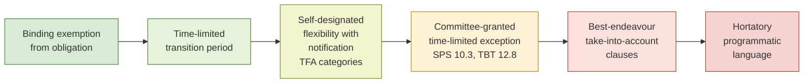

## Special and Differential Treatment Provisions Across the WTO Agreement Architecture

### Scope and Framing

This item maps where special and differential treatment (S&DT) appears in the WTO's legal texts, what legal force each type of provision carries, and how the architecture has evolved from the GATT 1947 period through the Uruguay Round agreements, the Trade Facilitation Agreement (TFA), and the post-2019 debates over "self-declared" developing-country status. It concerns the *provisions themselves and their structure*. It does not cover the substantive content of individual agreements (for example, the detailed subsidy disciplines of the Agreement on Subsidies and Countervailing Measures beyond their S&DT features) or the full Doha Round negotiating record.

**Defined term: special and differential treatment (S&DT).** Provisions in WTO agreements and decisions that give developing and least-developed country (LDC) Members special rights, flexibilities or more favourable treatment compared with developed Members, and that recognise the asymmetric capacity of developing Members to implement and benefit from multilateral rules.

**Key Points**

- The WTO Secretariat's periodic compilation identifies roughly 155 S&DT provisions across the Uruguay Round agreements and related decisions. [Unverified: the figure is drawn from the Secretariat's 2001 and later notes (WT/COMTD/W/77 and its revisions) and varies with how "provision" is counted.]
- S&DT is not one doctrine. It is a heterogeneous set of clauses of very different legal strength, ranging from binding exemptions to purely hortatory "best endeavour" language.
- The legal foundation begins with GATT Part IV (1965) and the 1979 Enabling Clause, and is embedded in the Marrakesh Agreement Establishing the WTO through its Preamble and the individual agreements.
- The WTO Agreement contains no definition of "developing country." Status is self-declared, except for LDCs, which are designated by the United Nations.
- The most-cited enforcement problem is that many S&DT provisions are unenforceable in dispute settlement because they are drafted as non-binding exhortations.

---

### Legal Foundations: From GATT to the WTO

#### GATT Part IV (1965)

Part IV of the GATT 1947 (Articles XXXVI to XXXVIII), "Trade and Development," was added in 1965. Its core provisions state that developed contracting parties "do not expect reciprocity for commitments made by them in trade negotiations to reduce or remove tariffs and other barriers to the trade of less-developed contracting parties" (Article XXXVI:8) and commit developed parties to give high priority to reducing barriers to products of particular export interest to less-developed parties (Article XXXVII:1). The language is largely one of "best efforts" ("shall to the fullest extent possible") rather than hard obligation, a drafting pattern that recurs throughout the later architecture.

#### The Enabling Clause (1979)

The Decision of 28 November 1979 on Differential and More Favourable Treatment, Reciprocity and Fuller Participation of Developing Countries (L/4903), known as the **Enabling Clause**, is a permanent legal basis, made part of GATT 1994 by paragraph 1(b)(iv) of the incorporation annex to GATT 1994. It authorises departures from the most-favoured-nation (MFN) principle of GATT Article I:1. Recall that MFN requires any advantage granted to one Member to be extended immediately and unconditionally to all Members. The Enabling Clause permits, in paragraph 2:

| Paragraph | Permitted departure | Example |
| --- | --- | --- |
| 2(a) | Preferential tariff treatment by developed Members to developing Members, under the Generalized System of Preferences (GSP) | EU GSP, US GSP schemes |
| 2(b) | Differential and more favourable treatment for developing countries under non-tariff measure agreements negotiated under GATT auspices | Tokyo Round codes |
| 2(c) | Regional or global arrangements among developing Members for mutual tariff reduction | Global System of Trade Preferences among Developing Countries (GSTP) |
| 2(d) | Special treatment for LDCs within any general or specific measures in favour of developing countries | LDC-specific preferences |

The Enabling Clause also contains the **graduation** concept in paragraph 7: developing Members "expect that their capacity to make contributions or concessions will improve with the progressive development of their economies," and should therefore "participate more fully in the framework of rights and obligations under the GATT." Graduation has no operational trigger in the text.

#### The Appellate Body's Reading: *EC-Tariff Preferences* (DS246)

In *European Communities: Conditions for the Granting of Tariff Preferences to Developing Countries* (DS246, India v. EC), the Appellate Body (2004) held that the Enabling Clause is an "exception" to Article I:1 in the sense that it operates as an affirmative defence, so the burden of showing consistency with it falls on the respondent, but that the term "developing countries" in paragraph 2(a) does not require identical treatment of all developing countries. The Appellate Body read the "non-discriminatory" requirement in footnote 3 to allow preferences that respond to "development, financial and trade needs" of developing countries, provided the differentiation is based on objective, inter-country needs and the preferences are made available to all beneficiaries with the relevant need. The drug-arrangement preferences at issue were nevertheless found inconsistent because the EC had not shown that its list of beneficiaries was determined by an objective assessment of the drug problem.

**Practitioner lens.** For a dispute-settlement lawyer, DS246 established that unilateral preference schemes may differentiate among beneficiaries only through transparent, objective, need-based criteria. For a negotiator, it means that the design of a GSP scheme (product coverage, graduation thresholds, eligibility conditions such as labour or environmental conditionality) is legally constrained by the "non-discriminatory" requirement, and that conditionality tied to policy demands unrelated to development needs is legally exposed.

#### The Marrakesh Agreement and Uruguay Round Architecture

The Uruguay Round abandoned the Tokyo Round's "GATT à la carte" (codes binding only signatories) in favour of the **single undertaking**, under which nearly all WTO agreements bind all Members. This made S&DT more consequential: instead of developing countries opting out of agreements, S&DT flexibilities within agreements became the mechanism for differentiating obligations. The Preamble of the Marrakesh Agreement recognises "that there is need for positive efforts designed to ensure that developing countries, and especially the least developed among them, secure a share in the growth in international trade commensurate with the needs of their economic development."

---

### Taxonomy of S&DT Provisions

The Secretariat's classification of S&DT provisions into six categories is the standard analytical framework. The categories differ sharply in legal force.

| Category | Nature | Legal force | Illustrations |
| --- | --- | --- | --- |
| 1. Provisions aimed at increasing trade opportunities | Market-access improvement for developing Members' exports | Mostly hortatory | GATT Article XXXVII; Agreement on Textiles and Clothing (expired 2005); Agreement on Agriculture Article 16 |
| 2. Provisions requiring Members to safeguard developing-country interests | Obligation on developed Members to "take into account" or "give special regard to" developing-country interests | Weak; variable | Anti-Dumping Agreement Article 15; SCM Agreement Article 27.10 |
| 3. Flexibility of commitments, of action and use of policy instruments | Lesser or different obligations for developing Members, or freedom to use policy instruments otherwise restricted | Strong where explicit | Agreement on Agriculture Articles 6.2 and 15; SCM Agreement Article 27; TRIPS Article 65 |
| 4. Transitional time periods | Longer implementation periods | Strong where dated; weaker where open-ended | TRIPS Articles 65 and 66; SPS Agreement Article 10.2; TFA Section II |
| 5. Technical assistance | Support for implementation | Mostly "best endeavour" | SPS Article 9; TBT Article 11; TRIPS Article 67 |
| 6. Provisions relating to LDC Members | Special treatment for LDCs specifically | Mixed | GATT Article XXXVI; SCM Article 27.2; TRIPS Article 66; Marrakesh Agreement Article XI:2 |

**Defined term: best endeavour provision.** A clause that requires a Member to make efforts toward an outcome without guaranteeing the outcome. Typical formulations include "shall endeavour," "shall give special consideration," "shall take into account," and "shall to the fullest extent possible." Because the obligation is one of conduct rather than result, establishing a breach in dispute settlement is difficult.

**Defined term: transitional period.** A fixed period after entry into force of an agreement during which a developing or LDC Member is not required to apply particular obligations. Transitional periods may be fixed (for example, five years) or extendable on request, sometimes on a case-by-case basis with Committee approval.

#### Analytical Value of the Taxonomy

The value of the taxonomy lies in diagnosing why some S&DT provisions are used and others are not. Categories 3 and 4, where the text specifies an exemption, exception or date, can be invoked by the beneficiary as of right. Categories 1, 2 and 5, which depend on the conduct of other Members, depend on political goodwill and are essentially unjusticiable. Category 6 is heterogeneous: LDC-specific exemptions from obligations (for example, from export subsidy prohibitions under SCM Article 27.2) are firm, while LDC-directed market-access and technical-assistance language is weaker.

---

### S&DT Across the Individual Agreements

The sections below map the principal S&DT mechanisms in each major agreement. Article references should be verified against the current consolidated texts before being cited in a legal submission. [Unverified: article and paragraph numbers are provided from standard references and should be confirmed.]

#### Agreement on Agriculture (AoA)

- **Reduced reduction commitments.** Developing Members undertook tariff reductions of an average 24 percent (minimum 10 percent per tariff line) over ten years, versus 36 percent (minimum 15 percent) over six years for developed Members; subsidy-reduction commitments were two-thirds of the developed-Member figures (Article 15 and Schedules).
- **Article 6.2 (development box).** Exempts from domestic-support reduction commitments investment subsidies generally available to agriculture in developing Members, agricultural input subsidies generally available to low-income or resource-poor producers, and support to encourage diversification from illicit narcotic crops.
- **De minimis.** Developing-Member de minimis threshold of 10 percent of the value of production (versus 5 percent for developed Members) (Article 6.4).
- **Article 9.4.** Exemption from export subsidy reduction commitments on marketing and transport costs, for a period.
- **Article 12 and the Marrakesh Decision on Net Food-Importing Developing Countries (NFIDCs).** A ministerial decision on measures concerning possible negative effects of the reform programme on LDCs and NFIDCs, including food aid and technical assistance. The decision is widely regarded as having had limited practical effect because it contains no operative mechanism. [Inference]
- **Special Safeguard (SSG) and the Special Safeguard Mechanism (SSM).** The SSG under Article 5 is available only to Members that tariffied non-tariff barriers and reserved the right; the SSM was proposed in the Doha Round for developing Members but not concluded.
- **Public stockholding for food security.** The 2013 Bali Ministerial Decision (WT/MIN(13)/38) and the 2014 General Council decision (WT/L/939) established an interim "peace clause" for public stockholding programmes exceeding de minimis limits, pending a permanent solution. [Inference: the permanent solution has not been reached as of the sources known to this author; verify current status.]

#### Agreement on Subsidies and Countervailing Measures (SCM)

- **Article 27** is the principal S&DT provision. It recognises subsidies as an important instrument for development and provides:
  - LDC Members and Members listed in Annex VII are exempt from the prohibition on export subsidies (Article 3.1(a)) and from the import-substitution subsidy prohibition (Annex VII(a)).
  - **Annex VII(b)** covers Members with gross national income (GNI) per capita below USD 1,000 (in 1990 dollars); these remain exempt until they reach that threshold for three consecutive years. [Inference: the 1990-dollar formulation creates a real-terms threshold that has been criticised as increasingly restrictive; confirm current status of Annex VII(b) Members.]
  - Other developing Members had an eight-year phase-out for export subsidies, with a possibility of extension. Many extensions were granted and, following the Nairobi Ministerial Decision (WT/MIN(15)/45 of 19 December 2015), transitions for certain developing Members' export subsidies were extended to end-2023 (with a specified schedule for some categories). [Unverified: verify expiration dates and any subsequent extensions.]
  - **Article 27.4** contains the export-subsidy phase-out, and **Article 27.5** governs the phase-out for export competitiveness in a product.
- **Article 27.10** contains a de minimis exemption from countervailing duty investigations for developing-country products where subsidy levels are below 2 percent (or 3 percent for Article 27.2(b) Members) of the product's value, and where import volume shares fall below specified thresholds.

#### Agreement on Trade-Related Aspects of Intellectual Property Rights (TRIPS)

- **Article 65** provides transition periods: one year after WTO entry into force generally; a further four years for developing Members (Article 65.2); an additional five years for extending product patent protection to areas of technology not previously protected (Article 65.4); and transition for economies in transition (Article 65.3).
- **Article 66.1** gives LDC Members a renewable transition period (initially 10 years, extended by Council for TRIPS decisions), and 66.2 obliges developed Members to provide incentives to enterprises and institutions in their territories to promote technology transfer to LDCs. The implementation of Article 66.2 has drawn sustained developing-country criticism, and the Council for TRIPS adopted a Decision in 2003 (IP/C/28) requiring annual reporting by developed Members. [Inference: commentators frequently characterise reporting quality as uneven; this is an evaluative claim.]
- **Pharmaceutical products.** Recall that the 2001 Doha Declaration on TRIPS and Public Health extended the LDC pharmaceutical transition to 1 January 2016, and a 2015 Council for TRIPS decision (IP/C/73) further extended it to 1 January 2033 (or until the LDC ceases to be an LDC, if earlier). [Unverified: confirm the date.]
- **Article 67** on technical cooperation.

#### Agreement on the Application of Sanitary and Phytosanitary Measures (SPS)

- **Article 10.1** requires Members to take account of the special needs of developing Members, particularly LDCs, in the preparation and application of SPS measures.
- **Article 10.2** provides that where the appropriate level of protection allows scope for the phased introduction of new SPS measures, longer time frames for compliance should be accorded on products of interest to developing Members.
- **Article 10.3** allows the SPS Committee to grant specified, time-limited exceptions, in whole or in part, from obligations under the Agreement, taking into account financial, trade and development needs.
- **Article 9** on technical assistance.
- The **Standards and Trade Development Facility (STDF)**, a partnership of the WTO, the World Bank, the Food and Agriculture Organization, the World Organisation for Animal Health and the World Health Organization, funds capacity-building projects.

#### Agreement on Technical Barriers to Trade (TBT)

- **Article 12** is the principal S&DT article: Members must take account of the special development, financial and trade needs of developing Members (12.3); developing Members are not expected to use international standards as a basis for technical regulations if inappropriate for their circumstances (12.4); and the TBT Committee may grant specified, time-limited exceptions (12.8).
- **Article 11** on technical assistance to other Members, and **Article 12.7** on encouragement for participation in international standardising bodies.

#### Agreement on Implementation of Article VI of GATT 1994 (Anti-Dumping)

- **Article 15** requires developed Members to give "special regard" to the situation of developing Members when considering the application of anti-dumping measures and to explore "possibilities of constructive remedies" before applying duties where they would affect the essential interests of developing Members.
- Article 15 is one of the most litigated S&DT clauses. In *European Communities: Anti-Dumping Duties on Cotton-Type Bed Linen from India* (DS141, Appellate Body Report 2001), the Appellate Body held that Article 15 does not oblige the investigating authority to accept a constructive remedy offered by an exporter, but it does require the authority to actively consider whether a remedy is possible. The Panel had earlier taken a more demanding view of the requirement to "explore" possibilities. [Inference: the Appellate Body's reading is commonly characterised as giving Article 15 minimal practical bite, since the obligation is satisfied by consideration rather than outcome.]

#### Agreement on Safeguards

- **Article 9.1** provides that safeguard measures shall not be applied against a product originating in a developing Member as long as its share of imports of the product concerned does not exceed 3 percent, provided that developing Members with less than 3 percent import share collectively account for not more than 9 percent of total imports of the product concerned.
- **Article 9.2** allows developing Members to extend the period of application of a safeguard measure for up to two years beyond the normal maximum, and to re-apply after a shorter interval of non-application.

#### General Agreement on Trade in Services (GATS)

- **Article IV** (Increasing Participation of Developing Countries) provides for negotiated specific commitments relating to strengthening domestic services capacity, improving access to distribution channels and information networks, and liberalisation of market access in sectors and modes of export interest. It is framed in terms of "negotiated specific commitments" and is essentially aspirational in operation.
- **Article XIX:2** provides that the process of liberalisation shall take place with due respect for national policy objectives and the level of development of individual Members, with "appropriate flexibility for individual developing country Members for opening fewer sectors, liberalizing fewer types of transactions, [and] progressively extending market access in line with their development situation."
- **Article XXV** on technical cooperation.
- **The LDC Services Waiver** (WT/L/847, 17 December 2011), extended and now operating for 15 years from 2011, permits Members to give preferential treatment to services and service suppliers of LDCs without violating GATS Article II (MFN). Recall that Article II requires MFN treatment for services and service suppliers of any other Member. The waiver is a Ministerial decision, not a treaty amendment, and its use depends on Members' notifications of preferences (the Bali 2013 decision on operationalisation, WT/L/918, established a notification and review process).

#### Agreement on Trade Facilitation (TFA)

The TFA (entered into force 22 February 2017) contains the most operationally sophisticated S&DT design in the WTO architecture. Recall that a developing-country Member designates each substantive provision as belonging to one of three categories, with the ability to implement only what its capacity permits:

- **Category A:** provisions implemented upon entry into force (or, for LDCs, within one year of entry into force).
- **Category B:** provisions implemented after a transitional period following entry into force.
- **Category C:** provisions implemented after a transitional period and conditional on the acquisition, through technical assistance and support for capacity building, of the capacity to implement.

The design is notable because it links S&DT to a **notification and review mechanism** and to a dedicated **Trade Facilitation Agreement Facility (TFAF)** for technical assistance, and because it establishes a **Committee on Trade Facilitation** with a **notification-based flexibility** and a **dispute-settlement grace period**: Article 20 of the TFA provides that for a specified period after entry into force, DSU provisions do not apply to disputes concerning Category B and C obligations for developing Members (two years) and LDCs (six years), and that any Member using the "early warning" mechanism gets extensions. [Unverified: confirm the exact period lengths and the precise scope of the dispute-settlement moratorium in TFA Article 20 and Section II, Article 17.]

**Practitioner lens.** For a trade negotiator, the TFA's category structure is the current best-practice template for capacity-contingent commitments because it converts an amorphous "best endeavour" into a self-determined implementation schedule with an audit trail. Its principal weakness is that the Category C link to donor support depends on a matching between beneficiary needs and donor willingness; the TFA provides a Committee mechanism to monitor this but not a binding donor obligation.

#### Agreement on Government Procurement (GPA 2012)

Because the GPA is a plurilateral agreement in Annex 4, it binds only Parties. Its Article V provides special and differential treatment for developing-country Parties, including transitional measures (offsets, price preferences, phased-in coverage, and exclusion of certain entities or sectors) that a developing Party may negotiate and list in its Appendix I annexes.

#### Other Mechanisms

- **Article XVIII of GATT 1994 (Governmental Assistance to Economic Development).** Section A permits modification of tariff bindings; Section B permits quantitative restrictions for balance-of-payments reasons; Section C permits other measures to promote establishment of particular industries. Section B has been addressed by the Understanding on the Balance-of-Payments Provisions of GATT 1994, which imposes procedural and substantive discipline (price-based measures preferred; time limits). [Inference: use of Article XVIII:B has declined markedly, but the provision's status as a legal fallback remains in the text.]
- **Article XI:2 of the Marrakesh Agreement** provides that LDC Members "will only be required to undertake commitments and concessions to the extent consistent with their individual development, financial and trade needs, or their administrative and institutional capabilities."
- **The Decision on Measures in Favour of Least-Developed Countries** (1994) and the **Integrated Framework** (now Enhanced Integrated Framework, EIF) for trade-related technical assistance to LDCs.
- **The Aid for Trade initiative**, launched in 2005 following the Hong Kong Ministerial Declaration, which is a non-binding donor-facing programme rather than an S&DT legal provision.

---

### Cross-Cutting Structural Features

#### Legal Strength Spectrum

The spectrum matters for dispute settlement. A respondent developing Member invoking a binding exemption (for example, SCM Annex VII) has a strong defence. A complainant developing Member invoking a best-endeavour clause against a developed Member (for example, Anti-Dumping Article 15) has little prospect of success.

#### Who Is a "Developing Country"?

**Defined term: developing country Member (WTO usage).** A Member that has designated itself as such. There is no definition in the WTO Agreement and no WTO criterion. Members announce their status, and other Members may challenge the claim to specific S&DT entitlements, although in practice they seldom do. By contrast, **least-developed country (LDC)** status follows the UN's Committee for Development Policy criteria, and the WTO recognises the UN list. As of the most recent information available, 36 WTO Members are LDCs, though this number changes with graduations. [Unverified: verify current count; 44 LDCs are listed by the UN and 36 are WTO Members as of last confirmed figures.]

Self-declaration has produced a structural controversy, because the developing-country group includes economies of very different levels of income and trade weight, including several that are among the world's largest by GDP and export volume. Three points of reference:

- The **2019 United States memorandum** (WT/GC/W/757/Rev.1, "Communication from the United States: An Undifferentiated WTO: Self-Declared Development Status Risks Institutional Irrelevance") proposed criteria (OECD membership, G20 membership, high-income classification, and a share of world merchandise trade at or above 0.5 percent) that would disqualify Members from claiming S&DT in future negotiations, and threatened to act unilaterally.
- A **July 2019 US Presidential Memorandum** directed the US Trade Representative to use all available means to change the practice, and in 2019-2020, the US in effect stopped treating certain self-declared developing countries as such for purposes of its countervailing duty de minimis rules (in a Commerce Department notice removing several economies from the list of developing countries under US CVD law).
- Several Members announced that they would not seek new S&DT in future negotiations: Brazil (2019, in the context of a US bilateral understanding), and later Korea (October 2019), Singapore (2019), and, in the context of the 2022 Fisheries Subsidies Agreement, China's stated position (September 2022) that it would not seek new S&DT in current and future WTO negotiations. [Unverified: verify the specific dates and wording of each announcement.]

**The strongest case for retaining self-declaration.** Any objective criterion would be arbitrary and politically contested, since income, trade share, human development and structural vulnerability point in different directions. Self-declaration preserves the political consensus underlying the WTO: Members accepted Uruguay Round obligations on the understanding that status would not be adjudicated. It also allows countries to differentiate themselves in practice, by choosing not to use particular flexibilities. And the S&DT entitlements that matter most (exemptions, transition periods, TFA categories) are already tied to specific criteria or notification, not to status alone, so the practical benefit to large emerging economies is narrower than critics claim.

**The strongest case for reform.** The current practice allows economies with large export sectors, high aggregate GDP, and sophisticated industrial policy to claim flexibilities (particularly in subsidy disciplines) that reduce the reach of rules and shift adjustment costs to others. It also erodes the credibility of S&DT for genuinely vulnerable Members, and it has made agreement on new rules harder because developed Members insist on less differentiation as the price for concessions. Differentiation based on need, not on group membership, would target flexibilities where they are most needed.

**Assessment.** The two positions differ in part because they measure different things. Critics look at the beneficiaries of S&DT that exist by status (for example, the 10 percent de minimis in agriculture, or the SCM Article 27.4 transitions), and defenders look at the provisions that require the Member to demonstrate a need or that require a specific threshold. The realistic reform path since 2019 has been the second one: differentiated outcomes within individual agreements (need-based flexibilities as in the TFA or the Fisheries Subsidies Agreement) rather than a general graduation rule.

#### Notification, Monitoring and the Committee on Trade and Development

The **Committee on Trade and Development (CTD)** monitors S&DT implementation. Its **Special Session** (CTD-SS) was mandated at Doha (paragraph 44 of the Doha Ministerial Declaration) to review all S&DT provisions "with a view to strengthening them and making them more precise, effective and operational." The Doha mandate produced a 2001 Secretariat compilation and a set of 88 proposals from developing-country Members, with a subset of five "Category II" (legally binding) or "agreement-specific" proposals achieving the early "Decision on Implementation-Related Issues" style outcomes. The proposals stalled: the 2004 July Package (WT/L/579) and the 2005 Hong Kong Ministerial Declaration recorded partial agreement on the five LDC-specific proposals, and the Doha work on the rest was not concluded. [Inference: the stall is conventionally attributed to disagreement about the content of "precise, effective and operational" S&DT and to linkage with other Doha items, but the internal negotiating dynamics are contested.]

#### The LDC Package and Monitoring Mechanism

The 2013 Bali Ministerial Conference adopted a package of LDC decisions, including duty-free, quota-free (DFQF) market access commitments (WT/MIN(13)/44), preferential rules of origin for LDCs, and the LDC services waiver. The **Monitoring Mechanism** on S&DT (WT/MIN(13)/45) was established, under the CTD, to analyse and review the implementation of S&DT provisions. Its work has been slow, and it has been described by some delegations as ineffective. [Inference: this is an evaluative characterisation drawn from delegation statements and commentary.] Further Ministerial decisions on preferential rules of origin for LDCs (2015, WT/MIN(15)/47) and other measures followed.

---

### Fisheries Subsidies Agreement: A Contemporary S&DT Design

The Agreement on Fisheries Subsidies (adopted at the 12th Ministerial Conference in June 2022, WT/MIN(22)/33, WT/L/1144) is the most recent example of new S&DT design, and it illustrates the post-2019 shift towards need-based, self-limiting flexibilities. Recall that the agreement prohibits subsidies to illegal, unreported and unregulated (IUU) fishing, subsidies to overfished stocks, and subsidies to fishing on the unregulated high seas. Its S&DT elements include:

- LDC Members are exempt from the disciplines' application (Article 5 and related), consistent with the flexibilities for LDCs.
- Developing-country Members have a **two-year transition** for the IUU, overfished-stock and high-seas prohibitions, in respect of measures within the exclusive economic zone (EEZ) (Article 5.7 and the transitional provision).
- **Exemption for subsidies within the EEZ** (generally 12 nautical miles for developing and LDC Members), to be provided in a manner consistent with development needs, and a **de minimis exclusion** for low-income fishers. [Unverified: the specific nautical-mile carve-outs and the treatment of small-scale artisanal fishing should be checked against the text.]
- A **voluntary fund** to provide technical assistance (the Fish Fund), established with the WTO's Secretariat.

The Agreement's treatment of S&DT was a significant negotiating question because it sits at the intersection of the developing-country status debate: several large fishing economies self-designate as developing. The final text uses functional criteria and monitoring rather than a status-based test, with certain flexibilities tied to a Member's share of global marine capture production. [Unverified: verify the exact threshold applied.]

---

### Assessing S&DT Effectiveness

**Evidence for a modest record.**

- Transition periods and exemptions in the Uruguay Round agreements were legally binding, and beneficiaries used them extensively, especially in TRIPS, SCM and the TRIMs Agreement. Many notified requests for extensions were granted.
- Category 4 (transitional periods) and category 3 (flexibility of commitments) are the most consequential in practice.
- The TFA design demonstrates that capacity-contingent flexibilities can be structured with a measurable implementation schedule and notification duties.

**Evidence for limited effect.**

- Categories 1, 2 and 5, which impose obligations on developed Members, have low justiciability. A 2010s review of the Secretariat's classification found that a large majority of S&DT provisions in the Uruguay Round agreements were of the best-endeavour or hortatory type. [Unverified: the proportion is an estimate; confirm from Secretariat documents.]
- Transition periods ended without the promised capacity, prompting repeated extension requests, notably in the TRIMs and SCM contexts.
- The Uruguay Round "implementation issues" of 1999-2001 arose because developing Members considered the S&DT in the Agreements insufficient and the implementation costs high; the resulting Doha Decision on Implementation-Related Issues and Concerns (WT/MIN(01)/17) handled a subset.

**Assessment.** S&DT is effective where it takes the form of hard-law flexibilities that the beneficiary can invoke unilaterally and ineffective where it depends on the conduct of other Members. That observation, more than any status debate, explains the direction of recent drafting: shift from best-endeavour promises to self-designated, capacity-linked flexibilities.

---

### Worked Example: Mapping an S&DT Question

**Example**

A developing-country Member (not an LDC) with GNI per capita above the Annex VII(b) threshold is considering (a) maintaining a subsidy contingent on export performance for a manufactured good, and (b) delaying implementation of a customs single-window provision. Its trade ministry asks which S&DT provisions apply.

**Step 1: Classify each measure by agreement.**

- Measure (a) falls under the SCM Agreement (prohibited export subsidy under Article 3.1(a)).
- Measure (b) falls under the TFA (single window, Article 10.4).

**Step 2: Identify the applicable S&DT and its legal force.**

- For (a): Article 27.2 and Annex VII exempt only LDCs and Annex VII Members. Article 27.4 provided a phase-out period for other developing Members that has, for most, expired, subject to extensions (for example, the Nairobi decision). If the Member is not covered by any extension, the flexibility is not available and the measure is exposed to challenge. The Member should check whether it received an extension and whether it has expired. [Inference: the result turns on the Member's individual circumstances.]
- For (b): the Member may designate the provision as Category A, B or C in its notification under TFA Section II, provided it complies with notification deadlines.

**Step 3: Check procedural conditions.**

- For (b): the Member must have notified its category designations by the applicable deadline and, for Category B and C, indicative and definitive dates for implementation. A Member that fails to give the required notification may lose the flexibility. Category C requires that assistance and support for capacity building be identified and that the Member cooperate with donors.

**Step 4: Assess exposure.**

- For (a), a violation complaint under the DSU is plausible. Remedies for prohibited subsidies under SCM Article 4 are expedited and require withdrawal "without delay."
- For (b), the TFA's dispute-settlement grace period would limit exposure for Category B and C obligations.

**Output**

The Member concludes that measure (a) lacks a current S&DT defence unless a specific extension covers it, and that measure (b) can be protected by a timely and properly formulated Category B or C notification. The example illustrates the general lesson that S&DT provisions are not a background entitlement; they are conditional legal instruments whose use depends on the text, on notifications, and on timing.

---

### Practitioner Checklist

| Question | Legal anchor |
| --- | --- |
| Is the Member an LDC (UN list) or a self-declared developing Member? | UN CDP list; WTO practice |
| Does the agreement contain a binding exemption, a transition period, or only a best-endeavour clause? | Secretariat taxonomy; agreement text |
| Has the Member made the required notification or designation? | TFA Section II; SCM Article 27 notifications; TRIPS Council notifications |
| Has the transition period expired or been extended? | Agreement text; General Council and Committee decisions |
| Is a Committee-granted time-limited exception available? | SPS 10.3; TBT 12.8 |
| Does the provision bind other Members, and is it justiciable? | Appellate Body reasoning in DS141 and comparable reports |
| Does the Member's stated position in a specific negotiation waive new S&DT claims? | Ministerial or negotiating statements |
| Does the Enabling Clause apply, and is the preference scheme need-based? | DS246 |

---

### Conclusion

S&DT in the WTO is a layered architecture rather than a single principle. Its foundations lie in GATT Part IV and the Enabling Clause, and its operational content is distributed across more than a hundred provisions in the Uruguay Round agreements, the TFA, the Fisheries Subsidies Agreement and various Ministerial decisions. The provisions differ sharply in legal force: binding exemptions and dated transition periods can be invoked by beneficiaries and are enforced in practice, whereas best-endeavour obligations on developed Members are largely unenforceable. The absence of a definition of "developing country" has turned S&DT from a technical matter into a systemic dispute over differentiation, and the post-2019 drafting practice is moving toward need-based and notification-based flexibilities as the compromise. For the practitioner, the reliable method is to identify the specific provision, classify its legal strength, check the procedural conditions for its use, and verify whether the relevant transition period has expired.

---

### Related Topics

- The Enabling Clause and Generalized System of Preferences design after DS246
- The Trade Facilitation Agreement's Category A, B and C notification system and the Trade Facilitation Agreement Facility
- Least-developed-country graduation and the smooth-transition arrangements under the UN framework and the WTO
- The Agreement on Agriculture's development box and the Public Stockholding decision
- SCM Agreement Article 27 and Annex VII: thresholds, extensions and the Nairobi decision
- The 2019 US challenge to self-declared developing-country status and Members' responses
- Aid for Trade and the Enhanced Integrated Framework as non-binding support mechanisms
- The Committee on Trade and Development and its Special Session mandate under Doha paragraph 44
- The Fisheries Subsidies Agreement's S&DT and its Fish Fund
- Technical assistance and capacity building under TRIPS Article 67, SPS Article 9 and TBT Article 11