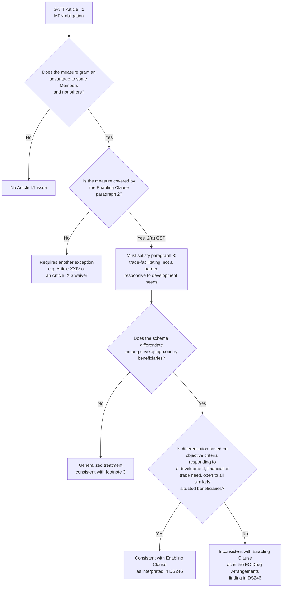

## The Enabling Clause and the Generalized System of Preferences

### Scope and Framing

This item covers the legal instrument that permits developed WTO Members to grant tariff preferences to developing countries without violating the most-favoured-nation (MFN) obligation, and the unilateral preference schemes built on that permission. It addresses the Enabling Clause's text and legal status, its interaction with GATT Article I:1, the leading dispute interpreting it, the design features of Generalized System of Preferences (GSP) schemes (with the EU scheme as the primary illustration), and the practical and legitimacy debates surrounding preference erosion, conditionality and graduation. It does not cover reciprocal preferential trade agreements under GATT Article XXIV or GATS Article V, except by contrast, nor the broader special and differential treatment (S&DT) architecture beyond the Enabling Clause itself.

**Key Points**

- The Enabling Clause (Decision of 28 November 1979, L/4903) is a permanent GATT legal basis, not a temporary waiver, and it was incorporated into GATT 1994 by the WTO Agreement.
- It authorises four categories of derogation from MFN, of which GSP tariff preferences (paragraph 2(a)) are the most widely used.
- The Appellate Body's 2004 report in *EC-Tariff Preferences* (DS246) is the controlling interpretation: preference-granting Members may differentiate among developing-country beneficiaries, but only on the basis of objective criteria that respond to a "development, financial or trade need," applied in a way that ensures the same treatment to all similarly situated beneficiaries.
- GSP schemes are unilateral and non-contractual: the granting Member may modify, suspend or withdraw preferences, subject to the constraints the Appellate Body identified.
- Preference erosion, meaning the declining value of tariff preferences as MFN tariffs fall through multilateral liberalization and as more competitors gain preferential access, is a documented structural limitation on the scheme's long-run value to beneficiaries.

---

### Legal Basis: The Text and Status of the Enabling Clause

#### Origins

Recall that GATT Article I:1 requires that any advantage, favour, privilege or immunity granted by a contracting party to any product originating in or destined for any other country be extended immediately and unconditionally to the like product originating in or destined for the territories of all other contracting parties. A unilateral tariff preference limited to developing countries is, on its face, inconsistent with this obligation. Before 1971, the legal basis for such preferences required individual waivers under GATT Article XXV:5. In 1971, contracting parties adopted a ten-year waiver permitting the GSP. The **Enabling Clause**, adopted on 28 November 1979 as part of the Tokyo Round "Framework" package, converted this temporary waiver into a **permanent** legal basis.

**Defined term: Enabling Clause.** The GATT Decision of 28 November 1979 on Differential and More Favourable Treatment, Reciprocity and Fuller Participation of Developing Countries (L/4903), which authorises WTO Members to accord differential and more favourable treatment to developing countries, notwithstanding the MFN obligation of GATT Article I:1.

#### Incorporation into the WTO

Paragraph 1(b)(iv) of the language incorporating GATT 1994 into the WTO Agreement provides that GATT 1994 includes "other decisions of the CONTRACTING PARTIES to GATT 1947" in effect on the date of entry into force of the WTO Agreement, which encompasses the Enabling Clause. As a result, the Enabling Clause is part of GATT 1994 and directly enforceable and interpretable within WTO dispute settlement, as confirmed in *EC-Tariff Preferences*.

#### Structure of the Text

| Paragraph | Content |
| --- | --- |
| 1 | Notwithstanding Article I of GATT, Members may accord differential and more favourable treatment to developing countries, without according such treatment to other Members |
| 2 | Lists four categories of covered treatment (2(a) to 2(d), described below) |
| 3 | Any differential and more favourable treatment must (a) be designed to facilitate and promote trade of developing countries and not raise barriers to or create undue difficulties for other Members' trade, (b) not constitute an impediment to reduction or elimination of tariffs on an MFN basis, and (c) be modified, in the case of preferences under paragraph 2(a), as necessary to respond positively to the development, financial and trade needs of developing countries |
| 4 | Notification and consultation requirements for Members invoking the Clause |
| 5 | Preserves the principle that developed Members do not expect reciprocity for commitments to reduce trade barriers made in trade negotiations with developing Members (echoing GATT Article XXXVI:8) |
| 6 | Least-developed Members "will be given special treatment in the light of their particular economic situation and their development, trade and financial needs" |
| 7 | Recognises that as economies of developing countries develop, they are expected to participate more fully in the framework of GATT rights and obligations (graduation concept) |
| 8 | Development of countries via preferential arrangements should improve their capacity to comply with GATT/WTO obligations |

**Defined term: footnote 3 (non-discrimination requirement).** A footnote attached to paragraph 2(a) of the Enabling Clause stating that preferential tariff treatment under GSP schemes must be "generalized, non-reciprocal and non-discriminatory." This footnote is the textual anchor for the Appellate Body's ruling in DS246 that differentiation among developing-country beneficiaries is permitted only where it responds to an objectively identifiable development need shared by the differentiated group.

#### The Four Categories of Paragraph 2

| Sub-paragraph | Covered treatment | Principal instrument |
| --- | --- | --- |
| 2(a) | Preferential tariff treatment by developed Members to products originating in developing countries, under the Generalized System of Preferences | Unilateral GSP schemes (EU, US historically, Japan, others) |
| 2(b) | Differential and more favourable treatment for developing countries with regard to non-tariff measures governed by GATT instruments negotiated multilaterally | Tokyo Round codes; relevant WTO agreement provisions with built-in S&DT |
| 2(c) | Regional or global arrangements entered into among developing-country Members for the mutual reduction or elimination of tariffs and, in accordance with criteria or conditions prescribed by the CONTRACTING PARTIES, for the mutual reduction or elimination of non-tariff measures on products imported from one another | South-South preferential arrangements, e.g., the Global System of Trade Preferences among Developing Countries (GSTP) |
| 2(d) | Special treatment for least-developed countries in the context of any general or specific measures in favour of developing countries | LDC-specific preference margins and schemes |

**Practitioner lens.** For a trade lawyer advising a government considering a new preference scheme, the threshold classification question is which sub-paragraph covers the measure, because each carries different conditions: 2(a) triggers the non-discrimination footnote and the DS246 jurisprudence; 2(c) requires the preferential arrangement to be exclusively among developing Members; 2(d) permits differentiation specifically favouring LDCs, which is textually easier to justify than differentiation among non-LDC developing Members.

---

### The Leading Case: *EC-Tariff Preferences* (DS246)

#### Facts

India challenged the European Communities' GSP scheme, specifically its **Drug Arrangements**, which extended additional tariff preferences to twelve named countries (mostly in Latin America and parts of Asia) on the basis of their efforts to combat drug production and trafficking, without extending the same preferences to other developing countries, including India.

#### Panel and Appellate Body Findings

| Issue | Panel (2003) | Appellate Body (2004) |
| --- | --- | --- |
| Legal character of the Enabling Clause | Exception to Article I:1; complainant bears burden of establishing inconsistency with Article I:1, then respondent must justify under the Clause | Affirmed as an exception in the sense of an affirmative defence: the Enabling Clause "excludes" the application of Article I:1 for measures meeting its conditions; the responding party bears the burden of demonstrating that its measure meets those conditions |
| Meaning of "non-discriminatory" (footnote 3) | Read narrowly: identical tariff treatment must be given to all GSP beneficiaries | Reversed: "non-discriminatory" does not require identical treatment for all developing countries; it permits differentiation, provided the response is to a "development, financial or trade need" and the criteria for according differential treatment are objective and the treatment is available to all similarly situated beneficiaries |
| Legality of the Drug Arrangements as designed | Found WTO-inconsistent | Also found inconsistent, but for a different, narrower reason: the EC had not established that its scheme contained objective criteria distinguishing the beneficiaries from other developing countries with a similar need, since it operated as a closed list without a mechanism allowing other similarly affected countries to be added or to demonstrate eligibility |

**Defined term: "development, financial or trade need."** The standard the Appellate Body derived from paragraph 3(c) of the Enabling Clause (which requires positive response to such needs) as the substantive benchmark against which any differentiation among GSP beneficiaries must be assessed. The need must be one that can be "positively addressed" through tariff preferences, and it must be broad-based, meaning objectively identifiable by reference to an external, verifiable standard rather than a unilateral political judgment.

#### Legal Significance

The ruling reconciled two positions: it did not require rigid uniformity (which would have made schemes like special arrangements for LDCs, or for particularly vulnerable economies, per se illegal), but it constrained the discretion of preference-granting Members to design closed, list-based schemes resembling bilateral favouritism. The consequence is that preference schemes with graduated or differentiated benefits must build in **objective, transparent eligibility criteria and a mechanism for other developing countries meeting the same criteria to be included**.

**Practitioner lens.** For a government designing a new GSP-plus arrangement (for example, one linked to human rights, labour standards, environmental conventions or anti-drug conventions), DS246 requires: (1) identification of the specific development, financial or trade need being addressed; (2) an objective and transparent standard for eligibility, ideally tied to accession to and effective implementation of identifiable international instruments; and (3) an open, non-discretionary process by which any developing country meeting the criteria can be added, rather than a politically curated list.

---

### The GSP System: Design and Operation

#### Historical Origins

The GSP concept originated in the 1964 first United Nations Conference on Trade and Development (UNCTAD), where developing countries argued that reciprocal MFN-based liberalization under GATT structurally disadvantaged them because their exports were concentrated in primary products facing high tariffs and tariff escalation, while manufactured-goods tariffs (of interest to developed exporters) fell through successive GATT rounds. The 1968 UNCTAD II conference produced international agreement in principle on a generalized, non-reciprocal, non-discriminatory system of preferences, implemented from 1971 onward through the temporary GATT waiver and, from 1979, the Enabling Clause.

**Defined term: Generalized System of Preferences (GSP).** A system under which developed countries grant non-reciprocal, reduced or zero tariffs to imports from developing countries, on a unilateral basis, meaning the developing-country beneficiary makes no reciprocal tariff concession in return. Each developed Member maintains its own scheme, with its own product coverage, preference margins, rules of origin and eligibility criteria; there is no single "GSP agreement."

#### Common Structural Elements Across National Schemes

| Element | Function |
| --- | --- |
| Beneficiary list | Countries eligible under the scheme; often tiered (general GSP, GSP-plus/special incentive arrangements, LDC-specific arrangements) |
| Product coverage | List of tariff lines eligible for preference; frequently excludes or limits "sensitive" products (agriculture, textiles) |
| Preference margin | The gap between the MFN applied tariff and the preferential rate; can be a percentage reduction or duty-free treatment |
| Rules of origin | Criteria (value-added, change in tariff classification, cumulation rules) determining whether a product "originates" in the beneficiary for preference purposes |
| Graduation mechanism | Removal of a country or a product sector from the scheme once it reaches an income or competitiveness threshold |
| Conditionality | Eligibility tied to compliance with specified international conventions (labour rights, human rights, environmental, governance, anti-drug) in "GSP-plus" or "special incentive" variants |
| Safeguard/withdrawal clause | Authority to suspend preferences temporarily or permanently for a beneficiary or product, for reasons including serious violations of core conventions, fraud, or import surges |

#### The EU GSP Scheme (Illustrative Detail)

The EU scheme, currently under Regulation (EU) 2023/2594 (applicable from 2024), maintains a three-tier structure, continuing the architecture of its predecessor regulations. [Unverified: verify current regulation number and dates against the EU's official GSP webpage, as EU GSP regulations are periodically renewed and amended.]

| Tier | Description | Eligibility | Benefit |
| --- | --- | --- | --- |
| Standard GSP | The general arrangement | Low and lower-middle-income countries not otherwise covered by another preferential arrangement with the EU, and not graduated out | Reduced tariffs on around two-thirds of EU tariff lines |
| GSP+ (special incentive arrangement for sustainable development and good governance) | Enhanced preferences | Vulnerable low and lower-middle-income countries (measured by a lack of export diversification and a low share of EU imports) that ratify and effectively implement 27 international conventions on human rights, labour rights, environment and governance, and accept monitoring | Duty-free access on essentially the same product coverage as standard GSP, i.e., significantly deeper preferences |
| Everything But Arms (EBA) | LDC-specific arrangement | All UN-designated LDCs | Duty-free, quota-free access on all products except arms and ammunition |

**Defined term: graduation (GSP mechanism, distinct from Enabling Clause paragraph 7).** The removal of preferential treatment for a beneficiary country's exports in a specific product sector (sector graduation) or the removal of the country from the scheme altogether (country graduation), typically triggered when the World Bank classifies the country as a high-income economy for three consecutive years, or when the beneficiary's exports of a product sector to the granting Member exceed a defined share threshold over consecutive years.

**Practitioner lens.** For a beneficiary-country negotiator, GSP+ eligibility is a strategic lever: ratifying and demonstrating effective implementation of the specified conventions converts standard preferences into duty-free treatment, but it also creates an ongoing monitoring relationship (biennial reporting cycles) and an exposure to withdrawal if implementation is judged to lapse. The EU has invoked withdrawal or threatened withdrawal in specific cases (for example, partial withdrawal or threatened withdrawal of preferences tied to labour-rights or governance concerns for named beneficiaries); the precise cases and current status should be verified against the European Commission's GSP monitoring reports. [Unverified]

#### The US GSP Programme: Status Note

The US GSP programme, established under the Trade Act of 1974, operates on a different legal track from the EU scheme, being periodically authorized by US legislation and subject to lapse when Congress does not renew it. As of the most recent information available to this synthesis, the US GSP programme's authorization had lapsed and had not been renewed for an extended period, with US importers unable to claim preferential duty treatment even though the underlying statute contemplates retroactive refunds upon renewal. [Unverified: the renewal status changes with US legislative action; verify current status before relying on this for a specific transaction, including whether GSP has been reauthorized and whether any retroactive refund mechanism is in effect.]

#### Other National Schemes

Japan, the United Kingdom (which established its own scheme, the Developing Countries Trading Scheme, after leaving the EU customs union), Canada, Switzerland (and other EFTA states), Norway, and other developed Members maintain separate GSP-type schemes, each with distinct beneficiary lists, product coverage and rules of origin. [Unverified: scheme-specific detail should be verified against each Member's current legislation for any application requiring precision.]

---

### GSP Versus Reciprocal Preferential Trade Agreements

**Defined term: non-reciprocal preference.** A tariff preference granted by one party without requiring a reciprocal concession from the beneficiary, distinguishing GSP-type arrangements from free trade agreements (FTAs) or customs unions under GATT Article XXIV, which require substantially all trade to be liberalized reciprocally between the parties as a condition for the exception to MFN.

| Feature | GSP (Enabling Clause) | Reciprocal FTA (GATT Article XXIV) |
| --- | --- | --- |
| Reciprocity | None required; beneficiary makes no tariff concession | Required; "substantially all trade" liberalized between parties |
| Bindingness | Unilateral, non-contractual; grantor may modify or withdraw, subject to DS246 constraints | Treaty-based; withdrawal governed by the agreement's own terms and international law of treaties |
| Notification | Notified to the WTO under the Enabling Clause and reviewed in the Committee on Trade and Development | Notified under GATT Article XXIV:7 or GATS Article V:7, reviewed by the Committee on Regional Trade Agreements |
| Coverage requirement | No "substantially all trade" requirement, but paragraph 3(a) requires the treatment be designed to facilitate trade | Must cover substantially all trade between the parties |
| Typical legal challenge | Discrimination among developing-country beneficiaries (DS246 standard) | Whether the "substantially all trade" and "other regulations of commerce" requirements are met |

Many developing countries have transitioned specific trading relationships from GSP-based unilateral preferences to reciprocal FTAs (for example, the EU's Economic Partnership Agreements with African, Caribbean and Pacific states, which replaced the non-reciprocal Cotonou/Lomé preferences after a WTO waiver period, precisely to resolve the tension between non-reciprocal preferences for a defined regional group and the Enabling Clause's requirement that GSP-type treatment be generalized rather than country-specific). Recall that the EU's Lomé Convention preferences for African, Caribbean and Pacific (ACP) countries had required a specific Article IX:3 waiver (the Cotonou Waiver) precisely because they were not "generalized" within the meaning of the Enabling Clause, being limited to a specific group defined by a colonial-historical relationship rather than by an objective development criterion open to all similarly situated developing countries.

---

### Practical Effects and Debates

#### Preference Erosion

**Defined term: preference erosion.** The decline in the value of a tariff preference over time, arising from (a) reductions in the MFN tariff itself through multilateral rounds, which narrow the preference margin, and (b) the proliferation of competing preferential arrangements (other GSP beneficiaries, new FTAs, other beneficiaries' preferences), which erode the beneficiary's relative advantage.

Preference erosion has been a persistent theme in WTO development discussions, including in the context of the Doha Round's non-agricultural market access (NAMA) negotiations, where beneficiaries of long-standing preferences (particularly in agriculture, textiles and sugar) expressed concern that ambitious MFN tariff cuts would erase the value of their preferential access before they could adjust their export structures. [Inference: the empirical magnitude of erosion effects varies substantially by product and beneficiary, and precise quantification requires country- and sector-specific study rather than a general figure.]

#### Utilization Rates

A persistent empirical finding in the trade-policy literature is that **preference utilization rates**, meaning the share of eligible exports that actually claim the preference, are well below 100 percent for many beneficiaries, particularly smaller and least-developed exporters. Commonly cited reasons include the administrative cost of complying with rules of origin, the small preference margin relative to compliance cost for some products, exporter unfamiliarity with scheme requirements, and the effect of non-tariff measures (SPS and TBT requirements) that limit market access even where a tariff preference exists. [Unverified: this is a widely observed pattern in the economic literature on preference schemes; exact utilization rates vary by scheme, product, and year, and should be sourced to current UNCTAD or European Commission monitoring data for a specific claim.]

#### Conditionality Debate

**The strongest case for conditionality (GSP+-style arrangements).** Linking enhanced preferences to ratification and effective implementation of international conventions on labour, human rights, environment and governance gives beneficiary governments a market-access incentive to improve domestic standards, and it allows the granting Member to calibrate the depth of preference to a verifiable commitment rather than granting the same benefit regardless of governance quality. Because the criteria (ratification and monitored implementation of named conventions) are objective and available to any qualifying country, this design is more consistent with the DS246 "objective criteria" standard than the drug-arrangement approach that was struck down.

**The strongest case against conditionality.** Conditionality imports non-trade policy objectives into what the Enabling Clause frames as a trade and development instrument, and it can function as leverage disproportionate to the trade relationship, especially where withdrawal threatens significant export revenue for a small beneficiary economy. Critics also argue that monitoring and enforcement of the underlying conventions by the granting Member is inherently selective and politically inflected, reproducing exactly the kind of discretionary differentiation among developing countries the Enabling Clause's non-discrimination footnote was designed to prevent, even where the criteria are nominally objective.

**Assessment.** DS246 supplies the legal ceiling on conditionality (objective criteria, open eligibility, and response to a demonstrable need) without resolving the underlying policy question of whether conditionality of this kind is desirable. The design compromise most granting Members have converged on, exemplified by EU GSP+, is objective, convention-based eligibility criteria combined with a monitoring and reporting cycle, rather than case-by-case discretionary selection of beneficiaries.

#### Graduation and the "Middle-Income Trap" Critique

Because GSP schemes typically graduate beneficiaries as income or export competitiveness rises, critics have argued that graduation can remove support precisely as an economy is diversifying into higher-value manufactured exports where preference margins matter most, creating a disincentive or a difficult transition point. Proponents respond that graduation preserves the scarce preference budget for the neediest beneficiaries and is consistent with paragraph 7 of the Enabling Clause, which explicitly anticipates fuller participation in GATT/WTO rights and obligations as economies develop.

---

### Diagram: Legal Relationship Between the Enabling Clause, GATT Article I, and GSP Schemes

### Diagram: Comparative Structure of GSP Tiers (EU Illustration)

<svg xmlns="http://www.w3.org/2000/svg" viewBox="0 0 740 340" role="img" aria-label="Comparative structure of GSP tiers under the EU scheme (svg_diagram)">
<title>GSP Tier Structure: Standard, GSP+ and Everything But Arms (svg_diagram)</title>
<rect x="0" y="0" width="740" height="340" fill="#ffffff" />
<text x="370" y="26" text-anchor="middle" font-family="Arial, sans-serif" font-size="15" font-weight="bold" fill="#1a1a1a">GSP Tier Structure: EU Scheme Illustration (svg_diagram)</text>
<rect x="30" y="50" width="210" height="250" rx="8" fill="#e8f0fa" stroke="#2b5c8a" stroke-width="1.5" />
<text x="135" y="78" text-anchor="middle" font-family="Arial, sans-serif" font-size="13" font-weight="bold" fill="#1a1a1a">Standard GSP</text>
<text x="135" y="106" text-anchor="middle" font-family="Arial, sans-serif" font-size="11" fill="#1a1a1a">Low / lower-middle</text>
<text x="135" y="122" text-anchor="middle" font-family="Arial, sans-serif" font-size="11" fill="#1a1a1a">income, no other</text>
<text x="135" y="138" text-anchor="middle" font-family="Arial, sans-serif" font-size="11" fill="#1a1a1a">preferential deal</text>
<text x="135" y="170" text-anchor="middle" font-family="Arial, sans-serif" font-size="11" fill="#1a1a1a">Reduced tariffs on</text>
<text x="135" y="186" text-anchor="middle" font-family="Arial, sans-serif" font-size="11" fill="#1a1a1a">~2/3 of tariff lines</text>
<text x="135" y="218" text-anchor="middle" font-family="Arial, sans-serif" font-size="11" fill="#1a1a1a">No convention</text>
<text x="135" y="234" text-anchor="middle" font-family="Arial, sans-serif" font-size="11" fill="#1a1a1a">conditionality</text>
<rect x="265" y="50" width="210" height="250" rx="8" fill="#e7f4e4" stroke="#3f7d32" stroke-width="1.5" />
<text x="370" y="78" text-anchor="middle" font-family="Arial, sans-serif" font-size="13" font-weight="bold" fill="#1a1a1a">GSP+</text>
<text x="370" y="106" text-anchor="middle" font-family="Arial, sans-serif" font-size="11" fill="#1a1a1a">Vulnerable low /</text>
<text x="370" y="122" text-anchor="middle" font-family="Arial, sans-serif" font-size="11" fill="#1a1a1a">lower-middle income,</text>
<text x="370" y="138" text-anchor="middle" font-family="Arial, sans-serif" font-size="11" fill="#1a1a1a">low export diversification</text>
<text x="370" y="170" text-anchor="middle" font-family="Arial, sans-serif" font-size="11" fill="#1a1a1a">Duty-free on standard</text>
<text x="370" y="186" text-anchor="middle" font-family="Arial, sans-serif" font-size="11" fill="#1a1a1a">GSP product coverage</text>
<text x="370" y="218" text-anchor="middle" font-family="Arial, sans-serif" font-size="11" fill="#1a1a1a">Ratify + implement 27</text>
<text x="370" y="234" text-anchor="middle" font-family="Arial, sans-serif" font-size="11" fill="#1a1a1a">conventions; monitored</text>
<rect x="500" y="50" width="210" height="250" rx="8" fill="#fdf1d6" stroke="#b8860b" stroke-width="1.5" />
<text x="605" y="78" text-anchor="middle" font-family="Arial, sans-serif" font-size="13" font-weight="bold" fill="#1a1a1a">Everything But Arms</text>
<text x="605" y="106" text-anchor="middle" font-family="Arial, sans-serif" font-size="11" fill="#1a1a1a">All UN-designated</text>
<text x="605" y="122" text-anchor="middle" font-family="Arial, sans-serif" font-size="11" fill="#1a1a1a">LDCs</text>
<text x="605" y="170" text-anchor="middle" font-family="Arial, sans-serif" font-size="11" fill="#1a1a1a">Duty-free, quota-free</text>
<text x="605" y="186" text-anchor="middle" font-family="Arial, sans-serif" font-size="11" fill="#1a1a1a">on all products except</text>
<text x="605" y="202" text-anchor="middle" font-family="Arial, sans-serif" font-size="11" fill="#1a1a1a">arms and ammunition</text>
<text x="605" y="234" text-anchor="middle" font-family="Arial, sans-serif" font-size="11" fill="#1a1a1a">Based on Enabling</text>
<text x="605" y="250" text-anchor="middle" font-family="Arial, sans-serif" font-size="11" fill="#1a1a1a">Clause paragraph 2(d)</text>
</svg>

---

### Worked Example: Assessing a Proposed Preference Scheme for Enabling Clause Consistency

**Example**

A hypothetical developed Member proposes a new "Climate Resilience Preference Arrangement" offering duty-free access, beyond its standard GSP rates, to developing countries that meet a vulnerability index based on exposure to climate-related economic shocks and that have ratified specified environmental instruments.

**Step 1: Classify under paragraph 2.** The measure is a tariff preference for developing countries and falls under paragraph 2(a), triggering the footnote 3 non-discrimination requirement and the DS246 standard.

**Step 2: Identify the claimed "development, financial or trade need."** Vulnerability to climate-related economic shocks is capable of qualifying as such a need if it is defined by reference to an external, objective and verifiable standard (for example, an established multilateral vulnerability index), rather than by unilateral, ad hoc designation.

**Step 3: Test the eligibility mechanism against DS246.** The scheme should specify the vulnerability index and threshold in the legal instrument itself; provide a transparent process by which any developing country meeting the threshold can apply, be assessed, and be added; and avoid a closed list that excludes similarly vulnerable countries without an objective basis for the exclusion.

**Step 4: Check paragraph 3 conditions.** The scheme should be designed to facilitate and promote beneficiaries' trade (not simply reward conduct unrelated to trade capacity), should not raise barriers to third countries' trade, and should not impede multilateral MFN tariff reduction.

**Step 5: Consider procedural requirements.** Under paragraph 4, the granting Member should notify the scheme to the WTO (in practice, reviewed in the Committee on Trade and Development) and be prepared to consult with affected Members.

**Output**

A scheme built on a published, externally verifiable vulnerability index, with an open application process and periodic, criteria-based review, would be defensible under the Enabling Clause as interpreted in DS246. A scheme built on a closed list of named beneficiaries selected without reference to a published, objective standard would replicate the flaw that led to the finding of inconsistency in the EC Drug Arrangements.

---

### Practitioner Checklist

| Question | Legal anchor |
| --- | --- |
| Does the measure grant an advantage to some but not all Members? | GATT Article I:1 |
| Is the measure limited to developing or least-developed countries? | Enabling Clause paragraph 1 |
| Which sub-paragraph of paragraph 2 covers it? | Enabling Clause paragraph 2(a)-(d) |
| Does the scheme differentiate among developing-country beneficiaries? | Footnote 3; DS246 |
| If so, is the differentiation based on an objective, externally verifiable need? | DS246 Appellate Body reasoning |
| Is the eligibility process open to any country meeting the criteria? | DS246 Appellate Body reasoning |
| Does the scheme facilitate trade and avoid impeding MFN liberalization? | Enabling Clause paragraph 3 |
| Has the scheme been notified to the WTO? | Enabling Clause paragraph 4 |
| Does a graduation or withdrawal mechanism exist, and on what criteria? | National scheme legislation, e.g. EU GSP Regulation |
| Would a reciprocal FTA under GATT Article XXIV be a more durable alternative? | GATT Article XXIV; historical EU-ACP EPA transition |

---

### Conclusion

The Enabling Clause converted a temporary GATT waiver into a permanent legal foundation for non-reciprocal tariff preferences, and GSP schemes built on it have been the principal vehicle for developed-country market-access concessions to developing countries outside reciprocal negotiations. The 2004 Appellate Body report in *EC-Tariff Preferences* supplied the operative legal test: differentiation among developing-country beneficiaries is permitted, but only where it responds to an objective, externally verifiable development, financial or trade need and remains open to any similarly situated beneficiary. That standard now shapes the design of "GSP-plus" style conditional schemes. The practical value of GSP to beneficiaries is constrained by preference erosion, uneven utilization rates, and the unilateral, revocable character of the preferences, which distinguishes GSP sharply from the binding, reciprocal commitments of a free trade agreement. For a practitioner, the recurring analytical task is not simply confirming that a preference scheme exists, but testing its eligibility design against the DS246 standard and assessing whether the specific beneficiary in question can rely on it as a durable market-access guarantee or should instead pursue a negotiated, reciprocal alternative.

---

### Related Topics

- GATT Article XXIV and GATS Article V: the reciprocal preferential trade agreement exception to MFN
- The LDC Services Waiver (WT/L/847) as a services-sector analogue to GSP
- Rules of origin design and cumulation in preferential schemes
- The EU-ACP Cotonou Waiver and the transition to Economic Partnership Agreements
- Special and differential treatment provisions across the WTO agreement architecture
- The Doha Round NAMA negotiations and the preference-erosion debate
- UNCTAD's role in the origins and monitoring of the GSP system
- The Duty-Free Quota-Free (DFQF) market access commitment for LDCs under the 2005 Hong Kong Ministerial Declaration
- Graduation thresholds and the World Bank income classification as a policy trigger
- Aid for Trade as a complement to preference-based market access