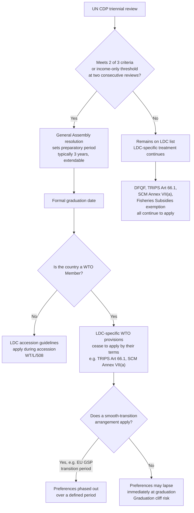

## Least-Developed Country Exemptions, Transition Periods, and Duty-Free Quota-Free Access

### Scope and Framing

This item covers the distinct bundle of legal treatment reserved specifically for least-developed countries (LDCs) within the WTO architecture, as opposed to the broader, self-declared "developing country" category. It addresses how LDC status is determined, the LDC-specific exemptions and extended transition periods across the agreements, the duty-free quota-free (DFQF) market-access commitment and its implementation, and the emerging "smooth transition" regime for countries graduating out of LDC status. It does not re-cover the general special and differential treatment (S&DT) taxonomy or the Enabling Clause's GSP mechanics beyond what is specific to LDCs.

**Key Points**

- LDC status is not self-declared. It follows the United Nations Committee for Development Policy (CDP) triennial review, using three criteria: gross national income (GNI) per capita, the Human Assets Index (HAI), and the Economic and Environmental Vulnerability Index (EVI).
- As of the most recent figures reviewed, there are 44-45 UN-designated LDCs, of which roughly 35-36 are WTO Members, with several others in various stages of WTO accession. [Unverified: this figure moves with graduations and accessions and should be checked against the current UN DESA and WTO LDC lists before being cited precisely.]
- The 2005 Hong Kong Ministerial Declaration's DFQF commitment (paragraph 47 and Annex F) requires developed Members, and developing Members declaring themselves able to do so, to provide duty-free and quota-free market access for at least 97 percent of tariff lines originating from LDCs.
- LDC-specific legal treatment operates through three mechanisms: binding exemptions from certain obligations (for example, SCM Article 27.2 export-subsidy prohibition), extended or open-ended transition periods (for example, TRIPS Article 66.1), and market-access commitments from trading partners (DFQF, preferential rules of origin, the LDC services waiver).
- Since 2020, the WTO has developed a distinct "smooth transition" framework to prevent graduating LDCs from experiencing an abrupt loss of preferences, addressing what has historically been called the "graduation cliff."

---

### Determining LDC Status: The UN Criteria

**Defined term: least-developed country (LDC).** A country designated by the UN General Assembly, on the recommendation of the Economic and Social Council (ECOSOC) based on the CDP's assessment, as meeting defined thresholds of low income, weak human capital, and high economic and environmental vulnerability. The WTO does not independently define LDC status; it adopts the UN list.

The CDP reviews the list every three years using three criteria:

| Criterion | Measure | Function |
| --- | --- | --- |
| Gross National Income (GNI) per capita | A three-year average, benchmarked against an inclusion and a (higher) graduation threshold | Income proxy |
| Human Assets Index (HAI) | Composite of health (child mortality, maternal mortality, prevalence of undernourishment) and education (secondary school enrolment, adult literacy) indicators | Human capital proxy |
| Economic and Environmental Vulnerability Index (EVI) | Composite of structural economic vulnerability (export concentration, instability of exports, agricultural share) and environmental vulnerability (natural disaster exposure, remoteness) indicators | Structural resilience proxy |

**Defined term: graduation (UN LDC category, distinct from GSP-scheme graduation and from Enabling Clause paragraph 7).** The formal removal of a country from the LDC category, triggered when a country meets the graduation thresholds on at least two of the three criteria (or has GNI per capita at least double the graduation threshold, an "income-only" pathway) at two consecutive triennial reviews, followed by a General Assembly resolution setting a preparatory period (normally three years, extendable) before the country formally graduates.

Graduation is a UN General Assembly act, not a WTO act; the WTO's LDC-specific treatment simply tracks whichever countries are on the UN list at a given time, with two consequences: a WTO Member that graduates from the UN list loses LDC-specific WTO treatment as a matter of the underlying provisions' own terms (most LDC-specific clauses are drafted by reference to LDC status, not by a fixed named list), unless a specific transitional arrangement is agreed (see the smooth-transition section below); and a small number of graduating LDCs are not yet WTO Members and instead carry LDC status into their WTO accession negotiations, where LDC-specific accession guidelines apply (see below).

Recent and pending graduations illustrate the process: Botswana (1994), Cabo Verde (2007), Maldives (2011), Samoa (2014), Equatorial Guinea (2017), Vanuatu (2020), and Bhutan (2023) have graduated; Nepal, Bangladesh and Lao PDR were expected to graduate around November 2026; São Tomé and Príncipe was reported by the UN as reaching a major development step toward graduation in December 2025. [Unverified: precise graduation dates shift with CDP reviews and General Assembly decisions and should be confirmed against the UN DESA LDC Portal for any date-sensitive use.]

**Practitioner lens.** For a trade negotiator advising a government approaching graduation, the CDP's Enhanced Monitoring Mechanism and the possibility of deferral matter operationally: ECOSOC has, in specific cases, recommended deferring a country's graduation (for example, Angola's graduation was deferred, and Solomon Islands' preparatory period was extended, following recommendations addressed in 2023), so the "expected" graduation date is not always the actual one, and reliance on a specific calendar date for treaty-planning purposes requires current verification.

---

### WTO Membership of LDCs and LDC Accession

Not every UN-designated LDC is a WTO Member. Some are still negotiating accession (historically including Bhutan, Comoros, São Tomé and Príncipe, Timor-Leste, in various stages over recent years), and two LDCs, Kiribati and Tuvalu, have historically been on the UN graduation path without being WTO Members at all. [Unverified: verify current accession status, since accessions complete over time; Bhutan and São Tomé and Príncipe, among others, have had accession developments in recent years.]

**Defined term: LDC accession guidelines.** A 2002 General Council decision (WT/L/508) and a 2012 decision reaffirming and elaborating it (WT/L/508/Add.1, sometimes cited by its later symbol) that direct WTO Members to apply restraint in seeking market-access and rule commitments from acceding LDCs, to take into account the LDC's individual development, financial and trade needs and administrative capacity (echoing Marrakesh Agreement Article XI:2), and to provide technical assistance throughout the accession process. The guidelines are themselves a form of LDC-specific S&DT, applied to the accession process rather than to standing obligations.

---

### LDC-Specific Exemptions and Transition Periods Across the Agreements

Unlike general S&DT, which is available to any Member that self-declares as developing, LDC-specific treatment is textually confined to the UN list and is often the strongest form of flexibility in a given agreement: a binding exemption rather than a best-endeavour clause. The table below summarizes the principal LDC-specific mechanisms; article numbers should be checked against current consolidated texts before citation in a formal submission. [Unverified: article numbering and dates below are drawn from standard secondary compilations and should be verified against the primary agreement texts.]

| Agreement | LDC-specific provision | Nature |
| --- | --- | --- |
| Marrakesh Agreement | Article XI:2: LDC Members "will only be required to undertake commitments and concessions to the extent consistent with their individual development, financial and trade needs, or their administrative and institutional capabilities" | General principle, best-endeavour in character |
| GATT 1994 / Enabling Clause | Paragraph 2(d): special treatment for LDCs in the context of any general or specific preferential measures; paragraph 6: LDCs "will be given special treatment in the light of their particular economic situation and their development, trade and financial needs" | Legal basis for LDC-specific preference schemes (e.g. Everything But Arms) |
| Agreement on Subsidies and Countervailing Measures (SCM) | Article 27.2(a): LDC Members (and Annex VII(b) Members, GNI per capita below $1,000 in 1990 dollars) are exempt from the prohibition on export subsidies under Article 3.1(a); Annex VII(a) exempts LDCs from the import-substitution subsidy prohibition entirely, without an income test | Binding exemption |
| TRIPS | Article 66.1: LDC Members are not required to apply most TRIPS provisions (other than Articles 3, 4 and 5, the national treatment, MFN and multilateral-agreement-preservation provisions) for a transition period, renewable on request; Article 66.2: developed Members must provide incentives for technology transfer to enterprises in LDCs | Binding, renewable transition period; best-endeavour technology-transfer obligation |
| TRIPS, pharmaceuticals | The LDC pharmaceutical-patent and undisclosed-data transition, extended by the Doha Declaration on TRIPS and Public Health (2001) to 1 January 2016, and further extended by the Council for TRIPS (2015, IP/C/73) to 1 January 2033 or the date the Member ceases to be an LDC, whichever is earlier | Binding, dated transition |
| Agreement on Trade Facilitation (TFA) | LDC Members may implement Category A provisions within one year of entry into force (rather than immediately); Category B and C provisions carry LDC-specific longer transitional periods and priority for technical assistance; a six-year (versus two-year for other developing Members) dispute-settlement grace period under TFA Article 20 | Self-designated, capacity-contingent flexibility |
| Agreement on Agriculture | LDC Members are exempt from reduction commitments on tariffs and domestic support (Article 15.2), though most LDCs had little scheduled support to reduce in any case | Binding exemption |
| SPS and TBT Agreements | Committee authority to grant LDCs specified, time-limited exceptions from obligations, taking into account financial and trade needs, technological and infrastructural development (SPS Article 10.3; TBT Article 12.8) | Discretionary, committee-granted |
| GATS | Article IV:3 requires special priority to be given to LDCs in the implementation of measures to increase developing-country participation; the LDC Services Waiver (WT/L/847, 2011, subsequently extended) permits Members to grant preferential treatment to LDC services and service suppliers, departing from GATS Article II MFN | Best-endeavour priority language; binding waiver mechanism for the preferences it authorizes |
| Agreement on Fisheries Subsidies | LDC Members are exempt from the core prohibitions (illegal, unreported and unregulated fishing; overfished stocks; unregulated high seas) | Binding exemption |
| GPA (plurilateral, Annex 4) | Article V S&DT provisions available to developing-country Parties generally apply with additional flexibility for LDC Parties | Negotiated, case-by-case |

**Defined term: renewable transition period.** A transition period that does not expire automatically at a fixed date but continues, or can be extended, upon a request by the beneficiary and (typically) approval or non-objection by the relevant WTO body. TRIPS Article 66.1 functions this way: the Council for TRIPS has granted successive extensions (most significantly, the general TRIPS transition for LDCs was extended in 2013 to 1 July 2021, and then, by a 2021 Council for TRIPS decision, to 1 July 2034 or the date of graduation, whichever is earlier). [Unverified: confirm the current expiry date and decision symbol.]

**Practitioner lens.** The distinction between a binding exemption (SCM Annex VII(a), Fisheries Subsidies LDC exemption) and a renewable transition (TRIPS Article 66.1) matters for compliance planning: an exemption requires no renewal and persists as long as LDC status holds, whereas a renewable transition requires the Member (or the LDC Group collectively) to actively request extension before expiry, creating a procedural risk if the request is not timely made.

---

### The Duty-Free Quota-Free (DFQF) Commitment

#### Legal Basis

**Defined term: duty-free quota-free (DFQF) access.** Market access granted without tariffs and without quantitative restrictions, for products originating in a specified beneficiary group, here LDCs specifically.

The DFQF commitment originated at the 2005 Hong Kong Ministerial Conference. Paragraph 47 of the Hong Kong Ministerial Declaration and its Annex F record that developed-country Members, and developing-country Members declaring themselves in a position to do so, agreed to:

- Provide duty-free and quota-free market access on a lasting basis for **at least 97 percent of products** originating from LDCs, defined at the tariff-line level, by 2008 or the start of the implementation period of the (then-anticipated) Doha Round outcome;
- Where a Member could not yet provide full coverage, it was to expand product coverage progressively, consistent with Annex F's terms.

**Defined term: the 97 percent threshold.** The negotiated compromise figure representing the share of tariff lines (not trade value) that must receive DFQF treatment, leaving up to 3 percent of tariff lines outside the requirement. This 3 percent margin has been a persistent point of criticism, because Members can concentrate exclusions on tariff lines of particular export interest to LDCs (for example, specific agricultural or textile lines), which can materially affect LDC export revenue even though the tariff-line percentage requirement is nominally met.

#### Bali (2013) Reinforcement

The 2013 Bali Ministerial Decision on Duty-Free and Quota-Free Market Access for LDCs (WT/MIN(13)/44) reaffirmed the Hong Kong commitment and:

- Required Members not yet providing DFQF access consistent with the Hong Kong Decision to improve their coverage, notably by taking steps toward achieving 97 percent coverage;
- Requested the Sub-Committee on LDCs to review DFQF coverage periodically, including through notifications from Members;
- Encouraged progress toward simplifying and making more transparent and liberal the preferential rules of origin applicable to LDC products.

#### Preferential Rules of Origin for LDCs

A parallel Bali decision (and further elaboration at the 2015 Nairobi Ministerial Conference, WT/MIN(15)/47) addressed **preferential rules of origin**, meaning the criteria determining whether a product is treated as "originating" in an LDC and therefore eligible for DFQF or other preferential treatment. The decisions encourage Members to:

- Adopt simple and transparent origin criteria, including allowance for non-originating materials up to a specified percentage of the final product's value (or a specified change in tariff classification standard);
- Permit **cumulation**, meaning the ability to count inputs sourced from other countries (regional or, in some schemes, global cumulation) toward the originating content requirement, which matters for LDCs integrated into regional or global supply chains, particularly textiles and apparel;
- Provide flexible documentation requirements.

**Defined term: cumulation (rules of origin).** A mechanism allowing materials or processing from a specified group of countries (for example, other LDCs, or countries in a regional bloc) to be counted as if they originated in the exporting beneficiary country, for purposes of meeting a preference scheme's originating-content threshold. Without cumulation, an LDC assembling a garment from imported regional fabric might fail an origin test that requires the fabric itself to be LDC-made; with regional cumulation, the fabric's regional origin counts toward the requirement.

#### Implementation Record

Coverage varies substantially by developed-country Member. The EU's Everything But Arms (EBA) arrangement (discussed under the Enabling Clause item) provides duty-free, quota-free access on essentially all products except arms and ammunition, exceeding the 97 percent threshold. Other developed Members have historically maintained exclusions concentrated in politically sensitive sectors (certain agricultural products, and, in some schemes, apparel and footwear), which has drawn recurring criticism in the WTO's Sub-Committee on LDCs and Trade Policy Reviews. [Inference: the characterization of which specific Members fall short of full 97 percent coverage, and by how much, changes with tariff schedule updates and should be verified against the WTO Secretariat's periodic DFQF monitoring reports rather than treated as a fixed fact.]

**Practitioner lens.** For an LDC trade negotiator, the operative question is rarely whether a partner nominally meets the 97 percent tariff-line threshold, but which specific tariff lines fall in the excluded 3 percent, because a small number of excluded lines in a sector where the LDC has genuine export capacity (for example, a specific garment category, or a processed agricultural product) can have a disproportionate revenue effect relative to the percentage figure. Analysis should proceed product-by-product against the LDC's actual or potential export profile, not from the aggregate percentage alone.

---

### Worked Example: Assessing DFQF Coverage for a Hypothetical LDC Exporter

**Example**

An LDC exports processed cashew nuts and light garments. Its trade ministry wants to know whether a given developed-country partner's DFQF scheme provides meaningful market access.

**Step 1: Confirm nominal compliance.** Check the partner's notification to the Sub-Committee on LDCs (or its scheme's published tariff schedule) for the percentage of tariff lines covered duty-free and quota-free. If at or above 97 percent, the partner is nominally consistent with the Hong Kong/Bali commitments.

**Step 2: Identify the specific tariff lines of export interest.** Cross-reference the Harmonized System (HS) codes for processed cashew nuts and the relevant garment categories against the partner's exclusion list.

**Step 3: Assess origin requirements.** If garments are assembled using imported fabric, check whether the partner's rules of origin permit cumulation with the fabric's country of origin, or require the fabric itself to be LDC-originating (a "double transformation" or "yarn-forward" standard), which is commonly a binding constraint for apparel exporters in practice.

**Step 4: Assess non-tariff constraints.** Even where the tariff line is duty-free, confirm whether SPS measures (for processed food items) or technical regulations under the TBT Agreement create a practical market-access barrier independent of the tariff treatment.

**Output**

If cashew products and the specific garment HS lines are within the covered 97 percent and the rules of origin permit practical compliance (including cumulation where needed), the DFQF commitment delivers real market access. If either product category falls within the excluded 3 percent, or the rules of origin are effectively unworkable given the LDC's supply chain, the nominal DFQF commitment provides little practical benefit for that specific export line, even though the partner is in aggregate compliance with the Hong Kong Decision.

---

### The Graduation Cliff and the Smooth Transition Framework

#### The Problem

**Defined term: graduation cliff.** The abrupt loss of LDC-specific preferences (DFQF access, TRIPS transition periods, SCM export-subsidy exemptions, and other LDC-specific treatment) that occurs when a country graduates from the UN LDC list, if trading partners' preference schemes and WTO provisions apply LDC-specific treatment strictly by reference to current UN status, with no phase-out period.

The WTO's own analysis (the "Trade Impacts of LDC Graduation" report) found that the aggregate trade impact of graduation "appears limited" for most graduating LDCs, since preference margins over MFN rates have narrowed over time (a form of preference erosion specific to the LDC context), but that the impact is concentrated and can be significant for **specific export items**, notably clothing, fish products and footwear, directed at a small number of developed-country markets (the report specifically identified Canada, the EU and Japan as markets where the effect was most concentrated). [Inference: the aggregate-versus-concentrated-impact finding is drawn from a single WTO Secretariat study and should be treated as indicative rather than as a guarantee for any specific graduating country, whose export structure may differ materially from the studied cohort.]

#### The 2023 General Council Decision

On 23 October 2023, the WTO General Council adopted a decision on the extension of support measures for graduating LDCs, taken by consensus at a special General Council meeting. Its main elements:

- It **encourages** WTO Members that operate DFQF or other preferential market-access programmes conditioned on LDC status to provide a **smooth and sustainable transition period** for the withdrawal of preferences after a country graduates, rather than an immediate cutoff.
- It links this commitment to the implementation of the **Doha Programme of Action for LDCs (DPoA) 2022-2031**, the UN's successor framework to the earlier Istanbul Programme of Action, which itself calls for predictable graduation support.
- It responds directly to the concerns of the cohort of LDCs expected to graduate around the mid-2020s, including Bangladesh, Nepal and Lao PDR (each anticipated around November 2026 at the time of the decision), and Bhutan (graduated December 2023) and São Tomé and Príncipe (in the graduation process).
- The decision is **hortatory in character**: it "encourages" rather than legally binds Members to extend preferences, reflecting the fact that most DFQF schemes are unilateral national instruments (see the Enabling Clause item) that the WTO cannot directly mandate.

**Defined term: Doha Programme of Action for LDCs (DPoA) 2022-2031.** The UN's current ten-year framework (adopted at the Fifth UN Conference on the Least Developed Countries, Doha, Qatar, March 2023; not to be confused with the WTO's Doha Development Agenda) for supporting LDCs, including on trade, investment, science and technology, and graduation with momentum.

#### National-Level Smooth Transition Practice

Consistent with the General Council's encouragement, some developed Members have adopted their own transition periods in national legislation: the EU's GSP framework, for example, has historically provided a period (commonly three years from the effective date of UN graduation) during which a graduating country retains EBA-equivalent treatment before shifting to the applicable GSP or GSP+ tier (or to MFN treatment if no other scheme applies), subject to the specific regulation in force at the relevant time. [Unverified: the length and conditions of any such transition period should be verified against the current EU GSP Regulation, as these provisions are periodically revised.]

**Practitioner lens.** For a negotiator representing a soon-to-graduate LDC, the practical strategy has two tracks: first, using the WTO's Sub-Committee on LDCs and Trade Policy Review mechanisms to press individual trading partners for explicit transition periods in their own preference legislation (since the WTO decision itself creates no directly enforceable obligation on those partners); and second, sequencing domestic reforms (diversifying export markets and products, strengthening compliance capacity for SPS/TBT requirements that will apply on an MFN basis after graduation) so that the country is less exposed to any single partner's preference-withdrawal decision.

---

### Diagram: LDC Status and the Flow of Legal Consequences

### Diagram: The Three UN Graduation Criteria

<svg xmlns="http://www.w3.org/2000/svg" viewBox="0 0 720 320" role="img" aria-label="The three UN criteria for LDC classification and graduation (svg_diagram)">
<title>UN LDC Classification Criteria: GNI, HAI and EVI (svg_diagram)</title>
<rect x="0" y="0" width="720" height="320" fill="#ffffff" />
<text x="360" y="26" text-anchor="middle" font-family="Arial, sans-serif" font-size="15" font-weight="bold" fill="#1a1a1a">UN LDC Classification Criteria (svg_diagram)</text>
<rect x="30" y="55" width="200" height="230" rx="8" fill="#e8f0fa" stroke="#2b5c8a" stroke-width="1.5" />
<text x="130" y="82" text-anchor="middle" font-family="Arial, sans-serif" font-size="13" font-weight="bold" fill="#1a1a1a">GNI per capita</text>
<text x="130" y="112" text-anchor="middle" font-family="Arial, sans-serif" font-size="11" fill="#1a1a1a">Three-year average</text>
<text x="130" y="128" text-anchor="middle" font-family="Arial, sans-serif" font-size="11" fill="#1a1a1a">national income</text>
<text x="130" y="160" text-anchor="middle" font-family="Arial, sans-serif" font-size="11" fill="#1a1a1a">Inclusion and</text>
<text x="130" y="176" text-anchor="middle" font-family="Arial, sans-serif" font-size="11" fill="#1a1a1a">graduation thresholds</text>
<text x="130" y="208" text-anchor="middle" font-family="Arial, sans-serif" font-size="11" fill="#1a1a1a">Income-only pathway:</text>
<text x="130" y="224" text-anchor="middle" font-family="Arial, sans-serif" font-size="11" fill="#1a1a1a">2x graduation threshold</text>
<rect x="260" y="55" width="200" height="230" rx="8" fill="#e7f4e4" stroke="#3f7d32" stroke-width="1.5" />
<text x="360" y="82" text-anchor="middle" font-family="Arial, sans-serif" font-size="13" font-weight="bold" fill="#1a1a1a">Human Assets Index</text>
<text x="360" y="112" text-anchor="middle" font-family="Arial, sans-serif" font-size="11" fill="#1a1a1a">Child and maternal</text>
<text x="360" y="128" text-anchor="middle" font-family="Arial, sans-serif" font-size="11" fill="#1a1a1a">mortality</text>
<text x="360" y="160" text-anchor="middle" font-family="Arial, sans-serif" font-size="11" fill="#1a1a1a">Undernourishment</text>
<text x="360" y="176" text-anchor="middle" font-family="Arial, sans-serif" font-size="11" fill="#1a1a1a">prevalence</text>
<text x="360" y="208" text-anchor="middle" font-family="Arial, sans-serif" font-size="11" fill="#1a1a1a">School enrolment and</text>
<text x="360" y="224" text-anchor="middle" font-family="Arial, sans-serif" font-size="11" fill="#1a1a1a">adult literacy</text>
<rect x="490" y="55" width="200" height="230" rx="8" fill="#fdf1d6" stroke="#b8860b" stroke-width="1.5" />
<text x="590" y="82" text-anchor="middle" font-family="Arial, sans-serif" font-size="13" font-weight="bold" fill="#1a1a1a">Economic and</text>
<text x="590" y="98" text-anchor="middle" font-family="Arial, sans-serif" font-size="13" font-weight="bold" fill="#1a1a1a">Vulnerability Index</text>
<text x="590" y="128" text-anchor="middle" font-family="Arial, sans-serif" font-size="11" fill="#1a1a1a">Export concentration</text>
<text x="590" y="144" text-anchor="middle" font-family="Arial, sans-serif" font-size="11" fill="#1a1a1a">and instability</text>
<text x="590" y="176" text-anchor="middle" font-family="Arial, sans-serif" font-size="11" fill="#1a1a1a">Agricultural</text>
<text x="590" y="192" text-anchor="middle" font-family="Arial, sans-serif" font-size="11" fill="#1a1a1a">dependence</text>
<text x="590" y="224" text-anchor="middle" font-family="Arial, sans-serif" font-size="11" fill="#1a1a1a">Natural disaster and</text>
<text x="590" y="240" text-anchor="middle" font-family="Arial, sans-serif" font-size="11" fill="#1a1a1a">remoteness exposure</text>
</svg>

---

### Debates: Adequacy of LDC-Specific Treatment

**The strongest case that LDC-specific treatment is substantial and effective.** Unlike general S&DT, which is heavily weighted toward best-endeavour language, the LDC-specific mechanisms include hard-law exemptions (SCM Annex VII(a), the Fisheries Subsidies exemption) and a binding, actively used renewable transition period (TRIPS Article 66.1) that has never been denied on request. The DFQF commitment, though imperfect, has produced near-complete market-access coverage from several major markets (notably the EU's EBA scheme), and the WTO's own empirical study found the aggregate trade impact of losing this treatment to be limited for most graduates. The 2023 smooth-transition decision shows the institution actively addressing the graduation-cliff problem rather than treating LDC status as a one-time, all-or-nothing classification.

**The strongest case that LDC-specific treatment is insufficient.** The 97 percent DFQF threshold leaves room for partners to exclude precisely the tariff lines where LDCs have real export capacity, and the WTO's own study found the impact "concentrated" in clothing, fish products and footwear, the sectors most likely to matter for a graduating LDC's actual economy, even while calling the aggregate impact limited. The smooth-transition decision is hortatory, not binding, so its practical value depends entirely on each trading partner's unilateral legislative choice. LDC accession guidelines are themselves soft, "encouraging restraint" language rather than firm ceilings on what acceding LDCs can be asked to commit. And technical-assistance and technology-transfer obligations directed at developed Members (TRIPS Article 66.2, SPS Article 9, TBT Article 11) remain largely unenforceable best-endeavour clauses, mirroring the general S&DT pattern.

**Assessment.** The empirical picture supports a differentiated conclusion: the LDC-specific regime is comparatively the strongest part of the WTO's S&DT architecture where it takes the form of binding exemptions and renewable transitions, and comparatively weak where it depends, as market access and technology transfer do, on the voluntary, ongoing cooperation of trading partners. The 2026 graduation wave (Bangladesh, Nepal, Lao PDR) is likely to be the most consequential real-world test of whether the 2023 smooth-transition decision translates into effective national-level practice. [Inference: this is a forward-looking assessment and should be revisited once post-graduation trade data for the 2026 cohort becomes available.]

---

### Practitioner Checklist

| Question | Legal anchor |
| --- | --- |
| Is the country currently on the UN LDC list, and is it a WTO Member? | UN CDP/General Assembly designation; WTO membership status |
| Is the relevant provision a binding exemption, a renewable transition, or a best-endeavour clause? | Agreement-specific text (SCM Annex VII, TRIPS Art 66.1, TFA Art 20, etc.) |
| For a TRIPS Article 66.1 matter, has the Council for TRIPS extension been requested and granted, and what is the current expiry date? | Council for TRIPS decisions |
| Does the trading partner's DFQF scheme cover the specific HS lines of the LDC's actual or potential exports? | Partner's national scheme notification |
| Do the applicable rules of origin permit cumulation consistent with the LDC's supply chain? | Bali/Nairobi rules-of-origin decisions; partner scheme rules |
| If the country is approaching graduation, does the relevant trading partner's legislation include a smooth-transition period? | National scheme legislation; 2023 General Council decision as a reference point |
| If the country is acceding rather than already a Member, do the LDC accession guidelines apply to the specific commitments being requested? | WT/L/508 and successor decisions |
| Has the CDP recommended deferral or an extended preparatory period for this specific country? | ECOSOC/General Assembly records |

---

### Conclusion

LDC-specific treatment is the most legally robust tier of the WTO's development architecture because status is externally verified rather than self-declared, and because several of its central provisions, the SCM Annex VII(a) export-subsidy exemption, the TRIPS Article 66.1 transition, and the Fisheries Subsidies exemption, are binding rather than hortatory. The DFQF commitment, anchored in the 2005 Hong Kong Ministerial Declaration and reinforced at Bali in 2013, has achieved substantial market-access coverage from major developed-country partners, though the 97 percent tariff-line threshold leaves scope for partners to exclude precisely the products where LDC export capacity is concentrated. The central unresolved design problem is the graduation cliff: because most LDC-specific treatment is drafted to track current UN status, a country's formal graduation can trigger an abrupt loss of preferences even where its underlying economic capacity has improved only marginally. The WTO's 2023 General Council decision addresses this through hortatory encouragement rather than binding obligation, leaving the practical outcome dependent on each trading partner's national legislative choices, a gap that the cohort of LDCs graduating around 2026 will test directly.

---

### Related Topics

- The Enabling Clause and the Generalized System of Preferences, including the EU's Everything But Arms arrangement
- Special and differential treatment provisions across the WTO agreement architecture
- The Trade Facilitation Agreement's Category A, B and C notification system and its LDC-specific timelines
- TRIPS Article 66 and the pharmaceutical patent transition for LDCs
- The Doha Programme of Action for LDCs 2022-2031 and its trade chapter
- LDC accession guidelines and WTO accession negotiations for non-Member LDCs
- Preferential rules of origin design and cumulation mechanisms
- The Enhanced Integrated Framework and Aid for Trade as LDC-focused capacity-building instruments
- The LDC Services Waiver (WT/L/847) under GATS
- The UN Committee for Development Policy's graduation methodology and the Enhanced Monitoring Mechanism