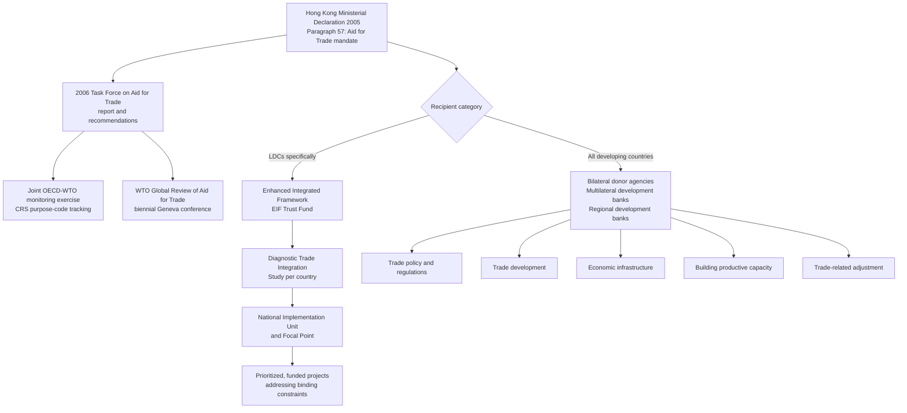

## The Aid for Trade Initiative and Trade-Related Technical Assistance

### Scope and Framing

This item covers Aid for Trade (AfT) as a distinct WTO-hosted initiative, the broader category of trade-related technical assistance (TRTA) it sits within, and the institutional mechanisms that deliver both. It addresses the origins of the initiative at the 2005 Hong Kong Ministerial Conference, its monitoring architecture (the Global Review and the OECD-WTO joint monitoring exercise), the Enhanced Integrated Framework (EIF) as the dedicated least-developed country (LDC) delivery vehicle, and the relationship between AfT and the legally binding S&DT provisions covered elsewhere in this chapter. It does not re-cover the substance of the S&DT provisions themselves, the Enabling Clause, or LDC-specific WTO exemptions, except to clarify how AfT complements rather than substitutes for them.

**Key Points**

- Aid for Trade is not a treaty obligation and creates no enforceable legal rights. It is a donor-financed, WTO-facilitated initiative to help developing and least-developed countries build the supply-side capacity and infrastructure needed to use market access and implement trade rules.
- The initiative was launched at the December 2005 Hong Kong Ministerial Conference and operationalized following the 2006 Task Force on Aid for Trade report.
- AfT is categorized by the OECD Creditor Reporting System into distinct categories: trade policy and regulations, trade development, trade-related infrastructure, building productive capacity, and trade-related adjustment.
- Monitoring runs through a joint OECD-WTO exercise, published biennially, and through the WTO's Global Review of Aid for Trade, a flagship conference held roughly every two years in Geneva.
- The Enhanced Integrated Framework (EIF) is the dedicated multi-donor mechanism for LDCs specifically, distinguishing it from AfT's broader developing-country scope.
- The relationship between AfT and legally binding S&DT is complementary but categorically different: S&DT provisions grant legal flexibility or exemption from rules, while AfT provides financing and capacity support to help countries take advantage of market access and comply with rules.

---

### Origins and Institutional Basis

#### The Doha Round Context

Recall that the Doha Development Agenda, launched in 2001, framed the round explicitly around development concerns, including the observation that many developing and least-developed Members lacked the supply-side capacity, infrastructure, and regulatory institutions to translate improved market access into actual trade. This diagnosis, sometimes summarized as the "missing middle" between negotiated market access and realized export growth, became the rationale for a financing initiative distinct from the negotiating agenda itself.

#### The Hong Kong Ministerial Declaration (2005)

Paragraph 57 of the Hong Kong Ministerial Declaration (WT/MIN(05)/DEC) requested the Director-General to create a Task Force to provide recommendations on how to operationalize Aid for Trade, and called on donors to increase and make more predictable financial contributions. The Declaration linked AfT explicitly to the round's ambition on market access, stating that Aid for Trade should complement, not substitute for, the development benefits from a successful conclusion of the negotiations.

**Defined term: Aid for Trade (AfT).** Official development assistance (ODA) and other official flows directed at helping developing countries build the trade-related infrastructure and productive capacity needed to formulate and implement trade policy, participate in trade negotiations, and expand and diversify trade, including assistance with adjustment costs from trade liberalization.

#### The 2006 Task Force Report

The WTO Director-General's Task Force on Aid for Trade issued its report in mid-2006, recommending:

- A definition of AfT organized around the categories still used today (see below);
- Enhanced monitoring, evaluation and coordination mechanisms, including at the country level through existing aid-coordination processes;
- A mandate for the WTO to convene periodic Global Reviews to assess progress and maintain political momentum;
- No new WTO institution or fund; AfT would be delivered through existing bilateral and multilateral development channels, with the WTO playing a monitoring, convening and advocacy role rather than a financing role.

**Practitioner lens.** This last point is the most consequential structural feature for a negotiator or aid official to understand: the WTO does not disburse Aid for Trade money. It has no trust fund comparable to a development bank. Its function is to track pledges and disbursements (through the OECD Creditor Reporting System), convene the donor-recipient dialogue, and maintain political visibility, while the money itself flows through bilateral aid agencies, multilateral development banks, and dedicated mechanisms such as the EIF.

---

### Categorization of Aid for Trade

The OECD Creditor Reporting System (CRS), in cooperation with the WTO, classifies AfT-relevant ODA into the following categories, which form the basis for the joint monitoring exercise.

| Category | Content | Illustrative activities |
| --- | --- | --- |
| Trade policy and regulations | Support for trade negotiations, agreement implementation, and trade-related institutional and regulatory capacity | Assistance with WTO accession, drafting SPS/TBT-compliant regulations, trade policy analysis units |
| Trade development | Support for the private sector and value chains to expand trade | Business support services, trade promotion, export diversification programmes |
| Economic infrastructure | Physical and regulatory infrastructure enabling trade | Ports, roads, energy, telecommunications relevant to trade flows |
| Building productive capacity | Support for sectors' ability to produce tradeable goods and services | Agricultural productivity programmes, industrial development, tourism sector support |
| Trade-related adjustment | Assistance with the costs of adjusting to trade liberalization | Support for firms and workers affected by tariff reduction or preference erosion |

**Defined term: Creditor Reporting System (CRS).** The OECD Development Assistance Committee's database in which donor agencies report individual aid activities, including purpose codes that allow AfT-relevant flows to be identified and aggregated across donors. Because AfT has no independent reporting mechanism, the CRS purpose-code classification is the operational definition used for all quantitative AfT monitoring.

**Practitioner lens.** Because AfT is identified through CRS purpose codes rather than through a dedicated reporting requirement, its boundaries are somewhat elastic: a donor's classification choices affect what counts as AfT in the aggregate statistics, and this has been a recurring point of methodological caution in WTO and OECD monitoring reports. [Inference: this classification sensitivity means cross-donor comparisons of AfT volumes should be read as indicative trends rather than as precisely comparable figures.]

---

### Monitoring Architecture

#### The Joint OECD-WTO Monitoring Exercise

Since 2007, the OECD and WTO have jointly produced monitoring reports, drawing primarily on the OECD CRS database supplemented by self-reporting questionnaires completed by donors, partner countries, and other stakeholders (regional organizations, the private sector). The exercise tracks:

- Aggregate AfT disbursements and commitments over time, by category and by region;
- Donor-level and recipient-level breakdowns;
- Qualitative evidence gathered through the questionnaires on how AfT is used, its perceived effectiveness, and implementation challenges.

**Defined term: commitments versus disbursements.** A *commitment* is a donor's pledge to provide a specified amount of funding for a specified activity; a *disbursement* is the actual transfer of funds. The gap between committed and disbursed AfT has been a recurring monitoring concern, since a high commitment figure does not guarantee that funds reach recipients on the announced timeline.

#### The Global Review of Aid for Trade

The WTO convenes a **Global Review of Aid for Trade**, a biennial (roughly) flagship event in Geneva bringing together WTO Members, donor agencies, multilateral development banks, the private sector, and civil society to assess the joint monitoring report's findings and set thematic priorities for the following cycle. Each Global Review has typically organized its discussion around a thematic focus. [Unverified: specific past Global Review themes and dates should be verified against the WTO's AfT webpage for precise citation, as the cycle and thematic framing have evolved over successive reviews.]

#### What the Monitoring Does and Does Not Establish

The monitoring exercise is descriptive and diagnostic. It does not create binding targets analogous to a treaty obligation, and no WTO Member is in "breach" of an AfT commitment in the legal sense that applies to, for example, a tariff binding or a subsidy discipline. The exercise's principal functions are to maintain transparency about flows, to identify gaps between pledges and delivery, and to generate evidence for the periodic political reaffirmation of the initiative at Ministerial Conferences.

---

### The Enhanced Integrated Framework (EIF): The LDC-Specific Mechanism

#### Relationship to AfT

Recall that Aid for Trade is a broad initiative covering all developing and least-developed recipients and channelled through the full range of bilateral and multilateral donors. The **Enhanced Integrated Framework (EIF)** is narrower and more institutionally concrete: it is a dedicated multi-donor trust fund and technical partnership specifically for LDCs, predating and then absorbed into the broader AfT narrative.

**Defined term: Enhanced Integrated Framework (EIF).** A multilateral partnership of LDCs, donors, and international organizations (including the WTO, UNCTAD, the International Trade Centre, the World Bank, the IMF, and UNDP among its core partner agencies) that funds and coordinates trade-related technical assistance and capacity building exclusively for LDCs, operating through a dedicated trust fund and a network of National Implementation Units and Focal Points within each beneficiary LDC.

#### Historical Development

| Period | Development |
| --- | --- |
| 1997 | The original **Integrated Framework (IF)** for Trade-Related Technical Assistance to LDCs launched, as a joint initiative of six core agencies (WTO, UNCTAD, ITC, World Bank, IMF, UNDP) |
| 2005-2006 | Following an independent evaluation identifying weaknesses in the IF's funding and delivery structure, the **Enhanced Integrated Framework** was designed as a successor, launched around 2007-2009 |
| Ongoing | The EIF operates in eligible LDCs (and recently graduated countries, for a transitional period) through **Diagnostic Trade Integration Studies (DTIS)**, which identify each country's priority trade-related constraints, followed by funded projects addressing those constraints |

**Defined term: Diagnostic Trade Integration Study (DTIS).** A country-level analytical study, produced under the EIF process, that identifies the binding constraints on a given LDC's trade competitiveness and integration into the multilateral trading system, and that forms the basis for prioritizing subsequent EIF-funded projects and for mainstreaming trade into the country's national development strategy.

**Practitioner lens.** For an LDC trade official, the EIF's DTIS is typically the entry point: it is the diagnostic document that both the country and donors use to justify and sequence project funding, and it is also frequently referenced by other agencies (including in WTO accession working parties and Trade Policy Reviews) as the authoritative statement of the country's trade-related priorities and constraints.

#### EIF Governance

The EIF is governed by a Board with representation from LDCs, donors, and the core partner agencies, and administered through an EIF Executive Secretariat, historically hosted at the WTO, with a dedicated multi-donor Trust Fund managed by a Trustee (historically the UN Office for Project Services, UNOPS, or a comparable multilateral fund administrator). [Unverified: current administrative arrangements, including trustee and secretariat hosting, should be verified against the EIF's current governance documents, as these arrangements have been subject to periodic review and restructuring.]

---

### Diagram: Institutional Architecture of AfT and the EIF

### Diagram: AfT Category Distribution (Illustrative Structure)

<svg xmlns="http://www.w3.org/2000/svg" viewBox="0 0 720 320" role="img" aria-label="Illustrative structure of Aid for Trade categories (svg_diagram)">
<title>Aid for Trade: Category Structure (svg_diagram)</title>
<rect x="0" y="0" width="720" height="320" fill="#ffffff" />
<text x="360" y="26" text-anchor="middle" font-family="Arial, sans-serif" font-size="15" font-weight="bold" fill="#1a1a1a">Aid for Trade Category Structure (svg_diagram)</text>
<rect x="30" y="55" width="320" height="90" rx="6" fill="#e8f0fa" stroke="#2b5c8a" stroke-width="1.5" />
<text x="190" y="80" text-anchor="middle" font-family="Arial, sans-serif" font-size="13" font-weight="bold" fill="#1a1a1a">Trade policy and regulations</text>
<text x="190" y="102" text-anchor="middle" font-family="Arial, sans-serif" font-size="11" fill="#1a1a1a">Negotiation support, accession assistance,</text>
<text x="190" y="118" text-anchor="middle" font-family="Arial, sans-serif" font-size="11" fill="#1a1a1a">regulatory drafting capacity</text>
<rect x="370" y="55" width="320" height="90" rx="6" fill="#e7f4e4" stroke="#3f7d32" stroke-width="1.5" />
<text x="530" y="80" text-anchor="middle" font-family="Arial, sans-serif" font-size="13" font-weight="bold" fill="#1a1a1a">Trade development</text>
<text x="530" y="102" text-anchor="middle" font-family="Arial, sans-serif" font-size="11" fill="#1a1a1a">Business support services,</text>
<text x="530" y="118" text-anchor="middle" font-family="Arial, sans-serif" font-size="11" fill="#1a1a1a">export promotion, value-chain integration</text>
<rect x="30" y="160" width="320" height="90" rx="6" fill="#fdf1d6" stroke="#b8860b" stroke-width="1.5" />
<text x="190" y="185" text-anchor="middle" font-family="Arial, sans-serif" font-size="13" font-weight="bold" fill="#1a1a1a">Economic infrastructure</text>
<text x="190" y="207" text-anchor="middle" font-family="Arial, sans-serif" font-size="11" fill="#1a1a1a">Ports, roads, energy,</text>
<text x="190" y="223" text-anchor="middle" font-family="Arial, sans-serif" font-size="11" fill="#1a1a1a">telecommunications</text>
<rect x="370" y="160" width="320" height="90" rx="6" fill="#eadcf3" stroke="#6b3f8c" stroke-width="1.5" />
<text x="530" y="185" text-anchor="middle" font-family="Arial, sans-serif" font-size="13" font-weight="bold" fill="#1a1a1a">Building productive capacity</text>
<text x="530" y="207" text-anchor="middle" font-family="Arial, sans-serif" font-size="11" fill="#1a1a1a">Agriculture, industry,</text>
<text x="530" y="223" text-anchor="middle" font-family="Arial, sans-serif" font-size="11" fill="#1a1a1a">tourism sector support</text>
<rect x="200" y="265" width="320" height="40" rx="6" fill="#fbe0dc" stroke="#a83b2e" stroke-width="1.5" />
<text x="360" y="290" text-anchor="middle" font-family="Arial, sans-serif" font-size="12" font-weight="bold" fill="#1a1a1a">Trade-related adjustment</text>
</svg>

---

### Trade Facilitation Agreement Facility: A Specialized Complement

Recall that the Trade Facilitation Agreement (TFA) uses a self-designated Category A, B and C notification system under which Category C commitments are explicitly conditional on the receipt of technical assistance and capacity-building support. The TFA created the **Trade Facilitation Agreement Facility (TFAF)** as a dedicated mechanism to help developing and least-developed Members access the assistance needed to implement Category C obligations, and to match specific needs (identified through TFA notifications) with donors able to provide targeted support.

**Defined term: needs-assistance matching.** A function performed by mechanisms such as the TFAF and, more generally, the AfT architecture, whereby a beneficiary country's specifically identified capacity gap (for example, the equipment or training needed to implement a single-window customs system) is matched with a donor or agency positioned to fund or deliver that specific support, rather than a beneficiary simply receiving general-purpose aid.

The TFAF illustrates a broader pattern: as WTO S&DT design has moved toward capacity-contingent, self-designated flexibility (the TFA Category A/B/C model, discussed in the S&DT item), the supporting technical-assistance infrastructure has become correspondingly more targeted and transactional, in contrast to the more general capacity-building envisioned in earlier AfT categories.

---

### Effectiveness Debates

**The strongest case that Aid for Trade has been effective.** AfT flows have grown substantially since the initiative's 2006 launch, and monitoring reports have documented improvements in trade-related infrastructure and institutional capacity in numerous recipient countries. The initiative's non-binding, non-institutional design was itself a deliberate choice that allowed it to be implemented quickly, without requiring a new treaty or WTO institution, and to be integrated into existing donor-country aid architecture rather than competing with it. The EIF's DTIS process has been credited with improving the evidentiary basis for trade-related development planning in LDCs, replacing ad hoc project selection with a structured diagnostic. And the initiative sustains political attention on supply-side constraints that would otherwise receive less prominence in a negotiating body focused primarily on rule-making.

**The strongest case that Aid for Trade has fallen short.** Because AfT creates no binding commitment, aggregate flows are exposed to shifts in donor-country fiscal priorities and have been affected by broader ODA volatility, including well-documented periods of ODA stagnation or decline among major donors. The commitment-disbursement gap identified in successive monitoring reports means announced pledges do not reliably translate into delivered funds on the announced timeline. Because AfT is defined through CRS purpose codes rather than a dedicated reporting obligation, monitoring is descriptive rather than accountability-generating: no mechanism analogous to WTO dispute settlement exists to test whether donor pledges were honoured. Critics have also questioned whether AfT categorization captures genuinely new and additional resources, as opposed to a relabelling of pre-existing development assistance under trade-related purpose codes. [Inference: the "additionality" critique, meaning the concern that AfT figures partly reflect reclassification rather than net new funding, has been a recurring theme in academic and civil-society commentary on AfT monitoring; its precise magnitude is methodologically difficult to establish and should be treated as a contested empirical question rather than a settled finding.]

**Assessment.** The two positions are not strictly in tension: AfT has plausibly built real capacity in specific, well-documented cases (particularly through EIF-funded DTIS-driven projects in LDCs), while simultaneously suffering from the structural weaknesses inherent in any non-binding, donor-dependent initiative operating without an enforcement mechanism. The initiative's design trade-off, speed and flexibility of implementation in exchange for the absence of legal bindingness, is the central fact a practitioner should carry into any assessment of its likely reliability for a specific country's planning purposes.

---

### Relationship to the Legally Binding S&DT Architecture

**Practitioner lens.** The distinction between AfT/TRTA and the binding S&DT provisions covered elsewhere in this chapter (transition periods, exemptions, the DFQF commitment) is a recurring point of confusion that a practitioner should be precise about:

| Feature | Binding S&DT (e.g., TRIPS Art 66.1, SCM Annex VII) | Aid for Trade / TRTA |
| --- | --- | --- |
| Legal character | Treaty obligation or exemption | Voluntary donor financing |
| Enforceability | Subject to WTO dispute settlement (where the obligation is justiciable) | Not enforceable through the DSU |
| What it delivers | Reduced or removed legal obligation | Money, technical expertise, infrastructure |
| Typical use case | A Member need not comply with a specific rule, or has longer to comply | A Member gains the institutional or physical capacity to comply with, or benefit from, the rules that do apply |
| WTO institutional role | Interpretation and, where relevant, adjudication | Monitoring, convening, and advocacy; no financing role |

A Member can hold a legal exemption without having the capacity to eventually exit it (for example, an LDC with a TRIPS transition period but no domestic capacity to legislate compliant IP law once the transition ends), which is precisely the gap AfT and TRTA are designed to close. Conversely, technical assistance without a corresponding transition period can leave a country formally obligated to comply on a timeline that does not match the realistic delivery schedule of the assistance itself, a mismatch the TFA's Category C design was specifically constructed to avoid by making the obligation's timing contingent on the assistance's actual delivery.

---

### Worked Example: Sequencing AfT and S&DT for a Hypothetical LDC

**Example**

An LDC has designated a customs modernization provision under the TFA as Category C, meaning implementation is conditional on receiving technical assistance and capacity-building support.

**Step 1: Identify the specific capacity gap.** Through its TFA notification process (and potentially informed by its EIF-funded DTIS, if the customs gap was identified as a binding constraint), the country specifies what is needed: for example, software for an electronic single-window system, staff training, and physical infrastructure at a specific border post.

**Step 2: Route the request through the appropriate mechanism.** The country may seek support through the TFAF (for TFA-specific needs-matching), through bilateral donor programmes reporting under AfT trade-policy-and-regulations or economic-infrastructure categories, or through EIF-funded follow-up projects if the constraint was identified in the DTIS.

**Step 3: Distinguish the legal and financing tracks.** The TFA Category C designation itself is the legal instrument suspending the compliance obligation; the AfT/EIF/TFAF channels are the financing and delivery instruments that, once successful, are expected to trigger the country's transition from "assistance pending" to "implementation achieved," at which point the TFA obligation becomes operative on the country's own notified timeline.

**Step 4: Monitor for delivery gaps.** If pledged assistance is delayed or under-disbursed (the commitment-disbursement gap discussed above), the country retains its Category C flexibility, since the TFA's design ties the obligation's timing to actual capacity acquisition rather than to a fixed calendar date, but the delay itself is a monitoring and advocacy matter, not one with a dispute-settlement remedy against the donor.

**Output**

The example illustrates the functional division of labour: the WTO's S&DT architecture supplies the legal flexibility (Category C conditionality), while the AfT/EIF/TFAF ecosystem supplies the practical means for the country to eventually operate without that flexibility, with the country's own notification and reporting obligations serving as the accountability link between the two tracks.

---

### Practitioner Checklist

| Question | Reference point |
| --- | --- |
| Does the assistance sought fall within an existing legal flexibility (e.g., TFA Category C), or is it a stand-alone capacity request? | TFA Section II; agreement-specific technical assistance clauses |
| Is the recipient an LDC (eligible for EIF) or a developing country more broadly (AfT generally)? | UN LDC list; EIF eligibility criteria |
| Has a DTIS been completed, and does it identify this specific constraint as a priority? | EIF process documents |
| Which AfT category does the activity fall under, for monitoring and donor-matching purposes? | OECD CRS purpose codes |
| Is the request routed through the TFAF, EIF, a bilateral donor, or a multilateral development bank? | Institutional mapping above |
| What is the gap, if any, between the donor's committed and disbursed funding for this activity? | OECD-WTO joint monitoring report |
| Does the legal obligation's timing depend on actual receipt of assistance, or on a fixed calendar date? | Specific agreement text (contrast TFA Category C with, e.g., a dated TRIPS transition) |

---

### Conclusion

Aid for Trade and trade-related technical assistance form the financing and capacity-building complement to the WTO's legal S&DT architecture, but the two operate on fundamentally different bases: S&DT provisions are treaty text, interpretable and in some cases enforceable through dispute settlement, while AfT is a voluntary, donor-financed initiative that the WTO monitors and convenes but does not fund or legally guarantee. Since its 2005 Hong Kong launch, the initiative has developed a substantial monitoring architecture, the joint OECD-WTO exercise and the biennial Global Review, alongside a dedicated LDC-specific delivery mechanism in the Enhanced Integrated Framework and a targeted needs-matching facility in the TFA Facility. Its practical value to any given recipient depends heavily on the reliability of donor delivery, a variable outside the WTO's direct control, which is the central limitation a practitioner should weigh when relying on AfT or TRTA as the operational bridge between a legal flexibility and eventual full compliance.

---

### Related Topics

- Special and differential treatment provisions across the WTO agreement architecture
- Least-developed country exemptions, transition periods, and duty-free quota-free access
- The Trade Facilitation Agreement's Category A, B and C notification system and the TFA Facility
- The Enhanced Integrated Framework governance structure and Diagnostic Trade Integration Studies
- LDC accession guidelines and the role of technical assistance in accession negotiations
- The OECD Creditor Reporting System and ODA classification methodology
- TRIPS Article 66.2 and the technology-transfer incentive obligation for developed Members
- The Standards and Trade Development Facility (STDF) as a sector-specific technical assistance mechanism for SPS compliance
- Regional development banks' role in trade-related infrastructure financing
- The Doha Programme of Action for LDCs 2022-2031 and its trade and capacity-building chapter