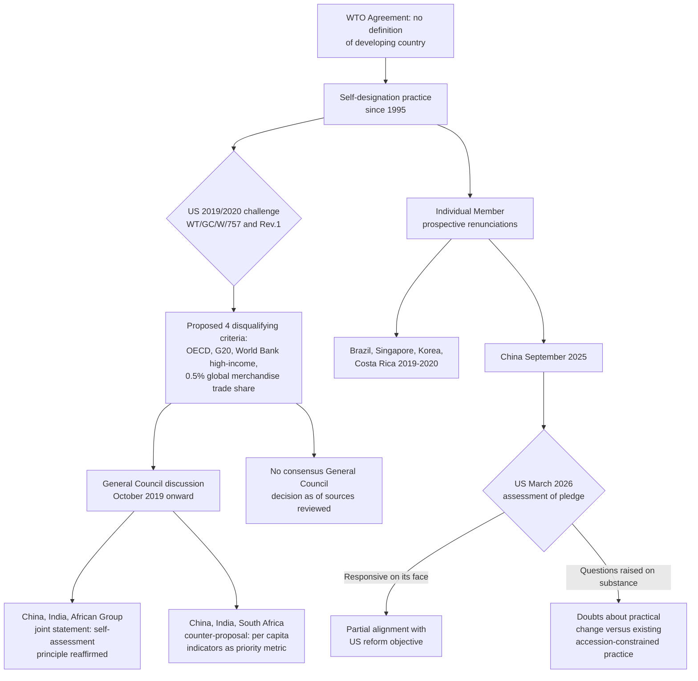

## The Self-Designation Debate Over Developing-Country Status

### Scope and Framing

This item covers the institutional and legal controversy over the WTO's practice of allowing Members to declare their own developing-country status, with no objective criteria, verification process, or graduation mechanism outside the least-developed country (LDC) category. It addresses the legal basis (or absence of one) for self-designation, the 2019-2020 United States challenge and its 2025-2026 follow-through, the responses from China, India, South Africa and other Members, the individual Member announcements renouncing future special and differential treatment (S&DT) claims without relinquishing status, and the structural effect of the impasse on WTO negotiating dynamics. It does not re-cover the substantive content of S&DT provisions or the Enabling Clause's GSP mechanics, which are addressed elsewhere in this chapter, except as needed to frame the stakes of the status debate itself.

**Key Points**

- The WTO Agreement contains no definition of "developing country" and no criteria or verification process for the designation, in contrast to LDC status, which follows UN Committee for Development Policy (CDP) criteria.
- The United States formally challenged this practice in a February 2019 communication (WT/GC/W/757) and a revised version (WT/GC/W/757/Rev.1, January 2020), proposing four disqualifying criteria: OECD membership, G20 membership, World Bank "high income" classification, or a 0.5 percent or greater share of global merchandise trade.
- Between 2019 and 2020, Brazil, Singapore, Korea and Costa Rica announced they would forgo future S&DT claims while retaining self-declared developing-country status; China made a comparable announcement in September 2025.
- China, India, South Africa and the WTO African Group issued a joint rebuttal reaffirming the principle that "developing countries must be allowed to make their own assessments regarding their own developing country status."
- As of March 2026, the United States had issued a further reform communication proposing a General Council Decision establishing four categories of Members that would not avail themselves of S&DT, and had raised specific doubts about whether China's September 2025 pledge substantively changes its negotiating posture.
- The debate is widely regarded as a structural cause of negotiating gridlock, because it prevents Members from calibrating the ambition of new disciplines to the actual capacity or competitiveness of the Member seeking flexibility.

---

### Legal Basis: The Absence of a Definition

#### No Textual Criteria

Recall that the Marrakesh Agreement Establishing the WTO and its annexed agreements refer extensively to "developing country Members" and "least-developed country Members" without defining the former term. **Defined term: self-designation (WTO practice).** The practice by which a WTO Member unilaterally declares itself a developing country for purposes of claiming S&DT provisions, without external verification, formal WTO approval, or an established set of criteria, distinguished from LDC status, which is externally determined by the UN.

This absence is not an oversight; it reflects the GATT-era practice under Part IV and the Enabling Clause, where "developing country" was treated as a political and self-referential category rather than a technical classification. The WTO inherited this practice at its founding in 1995 and has never revisited it through a General Council decision or an amendment.

#### Contrast with Other International Institutions

Unlike the WTO, the World Bank classifies economies by income group (low-income, lower-middle-income, upper-middle-income, high-income) using GNI per capita thresholds updated annually; the IMF distinguishes "advanced economies" from "emerging market and developing economies" using a broader composite methodology; and the UN designates LDCs using the CDP's three-criteria review. **Defined term: analytic classification system.** A methodology, typically involving quantifiable economic and social indicators applied by an independent body, for sorting countries into development categories, of the kind the World Bank, IMF and UN each maintain and the WTO does not.

#### Practical Consequence

Because there is no WTO verification step, a Member's self-declaration is not subject to challenge in the ordinary WTO institutional process, though it can be tested indirectly. In accession negotiations, an acceding Member's developing-country status and the S&DT it will receive are negotiated bilaterally and reflected in its accession protocol, giving existing Members leverage over a new Member's status even though no such leverage exists over an already-acceding Member's later self-declaration in subsequent negotiations. **Defined term: accession protocol.** The negotiated legal instrument governing a new Member's terms of WTO membership, which can include Member-specific commitments (including "WTO-plus" obligations exceeding standard Uruguay Round commitments) that in practice narrow the S&DT a newly acceded Member can claim, independent of its self-declared developing-country label.

**Practitioner lens.** For a negotiator assessing whether a specific Member's S&DT claim is contestable, the accession protocol is the more concrete instrument to examine than the abstract self-declaration, particularly for Members that acceded after 1995 (including China, in 2001) under protocols containing negotiated, Member-specific limitations on S&DT eligibility.

---

### The United States Challenge

#### The 2019 Communication

On 16 January 2019, the United States circulated a communication (published as WT/GC/W/757, 15 February 2019, and revised as WT/GC/W/757/Rev.1 on 24 February 2020), titled "An Undifferentiated WTO: Self-Declared Development Status Risks Institutional Irrelevance." Its core arguments:

- The WTO's binary developed/developing construct has not been revisited since 1995, despite substantial economic change among self-declared developing Members.
- Self-declaration allows "export powerhouses and other relatively advanced Members" to claim the same flexibilities as much smaller, poorer Members, which the communication argued creates asymmetries that keep negotiating ambition too weak to sustain viable outcomes.
- Because Members cannot differentiate among developing-country claimants, every negotiation becomes, in the communication's words, "a negotiation about setting high standards for a few, and allowing vast flexibilities or exemptions for the many."
- Self-declaration dilutes the benefit that LDCs and Members with genuine, narrowly tailored needs could otherwise enjoy from S&DT calibrated to those needs.

#### The Proposed Four Categories

The communication proposed that the General Council adopt a decision precluding a Member from invoking S&DT in current and future WTO negotiations if the Member falls into at least one of four categories:

| Category | Threshold |
| --- | --- |
| OECD membership | Current member or acceding member of the OECD |
| G20 membership | Member of the G20 |
| World Bank income classification | Classified as "high income" by the World Bank |
| Global trade share | Accounts for no less than 0.5 percent of global merchandise trade (imports and exports) |

**Practitioner lens.** The criteria are notable for what they omit: none directly measures GNI per capita, human development, or structural vulnerability, the kinds of indicators used in the UN's LDC methodology. The proposal instead measures aggregate economic weight and international-institutional membership, a choice critics have used to argue that the criteria conflate national economic scale with the absence of development need, since a country can have very large aggregate trade or GDP while retaining a low per capita income and substantial internal inequality or structural vulnerability.

#### The March 2026 Follow-Through

The USTR's March 2026 communication, "Further Perspectives on WTO Reform," reiterated the case for the four-category approach and drew on parallel critiques from the European Union and the United Kingdom. The communication noted that the EU had observed that self-declared developing Members' "growth of their relative weight in global trade" over three decades had not been matched by institutional adaptation, and that the UK had noted that more than 75 percent of WTO Members have access to S&DT, a proportion the UK report argued undermines the organization's credibility. [Unverified: precise wording of the EU and UK reports referenced in the USTR communication should be confirmed against the primary EU and UK texts.]

The March 2026 communication specifically scrutinized China's September 2025 announcement (discussed below), noting that on its face the announcement appeared "responsive" to the US reform proposal but that "a closer examination raises questions about China's pledge." [Unverified: the specific substance of the US's doubts, beyond the characterization in the communication, should be verified against the full text of the March 2026 document for precise citation.]

---

### Responses: The Defence of Self-Declaration

#### The Joint Statement of China, India and the African Group

In advance of an October 2019 General Council meeting where the US proposal was discussed, China, India and the WTO African Group issued a joint statement reaffirming existing S&DT principles, including that "developing countries must be allowed to make their own assessments regarding their own developing country status." The statement framed self-declaration as a foundational element of the WTO's development architecture rather than an anomaly to be corrected.

#### The China-India-South Africa Counter-Proposal

In response to the US's four-category approach, China, India, South Africa and other co-sponsors submitted a counter-proposal reiterating that self-declaration is appropriate within the WTO context, while emphasizing that **per capita indicators** should be given priority in any assessment of development levels, implicitly rejecting the US proposal's reliance on aggregate trade share, G20 membership, and OECD membership, none of which is a per capita measure.

**The strongest case for retaining self-declaration.**

1. *No workable objective alternative exists.* Any criteria-based system requires choosing among competing indicators (aggregate GDP, GNI per capita, human development, structural vulnerability, trade share), each of which produces different and contestable classifications; the US proposal's own critics note it would exclude countries such as India, Indonesia and Vietnam from self-declaring despite their being "certainly developing countries" by most conventional measures, illustrating the difficulty of drawing a clean, universally accepted line.
2. *Sovereignty and political legitimacy.* Uruguay Round Members accepted binding obligations on the understanding that development status determinations would remain within each Member's own judgment; changing this retroactively alters the bargain under which existing commitments were made.
3. *Aggregate measures mask internal disparity.* A large aggregate economy or trade share can coexist with substantial internal poverty, regional inequality, and per capita income far below developed-country levels; per capita indicators, the counter-proposal argues, better capture genuine development need than trade share or G20 membership.
4. *Case-by-case pragmatism already occurs.* Even without formal graduation, self-declared developing Members routinely accept negotiated limits on their S&DT in specific contexts (as China's 2001 accession protocol illustrates), so the system already produces differentiated outcomes through negotiation rather than a rigid external classification.

**The strongest case for reform.**

1. *Negotiating paralysis.* The US, EU and UK positions converge on the empirical claim that with more than three-quarters of the WTO membership eligible for S&DT, negotiators cannot build the kind of differentiated, reciprocal trade-offs that produced earlier GATT rounds, because near-universal eligibility for flexibility removes the incentive structure that reciprocal bargaining depends on.
2. *Dilution of LDC-specific benefit.* When S&DT flexibilities in a new agreement are available to the vast majority of the membership rather than targeted at the neediest Members, the practical value of the flexibility to a genuinely vulnerable LDC or small economy is diminished, because the flexibility no longer functions as meaningfully differentiated treatment.
3. *Fisheries Subsidies precedent as cautionary tale.* Critics of the status quo have pointed to the Doha agriculture negotiations and the run-up to the Fisheries Subsidies Agreement as cases where broad, undifferentiated developing-country exemptions from proposed disciplines threatened to undermine the substantive effectiveness of the rules being negotiated, since disciplines aimed at overfishing or trade-distorting subsidies are ineffective if the world's largest fishing nations or subsidizers can exempt themselves by self-declaration.
4. *Institutional credibility.* A system in which "a group of self-declared developing countries" (in the words of one US ambassador's 2019 remarks) includes some of the world's largest economies and exporters is difficult to reconcile publicly with the WTO's founding rationale for S&DT, namely addressing the needs of the genuinely disadvantaged.

**Assessment.** The empirical premise, that self-declaration eligibility is extremely broad relative to genuine development need by most conventional metrics, is not seriously disputed by either side; the disagreement is over remedy. The US-EU-UK position favours an externally imposed, criteria-based exclusion; the China-India-South Africa position favours retaining self-declaration while allowing per capita and needs-based differentiation to occur within individual negotiations. Neither side disputes that LDC status, which already uses objective UN criteria, should remain untouched. The practical stalemate since 2019 suggests that a General Council decision imposing an external classification system is unlikely absent consensus, which the objecting Members have shown no willingness to provide.

---

### Individual Member Announcements: Renunciation Without Reclassification

A distinct and more incremental development track has emerged alongside the unresolved criteria debate: several Members have individually announced they will not seek new S&DT in current or future WTO negotiations, while explicitly and simultaneously retaining their self-declared developing-country status and their existing S&DT entitlements.

| Member | Announcement | Retained status |
| --- | --- | --- |
| Brazil | 2019, in the context of an understanding with the United States | Retained self-declared developing-country status |
| Singapore | 2019 | Retained self-declared developing-country status |
| Korea | October 2019; Finance Minister Hong Nam-ki stated the decision was "not to forego the developing country status, but is to not seek any special treatment from the negotiations going forward" | Retained self-declared developing-country status |
| Costa Rica | Between March 2019 and March 2020 | Retained self-declared developing-country status |
| China | September 2025; stated it would not seek new S&DT in current and future WTO negotiations | Explicitly retained developing-country status; a Chinese official (Cui Fan, University of International Business and Economics) stated the decision "will not alter China's developing-country status, which is affirmed by both the WTO's self-designation mechanism and its accession protocol," citing continued lower per capita GDP relative to developed Members |

**Defined term: prospective renunciation.** An announcement by a Member that it will decline to invoke S&DT in negotiations going forward, without retroactively relinquishing S&DT already secured in prior agreements (for example, transition periods or exemptions already incorporated into existing commitments) and without formally renouncing the underlying developing-country classification itself.

#### China's Announcement and Its Interpretation

China's September 2025 announcement was widely read as at least partially responsive to the sustained US pressure documented above. Commentary distinguishes two readings:

**Reading one: substantive concession.** The announcement removes China's ability to claim new S&DT flexibilities in ongoing and future negotiations, which is a meaningful practical constraint given China's role as a major party in numerous active or prospective negotiating tracks (for example, further disciplines beyond the Fisheries Subsidies Agreement, e-commerce rules, or investment facilitation extensions).

**Reading two: limited practical effect.** Analysts have noted that China's WTO accession concessions (2001) already substantially narrowed the practical S&DT China could claim, citing that China's bound industrial tariffs (around 9.5 percent, versus the roughly 31.4 percent baseline sometimes cited for comparison) and agricultural tariffs (around 15.1 percent, versus roughly 37.9 percent) reflect accession-negotiated commitments closer to developed-Member norms than to typical S&DT-benefiting Members, suggesting the 2025 pledge formalizes a posture China had substantially already adopted in practice rather than representing a large new concession. [Unverified: the specific tariff figures cited in commentary should be verified against China's actual WTO accession schedules for precise use, and the characterization of "little real benefit" is an evaluative claim from secondary commentary rather than an official WTO or Chinese government position.]

**Practitioner lens.** The US March 2026 communication's expressed skepticism toward China's pledge, that "a closer examination raises questions" about it, reflects the second reading: from a US negotiating perspective, a prospective renunciation that does not alter the underlying self-declared status, and that may not represent a substantial departure from a country's existing accession-constrained practice, does not resolve the structural objection to self-declaration as a category. For a negotiator, the operative lesson is that these announcements should be read narrowly: they are country-specific, forward-looking, and do not create a legal precedent binding other Members, nor do they answer the criteria-based reform question the US proposal raises.

---

### Diagram: The Self-Designation Debate Structure

### Diagram: Comparative Positions on Development Status Criteria

<svg xmlns="http://www.w3.org/2000/svg" viewBox="0 0 740 340" role="img" aria-label="Comparative positions in the self-designation debate (svg_diagram)">
<title>Self-Designation Debate: Comparative Positions (svg_diagram)</title>
<rect x="0" y="0" width="740" height="340" fill="#ffffff" />
<text x="370" y="26" text-anchor="middle" font-family="Arial, sans-serif" font-size="15" font-weight="bold" fill="#1a1a1a">Self-Designation Debate: Comparative Positions (svg_diagram)</text>
<rect x="30" y="55" width="330" height="255" rx="8" fill="#e8f0fa" stroke="#2b5c8a" stroke-width="1.5" />
<text x="195" y="82" text-anchor="middle" font-family="Arial, sans-serif" font-size="13" font-weight="bold" fill="#1a1a1a">US / EU / UK Position</text>
<text x="195" y="110" text-anchor="middle" font-family="Arial, sans-serif" font-size="11" fill="#1a1a1a">Criteria: OECD membership,</text>
<text x="195" y="126" text-anchor="middle" font-family="Arial, sans-serif" font-size="11" fill="#1a1a1a">G20 membership, World Bank</text>
<text x="195" y="142" text-anchor="middle" font-family="Arial, sans-serif" font-size="11" fill="#1a1a1a">high-income, 0.5% trade share</text>
<text x="195" y="174" text-anchor="middle" font-family="Arial, sans-serif" font-size="11" fill="#1a1a1a">Measures: aggregate economic</text>
<text x="195" y="190" text-anchor="middle" font-family="Arial, sans-serif" font-size="11" fill="#1a1a1a">weight and institutional status</text>
<text x="195" y="222" text-anchor="middle" font-family="Arial, sans-serif" font-size="11" fill="#1a1a1a">Goal: exclude advanced</text>
<text x="195" y="238" text-anchor="middle" font-family="Arial, sans-serif" font-size="11" fill="#1a1a1a">economies from new S&amp;DT</text>
<text x="195" y="270" text-anchor="middle" font-family="Arial, sans-serif" font-size="11" font-weight="bold" fill="#1a1a1a">Preserve negotiating ambition</text>
<text x="195" y="286" text-anchor="middle" font-family="Arial, sans-serif" font-size="11" font-weight="bold" fill="#1a1a1a">and LDC-specific benefit</text>
<rect x="380" y="55" width="330" height="255" rx="8" fill="#e7f4e4" stroke="#3f7d32" stroke-width="1.5" />
<text x="545" y="82" text-anchor="middle" font-family="Arial, sans-serif" font-size="13" font-weight="bold" fill="#1a1a1a">China / India / South Africa Position</text>
<text x="545" y="110" text-anchor="middle" font-family="Arial, sans-serif" font-size="11" fill="#1a1a1a">Criteria: none externally</text>
<text x="545" y="126" text-anchor="middle" font-family="Arial, sans-serif" font-size="11" fill="#1a1a1a">imposed; self-assessment</text>
<text x="545" y="142" text-anchor="middle" font-family="Arial, sans-serif" font-size="11" fill="#1a1a1a">retained as principle</text>
<text x="545" y="174" text-anchor="middle" font-family="Arial, sans-serif" font-size="11" fill="#1a1a1a">Measures: per capita</text>
<text x="545" y="190" text-anchor="middle" font-family="Arial, sans-serif" font-size="11" fill="#1a1a1a">indicators prioritized</text>
<text x="545" y="222" text-anchor="middle" font-family="Arial, sans-serif" font-size="11" fill="#1a1a1a">Goal: preserve sovereign</text>
<text x="545" y="238" text-anchor="middle" font-family="Arial, sans-serif" font-size="11" fill="#1a1a1a">judgment over status</text>
<text x="545" y="270" text-anchor="middle" font-family="Arial, sans-serif" font-size="11" font-weight="bold" fill="#1a1a1a">Avoid arbitrary aggregate-</text>
<text x="545" y="286" text-anchor="middle" font-family="Arial, sans-serif" font-size="11" font-weight="bold" fill="#1a1a1a">metric exclusion</text>
</svg>

---

### Effects on Specific Negotiations

**Fisheries Subsidies Agreement.** Recall that the Agreement on Fisheries Subsidies (adopted June 2022) confines LDC exemptions to UN-designated LDCs and uses need-based, functional criteria (an exclusive economic zone carve-out and a transitional period for developing Members generally) rather than a blanket self-declared-developing-country exemption from the core prohibitions. This design is a direct product of the self-designation controversy: negotiators structured the disciplines to apply to major fishing nations regardless of self-declared status, precisely to avoid the outcome critics of self-declaration warned against, namely that the world's largest subsidizers could exempt themselves and hollow out the agreement's substantive effect.

**Investment Facilitation for Development Agreement (IFDA).** The IFDA's category system (Category A, B, C, modelled on the Trade Facilitation Agreement) similarly ties flexibility to self-designated categorization by the developing-country Party itself, rather than to an externally verified need, illustrating that the self-designation practice persists in the design of even the most recent plurilateral instruments, notwithstanding the ongoing criteria debate at the systemic level.

**Doha Round legacy.** The communication history reviewed above notes that flexibilities proposed in the Doha agriculture text, which would have granted all self-declared developing Members exemption from a new commitment rather than a smaller cut or longer implementation period, were rejected at the time but that the 2013 Bali agriculture outcomes were, in critics' view, the first instance in which Members agreed to use undifferentiated development status to exempt the entire self-declared developing-country group from a new commitment rather than requiring a calibrated, lesser obligation. [Inference: this characterization reflects a critical perspective found in the reform-advocacy literature rather than a universally accepted account of the Bali outcome's design rationale.]

---

### Worked Example: Assessing a Member's Negotiating Position

**Example**

A trade negotiator preparing for a plurilateral negotiation needs to assess how a specific counterpart Member, "Country X," a self-declared developing country with a G20 seat and a global merchandise trade share above 1 percent, is likely to position itself on new disciplines.

**Step 1: Confirm self-declared status and accession-protocol constraints.** Verify whether Country X's WTO accession protocol (if it acceded after 1995) contains Member-specific limitations on S&DT eligibility that already narrow its practical flexibility, independent of the general self-declaration debate.

**Step 2: Check for a prospective renunciation announcement.** Determine whether Country X has made a Korea/Brazil/China-style announcement forgoing new S&DT claims. If so, its negotiating position on new disciplines may already assume higher-ambition commitments, even though its formal status is unchanged.

**Step 3: Map Country X's classification against the US four-category proposal.** If Country X meets one or more of the OECD, G20, World Bank high-income, or 0.5 percent trade-share thresholds, expect the US (and likely the EU and UK) to resist any S&DT claim by Country X in the specific negotiation, regardless of the general systemic impasse.

**Step 4: Anticipate the coalition dynamic.** If Country X is aligned with the China-India-South Africa position, expect it to resist any negotiated text that embeds objective, externally imposed criteria for development status, even where it might individually be willing to forgo specific flexibilities on a voluntary, prospective basis.

**Output**

The negotiator concludes that Country X's formal self-declared status will not itself predict its negotiating behaviour; the more informative indicators are its accession-protocol constraints, any prospective-renunciation announcements, and its coalition alignment on the criteria question, each of which may point in different directions on any given issue.

---

### Practitioner Checklist

| Question | Reference point |
| --- | --- |
| Does the Member in question have LDC status (UN-determined) or self-declared developing status? | UN CDP list vs. WTO self-declaration |
| Does the Member's accession protocol impose Member-specific S&DT limitations? | Individual accession protocol text |
| Has the Member made a prospective renunciation of future S&DT claims? | Individual Member announcements (Brazil, Singapore, Korea, Costa Rica, China) |
| Does the Member meet one or more of the US four-category criteria (OECD, G20, World Bank high income, 0.5% trade share)? | WT/GC/W/757/Rev.1 |
| Is the specific negotiation using need-based, functional criteria (as in the Fisheries Subsidies Agreement) rather than blanket self-declared status? | Text of the specific agreement under negotiation |
| Which coalition has the Member aligned with on the criteria debate? | Joint statements (China-India-African Group; China-India-South Africa counter-proposal) |
| Has a General Council decision been adopted on this question? | General Council records; as of sources reviewed, no consensus decision had been reached |

---

### Conclusion

The self-designation debate is not a dispute over the text of any single WTO agreement but over an absence: the WTO has never defined "developing country," and the political consensus needed to define it, whether through the US's proposed aggregate-metric criteria or an alternative per capita-based standard favoured by China, India and South Africa, has not emerged since the United States raised the issue formally in 2019. The practical effect has been a partial, Member-by-member workaround: several Members, most consequentially China in September 2025, have prospectively renounced new S&DT claims while explicitly retaining their self-declared status, a move that partially addresses the ambition-level concern in specific negotiations without resolving the systemic classification question the US, EU and UK continue to press. Newer instruments, including the Fisheries Subsidies Agreement and the Investment Facilitation for Development Agreement, illustrate two different institutional responses: the former shifted toward need-based, functional criteria to prevent self-declaration from hollowing out substantive disciplines, while the latter continues to rely on self-designated categorization for its S&DT design. For a practitioner, the operative reality is that the debate will likely continue to be managed negotiation-by-negotiation and Member-by-member rather than resolved through a single systemic reform, absent a consensus this chapter's underlying dynamics show no current sign of producing.

---

### Related Topics

- Special and differential treatment provisions across the WTO agreement architecture
- Least-developed country exemptions, transition periods, and duty-free quota-free access
- The Enabling Clause and the Generalized System of Preferences
- China's WTO accession protocol and its negotiated departures from standard developing-country treatment
- The Agreement on Fisheries Subsidies and its need-based, functional design for developing-country flexibilities
- The Investment Facilitation for Development Agreement's self-designated category system
- WTO General Council decision-making and the consensus requirement
- The Trade Facilitation Agreement's Category A, B and C model as a template for capacity-contingent flexibility
- G20 and OECD membership as proxies in international economic classification debates
- The Doha Round agriculture negotiations and the 2013 Bali Ministerial outcomes