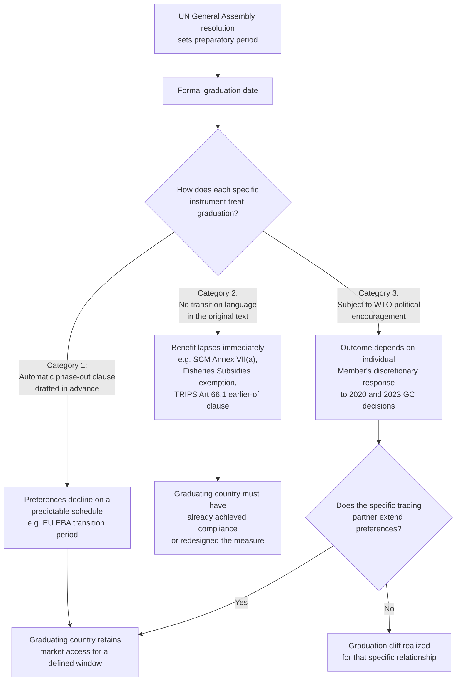

## LDC Graduation and the Phase-Out of Preferential Treatment Eligibility

### Scope and Framing

This item covers what happens legally and practically when a country exits the UN least-developed country (LDC) category, with the focus on the phase-out and transition mechanisms designed to soften that exit, as distinct from the graduation process itself or the substantive content of LDC-specific treatment. It addresses the structure of the "graduation cliff" problem, the specific phase-out timelines built into individual instruments (GATS Article IV waiver practice, TRIPS Article 66.1, the DFQF schemes of major markets), the 2020 and 2023 WTO decisions on smooth transition, and how graduating LDCs sequence their exit strategy across multiple, uncoordinated preference regimes. It assumes familiarity with, and does not re-derive, the UN CDP graduation criteria, the substantive LDC-specific exemptions, or the DFQF commitment's design, treating each with only the concise refresher needed to build on it.

**Key Points**

- Graduation from the UN LDC list is a single administrative event, but a graduating country holds LDC-conditioned benefits across dozens of uncoordinated instruments, national schemes, and multilateral provisions, each with its own rule for what happens at graduation.
- Some instruments phase out automatically over a fixed period after graduation (for example, the EU's GSP/EBA transition arrangement); others lapse immediately unless the country separately qualifies under a different mechanism; and still others (WTO-level legal exemptions) simply cease to apply by their own terms once LDC status ends, absent a specific extension decision.
- The WTO's own empirical assessment found the aggregate trade impact of graduation to be limited for most graduates, but concentrated in specific sectors, particularly clothing, footwear and fish products, in a small number of destination markets.
- The 2020 WTO General Council decision on LDC graduation and the 2023 decision on extension of support measures are the two principal multilateral responses, both encouraging rather than mandating transition arrangements.
- Because phase-out design is fragmented across national legislatures and international instruments, a graduating LDC's effective exposure depends less on any single WTO rule than on the specific transition provisions (or their absence) in each of its major trading partners' preference schemes.

---

### The Structural Problem: Graduation as a Single Event, Dispersed Consequences

Recall that graduation is a UN General Assembly act, occurring after the CDP recommends removal from the LDC list (based on the GNI per capita, Human Assets Index and Economic and Environmental Vulnerability Index criteria) and after a preparatory period, normally three years and extendable, set by the General Assembly resolution. **Defined term: preparatory period.** The interval between a General Assembly resolution confirming a country's eligibility to graduate and the country's actual removal from the LDC list, during which the country and its development partners are expected to plan for the transition, including negotiating any extended preferential arrangements.

The structural difficulty is that LDC-conditioned treatment is not consolidated in one place. It is scattered across:

- Multilateral WTO legal text (TRIPS Article 66.1, SCM Annex VII(a), the Fisheries Subsidies Agreement exemption, TFA LDC-specific timelines);
- Multilateral WTO Ministerial or General Council decisions (the DFQF commitment under the Hong Kong Declaration, the LDC Services Waiver);
- National unilateral preference legislation (the EU's Everything But Arms, historically distinct US, Japanese, Canadian and other schemes), each independently drafted and independently amendable by the granting Member;
- Regional and bilateral instruments that reference LDC status as an eligibility trigger.

**Defined term: graduation cliff.** The risk that LDC-conditioned treatment lapses abruptly, rather than gradually, at the moment of formal UN graduation, because most instruments are drafted to apply "to LDCs" by reference to current status rather than by a fixed list or a scheduled phase-out. Where an instrument contains no explicit transition clause, its default behaviour is to stop applying immediately, creating a potential one-time shock to the graduating country's market access, legal flexibility, or compliance timeline, independent of whether the country's underlying economic capacity has changed enough to absorb that shock.

Because each instrument's default behaviour differs, and because no single body coordinates the timing or terms of phase-out across all of them, a graduating country faces a portfolio problem: it must separately identify, negotiate, and monitor the phase-out terms of every LDC-conditioned benefit it currently relies on.

---

### Category 1: Instruments That Phase Out Automatically

#### The EU's Transition Arrangement

The EU's GSP framework has historically built a transition period directly into its regulation, so that a graduating LDC does not lose Everything But Arms (EBA) treatment on the day of UN graduation. Under the EU's practice, a graduating country typically retains EBA-equivalent treatment for a defined period (commonly framed as three years from the effective date of graduation) before shifting to whatever tier of the standard EU GSP scheme (standard GSP, or GSP+, if it separately qualifies and ratifies the required conventions) it is otherwise eligible for, or to MFN treatment if no scheme applies. [Unverified: the precise duration and mechanics should be verified against the specific EU GSP Regulation in force at the time of a given country's graduation, since the regulation is periodically revised and its transition terms have not necessarily remained constant across revisions.]

**Practitioner lens.** For a country approaching graduation, the EU's built-in transition period is the most favourable model in the current landscape, precisely because it is codified in the granting Member's own legislation rather than dependent on a case-by-case political decision at the time of graduation. A negotiator should confirm the transition period's exact length and conditions well before the preparatory period ends, since the regulation's terms can change between the time a country enters its preparatory period and the time it actually graduates.

#### Structural Feature: Automatic Versus Discretionary Phase-Out

**Defined term: automatic phase-out clause.** A provision, written into a granting Member's preference legislation in advance of any specific country's graduation, that specifies a defined transition period and its terms, such that a graduating country's preferential treatment declines on a predictable schedule without requiring a fresh political decision at the moment of graduation. This is distinguished from a **discretionary transition**, where the granting Member retains the legal power to extend preferences upon graduation but has made no advance commitment to do so, leaving the outcome dependent on a decision taken (or not taken) at the time.

Only a subset of major markets' preference schemes have historically contained automatic phase-out clauses of this kind. Where a scheme does not, the graduating country's continued preferential access depends on that Member's willingness to act, which is precisely the gap the WTO's 2020 and 2023 decisions (below) were designed to address through political encouragement, since the WTO itself cannot compel a Member's unilateral scheme design.

---

### Category 2: Instruments That Lapse by Their Own Terms

#### WTO Legal Provisions Tied Directly to LDC Status

Several of the most consequential LDC-specific legal provisions are drafted to apply "to LDC Members" without any graduation-transition language in the original text, meaning their default legal effect, absent a specific extension decision, is to cease applying at the moment of formal graduation.

| Provision | Default behaviour absent a specific extension |
| --- | --- |
| SCM Agreement Article 27.2(a) and Annex VII(a) export-subsidy exemption | Ceases to apply upon graduation, since the exemption is textually tied to LDC (or Annex VII(b) income-threshold) status |
| Fisheries Subsidies Agreement LDC exemption from core prohibitions | Ceases to apply upon graduation, on the same textual logic |
| TFA LDC-specific implementation timelines and dispute-settlement grace period | Longer LDC-specific periods (for example, the six-year dispute-settlement grace period) are tied to LDC status at the relevant reference point in the TFA's own terms; a graduating Member's ongoing implementation schedule requires case-specific reading of the TFA's provisions to determine whether category designations already made remain locked in |
| GATS Article IV:3 priority language | Best-endeavour in character in any event, so graduation removes an already-weak claim on other Members' conduct rather than a binding right |

**Practitioner lens.** For these provisions, there is no automatic phase-out to plan around; the exemption or accelerated timeline simply ends. A graduating Member relying on, for example, the SCM Annex VII(a) exemption for an existing export-subsidy programme should treat graduation as a hard deadline for either winding down the programme or securing WTO-consistent redesign, since no multilateral WTO decision has created a general transitional grace period for this category of binding legal exemption. [Inference: this is the logical consequence of the textual structure of these provisions; whether any Member has in practice negotiated an ad hoc extension for a specific graduating country in a specific case would need to be verified against Committee records for that Member.]

#### TRIPS Article 66.1: A Partial Exception

Recall that TRIPS Article 66.1 provides LDC Members a renewable transition period from most TRIPS obligations, and that the Council for TRIPS has extended this general transition (to 1 July 2034, or the date of a Member's graduation from LDC status, whichever is earlier, per the most recent Council for TRIPS decision reviewed). [Unverified: confirm the current expiry date and decision symbol against the Council for TRIPS record.] This "earlier of" structure means that, unlike the SCM or Fisheries Subsidies exemptions, TRIPS Article 66.1's general transition is explicitly drafted to terminate at graduation regardless of the calendar date otherwise available, making it, in this respect, a stricter rather than a more forgiving case: even though the transition nominally runs to a distant future date, a Member that graduates earlier loses the transition immediately upon graduation under the provision's own terms, unless a separate grace period is negotiated.

The narrower pharmaceutical-sector transition (extended by the Council for TRIPS in 2015, IP/C/73, to 1 January 2033) uses the same "earlier of" structure relative to graduation. [Unverified: confirm the precise current terms, including whether any post-graduation grace period has since been added by a later Council for TRIPS decision.]

---

### Category 3: The WTO's Political Response — Smooth Transition Decisions

#### The 2020 General Council Decision

Following growing concern among LDCs approaching graduation, the WTO General Council adopted a decision in 2020 addressing smooth transition for graduating LDCs, encouraging Members to extend transition periods and to give particular consideration to the situation of graduating LDCs in the design of their trade-related measures. [Unverified: the precise decision symbol and date should be confirmed against the WTO document repository, as multiple related LDC decisions were taken around this period and precise citation requires the primary document.]

#### The 2023 General Council Decision

Recall that on 23 October 2023, the WTO General Council adopted, by consensus at a special meeting, a decision extending support measures for graduating LDCs. Its substantive content, as previously established:

- It **encourages**, rather than requires, Members that operate DFQF or other LDC-conditioned preferential schemes to provide a smooth and sustainable transition period for the withdrawal of preferences after graduation, rather than an abrupt cutoff.
- It explicitly links this to the implementation of the UN's Doha Programme of Action for LDCs (DPoA) 2022-2031.
- It was adopted specifically in response to the concerns of the mid-2020s graduation cohort (Bangladesh, Nepal, Lao PDR, each then anticipated around November 2026, and Bhutan, which had already graduated in December 2023).

**Defined term: hortatory decision.** A WTO decision that expresses a collective political position and encourages a course of action without creating a legally enforceable obligation on individual Members, distinguished from a binding treaty commitment. Both the 2020 and 2023 General Council decisions are hortatory in this sense: they carry no WTO dispute-settlement remedy against a Member that fails to provide a transition period.

**Practitioner lens.** Because both decisions are encouragements rather than binding rules, their practical value lies in providing graduating LDCs a multilaterally endorsed reference point to invoke in bilateral advocacy with individual trading partners, and in creating a monitored political expectation that Members will be asked to explain their practice (including through Trade Policy Reviews and the Sub-Committee on LDCs) if they do not provide transitional arrangements. They do not substitute for a graduating country independently securing commitments in each major partner's own legislation.

---

### Diagram: Graduation and the Three Response Categories

### Diagram: A Graduating Country's Preference Portfolio (Illustrative)

<svg xmlns="http://www.w3.org/2000/svg" viewBox="0 0 740 360" role="img" aria-label="Illustrative portfolio of a graduating LDC's preferential treatment across instruments (svg_diagram)">
<title>A Graduating LDC's Preference Portfolio: Illustrative Structure (svg_diagram)</title>
<rect x="0" y="0" width="740" height="360" fill="#ffffff" />
<text x="370" y="26" text-anchor="middle" font-family="Arial, sans-serif" font-size="15" font-weight="bold" fill="#1a1a1a">A Graduating LDC's Preference Portfolio (svg_diagram)</text>
<rect x="30" y="55" width="220" height="270" rx="8" fill="#e7f4e4" stroke="#3f7d32" stroke-width="1.5" />
<text x="140" y="82" text-anchor="middle" font-family="Arial, sans-serif" font-size="12" font-weight="bold" fill="#1a1a1a">Automatic Phase-Out</text>
<text x="140" y="112" text-anchor="middle" font-family="Arial, sans-serif" font-size="11" fill="#1a1a1a">EU EBA to GSP/GSP+</text>
<text x="140" y="128" text-anchor="middle" font-family="Arial, sans-serif" font-size="11" fill="#1a1a1a">transition window</text>
<text x="140" y="160" text-anchor="middle" font-family="Arial, sans-serif" font-size="11" fill="#1a1a1a">Predictable schedule,</text>
<text x="140" y="176" text-anchor="middle" font-family="Arial, sans-serif" font-size="11" fill="#1a1a1a">codified in advance</text>
<text x="140" y="220" text-anchor="middle" font-family="Arial, sans-serif" font-size="11" font-weight="bold" fill="#1a1a1a">Lowest planning risk</text>
<rect x="270" y="55" width="220" height="270" rx="8" fill="#fbe0dc" stroke="#a83b2e" stroke-width="1.5" />
<text x="380" y="82" text-anchor="middle" font-family="Arial, sans-serif" font-size="12" font-weight="bold" fill="#1a1a1a">Immediate Lapse</text>
<text x="380" y="112" text-anchor="middle" font-family="Arial, sans-serif" font-size="11" fill="#1a1a1a">SCM Annex VII(a)</text>
<text x="380" y="128" text-anchor="middle" font-family="Arial, sans-serif" font-size="11" fill="#1a1a1a">Fisheries Subsidies exemption</text>
<text x="380" y="144" text-anchor="middle" font-family="Arial, sans-serif" font-size="11" fill="#1a1a1a">TRIPS Art 66.1 (earlier-of)</text>
<text x="380" y="176" text-anchor="middle" font-family="Arial, sans-serif" font-size="11" fill="#1a1a1a">No advance transition</text>
<text x="380" y="192" text-anchor="middle" font-family="Arial, sans-serif" font-size="11" fill="#1a1a1a">text; hard deadline</text>
<text x="380" y="230" text-anchor="middle" font-family="Arial, sans-serif" font-size="11" font-weight="bold" fill="#1a1a1a">Highest planning risk</text>
<rect x="510" y="55" width="220" height="270" rx="8" fill="#fdf1d6" stroke="#b8860b" stroke-width="1.5" />
<text x="620" y="82" text-anchor="middle" font-family="Arial, sans-serif" font-size="12" font-weight="bold" fill="#1a1a1a">Discretionary / Political</text>
<text x="620" y="112" text-anchor="middle" font-family="Arial, sans-serif" font-size="11" fill="#1a1a1a">DFQF schemes without</text>
<text x="620" y="128" text-anchor="middle" font-family="Arial, sans-serif" font-size="11" fill="#1a1a1a">a built-in transition clause</text>
<text x="620" y="160" text-anchor="middle" font-family="Arial, sans-serif" font-size="11" fill="#1a1a1a">Subject to 2020 and 2023</text>
<text x="620" y="176" text-anchor="middle" font-family="Arial, sans-serif" font-size="11" fill="#1a1a1a">General Council encouragement</text>
<text x="620" y="220" text-anchor="middle" font-family="Arial, sans-serif" font-size="11" font-weight="bold" fill="#1a1a1a">Variable, partner-dependent risk</text>
</svg>

---

### Empirical Assessment: The WTO's "Trade Impacts of LDC Graduation" Study

Recall that the WTO Secretariat produced a report, at the request of the LDC Group, analysing graduation's trade implications. Its principal findings:

- The aggregate trade impact of graduation "appears limited" for most graduating LDCs, in significant part because preference margins over applied MFN rates have narrowed over time for many products, a form of preference erosion that reduces what is actually lost when a preference ends.
- Graduating LDCs have "diverse economic profiles," differing in export structure and in how heavily they rely on preferential market access, meaning the aggregate finding of limited impact conceals substantial variation across individual countries.
- The most significant impact is concentrated in a small number of export items, specifically clothing, fish products, and footwear, destined for a small number of developed-country markets, with Canada, the EU, and Japan specifically identified as markets where this concentrated effect was most significant.
- The report's overall recommendation was that graduation support should be "tailored to the needs and development strategy of each country" rather than applied through a single uniform mechanism.

**Practitioner lens.** This finding has a direct planning implication: a graduating country's negotiating priority should not be a generic request for "continued preferences" but a targeted analysis of which specific tariff lines, in which specific destination markets, carry the greatest exposure, precisely mirroring the methodology set out in the DFQF worked example elsewhere in this chapter. A country whose exports are concentrated in, for example, garments destined for Canada, the EU or Japan should treat those specific relationships as the priority for securing an explicit transition arrangement, rather than assuming the WTO-level aggregate finding of "limited impact" applies uniformly to its own trade profile.

---

### Worked Example: Sequencing a Graduation Exit Strategy

**Example**

A hypothetical LDC, "Country Y," has entered its three-year preparatory period following a General Assembly resolution confirming eligibility to graduate. Its principal exports are garments (to the EU and a non-EU developed market with no codified transition clause) and a processed agricultural product benefiting from an SCM Annex VII(a)-covered export incentive scheme.

**Step 1: Inventory all LDC-conditioned benefits.** The country's trade ministry compiles a complete list: EU EBA treatment; the non-EU market's DFQF scheme (no automatic transition clause); the SCM Annex VII(a) export-subsidy exemption for the agricultural incentive scheme; the TRIPS Article 66.1 general transition; TFA Category B/C designations still pending full implementation; and any other bilateral or regional LDC-conditioned arrangements.

**Step 2: Classify each benefit by phase-out category.** EU EBA falls into Category 1 (automatic transition, subject to verifying current regulation terms). The non-EU DFQF scheme and the SCM export-subsidy exemption fall into Category 2/3: the export-subsidy exemption lapses immediately by its own terms (Category 2), while the DFQF scheme's fate depends on that partner's discretionary response (Category 3).

**Step 3: Prioritize by trade exposure.** Applying the WTO study's finding that impact concentrates in specific sectors and markets, the ministry identifies that garment exports to the non-EU market represent the single largest exposure, since that market has no codified transition clause, making it the top advocacy priority.

**Step 4: Sequence the export-subsidy wind-down separately.** Because the SCM exemption lapses immediately at graduation with no available multilateral grace period, the ministry treats this as a fixed compliance deadline, independent of any market-access advocacy, and begins redesigning or phasing out the underlying subsidy programme well before the preparatory period ends.

**Step 5: Use the 2023 General Council decision as an advocacy reference.** In bilateral engagement with the non-EU market, the ministry cites the General Council's encouragement of smooth transition arrangements as a multilaterally endorsed norm, while recognizing that securing an actual commitment requires that market's own legislative or administrative action.

**Output**

Country Y's graduation strategy treats the EU relationship as lower risk (an already-codified transition window), the non-EU DFQF relationship as the priority advocacy target (discretionary, high trade exposure), and the SCM-covered subsidy programme as a fixed compliance deadline requiring domestic reform regardless of external advocacy outcomes.

---

### Practitioner Checklist

| Question | Reference point |
| --- | --- |
| Has the General Assembly set a preparatory period, and how long remains? | UN General Assembly graduation resolution |
| For each LDC-conditioned benefit the country relies on, does the granting instrument contain an automatic phase-out clause? | Specific national scheme legislation (e.g., current EU GSP Regulation) |
| For WTO-level legal exemptions (SCM Annex VII(a), Fisheries Subsidies), is there any prospect of an ad hoc extension, or does the exemption lapse strictly at graduation? | Relevant WTO Committee practice for the specific Member |
| Does the TRIPS Article 66.1 "earlier of" structure apply, and has any post-graduation grace period since been added? | Current Council for TRIPS decision |
| Which specific export products and destination markets carry the greatest exposure, per the WTO's sectoral concentration findings? | Country-specific trade data; WTO Trade Impacts of LDC Graduation methodology |
| Has the destination market responded to the 2020 or 2023 General Council decisions with its own codified transition rule, or does it remain discretionary? | Bilateral monitoring; Sub-Committee on LDCs records |
| Are any TFA Category B or C implementation timelines tied to LDC status in a way that changes at graduation? | TFA Section II notifications for the specific country |

---

### Conclusion

Graduation from the UN LDC list is a single legal event, but its practical consequences are distributed across a fragmented set of instruments with no common phase-out design. Some, notably the EU's GSP/EBA framework, build in a codified transition window that gives graduating countries predictability. Others, particularly binding WTO legal exemptions such as the SCM Agreement's Annex VII(a) export-subsidy carve-out and the Fisheries Subsidies Agreement's LDC exemption, lapse immediately by their own terms, with no multilateral grace period unless separately negotiated. A third category, most DFQF schemes without a built-in transition clause, depends on the discretionary response of individual trading partners, a gap the WTO's 2020 and 2023 General Council decisions address only through political encouragement rather than binding obligation. The WTO's own empirical work suggests the aggregate impact of graduation is often limited but concentrated in specific sectors and markets, meaning the effective planning task for any graduating country is not a generic defence of "LDC benefits" but a granular, instrument-by-instrument and market-by-market inventory of what phases out automatically, what lapses immediately, and what remains subject to negotiation, sequenced against the country's actual export exposure.

---

### Related Topics

- Least-developed country exemptions, transition periods, and duty-free quota-free access
- The Enabling Clause and the Generalized System of Preferences, including EU scheme design
- The UN Committee for Development Policy's graduation methodology and the Enhanced Monitoring Mechanism
- TRIPS Article 66 and the renewable transition period mechanism
- The Trade Facilitation Agreement's Category A, B and C notification system
- The Doha Programme of Action for LDCs 2022-2031
- The Aid for Trade initiative and the Enhanced Integrated Framework's role in post-graduation capacity building
- Preferential rules of origin and cumulation as a factor in preserving post-graduation competitiveness
- WTO accession negotiations for LDCs still acceding at the time of UN graduation
- Special and differential treatment provisions across the WTO agreement architecture