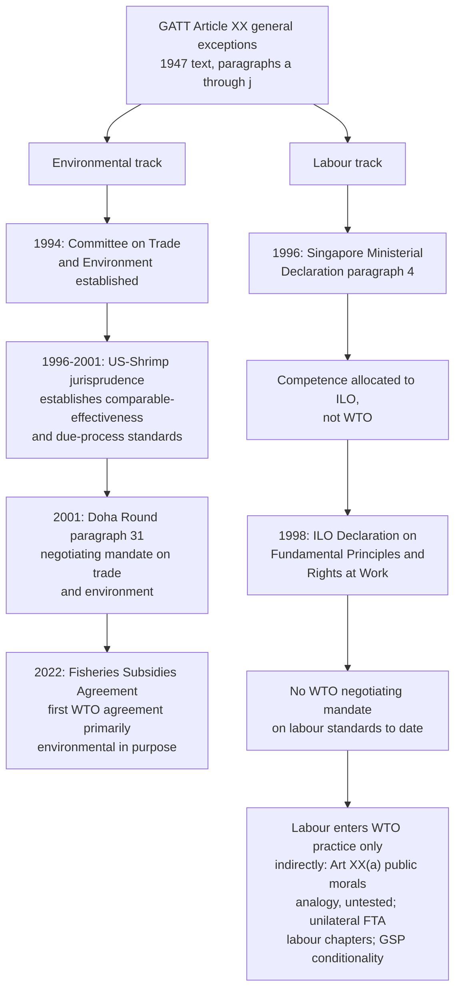

## The "Trade And..." Critique: Labor Standards and Environmental Carve-Outs

### Scope and Framing

This item covers the recurring debate over whether and how WTO law accommodates non-trade policy objectives, specifically labour standards and environmental protection, through exceptions, carve-outs and linkage proposals, rather than treating trade liberalization as insulated from these concerns. It addresses the legal texts that create space for such measures (principally GATT Article XX and its jurisprudence), the institutional history of the "trade and labour" and "trade and environment" agendas within the GATT/WTO, the leading dispute cases that have defined the boundaries of permissible unilateral measures, and the structural arguments for and against formal linkage. It does not cover the substantive environmental disciplines of the Fisheries Subsidies Agreement in detail (addressed under its own item), nor the general S&DT architecture, except where either bears directly on the labour/environment carve-out debate.

**Key Points**

- WTO law contains no free-standing labour-rights agreement; labour standards enter WTO law only indirectly, primarily through GATT Article XX(a) (public morals) and Article XX(e) (prison labour), and through non-binding declaratory language.
- WTO law contains no free-standing multilateral environmental agreement either, but GATT Article XX(b) (necessary to protect human, animal or plant life or health) and Article XX(g) (relating to the conservation of exhaustible natural resources) have been the textual basis for a substantial and evolving body of Appellate Body jurisprudence permitting environmental measures, subject to conditions.
- The chapeau of Article XX, its introductory clause, is the operative constraint in most disputes: a measure that falls within a specific paragraph can still fail if it is applied as a means of arbitrary or unjustifiable discrimination or a disguised restriction on trade.
- The 1996 Singapore Ministerial Declaration allocated labour standards to the International Labour Organization (ILO) rather than the WTO, a decision that has effectively foreclosed a multilateral WTO labour agreement for three decades.
- Environmental issues, by contrast, gained a standing institutional forum (the Committee on Trade and Environment, established 1994) and, later, a dedicated negotiating mandate under the Doha Round (paragraph 31) and the Fisheries Subsidies Agreement, reflecting a materially different trajectory from labour.

---

### The "Trade And..." Framework

**Defined term: "trade and..." critique.** A body of argument, originating largely outside the trade-law community (in the labour movement, environmental movement, and broader civil society) and periodically taken up by individual WTO Members, holding that trade liberalization should be conditioned on, or at minimum should not undermine, compliance with labour and environmental standards, and that the WTO's rules should be interpreted or amended to reflect this linkage more explicitly than they currently do.

The critique has two logically distinct components that are frequently conflated in political debate:

1. **The race-to-the-bottom argument.** Trade liberalization creates competitive pressure for governments to weaken labour and environmental regulation in order to attract investment and maintain export competitiveness, producing a downward spiral in standards. This is an empirical claim about regulatory dynamics.
2. **The fairness/level-playing-field argument.** Even absent an active regulatory race, producers in jurisdictions with lower labour or environmental standards enjoy a cost advantage that is "unfair" because it is not based on productivity, and trade rules should permit (or require) adjustment for this differential. This is a normative claim about what trade competition should be based on.

Both components generate the same practical proposal, conditioning market access or permitting trade measures on standards compliance, but they rest on different premises and attract different counter-arguments.

**Defined term: carve-out.** In this context, a provision or judicially recognized exception that permits a Member to maintain or apply a trade-restrictive measure otherwise inconsistent with GATT or WTO obligations, on the ground that the measure serves a specified non-trade objective (here, labour rights or environmental protection), subject to conditions limiting abuse.

---

### Legal Basis: GATT Article XX and the General Exceptions

#### Text and Structure

Recall that GATT Article XX permits Members to maintain measures otherwise inconsistent with GATT obligations, provided the measure falls within one of the listed paragraphs and satisfies the chapeau. The paragraphs most relevant to labour and environmental measures:

| Paragraph | Text (summarized) | Primary relevance |
| --- | --- | --- |
| Article XX(a) | Measures "necessary to protect public morals" | Labour standards (via the "public morals" doctrine, discussed below) |
| Article XX(b) | Measures "necessary to protect human, animal or plant life or health" | Environmental and health measures |
| Article XX(e) | Measures "relating to the products of prison labour" | The only labour-specific textual carve-out in GATT |
| Article XX(g) | Measures "relating to the conservation of exhaustible natural resources," if made effective in conjunction with restrictions on domestic production or consumption | Environmental and natural-resource measures |

**Defined term: the chapeau.** The unnumbered introductory clause of Article XX, which conditions the availability of any paragraph-based exception on the measure not being "applied in a manner which would constitute a means of arbitrary or unjustifiable discrimination between countries where the same conditions prevail, or a disguised restriction on international trade." The chapeau functions as a second, independent layer of scrutiny: a measure can fall squarely within a paragraph (for example, genuinely aimed at conserving an exhaustible natural resource) and still fail the overall Article XX test if its application is discriminatory or protectionist in effect.

#### The Two-Tier Analytical Structure

**Defined term: two-tier test.** The Appellate Body's standard method for applying Article XX, established across a line of cases beginning with *United States: Standards for Reformulated and Conventional Gasoline* (1996): first, determine whether the measure falls within the scope of one of the specific paragraphs (for example, is it "necessary" for Article XX(b), or does it "relate to" conservation for Article XX(g)); second, and only if the first step is satisfied, determine whether the measure's application satisfies the chapeau. A measure that fails the first tier need not be examined under the chapeau; a measure that passes the first tier but fails the chapeau is still WTO-inconsistent.

**Practitioner lens.** For a government designing a labour- or environment-linked trade measure, the chapeau is frequently the more demanding hurdle in practice, because a measure can be substantively well-justified (a genuine conservation or public-morals purpose) yet still fail if its administration is inflexible, fails to accommodate different conditions in different exporting countries, or lacks transparency and due process. Appellate Body jurisprudence, discussed below, has repeatedly turned on administrative design rather than on the underlying policy objective's legitimacy.

---

### The Environmental Track: Key Disputes and Doctrinal Evolution

#### *US-Gasoline* (1996): The First Article XX Test of the WTO Era

In *United States: Standards for Reformulated and Conventional Gasoline* (DS2), the Appellate Body found a US Clean Air Act regulation, which applied a stricter baseline requirement to imported gasoline than to domestic gasoline, could fall within Article XX(g) but failed the chapeau because the discriminatory baseline methodology was not adequately justified and reasonable alternatives were not explored. The case established that Article XX is available in principle for environmental regulation but requires careful, non-discriminatory administrative design.

#### *US-Shrimp* (1998, 2001): The Landmark Case

In *United States: Import Prohibition of Certain Shrimp and Shrimp Products* (DS58), the Appellate Body considered a US measure prohibiting shrimp imports from countries that did not require turtle-excluder devices (TEDs) comparable to US requirements, aimed at protecting endangered sea turtles.

| Finding | Content |
| --- | --- |
| Article XX(g) scope | "Exhaustible natural resources" includes living resources (sea turtles), reversing a narrower reading some had drawn from an earlier GATT-era panel report (*US-Tuna*, unadopted) |
| Extraterritorial application | A Member may, in principle, adopt a measure conditioning market access on exporting countries' conservation policies, even though the resource (migratory sea turtles) is not exclusively within the importing Member's own territory, provided a sufficient nexus exists |
| Chapeau failure (1998) | The measure as originally applied failed the chapeau because it was applied rigidly, requiring other countries to adopt essentially the same regulatory programme as the United States rather than a comparably effective one, and because of inadequate due process in the certification procedure |
| Compliance proceeding (2001, DS58/RW) | After the US revised its implementation to allow flexibility for exporting countries to adopt comparably effective, rather than identical, conservation programmes, and improved procedural fairness, the Appellate Body found the revised measure consistent with Article XX |

**Defined term: comparable effectiveness standard.** The principle, drawn from the *US-Shrimp* compliance proceeding, that an importing Member applying an environment-linked trade measure need not require exporting countries to adopt identical regulatory programmes, but may legitimately require that exporting countries' programmes be comparably effective in achieving the same conservation objective.

**Practitioner lens.** *US-Shrimp* is the single most cited precedent in both the environmental and, by extension, the labour-conditionality debate, because it establishes that extraterritorial, process-and-production-method-based trade conditionality (conditioning market access not on the physical product but on how it was produced) is not per se prohibited under Article XX, provided the measure is applied flexibly, with due process, and without unjustifiable discrimination. This significantly expanded the perceived legal space for unilateral trade measures linked to non-trade objectives, well beyond what many observers expected from the stricter, largely unsuccessful GATT-era *Tuna-Dolphin* reports.

#### *Brazil-Retreaded Tyres* (2007) and *EC-Seal Products* (2014)

In *Brazil: Measures Affecting Imports of Retreaded Tyres* (DS332), the Appellate Body upheld a Brazilian import ban on retreaded tyres as necessary to protect health and the environment (waste tyre accumulation, associated disease vectors and fire risk) under Article XX(b), while finding a specific exemption for Mercosur-origin tyres to constitute unjustifiable discrimination under the chapeau, illustrating that the necessity analysis and the chapeau analysis can point in different directions for different elements of the same regulatory scheme.

In *European Communities: Measures Prohibiting the Importation and Marketing of Seal Products* (DS400/DS401), the Appellate Body upheld the EU's seal-product ban as capable of justification under Article XX(a) (public morals, animal welfare in this case) in principle, but found the exemption for Indigenous communities' hunts to be applied in a manner that failed the chapeau, because the exemption's conditions were not shown to be genuinely connected to distinguishing morally relevant hunting practices from morally objectionable ones. [Inference: the precise legal basis and disposition of *EC-Seal Products* is complex and multi-layered (touching TBT as well as GATT Article XX); the summary here captures the central holding but article-by-article findings should be checked against the full report for a formal citation.]

#### Synthesis: What the Environmental Jurisprudence Establishes

The accumulated case law supports several propositions with reasonable confidence:

- Article XX(b) and (g) are available for genuinely environmental measures, including those addressing transboundary and extraterritorial concerns.
- Process-and-production-method distinctions (how a good was made or harvested) can, in principle, be a legitimate basis for trade measures under Article XX, contrary to an earlier, more restrictive reading some drew from unadopted GATT panel reports.
- The chapeau requires flexibility (comparable effectiveness rather than identical-programme requirements), procedural fairness (transparent, reasoned decision-making, an opportunity to be heard), and genuine consistency in application (no unexplained, discriminatory exemptions).
- No panel or Appellate Body report has held that environmental objectives are categorically excluded from Article XX; the recurring pattern of findings against measures has been about *application design*, not about the *legitimacy of the underlying objective*.

---

### The Labour Track: A Markedly Different Institutional Trajectory

#### The Absence of a Textual Hook

Unlike the environmental track, labour standards have no counterpart to Article XX(b) or (g). The only labour-specific GATT text is Article XX(e), covering prison-labour products, a narrow carve-out that does not extend to broader labour-rights concerns such as freedom of association, collective bargaining, child labour, forced labour beyond the prison-labour context, or occupational safety.

**Defined term: public morals doctrine (labour application).** The argument, advanced in academic and policy literature though never squarely tested in a WTO dispute specifically on labour-standards grounds, that Article XX(a)'s "public morals" exception could in principle extend to trade measures addressing severe labour-rights violations (for example, forced labour or the worst forms of child labour), by analogy to the *EC-Seal Products* recognition that animal welfare falls within "public morals." [Inference: this is a plausible doctrinal extension supported by some scholarly commentary and by the general breadth the Appellate Body has given "public morals," but it remains untested in the specific context of a labour-standards trade measure, and its success would depend heavily on chapeau-style application requirements analogous to those developed in the environmental cases.]

#### The Singapore Ministerial Declaration (1996)

The decisive institutional moment for the labour track came at the first WTO Ministerial Conference, in Singapore in December 1996. Paragraph 4 of the Singapore Ministerial Declaration states that Members renew their commitment to the observance of internationally recognized core labour standards, that the **International Labour Organization (ILO) is the competent body** to set and deal with these standards, and that Members reject the use of labour standards for protectionist purposes, while affirming that the comparative advantage of countries, particularly low-wage developing countries, must in no way be put into question.

**Defined term: competence allocation.** The Singapore Declaration's core institutional move: rather than creating any WTO mechanism for labour standards, it explicitly assigned that role to the ILO, a decision developing countries strongly favoured (having viewed labour-standards linkage proposals, largely advanced by developed-country labour movements and some governments, as a vehicle for disguised protectionism against low-wage-country exports) and developed-country labour interests largely opposed.

The Singapore Declaration's effect has been to foreclose any serious multilateral negotiation on a WTO labour agreement for the entire subsequent history of the organization. Unlike the environment track, which gained a standing WTO committee in the same year and a Doha-era negotiating mandate seven years later, the labour track has had no comparable institutional development within the WTO itself.

#### The ILO's Parallel Framework

**Defined term: ILO Declaration on Fundamental Principles and Rights at Work (1998).** A declaratory instrument adopted by the International Labour Conference identifying four categories of "core" labour standards, freedom of association and the right to collective bargaining, the elimination of forced or compulsory labour, the effective abolition of child labour, and the elimination of discrimination in employment and occupation, which ILO Members commit to respect, promote and realize by virtue of ILO membership, independent of ratification of the specific underlying conventions.

The ILO framework operates through its own supervisory mechanisms (reporting requirements, the Committee of Experts, complaints procedures) rather than through trade-related enforcement, and has no formal institutional link to WTO dispute settlement or market access. This institutional separation is the structural core of the "trade and labour" critique: labour-rights advocates argue the ILO's supervisory mechanisms lack the enforcement teeth of WTO dispute settlement (no binding remedy comparable to authorized trade retaliation), while trade-linkage sceptics argue precisely this separation was the deliberate and appropriate design choice made at Singapore.

---

### Diagram: Divergent Institutional Trajectories

### Diagram: The Article XX Two-Tier Test

<svg xmlns="http://www.w3.org/2000/svg" viewBox="0 0 740 320" role="img" aria-label="The Article XX two-tier analytical test for general exceptions (svg_diagram)">
<title>GATT Article XX: The Two-Tier Test (svg_diagram)</title>
<rect x="0" y="0" width="740" height="320" fill="#ffffff" />
<text x="370" y="26" text-anchor="middle" font-family="Arial, sans-serif" font-size="15" font-weight="bold" fill="#1a1a1a">GATT Article XX: The Two-Tier Test (svg_diagram)</text>
<rect x="30" y="55" width="330" height="230" rx="8" fill="#e8f0fa" stroke="#2b5c8a" stroke-width="1.5" />
<text x="195" y="82" text-anchor="middle" font-family="Arial, sans-serif" font-size="13" font-weight="bold" fill="#1a1a1a">Tier 1: Paragraph Test</text>
<text x="195" y="112" text-anchor="middle" font-family="Arial, sans-serif" font-size="11" fill="#1a1a1a">XX(a): necessary to protect</text>
<text x="195" y="128" text-anchor="middle" font-family="Arial, sans-serif" font-size="11" fill="#1a1a1a">public morals</text>
<text x="195" y="152" text-anchor="middle" font-family="Arial, sans-serif" font-size="11" fill="#1a1a1a">XX(b): necessary to protect</text>
<text x="195" y="168" text-anchor="middle" font-family="Arial, sans-serif" font-size="11" fill="#1a1a1a">life or health</text>
<text x="195" y="192" text-anchor="middle" font-family="Arial, sans-serif" font-size="11" fill="#1a1a1a">XX(g): relating to conservation</text>
<text x="195" y="208" text-anchor="middle" font-family="Arial, sans-serif" font-size="11" fill="#1a1a1a">of exhaustible resources</text>
<text x="195" y="248" text-anchor="middle" font-family="Arial, sans-serif" font-size="11" font-weight="bold" fill="#1a1a1a">Fails here: measure does not</text>
<text x="195" y="264" text-anchor="middle" font-family="Arial, sans-serif" font-size="11" font-weight="bold" fill="#1a1a1a">even fall within the paragraph</text>
<rect x="380" y="55" width="330" height="230" rx="8" fill="#fdf1d6" stroke="#b8860b" stroke-width="1.5" />
<text x="545" y="82" text-anchor="middle" font-family="Arial, sans-serif" font-size="13" font-weight="bold" fill="#1a1a1a">Tier 2: The Chapeau</text>
<text x="545" y="112" text-anchor="middle" font-family="Arial, sans-serif" font-size="11" fill="#1a1a1a">Not arbitrary or unjustifiable</text>
<text x="545" y="128" text-anchor="middle" font-family="Arial, sans-serif" font-size="11" fill="#1a1a1a">discrimination between</text>
<text x="545" y="144" text-anchor="middle" font-family="Arial, sans-serif" font-size="11" fill="#1a1a1a">countries with same conditions</text>
<text x="545" y="176" text-anchor="middle" font-family="Arial, sans-serif" font-size="11" fill="#1a1a1a">Not a disguised restriction</text>
<text x="545" y="192" text-anchor="middle" font-family="Arial, sans-serif" font-size="11" fill="#1a1a1a">on international trade</text>
<text x="545" y="224" text-anchor="middle" font-family="Arial, sans-serif" font-size="11" fill="#1a1a1a">Requires: flexibility, due</text>
<text x="545" y="240" text-anchor="middle" font-family="Arial, sans-serif" font-size="11" fill="#1a1a1a">process, consistent application</text>
<text x="545" y="264" text-anchor="middle" font-family="Arial, sans-serif" font-size="11" font-weight="bold" fill="#1a1a1a">Most disputes turn on this tier</text>
</svg>

---

### The Structural Debate: Should Formal Linkage Exist?

#### The Strongest Case for Formal Linkage

1. **Race-to-the-bottom risk is real at the margin.** Even if not the dominant driver of regulatory policy everywhere, competitive pressure from trade openness can discourage governments from raising, or can encourage them to suppress, labour and environmental standards in specific sectors exposed to import competition, particularly where enforcement capacity is weak and mobile capital can credibly threaten relocation.
2. **Global public goods require global rules.** Climate change, biodiversity loss, and certain labour abuses (forced labour, the worst forms of child labour) have effects that cross borders or implicate universal norms; a trading system that treats these as purely domestic regulatory choices, external to trade rules, under-values their global-public-good character.
3. **Asymmetric enforcement undermines coherence.** The WTO enforces intellectual property and market-access commitments through binding dispute settlement with the possibility of authorized trade retaliation, while labour standards rely on the ILO's comparatively soft supervisory mechanisms; this asymmetry, critics argue, reveals a choice about which values the trading system actually prioritizes.
4. **Jurisprudential space already exists.** *US-Shrimp* demonstrates the WTO's own dispute-settlement organs have found meaningful legal space for extraterritorial, non-product-related process standards in the environmental context; formalizing a comparable framework for labour would arguably be a modest doctrinal extension rather than a radical departure.

#### The Strongest Case Against Formal Linkage

1. **Comparative advantage is not "unfair" simply because it differs.** Lower wages in developing countries reflect, among other things, lower productivity, different capital endowments, and different stages of development, not merely weaker regulatory standards; treating wage differentials as an illegitimate basis for competition risks disguising conventional protectionism as a standards concern, precisely the risk the Singapore Declaration's negotiators sought to foreclose.
2. **Developing-country sovereignty and development strategy.** Historically, today's developed countries themselves industrialized using labour and environmental standards far below their current levels; conditioning market access on adopting developed-country-calibrated standards risks denying developing countries the same developmental pathway, and risks being used instrumentally to protect developed-country industries from legitimate competition.
3. **Institutional competence.** The ILO, with its tripartite structure (governments, employers, and workers' representatives all participating in standard-setting) and specialized supervisory expertise, is institutionally better suited to labour-standards questions than a trade organization whose dispute-settlement panels are not composed of labour-law specialists and whose remedies (trade retaliation) are a blunt instrument poorly calibrated to incentivizing genuine labour-market reform.
4. **Empirical uncertainty about the race-to-the-bottom.** The empirical literature on whether trade openness actually drives a systematic downward spiral in labour or environmental standards is mixed; some studies find limited evidence of a generalized race to the bottom, with FDI location decisions and export competitiveness depending on many factors beyond regulatory stringency, weakening the strongest form of the linkage argument's empirical premise. [Inference: characterizing the state of this empirical literature as "mixed" reflects the existence of studies on multiple sides of the question; the literature is large, methodologically heterogeneous across country and sector contexts, and this synthesis should not be read as a precise summary of its current balance of findings.]

#### Assessment

The environmental and labour tracks diverged sharply not because of any inherent legal distinction in how amenable trade law is to each concern (the *US-Shrimp* line of cases shows considerable legal space exists for both), but because of a specific 1996 political decision that allocated institutional competence for labour to the ILO and left environment without a comparably decisive foreclosure. The subsequent three decades of practice, a growing environmental jurisprudence, a Doha negotiating mandate, and eventually a substantive environmental agreement (Fisheries Subsidies), against a nearly static labour picture within the WTO itself, illustrate how much institutional trajectories can diverge from a shared legal starting point once a foundational political allocation is made.

---

### Where Labour Standards Do Appear in Trade Law: Outside the Multilateral WTO Track

Although the WTO itself has not developed multilateral labour disciplines, labour standards have entered international trade practice through channels outside the core WTO negotiating agenda:

| Channel | Mechanism |
| --- | --- |
| Bilateral and regional FTA labour chapters | Many FTAs (for example, USMCA's labour chapter, EU FTAs' "Trade and Sustainable Development" chapters) contain binding or semi-binding labour commitments, sometimes with dedicated dispute-resolution or rapid-response mechanisms distinct from WTO dispute settlement |
| Unilateral GSP-style conditionality | The EU's GSP+ arrangement, discussed elsewhere in this chapter, conditions enhanced preferences on ratification and effective implementation of specified labour (and other) conventions, operating through the Enabling Clause rather than a WTO labour agreement |
| The "public morals" doctrinal opening | The untested but plausible extension of Article XX(a), discussed above, by analogy to *EC-Seal Products* |
| Corporate and supply-chain due-diligence regulation | National and regional measures (for example, forced-labour import bans, mandatory human-rights due-diligence legislation) that operate independently of WTO law but interact with it insofar as they restrict imports on labour-conduct grounds, raising Article XX(a) or (e) questions if challenged |

**Practitioner lens.** For a trade lawyer advising on a forced-labour import restriction (a growing area of practice, given the proliferation of national forced-labour import bans in recent years), the operative legal terrain is not a WTO labour agreement, which does not exist, but a combination of: GATT Article XX(e) if the measure is framed around prison labour specifically; the untested Article XX(a) public-morals extension if framed more broadly around forced labour; and, critically, the chapeau's due-process and non-discrimination requirements, which the *US-Shrimp* and *Brazil-Retreaded Tyres* lines of cases suggest will be the actual battleground if such a measure is challenged.

---

### Worked Example: Assessing a Hypothetical Forced-Labour Import Restriction

**Example**

A WTO Member enacts a measure prohibiting imports of goods produced using forced labour, applying a rebuttable presumption of forced labour to goods from specified regions or sectors, with an exemption process requiring importers to demonstrate compliance.

**Step 1: Identify the GATT provision at issue.** The measure discriminates against goods based on production method rather than the product itself, and is likely to be challenged as inconsistent with GATT Article I (MFN) or Article III (national treatment) if it treats like products differently based on origin.

**Step 2: Assess the Tier 1 paragraph fit.** Article XX(e) applies narrowly to prison-labour products; if the measure extends beyond prison labour to broader forced-labour concerns, the more promising basis is Article XX(a), public morals, by analogy to the animal-welfare extension recognized in *EC-Seal Products*, though this remains legally untested for forced labour specifically.

**Step 3: Assess necessity (if Article XX(a)).** Following the necessity analysis developed in cases such as *Brazil-Retreaded Tyres* and *Korea-Beef* (an earlier necessity-test case), the measure would need to be shown as making a material contribution to combating forced labour, with the availability of less trade-restrictive alternatives weighed against the measure's own effectiveness.

**Step 4: Apply the chapeau.** Following *US-Shrimp*, the measure's administration matters most: is the presumption rebuttable with a genuine, accessible, transparent process; does the measure allow for comparably effective compliance demonstrations rather than requiring an identical regulatory programme to the enacting Member's own; is application consistent across countries in similar circumstances, avoiding arbitrary or unjustifiable discrimination.

**Output**

A well-designed forced-labour measure, with a genuinely rebuttable presumption, transparent and accessible due process, and non-discriminatory application across countries in comparable circumstances, would have a plausible, though untested, defence under Article XX(a) informed by the *US-Shrimp* chapeau standards. A rigid, non-rebuttable measure applied selectively to specific countries without a transparent evidentiary basis would closely resemble the flaws that caused the original *US-Shrimp* measure to fail the chapeau, and would be similarly vulnerable to challenge.

---

### Practitioner Checklist

| Question | Legal anchor |
| --- | --- |
| Does the measure discriminate based on origin or production method, triggering GATT Article I or III? | GATT Articles I, III |
| If environmental, does it fall within Article XX(b) or (g)? | *US-Gasoline*; *US-Shrimp* |
| If labour-related, is it confined to prison labour (clear textual basis) or broader (untested public-morals extension)? | Article XX(e); Article XX(a) by analogy to *EC-Seal Products* |
| Does the measure allow comparably effective compliance rather than requiring an identical regulatory programme? | *US-Shrimp* compliance proceeding (DS58/RW) |
| Is the measure applied with adequate due process, transparency, and consistency across similarly situated countries? | Chapeau jurisprudence generally |
| Are any exemptions within the measure itself justified by a genuine connection to the stated objective, or do they undermine the measure's coherence? | *Brazil-Retreaded Tyres*; *EC-Seal Products* |
| Is the underlying objective more effectively and legitimately pursued through the ILO, a bilateral FTA labour chapter, or unilateral GSP-style conditionality rather than a WTO-law-based trade restriction? | Singapore Ministerial Declaration paragraph 4; institutional competence considerations |

---

### Conclusion

The "trade and..." critique poses the same underlying question for both labour and the environment, whether the multilateral trading system should accommodate, or even require, non-trade policy objectives, but WTO law and practice have answered that question very differently for each. Environmental measures have a textual anchor in GATT Article XX(b) and (g), a three-decade jurisprudential development culminating in a workable, if demanding, chapeau-based standard, a standing institutional forum, a Doha-era negotiating mandate, and now a substantive multilateral agreement in the Fisheries Subsidies Agreement. Labour standards, by contrast, were institutionally allocated to the ILO at the 1996 Singapore Ministerial Conference and have never since gained a comparable WTO negotiating mandate, leaving Article XX(a)'s public-morals doctrine as a plausible but untested analogical extension, and leaving most substantive labour-trade linkage to occur outside the multilateral WTO track entirely, through FTA labour chapters, GSP-style conditionality, and national import restrictions whose WTO consistency would, if challenged, likely turn on the same chapeau-based due-process and non-discrimination principles the environmental cases have developed. The divergence illustrates that the legal capacity of GATT Article XX to accommodate non-trade objectives is not the binding constraint; the binding constraint has been institutional and political allocation of competence, made explicitly at Singapore for labour and left comparatively open for environment.

---

### Related Topics

- The Agreement on Fisheries Subsidies as the first primarily environmental WTO agreement
- GATT Article XX jurisprudence: necessity tests, the chapeau, and the *US-Shrimp* compliance proceeding
- The Enabling Clause and GSP-plus conditionality on labour, human rights and environmental conventions
- The Committee on Trade and Environment and the Doha Round paragraph 31 negotiating mandate
- The ILO Declaration on Fundamental Principles and Rights at Work and its supervisory mechanisms
- FTA labour and environment chapters as an alternative linkage mechanism outside the WTO
- The self-designation debate over developing-country status, as a parallel legitimacy controversy
- The TBT Agreement's treatment of process-and-production-method standards
- National forced-labour and human-rights due-diligence import measures and their WTO-consistency questions
- Extraterritoriality and jurisdictional nexus requirements in WTO trade-and-environment jurisprudence