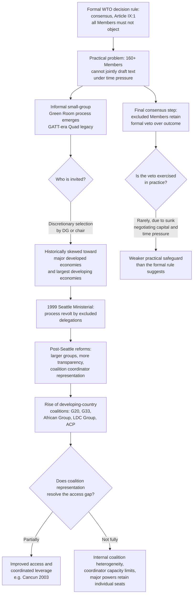

## Developing-Country Bargaining Power and the Informal Green Room Process

### Scope and Framing

This item covers the informal small-group negotiating practice known as the "Green Room" process, its origins, its role in WTO decision-making alongside the formal consensus rule, and the structural critique that it has systematically disadvantaged developing countries. It addresses the mechanics of Green Room meetings, the pivotal 1999 Seattle Ministerial Conference collapse as the defining crisis of legitimacy, the reforms attempted since, and the broader analytical question of how informal small-group processes interact with formal one-member-one-vote consensus rules in a 160-plus-Member organization. It does not cover the substance of specific negotiating rounds' outcomes, nor the general S&DT architecture, except where either bears directly on the bargaining-power and process-legitimacy question.

**Key Points**

- The WTO's formal decision-making rule is consensus among all Members (Article IX:1 of the Marrakesh Agreement, with voting as a rarely used fallback), but large multilateral negotiations have never in practice been conducted with all Members equally present at every drafting stage.
- The "Green Room" refers informally to a small-group, invitation-only meeting format (historically convened in a room adjacent to the WTO Director-General's office) in which a subset of Members negotiate compromise text later presented to the full membership, a practice inherited from GATT-era "quad" and informal consultations.
- The 1999 Seattle Ministerial Conference collapsed in significant part because of a legitimacy revolt by excluded developing-country delegations against the Green Room process, marking the process's transition from an accepted operational shortcut to an actively contested symbol of unequal power.
- Reforms since Seattle, including larger and more representative informal groups, greater transparency about which meetings are occurring, and the rise of developing-country coalitions (the G20, later G33, African Group, LDC Group, ACP Group) as bargaining blocs, have changed the process without eliminating small-group informality as a negotiating tool.
- The underlying tension is structural rather than merely procedural: a 160-plus-Member consensus-based organization cannot draft text with all Members simultaneously at the table, yet any smaller drafting group necessarily excludes someone, and the criteria for inclusion have never been formalized or made subject to an agreed rule.

---

### The Formal Decision-Making Rule and Its Practical Limits

#### Article IX and the Consensus Default

Recall that under Article IX:1 of the Marrakesh Agreement, the WTO is to continue the GATT practice of decision-making by consensus, defined in a footnote as the absence of any Member present at the meeting formally objecting to a proposed decision. Voting, where consensus cannot be reached, is available under specified majority thresholds (Article IX:1's default of one country, one vote, with different majorities specified for different decision types), but voting has been used only exceptionally in WTO practice, most notably for accessions and specific procedural matters, and never for a core multilateral trade round outcome.

**Defined term: consensus (as a decision rule, distinguished from unanimity).** A decision is reached by consensus if no Member formally objects; this is weaker than unanimity, which would require every Member's affirmative agreement, but stronger than a majority vote, since a single sustained objection blocks adoption. The practical consequence is that a decision requires not universal enthusiasm but the absence of a formal veto, which in a large and heterogeneous membership creates strong incentives to build compromise text informally, among a subset of Members, before bringing it to the full membership for the final consensus step.

#### Why Informal Small Groups Emerged

**Defined term: Green Room process.** An informal, invitation-only negotiating format in which the WTO Director-General (or, at Ministerial Conferences, the conference chair) convenes a subset of Members, typically 20 to 30, though the number and composition have varied considerably, to negotiate compromise language on contentious issues, with the resulting text subsequently presented to the full membership for consensus adoption or further negotiation. The name derives from the informal designation of a meeting room near the Director-General's office at the WTO's Geneva headquarters historically used for such sessions, and by extension has become shorthand for the practice itself regardless of the specific room used at any given venue, including at Ministerial Conferences held outside Geneva.

The practical rationale offered for the practice: with over 160 Members (as of current WTO membership), a negotiating session involving every delegation simultaneously drafting text is generally regarded as too unwieldy to produce compromise language efficiently, particularly under the time pressure of a Ministerial Conference. Smaller groups, in this view, are a necessary technical accommodation to the scale of the institution, not a deliberate mechanism of exclusion. This rationale traces to GATT-era practice, particularly the informal "Quad" (the United States, the European Communities, Japan and Canada), which functioned as a de facto steering group for much of the GATT's history before the WTO's larger and more diverse membership made a four-country steering group increasingly unrepresentative.

**Practitioner lens.** For a negotiator from a smaller delegation, understanding the Green Room as an operational response to scale, rather than purely as a conspiracy of the powerful, matters for strategy: the practical entry points are less about abolishing small-group negotiation altogether and more about securing inclusion, or effective coalition representation, within whatever small-group process does occur, since the underlying scale problem does not disappear simply because the room's composition is criticized.

---

### The Structural Critique: How Green Room Exclusion Disadvantages Developing Countries

#### The Composition Problem

Historically, Green Room invitations have skewed toward the largest trading Members (the major developed economies and a limited number of larger developing economies, such as India, Brazil, and later China), with participation determined at the Director-General's or chair's discretion, using criteria that have never been published or formally agreed. **Defined term: discretionary convening authority.** The practice by which the WTO Director-General or a Ministerial Conference chair decides, without a formal, agreed rule, which Members to invite to a given small-group negotiating session, based on an informal assessment of which delegations have the greatest stake in, or influence over, the specific issue under discussion.

This discretionary structure produces several documented consequences, drawn from the extensive academic and practitioner literature on WTO decision-making:

1. **Information asymmetry.** Delegations outside the room learn of compromise text only after it has substantially taken shape, limiting their ability to shape its content before positions harden.
2. **Capacity constraints compound exclusion.** Smaller delegations, particularly from LDCs and small island developing states, often lack the Geneva-based diplomatic staff to monitor multiple simultaneous informal processes even when nominally invited, meaning formal inclusion does not always translate into effective participation.
3. **Legitimacy deficit at the ratification stage.** Because the full membership must still consent by consensus, excluded Members retain a formal veto over any Green Room-negotiated text; this creates a recurring dynamic in which text negotiated by a subset is subsequently challenged, renegotiated, or blocked by Members who feel it was presented to them as a fait accompli rather than genuinely open for amendment.
4. **Coalition formation as a partial response.** Because individual small or developing-country delegations often cannot secure Green Room access on their own, this has been a major driver of the rise of developing-country negotiating coalitions (discussed below), which pool diplomatic capacity and seek representation as a bloc rather than as individual Members.

#### The Counter-Argument: Efficiency and the Limits of Full-Membership Drafting

**The strongest case for retaining informal small-group processes.**

1. A negotiating session with 160-plus delegations, each entitled to intervene, cannot realistically draft detailed compromise text within the time constraints of a Ministerial Conference; some informal filtering mechanism is functionally necessary.
2. The formal consensus requirement at the final adoption stage means Green Room-negotiated text has no legal effect until the full membership accepts it; excluded Members are not bound by anything until they consent, which preserves their formal power even if it does not equalize their practical influence over the text's content.
3. Green Room composition has, in practice, evolved to include more developing-country representation over time, particularly following the Seattle collapse, partially addressing the composition critique without abolishing the practice.
4. The realistic alternative, either strict adherence to full-plenary drafting or a formal, rules-based small-group selection procedure, has never commanded consensus support itself, suggesting the informal practice persists because no agreed alternative exists, not because it is regarded as ideal.

**The strongest case against the process as currently practised.**

1. Efficiency justifications do not, on their own, justify discretionary and non-transparent selection criteria; a formalized, rules-based selection process (for example, rotating regional representation, or fixed criteria tied to trade volume, group coordinatorship, or issue-specific stake) could preserve the efficiency benefit of small-group drafting while addressing the legitimacy deficit of ad hoc, unaccountable selection.
2. The formal veto at the final consensus stage is a weaker safeguard than it appears, because by the time text reaches the full membership, political momentum, sunk negotiating capital, and time pressure (particularly acute at Ministerial Conferences with fixed, short durations) create strong pressure to accept rather than reopen negotiated compromises, meaning the formal veto is exercised far less often than the formal rule would suggest is available.
3. Repeated exclusion has cumulative reputational and trust costs that extend beyond any single negotiation, contributing to a broader legitimacy crisis for the institution's negotiating function, a dynamic the Seattle collapse illustrates concretely (below).

**Assessment.** Both positions describe real and partially reconcilable concerns: the scale problem is genuine (a 160-plus-Member simultaneous drafting session is not a realistic negotiating format), and the exclusion problem is also genuine and empirically well-documented in the practitioner and academic literature on WTO ministerial practice. The disagreement is less about whether informal small-group processes are necessary in some form, and more about whether the current, discretionary selection method is the best available design for reconciling efficiency with legitimacy, a question the reforms discussed below have addressed only partially.

---

### The Seattle Ministerial Conference (1999): The Defining Crisis

#### What Happened

The Third WTO Ministerial Conference, held in Seattle in late November and early December 1999, was intended to launch a new negotiating round. It collapsed without agreement, for a combination of reasons that included substantive disagreements (notably over agriculture) and large-scale street protests, but the process dimension of the collapse is the specific focus relevant to this item.

**Defined term: the Seattle process revolt.** The events at Seattle in which a substantial number of developing-country delegations, most visibly African, Caribbean and other smaller delegations, publicly and collectively objected to being excluded from the Green Room sessions where draft ministerial text was being negotiated, on the ground that they were being asked to accept, or were finding leaked to them, text they had no meaningful opportunity to shape. Delegations reported learning of key compromise language through informal channels rather than through direct participation, and several developing-country ministers and ambassadors made public statements condemning the process as fundamentally non-transparent and exclusionary.

The revolt was significant because it moved the Green Room critique from an internal, largely academic and NGO-driven concern into an explicit, public position taken by a substantial bloc of Member governments themselves, delegitimizing the process in a way that private criticism from outside observers had not achieved.

#### Consequences for Subsequent Practice

The Seattle collapse produced a widely shared recognition, across the WTO Secretariat, the major trading powers, and developing-country delegations alike, that the pre-Seattle Green Room model could not simply continue unmodified. The specific, documented adjustments that followed over the subsequent Ministerial cycles included:

- **Larger informal group sizes.** Subsequent Green Room-style sessions at later Ministerials (Doha 2001, Cancún 2003, Hong Kong 2005, and beyond) have generally involved larger numbers of participating delegations than the pre-Seattle norm, reflecting an attempt to broaden the base of direct participation.
- **Greater transparency about process, if not always content.** Chairs and the Director-General's office have made more visible efforts to communicate which informal sessions are taking place and to hold periodic "green room reports" or briefings to the wider membership, so that non-participating Members are not entirely without information about the state of play, even if they remain outside the room where text is drafted.
- **Formal recognition of coalition representation.** Rather than attempting to include every individual developing-country delegation in small-group sessions, the practice increasingly relies on coalition coordinators (see below) attending on behalf of a bloc, treating coalition representation as a partial substitute for universal individual participation.

**Practitioner lens.** For a negotiator assessing whether a specific Ministerial's informal process is likely to replicate the Seattle dynamic, the practical indicators to watch are the size and composition of any convened small group relative to the full membership, whether coalition coordinators (rather than only individual major-power delegations) are included, and whether the chair or Director-General's office is providing regular, substantive updates to the full membership rather than presenting a late-stage text with limited opportunity for further input.

#### Cancún (2003): A Second Process Crisis

The Fifth Ministerial Conference, in Cancún in 2003, also collapsed, this time centrally over substantive disagreement (the Singapore Issues, discussed in the S&DT context elsewhere in this chapter, and agricultural market access), but the process dimension recurred: developing-country coalitions, notably the newly formed G20 (the developing-country agricultural coalition, distinct from the G20 forum of major economies) and the African, Caribbean and Pacific (ACP) and African Union groupings, coordinated effectively enough to resist a text they regarded as insufficiently responsive to their substantive positions, demonstrating that improved coalition capacity, itself partly a legacy of the post-Seattle reforms, could translate into genuine substantive leverage, not merely improved access to information.

---

### Developing-Country Coalitions as a Structural Response

#### The Logic of Coalition Formation

**Defined term: negotiating coalition (WTO context).** A group of WTO Members that coordinates negotiating positions, shares diplomatic and analytical resources, and, critically for the Green Room dynamic, is represented by one or a small number of coordinators in informal small-group sessions, functioning as a partial substitute for individual-country access to processes that cannot practically include every Member.

The rise of coalitions is a direct structural adaptation to the resource and access asymmetries the Green Room critique identifies: an individual small delegation cannot staff every informal session or match the analytical capacity of a major trading power, but a coalition can pool Geneva-based diplomatic staff, share technical and legal analysis, and, importantly, gain a credible claim to a seat in small-group sessions by virtue of representing a large aggregate share of the membership.

| Coalition | Approximate focus | Relevance to Green Room dynamics |
| --- | --- | --- |
| G20 (developing-country agricultural coalition, est. 2003) | Agricultural market access and subsidy reform, led at various points by Brazil, India, China, South Africa among others | Formed explicitly around and after Cancún; became a standard invitee to informal agriculture-related small-group sessions |
| G33 | Food security and special products flexibility in agriculture negotiations | Represents smaller and more vulnerable agricultural economies within the broader developing-country agricultural bloc |
| African Group | Coordinated African Union Member positions across the negotiating agenda | A standard coordinator-represented bloc in informal processes since the post-Seattle reforms |
| ACP Group (African, Caribbean and Pacific) | Historic preference-dependent economies, particularly relevant to preference-erosion and S&DT discussions | Coordinates positions distinct from, though overlapping with, the African Group |
| LDC Group | Least-developed countries specifically | Coordinates around DFQF, S&DT and graduation-related issues; its coordinator role is now a standard feature of WTO institutional practice, as reflected in the LDC Group's public statements on graduation and other matters |

**Practitioner lens.** For a small delegation, the practical Green Room strategy is rarely to seek individual inclusion, which is frequently unrealistic given the scale problem, but to invest diplomatic capital in an effective coalition coordinator role or in close coordination with whichever coalition most closely represents the delegation's interests, since coalition coordinators are now the primary channel through which developing-country positions reach small-group sessions.

#### Limits of the Coalition Response

Coalition representation is a partial rather than a complete solution to the underlying access problem, for several reasons documented in practitioner accounts:

- **Internal heterogeneity.** Coalitions such as the G20 or the African Group contain Members with genuinely divergent interests on specific issues (for example, net food-importing versus net food-exporting developing countries within agriculture negotiations), meaning a single coordinator cannot always represent the full range of individual Member positions without some members' priorities being subordinated to the coalition's median position.
- **Coordinator capacity constraints.** Coalition coordination itself requires diplomatic and analytical capacity that not all coalitions can sustain equally well across every negotiating track simultaneously.
- **Persistence of individual major-power access.** The largest individual trading powers (the United States, the European Union, and increasingly China) continue to participate as individual delegations rather than solely through coalition representation, meaning the practical influence gap between the largest individual players and coalition-represented developing countries, even effectively coordinated ones, has not been eliminated.

---

### Diagram: The Green Room Process and Its Critique

### Diagram: Scale of Participation Across Negotiating Formats

<svg xmlns="http://www.w3.org/2000/svg" viewBox="0 0 740 320" role="img" aria-label="Comparative scale of participation across WTO negotiating formats (svg_diagram)">
<title>Scale of Participation: Plenary, Coalition, and Green Room Formats (svg_diagram)</title>
<rect x="0" y="0" width="740" height="320" fill="#ffffff" />
<text x="370" y="26" text-anchor="middle" font-family="Arial, sans-serif" font-size="15" font-weight="bold" fill="#1a1a1a">Scale of Participation Across Formats (svg_diagram)</text>
<rect x="30" y="55" width="220" height="230" rx="8" fill="#e8f0fa" stroke="#2b5c8a" stroke-width="1.5" />
<text x="140" y="82" text-anchor="middle" font-family="Arial, sans-serif" font-size="12" font-weight="bold" fill="#1a1a1a">Full Plenary</text>
<text x="140" y="112" text-anchor="middle" font-family="Arial, sans-serif" font-size="11" fill="#1a1a1a">160+ Members</text>
<text x="140" y="128" text-anchor="middle" font-family="Arial, sans-serif" font-size="11" fill="#1a1a1a">present</text>
<text x="140" y="160" text-anchor="middle" font-family="Arial, sans-serif" font-size="11" fill="#1a1a1a">Final consensus</text>
<text x="140" y="176" text-anchor="middle" font-family="Arial, sans-serif" font-size="11" fill="#1a1a1a">adoption stage</text>
<text x="140" y="220" text-anchor="middle" font-family="Arial, sans-serif" font-size="11" font-weight="bold" fill="#1a1a1a">High legitimacy,</text>
<text x="140" y="236" text-anchor="middle" font-family="Arial, sans-serif" font-size="11" font-weight="bold" fill="#1a1a1a">low drafting efficiency</text>
<rect x="270" y="55" width="220" height="230" rx="8" fill="#e7f4e4" stroke="#3f7d32" stroke-width="1.5" />
<text x="380" y="82" text-anchor="middle" font-family="Arial, sans-serif" font-size="12" font-weight="bold" fill="#1a1a1a">Coalition Coordination</text>
<text x="380" y="112" text-anchor="middle" font-family="Arial, sans-serif" font-size="11" fill="#1a1a1a">G20, G33, African Group,</text>
<text x="380" y="128" text-anchor="middle" font-family="Arial, sans-serif" font-size="11" fill="#1a1a1a">LDC Group, ACP Group</text>
<text x="380" y="160" text-anchor="middle" font-family="Arial, sans-serif" font-size="11" fill="#1a1a1a">Coordinator represents</text>
<text x="380" y="176" text-anchor="middle" font-family="Arial, sans-serif" font-size="11" fill="#1a1a1a">bloc position</text>
<text x="380" y="220" text-anchor="middle" font-family="Arial, sans-serif" font-size="11" font-weight="bold" fill="#1a1a1a">Moderate legitimacy,</text>
<text x="380" y="236" text-anchor="middle" font-family="Arial, sans-serif" font-size="11" font-weight="bold" fill="#1a1a1a">moderate efficiency</text>
<rect x="510" y="55" width="220" height="230" rx="8" fill="#fbe0dc" stroke="#a83b2e" stroke-width="1.5" />
<text x="620" y="82" text-anchor="middle" font-family="Arial, sans-serif" font-size="12" font-weight="bold" fill="#1a1a1a">Green Room</text>
<text x="620" y="112" text-anchor="middle" font-family="Arial, sans-serif" font-size="11" fill="#1a1a1a">20-30 delegations,</text>
<text x="620" y="128" text-anchor="middle" font-family="Arial, sans-serif" font-size="11" fill="#1a1a1a">discretionary selection</text>
<text x="620" y="160" text-anchor="middle" font-family="Arial, sans-serif" font-size="11" fill="#1a1a1a">Compromise text</text>
<text x="620" y="176" text-anchor="middle" font-family="Arial, sans-serif" font-size="11" fill="#1a1a1a">drafting stage</text>
<text x="620" y="220" text-anchor="middle" font-family="Arial, sans-serif" font-size="11" font-weight="bold" fill="#1a1a1a">Contested legitimacy,</text>
<text x="620" y="236" text-anchor="middle" font-family="Arial, sans-serif" font-size="11" font-weight="bold" fill="#1a1a1a">high drafting efficiency</text>
</svg>

---

### Worked Example: Navigating an Informal Small-Group Process

**Example**

A small developing-country delegation, not itself a major trading power, learns that the chair of an upcoming Ministerial Conference intends to convene an informal small-group session on a contentious agriculture text, with an initial invitee list that does not include the delegation individually.

**Step 1: Identify the relevant coalition.** The delegation determines which coalition (for example, the G33, given a food-security-related agriculture issue) most closely aligns with its interests and confirms whether that coalition's coordinator has secured, or is likely to secure, a seat in the small-group session.

**Step 2: Feed positions to the coordinator in advance.** Rather than relying solely on the coordinator's general mandate, the delegation proactively communicates its specific red lines and priorities on the issue at hand, recognizing that coalition coordinators cannot represent positions they have not been given.

**Step 3: Monitor available transparency mechanisms.** The delegation tracks whatever briefing or reporting mechanism the chair has established (a post-Seattle-era practice) to stay informed of the small group's progress in as close to real time as available, rather than relying solely on the coordinator's own reporting back to the coalition.

**Step 4: Prepare to exercise the formal veto if necessary.** If the resulting text, when presented to the full membership, does not adequately reflect the delegation's core interests despite coalition advocacy, the delegation retains the formal right to object at the final consensus stage, though it should recognize, per the practical critique above, that late-stage objection carries real political costs and is less commonly exercised than the formal rule alone would suggest.

**Step 5: Consider seeking direct inclusion for future sessions.** If the issue is one where the delegation has a particularly acute and distinct stake not adequately captured by its coalition's median position, it can make a direct case to the chair's office for individual or supplementary inclusion, citing the post-Seattle norm of broader informal-group participation as precedent.

**Output**

The delegation's practical influence over the final text depends less on any single formal entitlement and more on how effectively it uses coalition channels, monitors available transparency mechanisms, and calibrates when to rely on coordinated advocacy versus when to press for direct access or, ultimately, to threaten exercise of its formal consensus veto.

---

### Practitioner Checklist

| Question | Relevant consideration |
| --- | --- |
| Is a Green Room-style small-group session being convened, and on what issue? | Chair's or Director-General's office announcements; informal Geneva diplomatic channels |
| Which coalition, if any, most closely represents this delegation's interests on the specific issue? | Coalition mandate and current coordinator |
| Has the delegation communicated its specific priorities to the relevant coalition coordinator? | Internal coalition coordination process |
| What transparency or briefing mechanism, if any, is the chair providing to non-participating Members? | Post-Seattle reform practice, specific to each Ministerial or negotiating body |
| Does the issue at hand implicate a distinct national interest not well captured by the delegation's coalition's median position? | Substantive policy analysis |
| Is the final consensus veto a realistic option given the political and time-pressure context, or is it likely to be practically unavailable despite its formal existence? | Assessment of negotiating dynamics at the specific juncture |
| Has this specific negotiating body or Ministerial adopted any formalized small-group selection criteria, or does discretionary selection persist? | Institutional practice for the specific body or conference |

---

### Conclusion

The Green Room process exemplifies a structural tension the WTO has never fully resolved: a consensus-based decision rule, formally protective of every Member's veto, operating within an organization too large for genuinely universal, simultaneous drafting of compromise text. The informal small-group practice that fills this gap has historically been criticized, with substantial empirical and practitioner support, for discretionary and non-transparent selection that has skewed toward the largest trading powers, a critique that reached its most consequential expression in the 1999 Seattle Ministerial Conference's collapse amid an open developing-country revolt against the process. Reforms since Seattle, larger and more representative informal groups, greater process transparency, and the rise of developing-country coalitions as institutionalized channels of coordinated representation, have measurably improved developing-country access and leverage without eliminating either the underlying scale problem that necessitates some form of small-group drafting or the discretionary character of who, precisely, gets invited into the room. For a practitioner, the durable lesson is that formal consensus and informal small-group negotiation function as two distinct and only loosely coupled layers of WTO decision-making, and that effective participation in the second layer, primarily now through coalition coordination, has become as important to real influence over outcomes as the formal veto the first layer guarantees.

---

### Related Topics

- The self-designation debate over developing-country status
- The "trade and..." critique and the legitimacy of non-trade linkage in WTO negotiations
- The G20 developing-country agricultural coalition and its role in the Doha Round agriculture negotiations
- The Cancún Ministerial Conference collapse (2003) and the Singapore Issues
- WTO decision-making under Article IX: consensus, voting, and interpretive decisions
- The LDC Group and African Group as institutionalized coordination mechanisms
- Joint Statement Initiatives as an alternative, plurilateral response to consensus gridlock
- Special and differential treatment provisions across the WTO agreement architecture
- The role of the WTO Director-General in convening and chairing informal processes
- Small and vulnerable economies' distinct negotiating capacity constraints within the WTO