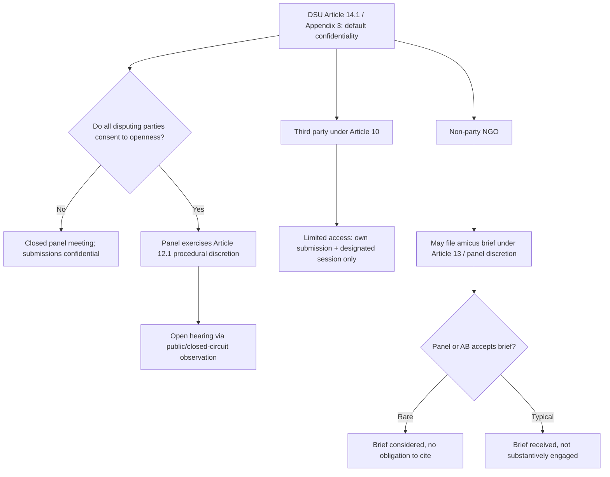

## Transparency and Civil Society Access to Dispute Settlement Proceedings

### Legal Basis: Confidentiality as the Default Rule

The WTO dispute settlement system's transparency posture is set by the Dispute Settlement Understanding (DSU), the treaty annexed to the Marrakesh Agreement that governs panel and Appellate Body procedure. Two provisions anchor the default toward confidentiality:

- **DSU Article 14.1** mandates that panel deliberations be confidential.
- **DSU Appendix 3, paragraph 2** (Working Procedures) states that panel meetings are closed to the public unless the disputing parties agree otherwise, and that submissions, statements, and rebuttal arguments are to be treated as confidential, though a party may disclose its own positions publicly.

This is a deliberate design choice inherited from GATT 1947 dispute practice, which treated inter-state trade disputes as diplomatic proceedings between sovereigns rather than adjudicative processes owed to a public audience. The consequence for practitioners: absent a specific procedural ruling opening a hearing, third parties (including civil society, press, and even other WTO Members not party to the dispute) have no treaty-based right to observe panel proceedings or access submissions in real time.

**Key Points**

- Confidentiality is the DSU default, not an exception requiring justification.
- The rule binds panels; it does not bind what a disputing party chooses to do with its *own* submissions.
- Third-party Members (those exercising rights under **DSU Article 10**, which allows a Member with a "substantial interest" in a dispute to make submissions and be heard by the panel) receive only the third-party submissions and a limited hearing segment — not full access to the bilateral record between the principal parties.

### Procedural Mechanism: How Openness Has Been Introduced Ad Hoc

Because Appendix 3 permits parties to agree to open their own meetings, a body of practice has developed allowing case-by-case transparency, entirely dependent on the disputing parties' consent rather than a standing rule change:

1. **Open panel hearings**: Beginning with *US — Continued Suspension* and *Canada — Continued Suspension* (the Hormones-related compliance disputes, DS320/DS321), the United States, Canada, and the European Communities jointly requested and received panel authorization to open hearings to public observation via closed-circuit broadcast. The panel's authority to do so rests on its general working-procedure discretion under **DSU Article 12.1**, read together with the parties' consent under Appendix 3.
2. **Open Appellate Body hearings**: The same pattern extended to Appellate Body review in disputes where all participants and third participants agreed, since the Appellate Body's working procedures (adopted under **DSU Article 17.9**) similarly permit party-consented openness.
3. **Public versions of submissions**: Some Members voluntarily publish their own written submissions on national trade-ministry websites concurrently with filing. This is unilateral disclosure of one's own pleading, not an opening of the confidential joint record, and it does not extend to the other party's submissions or the panel's internal working documents.
4. **Amicus curiae briefs**: Non-parties, including non-governmental organizations, may submit unsolicited written briefs. The Appellate Body confirmed panels have discretion to accept such briefs in *US — Shrimp/Turtle* (DS58) under the panel's general fact-finding authority in **DSU Article 13** ("right to seek information"), and the Appellate Body extended a parallel discretion to itself in *US — Lead and Bismuth II* (DS138). Acceptance is discretionary and rare in practice — a panel or the Appellate Body may receive a brief without being obligated to consider or cite it, and most amicus submissions receive no substantive engagement in the final report.

For a negotiator or dispute-settlement lawyer, the practical takeaway is that transparency is a negotiated feature of a specific dispute, not a procedural entitlement: counsel should raise a request for open hearings at the organizational meeting stage with the panel, and should expect that a single objecting party (often citing commercial confidentiality or diplomatic sensitivity) can block it.

### Case Illustration: EC — Hormones and the Amicus Curiae Controversy

The amicus curiae question produced one of the sharpest legitimacy disputes in WTO history during *US — Shrimp/Turtle* and its aftermath. When the Appellate Body confirmed panels *could* accept unsolicited NGO briefs, several developing-country Members — led by concerns voiced by India, Pakistan, Egypt, and others in General Council sessions — objected strongly, arguing that:

- The DSU nowhere grants non-Members a role in a state-to-state legal process;
- Developing countries, with fewer resources to respond to a proliferation of NGO submissions from well-funded Northern advocacy organizations, would face an asymmetric procedural burden; and
- Allowing amicus participation was a judicial innovation exceeding the Appellate Body's interpretive mandate under **DSU Article 3.2**, which states that DSB rulings "cannot add to or diminish the rights and obligations provided in the covered agreements."

The controversy escalated further in **EC — Asbestos** (DS135), when the Appellate Body issued a formal procedural ruling (an "Additional Procedure") inviting amicus applications for that specific appeal — the first time it proactively solicited briefs rather than merely accepting unsolicited ones. Members' reaction was so hostile that a General Council special session in late 2000 saw a large majority of the membership formally repudiate the Appellate Body's approach, though no binding DSU amendment followed. The episode illustrates a recurring practitioner lesson: WTO adjudicative bodies possess meaningful *de facto* procedural discretion, but exercising it in ways the membership perceives as unauthorized generates political backlash that can outlast the individual case and colors subsequent Appellate Body caution — plausibly contributing to the broader pattern of restraint the Appellate Body showed on contested procedural questions in later years. [Inference]

### The Legitimacy Debate: Strongest Form of Each Position

**Case for greater transparency and civil society access:**

- WTO rulings increasingly reach into domestic regulatory space — public health, environmental standards, food safety — that directly affects populations with no seat at the table (as in **EC — Hormones**, DS26/DS48, and **US — Shrimp/Turtle**, DS58). Democratic accountability arguments hold that decisions with this domestic reach cannot legitimately be adjudicated entirely behind closed doors.
- Other international adjudicative bodies (the WTO's own competitor narrative points to ICSID investment arbitration's post-2006 transparency reforms, and to ICJ public hearings) have moved toward public proceedings without collapsing state-to-state functionality, suggesting confidentiality is a policy choice, not a functional necessity for treaty adjudication.
- Confidentiality asymmetrically benefits parties with insider technical and legal capacity (large trading powers with dedicated trade-law bureaucracies) over affected stakeholders — domestic industries, labor groups, environmental organizations — who cannot monitor or contest positions taken in their name.

**Case for preserving confidentiality:**

- Trade disputes remain formally state-to-state under **DSU Article 3.3**'s characterization of the mechanism as central to providing security and predictability to "the multilateral trading system," not a public-law forum; introducing party access mid-negotiation could harden negotiating positions and reduce the mutually agreed solutions the DSU privileges under **Article 3.7**.
- Developing-country Members with smaller delegations argue that opening the door to amicus and public participation predominantly benefits well-resourced Northern civil-society organizations, replicating rather than correcting a resource asymmetry — the same critique the Appellate Body absorbed after *EC — Asbestos*.
- Confidential deliberation under Article 14.1 protects the panel's and Appellate Body's capacity to explore compromise legal reasoning without immediate public and political pressure on each interim position, a rationale with structural parallels to deliberative secrecy in domestic appellate judging. [Inference — analogy to domestic judicial practice, not a WTO-documented rationale]

### Practitioner Implications

For a negotiator advising a Member considering an open-hearing request, the operative calculus is bilateral leverage, not entitlement: since Appendix 3 requires the *other* party's consent, a request functions as a signaling and reputational tool (a Member confident in its legal position may propose openness to demonstrate transparency and pressure a reluctant counterpart) rather than a procedural right to invoke unilaterally. For counsel managing amicus risk, the practice since *EC — Asbestos* has been to treat unsolicited NGO briefs as a low-probability, low-engagement channel: panels and the Appellate Body retain unfettered discretion to disregard them entirely, so briefs are rarely a primary advocacy vector but may be used defensively to place a policy argument on the public record regardless of formal uptake.

**Related Topics**

- Special and differential treatment in dispute settlement participation costs for developing-country Members
- The Appellate Body crisis and US blocking of member appointments (2016–2019) as a distinct legitimacy failure
- DSU Article 21.5 compliance panels and sequencing disputes
- Confidentiality of Trade Policy Review Mechanism proceedings compared to dispute settlement
- Investor-state dispute settlement (ISDS) transparency reforms as a comparative institutional model