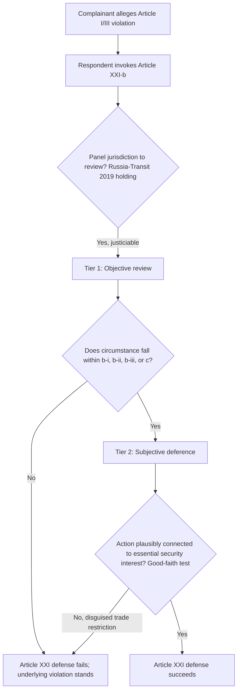

## National Security Exceptions: Article XXI Invocations and Non-Discrimination Under Strain

### Legal Basis: The Text and Its Deliberate Ambiguity

**GATT Article XXI** ("Security Exceptions") is the treaty basis. It provides that nothing in GATT 1994 shall be construed to require a Member to furnish information contrary to its essential security interests, or to prevent a Member from taking any action it considers necessary for the protection of its essential security interests, in three enumerated circumstances:

- **Article XXI(b)(i)**: action relating to fissionable materials;
- **Article XXI(b)(ii)**: action relating to traffic in arms, ammunition, and implements of war, or other goods and materials supplied for military establishments;
- **Article XXI(b)(iii)**: action taken in time of war or other emergency in international relations;
- **Article XXI(c)**: action pursuant to obligations under the UN Charter for the maintenance of international peace and security.

The drafting history matters for interpretation: the clause "which it considers necessary" was inserted at the insistence of the United States during the 1947 Havana Charter negotiations specifically to create broad self-judging discretion, on the understanding that Members would invoke it sparingly and in good faith. For roughly seven decades this self-judging language was treated as a practical taboo — invoked occasionally (Sweden's 1975 footwear import quotas, the US embargo on Nicaragua in 1985) but never adjudicated to a panel ruling, because Members implicitly agreed the clause was non-justiciable. That consensus broke down after 2017.

**Key Points**

- Article XXI is structurally distinct from the general exceptions in **GATT Article XX** (which requires a panel-reviewable "necessity" or "relating to" nexus test plus chapeau compliance) because of the "which it considers necessary" language attached to essential security interests.
- The clause sits in obvious tension with **Article I** (most-favoured-nation treatment) and **Article III** (national treatment), the two non-discrimination pillars it is invoked to override.
- Whether "which it considers necessary" makes the entire provision self-judging, or only insulates the factual predicate while leaving the *existence* of a qualifying circumstance under (b)(i)–(iii) or (c) open to objective panel review, was the central unresolved legal question until 2019.

### Procedural Mechanism: How a Panel Actually Reviews an Article XXI Claim

The mechanism a panel applies, once seized of a claim that a measure violates Article I or III and the responding Member invokes Article XXI(b), was authoritatively settled in **Russia — Traffic in Transit** (DS512, 2019 panel report):

1. The panel first confirms it has jurisdiction to review the invocation at all — rejecting the argument that "which it considers necessary" removes the matter entirely from WTO adjudication. The panel reasoned that if Article XXI were fully self-judging, the enumerated sub-paragraphs (b)(i)–(iii) and (c) would be surplusage, violating the interpretive principle against reading treaty text as redundant (drawn from customary rules of treaty interpretation under the **Vienna Convention on the Law of Treaties, Article 31**).
2. The panel then separates the analysis into two tiers:
   - **Objective review**: whether the circumstances invoked genuinely fall within one of the enumerated categories — e.g., whether an "emergency in international relations" under (b)(iii) actually exists. This is reviewable de novo by the panel, not deferred to the invoking Member.
   - **Subjective deference**: once a qualifying circumstance is objectively established, whether the specific action taken is "necessary" for the protection of essential security interests connected to that circumstance is largely left to the invoking Member's own judgment, subject only to a **good-faith** requirement drawn from **GATT Article XXIII** and general international law — meaning the action must not be so implausible or unconnected to the stated security interest as to be a disguised trade restriction.
3. Applying this test, the panel found that the 2014 breakdown in Russia–Ukraine relations (following Crimea) constituted an "emergency in international relations" under (b)(iii), and that Russia's transit restrictions were plausibly connected to it — so Russia's invocation succeeded on the merits, but critically, the *jurisdictional* holding that Article XXI is justiciable became the mechanism's lasting precedent, cited approvingly in the subsequent **Saudi Arabia — IPR Protection** (DS567) panel report.

For a dispute-settlement lawyer, the operative consequence is that a security-exception defense is no longer a jurisdictional trump card ending the case at the threshold — it forces the panel into a two-step factual inquiry, and a responding Member must now be prepared to substantiate the *existence* of the qualifying circumstance under (b)(i)-(iii) or (c), not merely assert its own necessity determination.

### Case Illustration: The Section 232 Steel and Aluminum Tariffs

The doctrinal stakes crystallized around the United States' 2018 tariffs on steel (25%) and aluminum (10%) imposed under **Section 232 of the Trade Expansion Act of 1962**, a domestic statute authorizing the President to adjust imports found by the Department of Commerce to threaten national security. The US applied the tariffs broadly, including against close security allies (the EU, Canada, and others), and invoked Article XXI(b) as its WTO defense against the resulting MFN and tariff-binding claims (violations of **GATT Article I** and **Article II**).

Multiple complainants — including the **EU, China, India, Norway, Switzerland, Turkey, and Russia** — filed disputes (e.g., DS544, DS547, DS548, DS550, DS551, DS552, DS554, DS556). Panel reports circulated in December 2022 across several of these disputes found the US tariffs inconsistent with GATT obligations and rejected the Article XXI defense as applied, applying essentially the *Russia — Traffic in Transit* framework: the panels found the US had not demonstrated the tariffs responded to an "emergency in international relations" within the meaning of (b)(iii), given they were imposed on grounds of import volumes and economic competitiveness rather than a security emergency tied to the enumerated categories. The United States formally rejected the panels' authority to review Article XXI matters at all, refused to adopt or comply with the reports, and — because the Appellate Body has been non-functional since December 2019 due to the US blocking new member appointments (a separate legitimacy crisis under **DSU Article 17**) — filed notices of appeal into the "void," a tactic that suspends the panel ruling indefinitely since no functioning Appellate Body exists to hear it. This illustrates a compounding institutional failure: even a jurisprudentially clear panel ruling on Article XXI's justiciability has no enforcement pathway when paired with a paralyzed appellate tier.

### The Legitimacy Debate: Strongest Form of Each Position

**Case that panel review of Article XXI is necessary and legally correct:**

- Absolute self-judging discretion would let any Member gut the entire non-discrimination architecture at will by relabeling ordinary protectionism as a security measure — the *Russia — Traffic in Transit* panel's textual point that the enumerated sub-paragraphs would otherwise be meaningless is a straightforward application of the effet utile interpretive principle under customary treaty law.
- Even under the panel's own framework, deference on the "necessity" determination remains very substantial — the objective-circumstance threshold does not meaningfully constrain a Member facing a genuine security crisis; it only screens out pretextual invocations.

**Case that panel review inappropriately encroaches on sovereign security judgment:**

- The 1947 negotiating history supports a strongly self-judging reading, and by adjudicating the *existence* of an emergency in international relations, panels are making judgments — about the security relationship between Russia and Ukraine, or about what constitutes a US national-security threat — that are inherently political and beyond the institutional competence and legitimacy of a trade panel to make binding.
- The US position, echoed in earlier US Congressional and executive-branch statements dating to the original GATT era, holds that inviting WTO review of security determinations at all is a category error since Article XXI was drafted to place a matter of sovereign self-defense outside the trade-legal order entirely — meaning the *Russia — Traffic in Transit* holding, whatever its textual logic, exceeds what Members consented to when ratifying the DSU.
- Practically, a dispute settlement system asked to adjudicate contested geopolitical facts (was there truly an "emergency in international relations"?) risks decisions that go unenforced precisely because they touch matters states will not subordinate to external adjudication — the Section 232 non-compliance is offered by proponents of this view as proof that the *Russia* precedent, however doctrinally elegant, has not actually constrained the powerful Members it was meant to discipline. [Inference — interpretive framing of the compliance pattern as evidence for the argument, not a WTO-documented conclusion]

### Practitioner Implications

For counsel structuring a security-exception defense post-2019, the burden of production has shifted meaningfully: a bare assertion of "essential security interests" is insufficient, and a responding Member should build a contemporaneous evidentiary record connecting the measure to a specific, objectively identifiable circumstance within (b)(i)–(iii) or (c) — ideally documented before the measure's adoption, since post-hoc justification narratives face credibility scrutiny under the good-faith standard. For a negotiator or policy advisor, the more consequential lesson is systemic: Article XXI has become a live vector for using national-security framing to route around ordinary tariff-binding and non-discrimination commitments, and the absence of a functioning Appellate Body means a losing party can effectively nullify an adverse panel ruling — meaning the doctrinal clarity achieved in *Russia — Traffic in Transit* has not, so far, translated into reliable compliance leverage against major powers. [Inference — assessment of practical effect, not itself a holding of any panel]

**Related Topics**

- The Appellate Body appointment blockage and the Multi-Party Interim Appeal Arbitration Arrangement (MPIA) as a workaround
- GATT Article XX general exceptions compared to Article XXI security exceptions
- Section 232 and Section 301 as parallel unilateral US trade-remedy statutes
- Retaliatory tariffs and the rebalancing measures adopted by the EU and Canada in response to Section 232
- Plurilateral and minilateral responses to WTO dispute-settlement paralysis