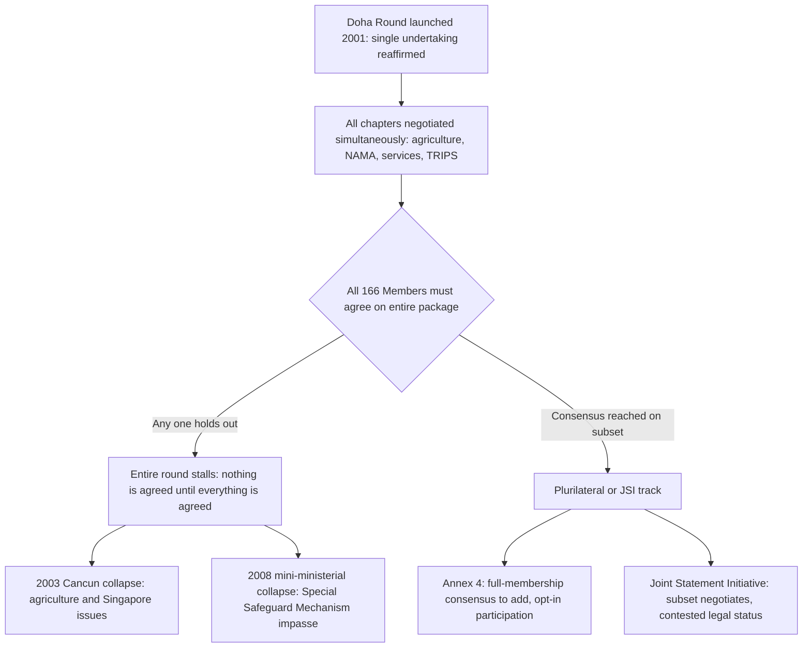

## The Single Undertaking Versus Plurilateralism Debate Over Institutional Flexibility

### Legal Basis: Where "Single Undertaking" Comes From — and Where It Doesn't

Unlike Article XXI or Article XX, the single undertaking is not itself a codified treaty article with binding force; it is a negotiating-mandate principle. Its textual anchor is the **1994 Marrakesh Ministerial Decision** launching the Uruguay Round outcome, and more precisely its operative articulation traces to the **1986 Punta del Este Declaration**, which stated that "the launching, the conduct and the implementation of the outcome of the negotiations shall be treated as parts of a single undertaking" — meaning "nothing is agreed until everything is agreed." The Doha Round's 2001 **Doha Ministerial Declaration** (paragraph 47) reaffirmed this explicitly for the current round, carving out only limited exceptions.

The structural counterpoint is **plurilateralism**, which operates through two distinct legal tracks under the WTO Agreement itself:

- **Annex 4 Plurilateral Agreements** under the **Marrakesh Agreement Establishing the WTO, Article II:3**: agreements binding only on WTO Members that have separately accepted them, requiring **consensus of the full Membership** merely to be *added* to Annex 4 (per **Article X:9** of the Marrakesh Agreement), even though substantive participation remains optional. The Agreement on Government Procurement (GPA) and the now-terminated Agreement on Trade in Civil Aircraft are the historical examples.
- **Joint Statement Initiatives (JSIs)**: a newer, less formalized practice beginning around 2017 in which a subset of Members negotiates outcomes (e.g., e-commerce, investment facilitation, services domestic regulation) without seeking Annex 4 status, instead implementing results through means such as **MFN-based scheduling under GATS Article XXI** modification procedures or standalone reference-paper commitments — a legally contested route precisely because it sidesteps the whole-membership consensus gate that Annex 4 formally requires.

**Key Points**

- The single undertaking is a negotiating *modality* choice reaffirmed by ministerial decision, not a permanent constitutional feature of the WTO Agreement — it could in principle be abandoned by consensus for any future round.
- Annex 4 plurilaterals are the *only* WTO-sanctioned mechanism for binding subsets of Members to enforceable obligations outside full-membership agreement — and even reaching that lane requires a full-consensus procedural gate.
- JSIs occupy an ambiguous legal space: proponents characterize them as consistent with WTO flexibility norms; critics (led by India and South Africa) argue they may exceed what the WTO Agreement's amendment and annex-modification procedures permit without a change to the rules themselves.

### Procedural Mechanism: Why the Single Undertaking Produces Gridlock

The mechanism by which single-undertaking design translates into negotiating paralysis operates through three linked features:

1. **Universal veto structure**: because no element is finalized until the whole package is finalized, any Member — regardless of economic weight — can hold the entire round hostage over a single unresolved issue, converting the WTO's **consensus-based decision-making** (the default under **Article IX:1** of the Marrakesh Agreement, formal voting being a rarely-used fallback) from a floor protecting weaker Members' voice into a ceiling on any outcome't advancing without universal buy-in.
2. **Issue-linkage bargaining**: the single undertaking is a deliberate design feature, not an accident — Uruguay Round architects intended it to allow developing countries to trade concessions in agriculture for gains in textiles, and industrial-country market access for intellectual-property protection (the origin of **TRIPS**, the Agreement on Trade-Related Aspects of Intellectual Property Rights, being bundled into the same undertaking specifically to induce developing-country acceptance). This logic requires the whole package to remain live simultaneously, which is precisely what makes late-stage defection or holdup by any party catastrophic for the entire negotiation.
3. **The agriculture veto point**: since 2003 (the collapsed **Cancún Ministerial**) and especially since 2008 (the collapsed July 2008 mini-ministerial), disagreement over the **Special Safeguard Mechanism** for agriculture — a proposed tool allowing developing countries to raise tariffs temporarily in response to import surges — between the US/Cairns Group agricultural exporters and India/China as import-sensitive developing economies has functioned as the recurring single-undertaking failure point, with each side unwilling to move on agriculture while other chapters (services, non-agricultural market access) remained simultaneously unresolved.

The consequence, from a negotiator's standpoint, is that the single undertaking's issue-linkage logic — originally a *feature* enabling grand bargains — becomes a *bug* once the membership grows large and heterogeneous enough (the WTO now has 166 Members compared to GATT's 23 founding contracting parties) that finding a package acceptable to every veto-holder approaches practical impossibility.

### Case Illustration: The Trade Facilitation Agreement as the Single Undertaking's Partial Escape Valve

The **Trade Facilitation Agreement (TFA)**, concluded at the **2013 Bali Ministerial Conference** and entering into force in 2017 as the WTO's first new multilateral agreement since 1995, is instructive precisely because it demonstrates a negotiated *exception* to strict single-undertaking gridlock rather than plurilateralism proper. Negotiators extracted trade facilitation — customs procedures, border-clearance simplification — from the broader Doha single undertaking and concluded it as a standalone multilateral agreement binding on the *entire* membership once ratified, while the rest of the Doha agenda (agriculture, NAMA) remained unresolved. This was possible because trade facilitation had comparatively low political salience relative to agricultural market access, allowing it to be "carved out" without disturbing the core bargaining linkages holding up the rest of the round.

By contrast, the **Fisheries Subsidies Agreement**, concluded at the **2022 Twelfth Ministerial Conference (MC12)** after over 20 years of negotiation (mandated originally by the 2001 Doha Declaration and given further impetus by UN Sustainable Development Goal 14.6), represents a similar multilateral (not plurilateral) carve-out achieved through years of separate track negotiation, though a comprehensive second-wave agreement addressing subsidies contributing to overcapacity and overfishing remains unresolved as of MC13 (2024) — illustrating that even successfully extracted single issues can themselves fragment into further undertaking-versus-partial-deal dynamics.

### The Legitimacy Debate: Strongest Form of Each Position

**Case for preserving the single undertaking:**

- The consensus/single-undertaking model is what gives smaller and developing-country Members negotiating leverage they would not otherwise possess: fragmenting negotiations into plurilaterals allows major economic powers to conclude high-standard agreements among like-minded Members and then use market power to pressure others to accede on take-it-or-leave-it terms later, without the linkage bargaining chips (agricultural market access, TRIPS flexibilities) that the single package provides.
- **Special and differential treatment (S&DT)** provisions — differentiated obligations and longer implementation timelines for developing-country Members, found throughout the WTO agreements (e.g., **TRIPS Article 66**, extended transition periods) — were negotiated *as part of* the single undertaking's grand bargain; unbundling negotiations into plurilateral tracks risks eroding the coherence of the S&DT framework that developing countries secured only because everything was on the table together.
- India and South Africa have argued in General Council submissions that JSIs proceeding outside Annex 4's consensus gate risk creating a two-tier WTO where rules are set by a self-selected subset and then normatively pressured onto non-participants through market access dynamics, without those non-participants having consented through the WTO's own amendment procedures.

**Case for embracing plurilateralism/flexibility:**

- A strict single-undertaking requirement across 166 heterogeneous Members with sharply divergent development levels and interests has produced two decades of near-total multilateral negotiating paralysis since Doha's 2001 launch — no comprehensive round has concluded since Uruguay in 1994, meaning the WTO's rulebook has not meaningfully updated for e-commerce, digital trade, or contemporary services models that did not exist in their current form when GATS was drafted.
- The GATT-era precedent of the **Tokyo Round Codes** (1979) — plurilateral agreements on subsidies, anti-dumping, and other issues that not all GATT contracting parties joined — demonstrates that variable-geometry participation has a long, legitimate lineage in the multilateral trading system predating the WTO's own single-undertaking design choice; the 1995 shift to single undertaking was itself a design choice, not an inherent constitutional necessity.
- Proponents of JSIs argue that reaching *some* enforceable multilateral disciplines on emerging issues among willing Members, implemented through existing legal mechanisms like GATS scheduling modifications, is preferable to permanent gridlock — and that non-participating Members retain the option to accede later once rules prove workable, similar to the GPA's own accession pattern.

### Practitioner Implications

For a negotiator assessing where the WTO institutional-design pendulum sits currently: the JSI approach to **e-commerce** (the Joint Statement Initiative launched in 2019, with a substantially concluded text announced in 2023–2024 among roughly 90 participating Members) is the live test case for whether "coalition of the willing" tracks can produce binding outcomes without amending the WTO's formal single-undertaking and Annex 4 architecture — its ultimate legal implementation path (multilateral incorporation via consensus, standalone plurilateral status under Annex 4, or a legally ambiguous "Members-only" reference-paper approach) remains a live procedural and political question a practitioner should track closely, since its resolution will function as precedent for whether future issue-specific coalitions can bypass single-undertaking gridlock entirely. [Inference — forward-looking assessment of unresolved institutional trajectory, not a settled WTO determination]

**Related Topics**

- The Joint Statement Initiative on e-commerce and its contested legal implementation pathway
- Special and differential treatment reform proposals and the "development" definition dispute
- The Agreement on Government Procurement as a functioning Annex 4 plurilateral precedent
- Doha Round agricultural negotiations and the Special Safeguard Mechanism impasse
- WTO reform proposals discussed at MC12 and MC13 on negotiating-function revitalization