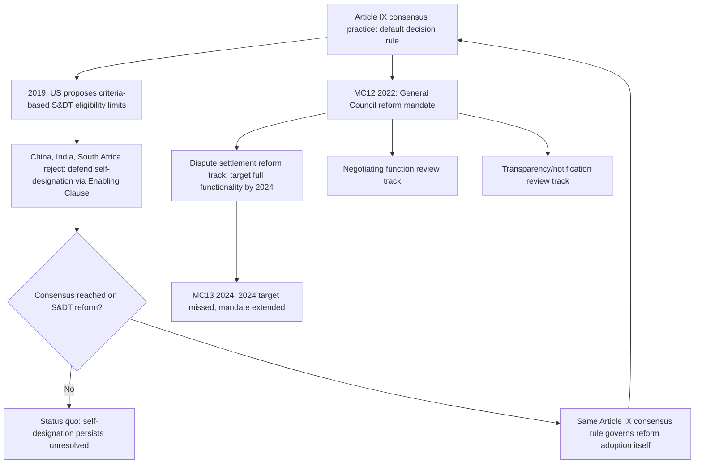

## The WTO Reform Work Programme: Decision-Making, Special and Differential Treatment, and the Level Playing Field Debate

### Legal Basis: What "Reform" Actually Targets

The WTO reform agenda is not anchored in a single treaty provision but spans three structurally distinct legal issues, each with its own textual foundation:

- **Decision-making**: governed by **Article IX** of the Marrakesh Agreement Establishing the WTO, which sets consensus as the default practice ("the WTO shall continue the practice of decision-making by consensus" — Article IX:1) with formal voting as a rarely-invoked fallback (three-fourths majority for most matters, and unanimity or specific supermajorities for waivers and amendments under Articles IX:3–4 and Article X). Reform proposals target the *practice* of consensus, not the treaty text itself, since amending Article IX would itself require the consensus it seeks to reform.
- **Special and differential treatment (S&DT)**: a body of provisions scattered across nearly every WTO agreement (e.g., **GATT Article XXXVI–XXXVIII** added via the 1965 Part IV, **TRIPS Article 66** transition periods, **Agreement on Subsidies and Countervailing Measures Article 27**) granting developing-country Members longer implementation timelines, technical assistance entitlements, and lesser obligations. Crucially, S&DT eligibility under WTO law operates on **self-designation**: a Member declares its own developing-country status, with no binding WTO mechanism to contest or verify that designation.
- **"Level playing field"**: not a defined legal term but a policy framing, primarily advanced by the United States since roughly 2018–2019, arguing that self-designated developing-country status by economically advanced WTO Members (China, Singapore, South Korea prior to its 2019 announcement, and others) distorts competitive conditions relative to Members that do not claim such status or have graduated from it.

**Key Points**

- Self-designation of developing-country status is not merely a diplomatic norm — it is the operative legal mechanism, since the WTO Agreement contains no objective income-based, capacity-based, or other criteria a panel or the Secretariat could apply to verify claimed status.
- Reform proposals affecting S&DT would require consensus to formally amend, meaning any change is subject to the same decision-making constraints the broader reform agenda separately targets — a structural bind where the veto-based decision architecture nearly forecloses using treaty amendment to fix perceived flaws in S&DT eligibility.
- "Level playing field" arguments are contested empirically as well as legally: critics note that even large self-designated developing economies typically already forgo the most consequential S&DT provisions (e.g., China's WTO Accession Protocol, negotiated in 2001, imposed WTO-plus obligations exceeding many standard developed-country commitments in several areas).

### Procedural Mechanism: The 2018–Present Reform Track

The formal WTO reform process runs through General Council and Ministerial Conference channels rather than a standalone legal instrument:

1. **Trigger**: a series of unilateral and joint communications beginning in 2018, most prominently a **US Trade Representative communication to the General Council (WT/GC/W/757, February 2019)** proposing criteria-based limits on self-declared developing-country status (e.g., OECD membership, G20 membership, World Bank high-income classification, or a specified global trade-share threshold) that would disqualify a Member from invoking future S&DT flexibilities in ongoing and future negotiations.
2. **Response and counter-proposals**: China, India, South Africa, and other developing-country Members rejected the criteria-based approach in General Council submissions, defending self-designation as a sovereign prerogative consistent with the WTO's founding development mandate (referencing the **1979 Enabling Clause**, the GATT-era decision permitting differential and more favourable treatment for developing countries as a permanent legal basis, not a temporary derogation).
3. **Ministerial mandate for institutional reform broadly**: **MC12 (June 2022)** produced a General Council-endorsed process to "conduct discussions with a view to having a fully and well-functioning dispute settlement system accessible to all Members by 2024" and to review the functioning of all three WTO pillars (negotiating, monitoring, dispute settlement), formalized through a **General Council decision establishing a reform process** with dedicated informal processes on dispute settlement, on transparency/notification, and on the negotiating function.
4. **MC13 (February 2024, Abu Dhabi)**: extended the dispute-settlement reform mandate (the 2024 target for a fully functioning system was not met) while reaffirming the broader institutional review process, without resolving the S&DT criteria dispute, which remains unaddressed in binding form.

The procedural bind for practitioners is structural: because Article IX consensus governs the reform process *itself*, the same veto dynamics the reform agenda seeks to address (one Member's ability to block outcomes) also govern whether reform proposals can be adopted — a self-referential constraint with no clean institutional exit.

### Case Illustration: China's S&DT Status and the 2019 Flashpoint

China's continued self-designation as a developing-country Member became the paradigmatic case animating the level-playing-field critique. China acceded to the WTO in 2001 under an **Accession Protocol** containing numerous WTO-plus obligations (including a 15-year non-market-economy methodology provision for anti-dumping purposes that expired in December 2016, itself a separate and heavily litigated issue — see **EU — Price Comparison Methodologies**, DS516, which China terminated before a panel ruling). Despite this, China continues to invoke S&DT flexibilities in ongoing negotiations, including in the **Fisheries Subsidies Agreement** negotiations, where transition-period and technical-assistance provisions for developing Members were a central negotiating fault line.

The Trump administration's 2019 communication proposed that any Member satisfying one or more of several objective criteria — OECD membership, G20 membership, over 0.5% share of world merchandise trade, or World Bank high-income classification — should not be entitled to invoke S&DT in current or future negotiations. China's economy satisfies the G20 and global-trade-share criteria comfortably, making it the clear (if not explicitly named) target. No consensus decision adopting these criteria has been reached, and the proposal remains formally pending without resolution — illustrating how even a well-specified reform proposal with clear objective criteria can stall indefinitely absent consensus, regardless of its analytical coherence.

### The Legitimacy Debate: Strongest Form of Each Position

**Case for criteria-based S&DT reform ("level playing field"):**

- Extending identical flexibilities to economies with vastly different capacities — from least-developed countries with minimal administrative capacity to G20 economies with sophisticated trade bureaucracies and, in some cases, larger trade volumes than long-standing "developed" Members — undermines the coherence of S&DT as a capacity-based accommodation rather than a status entitlement, weakening the rationale for special treatment across the board.
- Because S&DT provisions were negotiated as part of the Uruguay Round single undertaking's grand bargain, self-designation by advanced developing economies arguably captures negotiating flexibility intended for lower-capacity Members, distorting the original bargain's distributive logic without any WTO mechanism to correct for economic development that has occurred since accession.

**Case for preserving self-designation and broad S&DT:**

- The **Enabling Clause's** legal basis for differential treatment was deliberately drafted without an objective graduation mechanism precisely because development is multidimensional and contested — GDP per capita, trade share, or OECD membership each capture only partial and contestable proxies for genuine capacity constraints (a small, trade-exposed economy with high per-capita income can face different vulnerabilities than a large, low-income economy with substantial trade volume).
- Criteria-based proposals have overwhelmingly originated from and disproportionately would constrain a small number of large emerging economies, while the practical S&DT benefit most developing and least-developed Members actually rely on (technical assistance, extended implementation periods for capacity-intensive obligations like TRIPS enforcement or SPS/TBT conformity infrastructure) would be unaffected by graduating a handful of larger economies — meaning the proposal's stated universal rationale may substantially overstate its actual redistributive effect.
- Developing-country Members note that no comparable objective criteria exist for graduating out of *developed*-country privileges or obligations, so the reform push singles out S&DT specifically rather than proposing symmetric capacity-based review of the entire membership's obligation structure.

### Practitioner Implications

For a negotiator engaging in the current reform process, the operative reality is that S&DT reform is very unlikely to proceed through formal amendment given the consensus requirement, meaning the more probable pathway — visible already in the Fisheries Subsidies and JSI negotiating tracks — is *negotiation-specific* S&DT calibration, where flexibility is bargained issue-by-issue within a given text (as occurred in the Fisheries Subsidies Agreement's differentiated transition periods) rather than resolved as a cross-cutting systemic rule. For a dispute-settlement-focused practitioner, the parallel and arguably more consequential reform track is the ongoing effort to restore a functioning Appellate Body or equivalent — since a WTO Agreement lacking binding two-tier adjudication undermines the practical value of *any* substantive right, S&DT included, that depends on enforcement to have effect. [Inference — relative prioritization judgment, not a stated WTO position]

**Related Topics**

- The Appellate Body crisis and the Multi-Party Interim Appeal Arbitration Arrangement (MPIA)
- The Enabling Clause and its role as the legal basis for the Generalized System of Preferences
- Fisheries Subsidies Agreement transition-period negotiations as an S&DT case study
- China's WTO Accession Protocol and non-market-economy status litigation
- Consensus decision-making reform proposals and alternative voting-threshold models