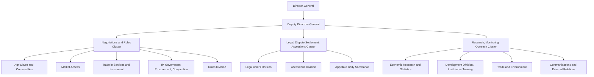

## Careers Within the WTO Secretariat and Its Divisional Structure

### Institutional Basis: The Secretariat's Legal Character

The WTO Secretariat's basis is **Article VI** of the Marrakesh Agreement Establishing the WTO, which provides for a Secretariat headed by a **Director-General** appointed by the Ministerial Conference, staffed on terms and conditions the Director-General determines subject to General Council-approved regulations. Two structural facts distinguish Secretariat employment from national civil service or private-sector trade-law practice:

- **International civil servant status**: Secretariat staff owe their duty exclusively to the WTO as an institution and its full Membership, not to any individual Member government. Article VI:4 specifically requires that the Director-General and staff "not seek or accept instructions from any government or any other authority external to the WTO," and that Members respect this independence.
- **No formal adjudicative role for staff**: unlike an international court's registry, the Secretariat does not itself decide disputes — panels are composed of ad hoc panelists selected per dispute (**DSU Article 8**), with the Secretariat's Legal Affairs Division and Rules Division providing legal and drafting support, research, and institutional memory, but no decisional authority. This distinction matters for anyone targeting a Secretariat legal-affairs role expecting judicial-style work: the function is closer to a specialized international-organization counsel's office than a court clerkship.

**Key Points**

- The Secretariat is deliberately structured to be substantively independent of any Member's instructions, which is the institutional guarantee underpinning its function as a neutral broker in negotiations and disputes.
- Secretariat staff support the negotiating, monitoring, and dispute-settlement pillars, but formal decision-making authority rests with the Members acting through the Ministerial Conference, General Council, and subsidiary councils and committees, not with Secretariat officials.

### Divisional Structure: How Functional Areas Map to the Secretariat

The Secretariat is organized into functional Divisions, each reporting through Deputy Director-Generals to the Director-General, broadly clustering into three operational groupings that mirror the WTO's core mandate areas:

1. **Trade negotiations and rules divisions** — covering the subject areas around which councils and committees are organized, including **Agriculture and Commodities**, **Market Access** (tariffs, non-tariff barriers, rules of origin, customs valuation, import licensing, information technology products, trade facilitation), **Trade in Services and Investment**, **Intellectual Property, Government Procurement and Competition** (covering TRIPS and the plurilateral GPA), **Rules** (anti-dumping, subsidies and countervailing measures, safeguards, regional trade agreements), and **Agriculture and Fisheries Subsidies** work streams that have grown alongside the 2022 Fisheries Subsidies Agreement's implementation needs.
2. **Legal, dispute-settlement, and accession divisions** — the **Legal Affairs Division** and **Rules Division** provide legal support across disputes and negotiations; the **Appellate Body Secretariat** (though functionally constrained since the Appellate Body's 2019 loss of quorum) maintains institutional continuity; and the **Accessions Division** manages Working Party processes for governments negotiating WTO membership, drafting Working Party reports and coordinating market-access schedules with acceding governments.
3. **Economic research, monitoring, and outreach divisions** — the **Economic Research and Statistics Division** produces the WTO's trade forecasts and the annual World Trade Report; the **Trade and Environment**, **Trade and Development**, **Development Division**, and **Institute for Training and Technical Cooperation** support capacity-building and Enabling-Clause-related work for developing and least-developed Members; and **Communications and External Relations** manages public engagement, the WTO website, and press functions.

Newer or expanding functional areas reflect issues that have gained negotiating salience since the mid-2010s: **Digital Trade** (supporting the Joint Statement Initiative on e-commerce), **Climate Change**, **Investment Facilitation for Development**, and **MSME (Micro, Small and Medium-sized Enterprises)** work, each typically embedded within or coordinated across the divisions listed above rather than constituting wholly separate standing divisions in every case.

### Entry Pathways: Mechanism for Securing a Secretariat Position

The Secretariat recruits through several distinct, non-overlapping channels, each with different eligibility gates:

1. **Young Professionals Programme (YPP)**: a one-year, non-renewable entry-level programme (monthly stipend in the CHF 4,000 range as of the 2027 cycle) restricted to candidates up to age 32 from **WTO Members with low or no professional representation in the Secretariat** — a deliberate geographic-diversity mechanism rather than a general graduate-entry scheme. Applicants list up to three preferred functional areas from an extensive list spanning **Accessions, Agriculture, Climate Change, Communications and External Relations, Competition Policy, Council and Trade Negotiations, Digital Trade, Dispute Settlement, Economic Research and Statistics, Fisheries Subsidies, Government Procurement (GPA), Intellectual Property Rights, Investment Facilitation for Development, MSMEs, Market Access, Sanitary and Phytosanitary measures, Technical Barriers to Trade, Trade and Development, Trade and Environment, and Trade Facilitation**, with placement in a specific Division determined by organizational needs and priorities as well as the candidate's stated interests. This is the primary formal pipeline for early-career candidates from underrepresented Members, and a mandatory cover letter specifying area preferences in order of priority is required for a complete application. [ntou](https://academics.ntou.edu.tw/files/202403210948480760.pdf)[impactpool](https://impactpool.org/jobs/1206760)
2. **Regular vacancy-based recruitment**: entry-level and experienced positions (e.g., Legal/Economic Affairs Officer roles) are posted division-by-division as vacancies arise, typically requiring a relevant advanced degree (law, economics, international relations) plus several years of specialized experience for anything beyond the most junior grades. For example, an Accessions Division Legal/Economic Affairs Officer role involves functioning as Secretary or Co-Secretary of accession Working Parties, drafting Working Party Reports, Chairperson's Notes, and briefing notes, and conducting economic and trade-related research and analysis. [impactpool](https://www.impactpool.org/jobs/1211325)
3. **General service and administrative support positions**: divisions also recruit for administrative and coordination functions; the Market Access Division, for instance, has recruited office assistant positions supporting document formatting, proofreading, and administrative coordination under the Divisional Coordinator's supervision. [impactpool](https://www.impactpool.org/jobs/1220469)
4. **Secondments and Missions-based pathways**: national governments frequently second trade officials to Geneva-based delegations to the WTO, which — while not Secretariat employment — is a common adjacent route building the substantive expertise (dispute-settlement litigation experience, negotiating-group participation) that later strengthens Secretariat vacancy applications, since delegation experience directly overlaps with the technical competencies divisions recruit for.

For a candidate targeting a specific division, the practical implication is that **subject-matter specialization** (e.g., a graduate-level economics background suited to Economic Research and Statistics, or trade-law litigation experience suited to Legal Affairs or Rules Division work) matters more than general international-relations credentials once past the YPP entry tier — divisional vacancy notices consistently specify domain-specific technical requirements (e.g., customs valuation expertise for Market Access Division roles, WTO dispute-settlement litigation experience for Legal Affairs) rather than generalist qualifications.

### Case Illustration: The Accessions Division as a Career-Track Case Study

The Accessions Division is illustrative of how Secretariat divisional work concretely differs from national trade-ministry or private-practice work. The Division facilitates negotiations between WTO members and acceding governments in the context of their integration into the multilateral trading system, including through alignment with WTO rules and market access liberalization, serving as a focal point for widening the scope and geographical coverage of the WTO. A staff member in this Division is not advocating for any single Member's interests — the defining contrast with a national ministry role — but rather facilitating a multilateral Working Party process in which existing Members negotiate bilateral and multilateral terms with the acceding government, drafting the eventual Working Party Report and Accession Protocol text (the same instrument type that, as in China's 2001 accession, can carry binding WTO-plus obligations extending well beyond standard multilateral commitments). Comorors and East Timor's 2024 accessions represent recent instances of this Division's active caseload, illustrating that accession work remains a live and recurring functional stream rather than a legacy function from the WTO's early expansion period. [impactpool](https://www.impactpool.org/jobs/1211325)

### Practitioner Implications

For an aspiring trade diplomat or negotiator, Secretariat experience offers a distinctive credential: neutral, cross-Member institutional exposure to how negotiating texts are actually drafted and how Working Party and dispute processes function procedurally — knowledge that is difficult to obtain from a single national vantage point. The trade-off is that Secretariat roles carry no advocacy mandate; a candidate whose career goal is representing a specific Member's negotiating position (a Ministry of Trade or Geneva Mission role) versus facilitating the multilateral process neutrally (a Secretariat role) should weight this distinction heavily, since the two tracks develop different skill emphases — persuasive advocacy and domestic-interest translation in the former, procedural neutrality and multilateral drafting precision in the latter — even though both draw on the same underlying subject-matter expertise in trade law and economics.

**Related Topics**

- The WTO Institute for Training and Technical Cooperation and capacity-building career tracks
- Geneva Mission postings and the relationship between national delegations and the Secretariat
- The Appellate Body Secretariat's function amid the appellate-body appointment crisis
- Accession Working Party procedure and the Accession Protocol as a legal instrument
- Comparative career pathways: WTO Secretariat versus UNCTAD, WCO, and regional trade-body secretariats