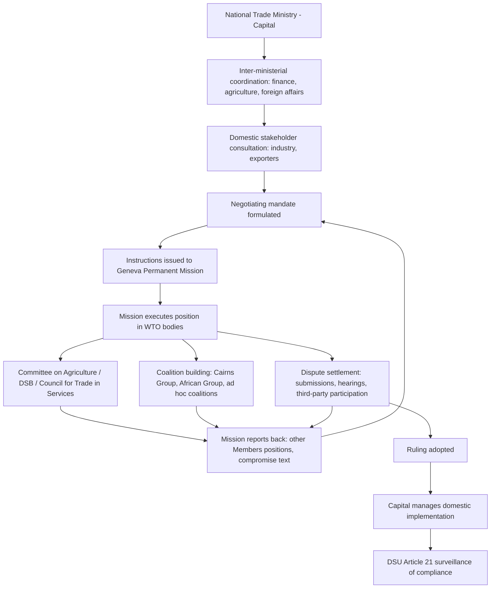

## National Trade Ministry and Geneva Permanent Mission Career Tracks

### Institutional Basis: Where This Track Sits in the WTO's Legal Architecture

Unlike Secretariat employment, national trade ministry and Geneva Mission careers operate as representatives *of* a Member rather than *for* the institution. The legal basis for this role is the WTO Agreement's foundational premise that the organization is Member-driven: **Article IV** of the Marrakesh Agreement establishes the Ministerial Conference, General Council, and specialized councils as composed of "representatives of all the Members" — meaning the substantive negotiating, monitoring, and dispute-litigation work of the WTO is conducted by national officials, not Secretariat staff, who facilitate but do not decide.

Two distinct institutional postings constitute this pathway:

- **Capital-based national trade ministry official**: sets negotiating mandates, formulates domestic trade policy positions, coordinates with other ministries (finance, agriculture, foreign affairs) and domestic stakeholders (industry associations, exporters, civil society), and instructs the Geneva Mission on positions to take in committee and negotiating sessions.
- **Geneva Permanent Mission (Delegation) official**: physically represents the Member in WTO councils, committees, negotiating groups, and dispute-settlement proceedings, executing capital-instructed positions while also feeding real-time intelligence and tactical assessment back to capital — a function requiring both technical trade-law fluency and skilled diplomatic judgment about what is negotiable in the room.

**Key Points**

- The capital/Geneva division of labor mirrors a standard foreign-ministry structure (headquarters formulates policy, mission executes and reports), but WTO-specific technical complexity — legal text interpretation, dispute-settlement procedure, tariff-schedule mechanics — means Geneva Mission trade officials typically require specialized training beyond generalist diplomatic preparation.
- For **least-developed and small developing-country Members**, resource constraints often mean a single Geneva-based diplomat covers WTO alongside other Geneva-based international organizations (UN human rights bodies, WIPO, WHO), producing a materially different career profile than the dedicated, often multi-person WTO-only missions maintained by large trading powers.
- Under **DSU Article 8.1**, panelists are drawn from a roster including "persons who have served on or presented a case to a panel," meaning experienced Geneva Mission trade-law officials and capital-based negotiators form part of the practical talent pool from which ad hoc dispute panels are constituted — creating a direct career linkage between mission/ministry experience and later panelist service.

### Procedural Mechanism: How the Two Postings Function Together in Practice

The operational mechanism linking capital and Geneva runs through a continuous instruction-and-reporting cycle, structured around the WTO's standing committee and council calendar:

1. **Mandate formulation in capital**: a national trade ministry (often within a dedicated WTO or multilateral trade division) develops negotiating positions through inter-ministerial coordination, drawing on domestic industry consultation and economic analysis, then issues formal instructions to the Geneva Mission ahead of each relevant committee or council meeting (e.g., the **Committee on Agriculture**, the **Dispute Settlement Body**, the **Council for Trade in Services**).
2. **Execution and negotiation in Geneva**: the Mission's trade counsellor or attaché delivers the capital-instructed position in the relevant body, engages informally with counterpart missions to build coalitions (e.g., within the **Cairns Group** on agriculture, the **African Group**, or ad hoc issue coalitions), and reports back on other Members' positions, emerging compromise text, and tactical opportunities.
3. **Dispute-settlement litigation function**: when a Member is a complainant or respondent in a dispute, the Geneva Mission — often supplemented by capital-based legal counsel or outside law firms specializing in WTO litigation — prepares written submissions, participates in panel and (historically) Appellate Body hearings, and coordinates third-party submissions strategy under **DSU Article 10** when the Member has a substantial interest in another dispute but is not itself a party.
4. **Feedback loop for domestic implementation**: once agreements or dispute rulings are reached, the capital-based ministry manages domestic implementation — legislative or regulatory changes required to bring measures into WTO conformity, a process monitored under **DSU Article 21** (surveillance of implementation of recommendations and rulings) and, for market-access commitments, schedule modification procedures under **GATT Article XXVIII** or **GATS Article XXI**.

For a practitioner, the critical procedural skill this track develops is not merely knowledge of substantive trade law but **negotiating-mandate management**: translating a capital's political constraints into workable negotiating room in Geneva, and translating Geneva's tactical read of the multilateral dynamic back into realistic mandate adjustments — a two-way translation function that experienced trade diplomats consistently identify as the core competency distinguishing effective Geneva Mission service from purely technical legal expertise.

### Case Illustration: Third-Party Participation as a Capacity-Building Career Pathway

**DSU Article 10** and **Article 10.2** allow any Member with a "substantial interest" in a matter before a panel to notify its interest and be granted an opportunity to be heard and to make written submissions — even without being a principal party to the dispute. This mechanism has functioned, in practice, as an important professional-development pathway for smaller and developing-country Missions: participating as a third party allows a Mission's trade officials to build direct dispute-settlement litigation experience — drafting submissions, observing panel and (pre-2019) Appellate Body hearings, and engaging with the legal reasoning of active disputes — without bearing the full cost, political exposure, and resource burden of being a principal complainant or respondent.

This pattern is visible across major disputes with high third-party participation counts — cases like the various Section 232 steel and aluminum tariff disputes and historic disputes like **US — Shrimp/Turtle** attracted numerous third-party notifications from Members whose direct commercial stake was modest relative to major exporters, but whose legal or systemic interest (e.g., in the interpretation of environmental exceptions under **GATT Article XX**, or security exceptions under **Article XXI**) justified the investment in building institutional dispute-settlement capacity. For a Geneva Mission official from a smaller Member, sustained third-party engagement across multiple disputes over a multi-year posting is often the single most effective way to accumulate credible dispute-settlement expertise short of direct litigation experience as a principal party — expertise that then becomes a differentiating credential for later WTO Secretariat vacancy applications, academic appointments, or private-practice trade-law recruitment. [Inference — career-development characterization drawn from the structural incentives of third-party participation, not a stated WTO policy conclusion]

### The Legitimacy and Effectiveness Debate: Resource Asymmetry in Practice

**Case that the capital/Geneva structure functions adequately across the membership:**

- The WTO's **Institute for Training and Technical Cooperation**, along with dedicated technical assistance programmes tied to Trade-Related Technical Assistance (TRTA) mandates under multiple agreements, exists precisely to build capacity in smaller Missions, providing training in dispute-settlement procedure, negotiating-text drafting, and tariff-schedule technical work — meaning the formal mechanism for narrowing the capacity gap already exists within WTO institutional design.
- The **Advisory Centre on WTO Law (ACWL)**, an independent intergovernmental organization created in 2001 specifically to provide developing-country and LDC Members with subsidized legal advice and litigation support, materially reduces the cost barrier to dispute-settlement participation that would otherwise track the ministry/mission resourcing gap most directly.

**Case that the structure reproduces significant power asymmetries:**

- Large trading powers (the United States, the EU, China, Japan) maintain Geneva Missions with dozens of dedicated trade specialists and direct access to well-resourced capital-based legal and economic analysis units, while many developing-country and LDC Missions cover WTO responsibilities with one or two generalist diplomats also responsible for other Geneva-based organizations — a structural resource asymmetry that directly affects which Members can realistically participate as complainants (rather than only third parties) in dispute settlement, monitor the full committee calendar, or contribute substantively to text-based negotiations across every negotiating track simultaneously.
- Even with ACWL support, the underlying mandate-formulation capacity in capital — the inter-ministerial coordination and domestic economic analysis feeding Geneva instructions — remains uneven across the membership, meaning subsidized litigation support addresses only one segment of the capacity gap (courtroom representation) while leaving the upstream policy-formulation capacity gap largely unaddressed.

### Practitioner Implications

For an aspiring trade diplomat evaluating this track against the WTO Secretariat pathway, the defining trade-off is **advocacy versus neutrality**: a ministry or Mission career builds deep expertise in representing a specific Member's interests, translating domestic political and economic constraints into international negotiating positions — a skill set directly transferable to private-sector trade-law and government-relations roles — whereas Secretariat experience builds procedural and drafting expertise from a neutral facilitation standpoint. A candidate targeting eventual dispute-settlement litigation practice should prioritize Geneva Mission postings with active third-party participation opportunities specifically, since sustained exposure to live panel proceedings — even without principal-party status — builds the procedural fluency that later distinguishes credible WTO litigation practitioners, whether they remain in government service, move to the ACWL, or transition to private international trade-law practice.

**Related Topics**

- The Advisory Centre on WTO Law and subsidized dispute-settlement legal support
- Coalition dynamics: the Cairns Group, the African Group, and ad hoc negotiating alliances
- DSU Article 10 third-party rights and their strategic use in capacity building
- The WTO Institute for Training and Technical Cooperation's role in Mission capacity building
- Transitions from government service to private WTO-focused trade-law practice