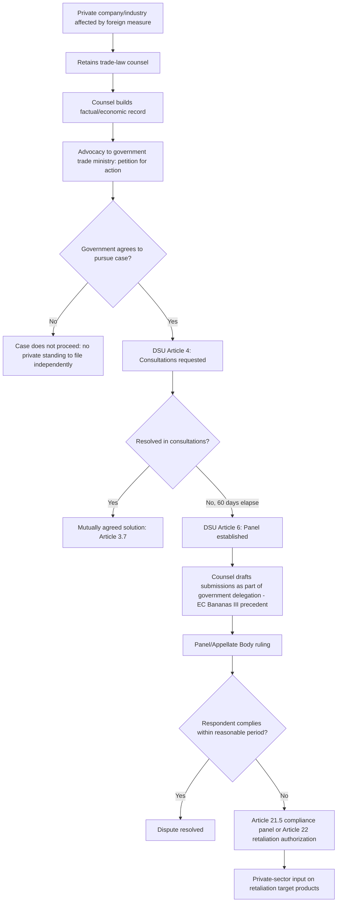

## Trade Law Practice: Representing Members and Private Parties Before WTO Panels

### Legal Basis: Standing Before Panels and the Private-Party Access Gap

The foundational structural fact for this practice area is that the **WTO dispute settlement system has no standing for private parties**. **DSU Article 1.1** confines the DSU's coverage to disputes "brought pursuant to the consultation and dispute settlement provisions of the covered agreements," and **Article XXIII of GATT 1994** (the nullification-or-impairment basis carried into the DSU framework) frames the cause of action as one Member against another. A company injured by another country's WTO-inconsistent measure — a tariff, a subsidy, a technical barrier — cannot itself file a WTO complaint; it must persuade its *own government* to bring the case as complainant.

This produces the practice area's defining structural feature:

- **Government-as-plaintiff, private-party-as-client**: private-sector trade lawyers typically represent an industry association or company whose commercial interest is affected, but the *legal* client of record before the panel is always the Member government. The lawyer's actual function is persuading and supporting the government's own trade ministry and Geneva Mission to litigate on the industry's behalf — a fundamentally different posture from domestic commercial litigation.
- **Panel composition and standing of counsel**: **DSU Article 8** and the Appellate Body's ruling in ***EC — Bananas III*** (DS27, 1997) confirmed that Members may include private legal counsel as part of their delegation before a panel — a holding that was contested at the time (the EU objected to the United States including private counsel in its delegation) but is now settled practice, meaning private trade-law firms and specialized boutiques routinely draft submissions and appear as part of the government delegation, not as independent counsel of record.
- **Amicus curiae as the only direct non-government channel**: as established in ***US — Shrimp/Turtle*** (DS58) and extended in ***US — Lead and Bismuth II*** (DS138), non-parties including affected private companies or industry associations may submit unsolicited amicus briefs directly to panels or the Appellate Body, but acceptance and engagement remain fully discretionary, making this a supplementary rather than primary channel for private-party input.

**Key Points**

- The absence of private standing means the practice area's core skill is less "litigation" in the domestic-court sense and more "persuading and supporting a sovereign client" — trade lawyers must build the legal and economic case, but a government retains full discretion over whether to file, what claims to pursue, and whether to settle or withdraw at any stage.
- **DSU Article 12.7** and the general practice of "mutually agreed solutions" under **Article 3.7** mean disputes frequently resolve or narrow without a full panel ruling — a private-party client's commercial interest in a definitive ruling can diverge from the government client's interest in a negotiated resolution, creating a distinctive alignment-of-interests dynamic practitioners must manage.
- Specialized WTO trade-law practice sits at the intersection of public international law and domestic trade-remedy law (anti-dumping, countervailing duty, and safeguard proceedings conducted by national authorities), since many WTO disputes originate from a challenge to a Member's domestic trade-remedy determination.

### Procedural Mechanism: The Practitioner's Role Across the Dispute Lifecycle

The mechanism by which private-sector counsel engages runs through several distinct stages, each requiring different skills:

1. **Pre-litigation case-building**: counsel for an affected industry assembles the factual and economic record — data on trade flows, injury, and the precise text of the foreign measure alleged to be WTO-inconsistent — and prepares a formal request (often through established domestic channels, such as a petition process analogous to those used for national trade-remedy investigations, or direct advocacy to the trade ministry) urging the government to pursue **consultations** under **DSU Article 4**, the mandatory first step before a panel may be requested.
2. **Consultations phase**: **DSU Article 4.3** requires the responding Member to enter consultations within 30 days, with a 60-day window before the complainant may request a panel if consultations fail to resolve the matter. Private counsel typically drafts the substantive legal analysis underlying the government's consultation request even though the government signs and delivers it formally.
3. **Panel proceedings**: once a panel is established under **DSU Article 6**, counsel drafts first written submissions, rebuttal submissions, and oral statements for the government delegation, and often participates directly in panel meetings as part of that delegation per the *EC — Bananas III* precedent. This stage demands treaty-interpretation fluency under **Vienna Convention on the Law of Treaties Articles 31–32** and close familiarity with prior panel and Appellate Body reasoning, since WTO adjudication — while not formally following stare decisis — treats prior rulings as carrying substantial interpretive weight in practice.
4. **Post-ruling compliance and retaliation phases**: if a panel or Appellate Body finds a violation and the responding Member fails to comply within the "reasonable period of time" (**DSU Article 21.3**), counsel may support the complainant government through **Article 21.5** compliance-panel proceedings or **Article 22** requests for authorization to suspend concessions (retaliatory tariffs) — a phase where private-sector input on which products should be targeted for retaliation (to maximize political pressure while minimizing harm to domestic consumers) is often directly solicited by the government, as seen in the EU and Canada's product-selection processes for Section 232 rebalancing measures.

For a practitioner, the compliance and retaliation phase is frequently where private-sector client interests are most directly and formally incorporated into government decision-making, since target-product selection for retaliatory tariffs is a discrete, technical exercise where industry input has direct, traceable influence — unlike the more diffuse influence private counsel exercises over core legal-argument strategy.

### Case Illustration: *EC — Bananas III* and the Precedent for Private Counsel

***European Communities — Regime for the Importation, Sale and Distribution of Bananas*** (DS27) is the foundational case establishing private counsel's role in WTO litigation. The dispute — brought by the United States, Ecuador, Guatemala, Honduras, and Mexico against the EU's banana import licensing regime, which favored former European colonies under the Lomé Convention over Latin American producers — saw the United States include private legal counsel as part of its delegation before the panel. The European Communities objected, arguing that only government officials should represent a Member before a WTO panel. The panel and subsequently the Appellate Body rejected this objection, holding that a Member has the right to determine the composition of its own delegation, including private counsel — a ruling that, procedurally minor as it may have seemed at the time, effectively opened the door to the now-standard practice of specialized WTO trade-law firms and boutiques drafting submissions and appearing alongside government officials in virtually every significant WTO dispute since.

The underlying banana dispute itself illustrates the private-interest-behind-government-litigation dynamic directly: the case was driven substantially by the commercial interests of major US-based fruit companies (Chiquita and Dole prominently among them) whose Latin American supply chains were disadvantaged by the EU's preferential treatment of African, Caribbean, and Pacific (ACP) producers, even though the United States itself produces negligible bananas — the US government's standing to bring the claim rested on the broader systemic interest in challenging discriminatory quota administration, illustrating how a WTO complainant's formal legal standing can diverge from the direct commercial stake driving the litigation.

### The Debate: Access and Equity Implications of Government-Mediated Standing

**Case that government-mediated standing is appropriate:**

- WTO disputes are formally state-to-state matters concerning treaty compliance between sovereigns (**GATT Article XXIII**'s nullification-or-impairment framing), and permitting direct private access would convert the WTO into an investor-state-style forum, fundamentally altering the character of an institution designed around inter-governmental negotiation and mutually agreed solutions under **Article 3.7**.
- Government screening of private claims serves a useful gatekeeping function, filtering out commercially motivated but systemically weak claims and allowing broader trade-policy and diplomatic considerations (retaliation risk, relationship management with the respondent Member) to inform whether litigation is actually in the national interest, not merely the petitioning company's interest.

**Case that the absence of private standing creates access inequities:**

- Large multinational companies and well-organized industry associations from major trading powers have far greater practical capacity to build the evidentiary case and sustain the sophisticated advocacy needed to secure government sponsorship than small and medium-sized exporters, particularly those based in developing countries with less institutionalized petition processes — meaning government-mediated standing does not neutrally screen for legal merit but tracks underlying access-to-government-influence asymmetries.
- Companies from Members without a well-resourced Geneva Mission or ministry trade-law capacity (the same asymmetry animating the ACWL's creation) face a compounded barrier: even a strong legal claim may never reach a panel if the government lacks the litigation capacity or political appetite to pursue it, regardless of the claim's underlying merit — a gap the **Advisory Centre on WTO Law**'s subsidized-representation model was designed to narrow but does not eliminate, since ACWL support addresses litigation cost rather than the prior political decision to litigate at all.

### Practitioner Implications

For a lawyer entering this practice area, the essential professional skill is dual-track client management: building a legally and economically rigorous case sufficient to convince a skeptical or resource-constrained trade ministry that litigation serves the *national* interest (not merely the client's commercial interest), while simultaneously managing the private client's expectations about the government's ultimate control over litigation strategy, timing, and settlement — a dynamic with no close domestic-litigation analogue. Practitioners specializing in this area typically build parallel expertise in a Member's domestic trade-remedy law (anti-dumping and countervailing duty investigation procedure), since a substantial share of WTO disputes originate from challenges to specific domestic trade-remedy determinations, meaning fluency in both the originating domestic administrative process and the WTO-level treaty claims is what differentiates specialist WTO trade-law practice from generalist international trade counsel.

**Related Topics**

- The Advisory Centre on WTO Law and its subsidized representation model for developing-country Members
- Domestic trade-remedy investigations (anti-dumping, countervailing duty, safeguards) as dispute origination points
- DSU Article 22 retaliation authorization and product-selection methodology
- Amicus curiae practice and its limits as a private-party input channel
- The Appellate Body crisis and its effect on private-sector litigation risk calculus