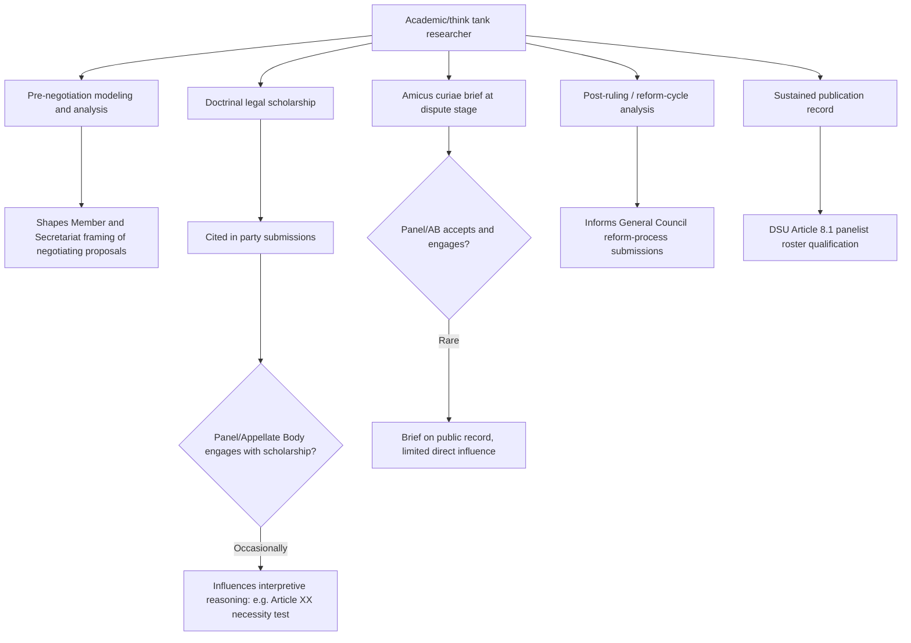

## Academic and Think Tank Research Pathways in International Trade Law and Policy

### Institutional Basis: How Research Pathways Interface With the WTO's Formal Structure

Unlike the Secretariat, ministry, or private-practice tracks, academic and think tank research has no formal standing role within WTO legal or procedural mechanisms — but it interfaces with the system through several recognized channels:

- **Amicus curiae submissions**: as established in ***US — Shrimp/Turtle*** (DS58) and ***US — Lead and Bismuth II*** (DS138), academics and research institutions may submit unsolicited briefs to panels and the Appellate Body under the panels' general fact-finding discretion (**DSU Article 13**). Acceptance and substantive engagement remain discretionary and historically limited, meaning this channel functions more as a way to place analysis on the public record than as a reliable avenue for direct influence on rulings.
- **Panelist and arbitrator rosters**: **DSU Article 8.1** specifies that panels should be composed of "well-qualified governmental and/or non-governmental individuals," explicitly including academics with recognized standing in international trade law or policy — meaning sustained scholarly expertise is a direct, formal qualification pathway into ad hoc adjudicative service, distinct from litigation practice.
- **Working Party and negotiating-group technical input**: accession Working Parties and negotiating groups frequently draw on independent economic modeling and legal analysis — from institutions like the **World Bank**, the **Peterson Institute for International Economics**, **Chatham House**, and university-based trade law centers — to inform Member positions, even though such analysis carries no formal evidentiary status before a panel.
- **The WTO's own research function**: the Secretariat's **Economic Research and Statistics Division** produces the annual *World Trade Report* and trade forecasts, creating a recognized channel through which Secretariat-employed economists (a partially overlapping career track with pure academia) shape institutional and Member understanding of trade trends.

**Key Points**

- Because WTO adjudication is not formally bound by academic commentary or amicus submissions, the primary influence channel for research pathways is indirect: shaping how governments, the Secretariat, and eventually panelists interpret ambiguous treaty text, rather than direct advocacy analogous to litigation practice.
- The **Advisory Centre on WTO Law (ACWL)**, while primarily a litigation-support body, also produces training materials and legal analysis that function as a hybrid between academic output and practitioner support, illustrating how the research and practice tracks overlap rather than remaining fully separate.
- Panelist selection under Article 8 explicitly values academic credentials, meaning a sustained publication record in WTO law is a recognized, direct qualification — not merely an indirect influence channel — for eventual adjudicative service.

### Procedural Mechanism: How Research Actually Enters the Policy and Legal Process

The mechanism by which academic and think tank work influences WTO governance runs through several distinguishable channels, each with different timing and audience:

1. **Pre-negotiation agenda-setting research**: economic modeling of prospective agreements (e.g., computable general equilibrium modeling of tariff-reduction scenarios) produced by institutions such as the Peterson Institute or university trade-policy centers often shapes how Members and the Secretariat frame the expected costs and benefits of a negotiating proposal well before formal text exists — most visibly in the run-up to major initiatives like the Trade Facilitation Agreement negotiations and the ongoing e-commerce Joint Statement Initiative.
2. **Doctrinal legal scholarship shaping interpretive arguments**: law review articles and treatises analyzing ambiguous provisions (for instance, extensive academic commentary on **GATT Article XXI**'s justiciability question preceding the 2019 ***Russia — Traffic in Transit*** panel report) are frequently cited in party submissions and, on occasion, directly referenced in panel or Appellate Body reasoning — the Appellate Body has cited academic commentary in interpreting concepts such as "necessity" under **Article XX** and technical terms under the **SPS** and **TBT Agreements**.
3. **Amicus brief submission at the dispute stage**: research institutions and individual academics submit formal amicus briefs addressing specific pending disputes, following the discretionary acceptance framework established since *US — Shrimp/Turtle*; engagement is uneven, but this remains the most direct formal channel for injecting independent research into a live proceeding.
4. **Post-ruling and reform-cycle analysis**: after significant rulings or ministerial outcomes, academic and think tank analysis assessing legitimacy, distributional impact, and enforcement efficacy (for example, extensive post-2019 scholarship on the Appellate Body crisis and its effect on the DSU's Article 17-based appellate mechanism) directly informs the ongoing General Council reform-process discussions launched at MC12 in 2022, since Member delegations frequently draw on this literature in framing reform proposals.

For a researcher, the practical implication is that influence timing matters: pre-negotiation modeling has the highest agenda-setting leverage but the least certainty of adoption, while amicus submissions at the dispute stage have the most direct formal channel but historically the lowest acceptance and engagement rate.

### Case Illustration: Scholarship's Role in the *Russia — Traffic in Transit* Justiciability Debate

The doctrinal question of whether **GATT Article XXI**'s "which it considers necessary" language rendered the provision entirely self-judging or subject to objective panel review had been debated extensively in academic literature for years before it reached formal adjudication in ***Russia — Traffic in Transit*** (DS512, 2019). Legal scholars had long analyzed the 1947 Havana Charter negotiating history, the structure of the enumerated sub-paragraphs (b)(i)–(iii), and comparative treaty-interpretation principles under the **Vienna Convention on the Law of Treaties** to argue for a middle-ground reading — objective review of the qualifying circumstance, paired with deference on the necessity determination itself. The panel's ultimate two-tier framework closely tracked this scholarly middle-ground position, illustrating how sustained academic engagement with an unresolved interpretive question can shape the analytical framework eventually adopted in formal adjudication, even though the scholarship itself carried no binding authority and the panel's reasoning proceeded independently from first principles of treaty interpretation.

This case also illustrates the research pathway's structural limitation: despite the panel's adoption of a legally rigorous framework substantially informed by years of prior scholarly debate, the United States' subsequent rejection of the *Section 232* panel rulings applying that same framework demonstrates that doctrinal clarity achieved through sustained academic and judicial engagement does not by itself secure compliance — a gap between scholarly/legal resolution and political enforcement that is itself now a significant subject of academic and think tank analysis in its own right. [Inference — characterization of the scholarship-to-compliance gap as a distinct research theme, not itself a documented WTO finding]

### The Debate: Independence and Influence Tensions in Trade Research

**Case that academic and think tank research functions as a valuable independent check:**

- Independent economic modeling and legal analysis provide a counterweight to government and industry-funded advocacy, offering Members — particularly smaller Members without extensive in-house analytical capacity — access to rigorous, non-partisan assessments of negotiating proposals and dispute outcomes that would otherwise be filtered entirely through interested parties' framing.
- Academic scholarship's role in shaping the *Russia — Traffic in Transit* framework demonstrates that sustained independent analysis of unresolved legal questions can produce interpretive frameworks of higher analytical quality than would emerge from purely party-driven advocacy in the heat of a specific dispute.

**Case that funding structures and institutional proximity raise independence concerns:**

- Many prominent trade-focused think tanks receive funding from corporate, industry-association, or government sources with direct interests in specific negotiating outcomes, raising questions — actively debated within the field itself — about whether ostensibly independent economic modeling adequately discloses or controls for funder interests, particularly in areas like agricultural liberalization or intellectual-property protection where funding sources often align predictably with modeling conclusions.
- Academic panelists and arbitrators serving under DSU Article 8, while formally required to be independent, often maintain ongoing consulting relationships with governments or private trade-law practices, creating a potential proximity between the scholarly and advocacy tracks that critics argue complicates the presumption of full independence, though no systematic WTO mechanism currently audits this overlap beyond standard conflict-of-interest disclosure requirements.

### Practitioner Implications

For a researcher building a career at this intersection, the most direct formal pathway into adjudicative influence is the Article 8 panelist/arbitrator route, which requires sustained, recognized publication and a reputation for rigor and independence built over years — meaning this pathway rewards deep specialization in a specific doctrinal area (e.g., subsidies law, SPS/TBT technical-barrier jurisprudence, or the security-exception justiciability debate) rather than broad generalist trade-policy commentary. For a researcher targeting policy influence rather than adjudicative service, the pre-negotiation agenda-setting window — producing rigorous modeling and analysis before a negotiating text exists — offers materially higher leverage than post-hoc dispute commentary, given the discretionary and historically limited engagement panels and the Appellate Body have shown toward amicus submissions once a dispute is already underway.

**Related Topics**

- DSU Article 8 panelist and arbitrator qualification criteria and roster composition
- Computable general equilibrium modeling methodology in trade-agreement impact assessment
- The Peterson Institute, Chatham House, and university-based trade law center research traditions
- Amicus curiae practice and its discretionary acceptance history since *US — Shrimp/Turtle*
- Funding transparency debates in trade-focused think tank research