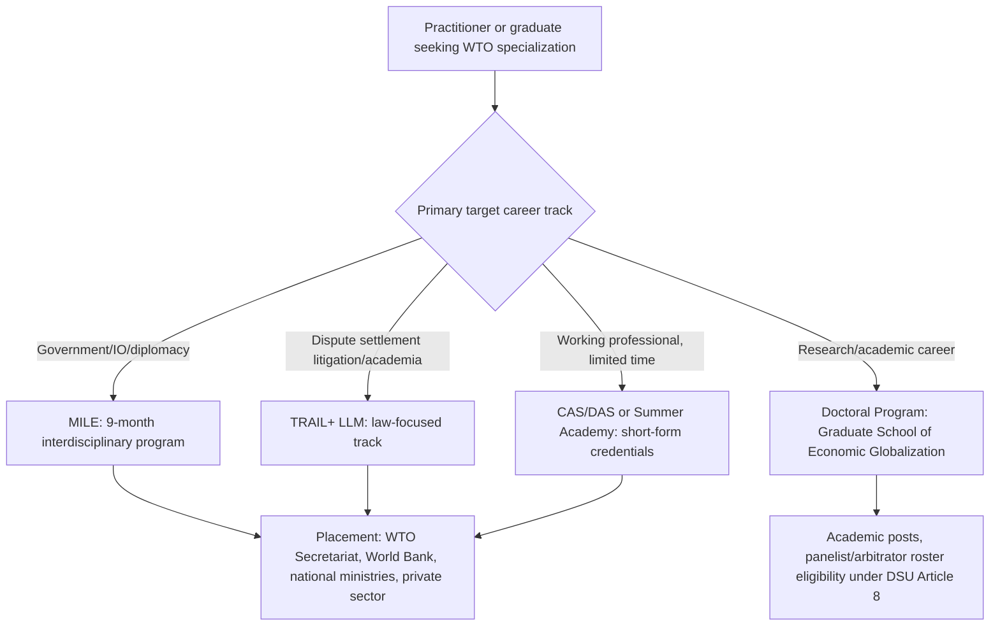

## Professional Credentialing: Trade Law LLMs and Specialized Negotiation Training

### Institutional Basis: Why Credentialing Matters Given the WTO's Legal Complexity

No WTO agreement mandates a specific credential for practitioners — neither **DSU Article 8**'s panelist criteria nor any Secretariat vacancy notice requires a named degree. Credentialing functions instead as a market signal within a field defined by unusually dense interdisciplinary demands: WTO practice requires simultaneous fluency in public international law (treaty interpretation under the **Vienna Convention on the Law of Treaties**), international economics (tariff and subsidy analysis, computable general equilibrium modeling), and multilateral diplomatic procedure — a combination rarely taught within a single traditional law or economics degree.

Three structural facts explain why specialized credentialing programs emerged as a distinct professional pathway:

- **DSU Article 8.1**'s panelist qualification standard — "well-qualified governmental and/or non-governmental individuals," including academics — rewards demonstrated interdisciplinary expertise rather than any specific credential, creating market space for programs designed to build exactly that combination.
- **Domestic legal education gaps**: most national law degrees provide, at best, a single survey course covering WTO law within a broader international economic law curriculum, insufficient for practitioners who need working fluency in the full agreement architecture (GATT, GATS, TRIPS, the Agreement on Subsidies and Countervailing Measures, the SPS and TBT Agreements) plus dispute-settlement procedure.
- **Negotiation as a distinct trainable skill**: unlike litigation, multilateral trade negotiation — managing coalition dynamics, mandate constraints, and issue-linkage bargaining under single-undertaking or plurilateral structures — is a procedural and diplomatic competency not taught in standard legal curricula, creating demand for dedicated negotiation-simulation training distinct from doctrinal legal education.

**Key Points**

- Credentialing programs cluster around Geneva and Geneva-adjacent institutions specifically because proximity to the WTO Secretariat, Permanent Missions, and the dispute-settlement apparatus allows programs to draw on active practitioners as faculty and to place graduates through direct institutional networks.
- The credential itself functions less as a formal gatekeeping requirement (as a bar exam does for domestic litigation) and more as a costly signal of specialized commitment and network access — meaningful for a competitive candidate pool but not a hard requirement for entry.

### Procedural Mechanism: How Specialized Programs Are Structured

The leading dedicated trade-law and policy credentialing pathway is the **World Trade Institute (WTI)** at the University of Bern, Switzerland, founded in 1999 following the WTO's 1995 establishment specifically to train practitioners and researchers in the new institutional architecture. Its structure illustrates the mechanism common across similar programs:

1. **Flagship executive-style master's program**: the **Master of International Law and Economics (MILE)**, a nine-month intensive program integrating in-house WTI staff and international faculty (many drawn from active WTO, Secretariat, and Geneva Mission practice), designed explicitly to prepare graduates for government, international-organization, NGO, and law-firm roles rather than purely academic careers.
2. **Law-focused LLM track**: the **Trade and Investment Law (TRAIL+) LLM**, targeting law graduates and professionals with an existing legal background who want to specialize in international economic law and global economic governance from an interdisciplinary perspective, distinguishing it from the more general MILE track aimed at law, economics, and political science backgrounds alike.
3. **Shorter-form and executive credentials**: Certificate and Diploma of Advanced Studies (CAS/DAS) tracks, à la carte courses, and an annual multi-week Summer Academy, allowing working professionals (ministry officials, Geneva Mission staff) to build targeted competency without committing to a full degree program — directly serving the capital/Geneva practitioner track's need for continuing professional development alongside active postings.
4. **Doctoral and research track**: a Graduate School of Economic Globalization and Integration offering PhD-level research, linking the credentialing pathway directly to the academic and think tank research pathway, since WTI faculty and alumni networks substantially overlap with the panelist, arbitrator, and Secretariat economist pools.

For a practitioner selecting among these options, the operative distinction is the MILE-versus-TRAIL+ choice: the MILE's broader interdisciplinary design suits candidates targeting government, international-organization, or diplomatic roles where economic literacy matters as much as legal doctrine, while TRAIL+'s law-specific focus suits candidates targeting dispute-settlement litigation practice or academic legal scholarship where doctrinal depth is the primary differentiator.

### Case Illustration: WTI's Alumni Network as a Credentialing Value Proposition

The WTI's own reported alumni outcomes illustrate what a specialized credential concretely delivers in practice, beyond doctrinal training itself. Graduates report placement across international organizations including the WTO, World Bank, UNCTAD, WIPO, UNEP, and regional development banks; national ministries of trade, investment, finance, and foreign affairs; Swiss governmental bodies including the State Secretariat for Economic Affairs; the European Commission; and private-sector employers spanning professional services, finance, and multinational corporations with substantial trade-policy exposure. The institute maintains a network exceeding 600 alumni worldwide, illustrating the network-access dimension of the credential's value distinct from its doctrinal content.

The WTI's advisory board composition is itself instructive: it includes individuals holding or having held senior WTO Secretariat positions (illustrating direct institutional linkage between the credentialing program and the Secretariat career track profiled elsewhere in this chapter), alongside prominent trade-law academics — a structural feature explaining why proximity-based credentialing programs can offer placement advantages that purely doctrinal, non-Geneva-based programs may not replicate as easily, since faculty and advisory relationships translate into direct professional network access at the point of job search.

### The Debate: Value and Limits of Specialized Credentialing

**Case that dedicated trade-law credentialing delivers distinct professional value:**

- The interdisciplinary combination WTO practice demands — legal doctrine, economic modeling, and negotiation procedure simultaneously — is not efficiently reproduced through a standard law degree plus on-the-job learning; dedicated programs compress years of fragmented exposure into a structured, faculty-guided curriculum with direct access to active practitioners as instructors.
- Given the small and networked nature of the Geneva trade-policy community, credentialing programs based in or near Geneva provide a genuine placement advantage through direct advisory-board and faculty linkages to the WTO Secretariat, national missions, and international organizations, functioning similarly to how elite domestic law schools leverage alumni networks for judicial clerkship placement.

**Case that formal credentialing is not a necessary or sufficient pathway:**

- Many senior practitioners across the WTO Secretariat, Geneva Missions, and dispute-settlement litigation practice built careers through direct government service, private-practice apprenticeship, or academic doctoral work without a dedicated trade-law master's credential, indicating the credential functions as an accelerant rather than a prerequisite.
- The considerable cost of dedicated programs (WTI's MILE, for instance, carries substantial annual tuition) raises access-equity questions analogous to those found in the broader ministry/mission resourcing debate: candidates from lower-income Members or without institutional sponsorship face a meaningfully higher barrier to the credentialing pathway than candidates from well-resourced governments or firms willing to fund the tuition, potentially reinforcing rather than correcting the same representational imbalances found in Secretariat and Geneva Mission staffing patterns.

### Practitioner Implications

For a candidate evaluating whether to pursue dedicated trade-law credentialing, the decision should track the specific career track targeted more than a generic "trade law expertise" goal: a candidate aiming for Secretariat or ministry entry benefits most from the MILE's interdisciplinary breadth and direct institutional placement networks, while a candidate aiming specifically for dispute-settlement litigation practice or academic legal scholarship should weight doctrinal depth (TRAIL+ or an equivalent law-focused LLM) more heavily, since panelist and arbitrator eligibility under DSU Article 8 rewards demonstrated legal-analytical rigor specifically. Working professionals already embedded in a ministry or Mission posting are typically better served by shorter CAS/DAS or Summer Academy formats that build targeted competency without requiring a career pause, reserving the full MILE or LLM commitment for pre-career or early-career candidates still establishing their initial specialization.

**Related Topics**

- The World Trade Institute's MILE and TRAIL+ programs as flagship credentialing models
- DSU Article 8 panelist and arbitrator qualification standards
- Geneva-based professional networks and their role in Secretariat and Mission recruitment
- Comparative doctoral pathways: WTI's Graduate School versus traditional university PhD tracks in international economic law
- Continuing professional development for active Geneva Mission and ministry officials