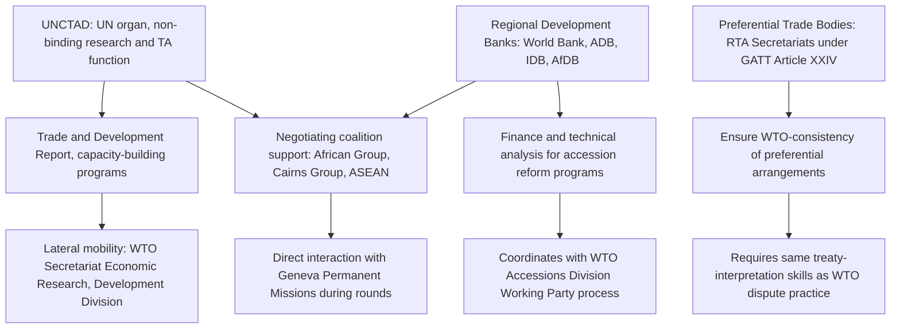

## Adjacent Institutions: UNCTAD, Regional Development Banks, and Preferential Trade Bodies

### Institutional Basis: Distinguishing Adjacent Institutions From the WTO's Legal Architecture

Adjacent institutions occupy legally distinct positions relative to the WTO — some complementary, some historically competitive in mandate, and some operating through an entirely separate legal basis for trade preferences. Understanding the boundary lines matters because career mobility across these institutions is common, but the legal instruments each operates under differ substantially:

- **UNCTAD (UN Conference on Trade and Development)**: established by UN General Assembly resolution in 1964, UNCTAD is a UN organ, not a treaty-based trade organization — it has no binding rule-making or dispute-settlement function. Its institutional origin is significant: UNCTAD emerged specifically as a developing-country-led forum during the era when GATT was widely perceived by the Global South as insufficiently attentive to development concerns, predating the **1979 Enabling Clause** (the GATT-era decision that later gave the Generalized System of Preferences its legal basis within the multilateral trading system itself).
- **Regional development banks** (the World Bank, along with regional counterparts such as the Asian Development Bank, Inter-American Development Bank, and African Development Bank): these are treaty-based international financial institutions whose relevant trade function is technical assistance, trade-related infrastructure financing, and — critically for WTO accession — funding and analytical support for acceding governments' domestic reform programs, operating under entirely separate constitutive treaties with no formal role in WTO rule administration.
- **Preferential trade bodies**: regional trade agreements (RTAs) and customs unions (the EU, USMCA, Mercosur, ASEAN, and others) operate under **GATT Article XXIV** (permitting free trade areas and customs unions as an exception to unconditional MFN treatment under **Article I**) and the equivalent **GATS Article V** for services, meaning RTA secretariats and negotiating bodies are legally grounded *within* the WTO framework as a recognized exception category, not external to it — a structurally different relationship than UNCTAD's or the development banks' fully external positioning.

**Key Points**

- The legal distinction matters directly for career mobility: UNCTAD and development-bank roles draw on trade-policy analytical skills transferable from WTO-focused training, but the institutions' non-binding or financing-focused mandates mean practitioners moving between these institutions and WTO-facing roles must adapt to substantially different institutional levers (technical assistance and research influence versus binding rule administration).
- RTA-focused roles, by contrast, require direct fluency in how Article XXIV and GATS Article V's WTO-consistency requirements interact with the substantive RTA text — meaning RTA practice is legally closer to WTO practice than either UNCTAD or development-bank work, despite operating within a formally separate institutional body.
- The Generalized System of Preferences (GSP) — unilateral tariff preferences granted by developed to developing countries — sits at the intersection of all three institution types: its legal basis is the WTO's Enabling Clause, but UNCTAD historically played the primary role in advocating for and coordinating the scheme's adoption, and development banks frequently finance the trade-facilitation infrastructure needed for developing countries to actually utilize GSP access.

### Procedural Mechanism: How These Institutions Interface With WTO-Facing Careers

The mechanism connecting these institutions to core WTO career pathways operates through distinguishable functional linkages:

1. **UNCTAD's research and technical assistance function**: UNCTAD produces the *Trade and Development Report* and extensive analytical work on developing-country trade policy, and operates technical assistance programs (including trade-related capacity building historically coordinated alongside WTO Aid-for-Trade initiatives) that frequently employ economists and trade-policy specialists with backgrounds overlapping directly with WTO Secretariat Economic Research and Statistics Division profiles, the Development Division, and Institute for Training and Technical Cooperation staff — creating a well-established lateral mobility pathway between UNCTAD Geneva (itself headquartered in Geneva alongside the WTO) and WTO Secretariat roles.
2. **Development banks' accession-support function**: the **World Bank** and regional development banks frequently finance and provide technical analysis supporting a government's domestic reform program during WTO accession negotiations — since accession Working Parties (serviced by the WTO's Accessions Division) require acceding governments to demonstrate legal and regulatory alignment with WTO rules, development-bank-funded technical assistance projects often directly support the same reform process the Accessions Division is negotiating, creating institutional coordination even though the two bodies operate under separate legal mandates.
3. **RTA secretariat and negotiating-body practice**: officials working within RTA secretariats (the European Commission's trade directorate, ASEAN Secretariat trade divisions, Mercosur's administrative structures) must ensure new or amended preferential arrangements satisfy Article XXIV's substantially-all-trade and reasonable-time-period requirements to maintain the RTA's WTO-consistency — a technical compliance function requiring the same treaty-interpretation skills used in core WTO dispute-settlement practice, applied to a different legal question.
4. **Cross-institutional coalition dynamics in WTO negotiations**: negotiating coalitions frequently active within WTO processes — the **African Group**, the **Cairns Group**, ASEAN Members coordinating positions — draw analytical and technical support from UNCTAD and, less directly, from development banks, meaning officials embedded in these institutions frequently interact directly with Geneva Mission delegations during active negotiating rounds, reinforcing the career-network overlap between adjacent institutions and core WTO-facing roles.

For a practitioner, the mobility pathway between adjacent institutions and WTO-facing roles is strongest where the underlying analytical skill set is directly transferable (trade-policy economics, development-focused trade analysis) and weakest where the institutional function is fundamentally different in kind (development-bank project finance versus WTO dispute-settlement litigation).

### Case Illustration: The Generalized System of Preferences as a Cross-Institutional Instrument

The **Generalized System of Preferences (GSP)** illustrates how these adjacent institutions function together around a single trade instrument while remaining legally distinct. UNCTAD first proposed and advocated for a generalized, non-reciprocal tariff-preference scheme for developing countries beginning in the mid-1960s, well before such a scheme had any WTO-compatible legal basis — since unconditional MFN treatment under **GATT Article I** would otherwise have prohibited developed countries from extending preferential tariffs to developing countries without extending the same treatment to all Members. The **1979 Enabling Clause** subsequently created the necessary GATT-level legal permission for GSP schemes, allowing individual developed Members (the EU, the US historically, Japan, and others) to design and implement their own GSP programs under a WTO-compatible legal umbrella.

Once GSP schemes existed, regional development banks became directly relevant to their practical utilization: an eligible developing country's ability to actually benefit from GSP access often depends on trade-facilitation infrastructure (customs modernization, certificate-of-origin systems, export-quality compliance capacity) that development banks finance as part of broader trade-competitiveness lending programs. A practitioner working on GSP-related trade policy might thus interact with all three institution types on a single case: UNCTAD for the original policy analysis and advocacy framework, the WTO Committee on Trade and Development for Enabling-Clause-related compliance questions, and a regional development bank for the infrastructure financing enabling a specific country to convert nominal GSP eligibility into actual increased export volumes.

### The Debate: Complementary Function Versus Institutional Fragmentation

**Case that adjacent institutions provide valuable complementary function:**

- UNCTAD's non-binding, research-oriented, and explicitly development-focused mandate allows it to advocate positions and produce analysis that would be procedurally difficult within the WTO's consensus-bound negotiating structure — providing an institutional space for developing-country perspectives to be articulated and refined before entering the more constrained WTO negotiating process.
- Development banks' financing capacity addresses a structural gap the WTO itself cannot fill: the WTO can negotiate market-access commitments and adjudicate disputes, but has no lending or infrastructure-financing function, meaning the trade-facilitation and productive-capacity investments needed to convert market access into actual trade flows depend entirely on financing institutions operating outside the WTO's legal architecture.
- RTA proliferation under Article XXIV, while sometimes criticized as fragmenting the multilateral system, has also functioned as a testing ground for deeper integration commitments (in services, investment, digital trade) that later informed multilateral negotiating proposals, including elements of the current e-commerce Joint Statement Initiative.

**Case that institutional proliferation creates fragmentation and coordination costs:**

- The existence of multiple, legally separate institutions addressing overlapping trade-and-development concerns (UNCTAD's development advocacy, the WTO Committee on Trade and Development's Enabling-Clause administration, development banks' project-based technical assistance) creates coordination costs and potential duplication, particularly burdensome for developing-country governments with limited capacity to engage productively across multiple institutional tracks simultaneously — the same resource-asymmetry dynamic affecting Geneva Mission staffing extends to multi-institutional engagement capacity.
- Critics of RTA proliferation (a debate connecting directly to the single-undertaking-versus-plurilateralism tension) argue that the accumulation of preferential arrangements under Article XXIV has produced a "spaghetti bowl" of overlapping rules of origin and differentiated market-access terms that complicates rather than simplifies the trading environment for businesses and smaller economies attempting to navigate multiple simultaneous preferential regimes.

### Practitioner Implications

For a practitioner mapping career mobility across these institutions, the clearest transferable-skill pathway runs through trade-policy economics and development-focused analysis — UNCTAD, the WTO's Development Division and Economic Research and Statistics Division, and development-bank trade-competitiveness units draw on substantially overlapping analytical training, making lateral movement among them comparatively fluid. Movement into RTA secretariat practice, by contrast, requires the same treaty-interpretation and dispute-adjacent legal skills central to core WTO litigation and negotiating practice, making it a closer lateral move for a dispute-settlement-focused or Rules Division-trained practitioner than for an economics-focused UNCTAD or development-bank specialist. A practitioner early in career planning should note that Geneva's institutional density — the WTO, UNCTAD, and numerous RTA liaison offices all maintaining a Geneva presence — makes early Geneva-based positioning valuable regardless of which specific adjacent institution is the initial entry point, since informal professional networks span institutional boundaries far more fluidly than the formal legal separations between the institutions might suggest. [Inference — career-strategy characterization based on the described institutional geography, not a documented finding of any institution]

**Related Topics**

- The 1979 Enabling Clause as the legal basis for the Generalized System of Preferences
- GATT Article XXIV and GATS Article V requirements for WTO-consistent regional trade agreements
- WTO Aid-for-Trade initiatives and their coordination with development-bank financing
- The "spaghetti bowl" critique of overlapping preferential trade agreements
- UNCTAD's historical role in the pre-Enabling-Clause push for developing-country trade preferences