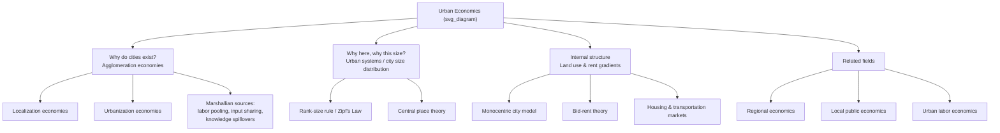

## Definition and Scope of Urban Economics

### Definition

Urban economics is the branch of economics that studies the spatial organization of economic activity, the location decisions of firms and households, and the economic forces that create, sustain, and transform cities. It applies microeconomic and macroeconomic tools to questions that are inherently spatial: why cities exist, why they form where they do, why activities cluster or disperse within them, and how urban markets for land, labor, and housing behave differently from markets in a spaceless economic model.

Formally, urban economics can be defined as the study of the allocation of resources across space within and between urban areas, with particular attention to:

- The location of production and consumption activities
- The determination of land use and land rent
- The size, growth, and internal structure of cities
- Urban labor and housing markets
- The provision of local public goods and services
- Externalities that arise from spatial proximity (congestion, agglomeration, pollution)

A standard characterization is that urban economics answers three interrelated questions:

1. Why do cities exist at all? (the agglomeration question)
2. Why are cities located where they are, and why do they vary in size? (the urban system question)
3. Why is economic activity distributed the way it is within a city? (the urban structure / land use question)

### Core Distinguishing Feature: Space

Standard microeconomic theory typically assumes a "dimensionless" economy — production and exchange happen at a point, and transportation costs are either zero or ignored. Urban economics rejects this simplification. Distance and location carry real costs (time, money, effort), and this single modification generates most of the field's core phenomena:

- Land rent gradients (the Alonso–Muth–Mills framework)
- Commuting cost trade-offs against housing consumption
- Agglomeration economies and diseconomies
- The existence of a central business district (CBD) or subcenters
- Spatial equilibrium conditions

$$U(c, q, s) \text{ subject to } y = c + R(s)q + t(s)$$

where $c$ is a composite consumption good, $q$ is housing/land consumption, $s$ is distance from the city center, $R(s)$ is the rent gradient, and $t(s)$ is the commuting cost function. This is the canonical household location problem that recurs throughout urban economics.

### Why Cities Exist: The Agglomeration Rationale

If transportation and communication were costless, there would be no economic reason for economic activity to concentrate in space. Cities exist because proximity generates **agglomeration economies** — productivity or utility gains from spatial concentration. These are conventionally classified as:

- **Localization economies**: benefits accruing to firms in the *same industry* clustering together (e.g., specialized labor pools, input sharing, knowledge spillovers within a sector)
- **Urbanization economies**: benefits accruing to firms from the *overall size and diversity* of the urban area, regardless of industry
- **Marshallian sources of agglomeration**: labor market pooling, input-output linkages (sharing of specialized suppliers), and knowledge spillovers — the three mechanisms Alfred Marshall identified and that remain the organizing framework used today

Counteracting these are **agglomeration diseconomies**: congestion, higher land rents, pollution, and crime, which rise with city size and eventually offset the benefits of concentration, producing an equilibrium (or optimal) city size.

### Scope: Sub-fields Within Urban Economics

**Urban spatial structure**

Study of land use patterns within a city — the monocentric city model, polycentric models, the bid-rent function, and the determinants of density gradients.

**Urban systems (city size distribution)**

Why cities exist in a hierarchy of sizes (often approximated by the rank-size rule / Zipf's Law), and what determines the number, size, and industrial specialization of cities in a national economy. This connects urban economics to regional economics and economic geography.

**Housing economics**

Housing supply elasticity, the durability of the housing stock, housing markets and filtering, housing finance, and housing policy (rent control, zoning, subsidies).

**Urban transportation economics**

Commuting behavior, congestion pricing, public transit economics, and the interaction between transportation infrastructure and land use.

**Local public economics**

Local government finance, the Tiebout model of jurisdictional choice ("voting with your feet"), local public goods provision, and property taxation.

**Urban labor markets**

Spatial mismatch, commuting zones, agglomeration effects on wages, and urban wage premiums.

**Urban environmental economics**

Pollution externalities from density and transportation, urban heat islands, and environmental justice concerns tied to spatial sorting.

**Poverty, segregation, and neighborhood effects**

Spatial sorting by income and race, neighborhood effects on economic outcomes, and the economics of urban poverty concentration.

### Relationship to Regional Economics

Urban and regional economics are closely related but distinguishable in emphasis:

| Dimension | Urban Economics | Regional Economics |
| --- | --- | --- |
| Spatial scale | Within and across individual cities | Across broader regions (multi-city, multi-state) |
| Core unit of analysis | The city / metropolitan area | The region (may contain multiple cities, rural areas) |
| Typical questions | Land use, commuting, housing, local city structure | Interregional trade, regional growth, migration between regions |
| Key models | Monocentric city model, bid-rent theory | Regional growth models, interregional trade models, economic base theory |

In practice the two fields overlap substantially, and many programs and textbooks treat them as a single combined field ("urban and regional economics"), since regional systems are ultimately networks of cities and the same underlying spatial-equilibrium logic applies at both scales.

### Methodological Toolkit

Urban economics draws on:

- **Microeconomic theory**: consumer and producer location choice, spatial equilibrium
- **Spatial equilibrium reasoning**: the assumption that in equilibrium, utility (or profit) is equalized across locations after accounting for rents and commuting costs — a foundational modeling device used to close urban models
- **Econometrics**: hedonic pricing models (to value housing/location attributes), spatial econometrics (to account for spatial autocorrelation), difference-in-differences and natural experiments (to identify causal effects of place-based policies)
- **General equilibrium and computable models**: for policy simulation (e.g., effects of zoning reform, transit investment)

### Illustrative Example: The Spatial Equilibrium Condition

Consider a household choosing residential distance $s$ from the CBD. Utility depends on consumption $c$, housing $q$, and commuting cost $t(s) = t \cdot s$. In spatial equilibrium, no household can gain by relocating, so utility must be constant across all inhabited locations:

$$V(s) = \max_{c,q} \, U(c,q) \; \text{s.t.} \; y - t s = c + R(s) q = \bar{u} \; \; \forall s$$

This single condition — utility equalization across space — is what pins down the equilibrium rent gradient $R(s)$: rent must fall with distance from the center exactly enough to compensate residents for higher commuting costs, otherwise households would move and bid rents up or down until equilibrium is restored. This is the organizing principle behind the Alonso–Muth–Mills monocentric city model, covered in depth elsewhere in this chapter's sequence.

### Diagram: Scope of Urban Economics (svg_diagram)

### Key Points

- Urban economics is distinguished from standard economics primarily by its explicit treatment of space and distance as economically consequential.
- The field addresses three nested questions: existence of cities, the urban system (sizes/locations of cities), and internal urban structure (land use within a city).
- Agglomeration economies (localization and urbanization economies, arising from Marshallian mechanisms) explain why cities exist despite the costs of density.
- Spatial equilibrium — utility or profit equalization across locations — is the central theoretical device used to model urban land and housing markets.
- Urban economics overlaps heavily with regional economics, housing economics, transportation economics, local public finance, and urban labor economics.

### Related Topics

- The monocentric city model and the Alonso–Muth–Mills framework
- Bid-rent theory and land use determination
- Agglomeration economies: localization vs. urbanization economies in depth
- Central place theory and the urban hierarchy
- Zipf's Law and the rank-size distribution of cities
- Tiebout model of local public goods
- Hedonic pricing and housing market valuation
- History of thought in urban economics (von Thünen, Marshall, Alonso, Muth, Mills)