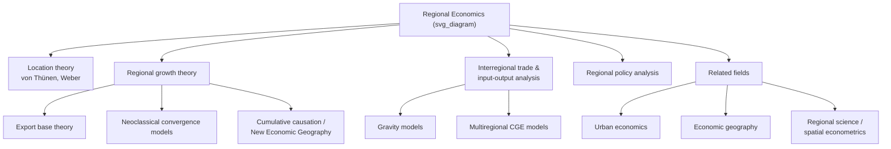

## Definition and Scope of Regional Economics

### Definition

Regional economics is the branch of economics concerned with the spatial allocation of resources across sub-national geographic units — regions, states, provinces, or multi-city economic areas — and with the economic forces that determine why regions grow, decline, specialize, or trade with one another. It extends standard economic analysis by treating geographic space as a variable that shapes production, trade, factor mobility, and growth, focusing on units larger than a single city but smaller than an entire nation.

Regional economics is often defined through the questions it seeks to answer:

1. Why do regions differ in their industrial structure, income levels, and growth rates?
2. What determines the location of economic activity across regions (interregional location theory)?
3. How do regions interact through trade, migration, and capital flows (interregional and multiregional analysis)?
4. What causes regional growth, decline, and convergence or divergence in income over time?
5. What role should regional policy play in addressing disparities between regions?

### The Region as the Unit of Analysis

A "region" in this field is not a fixed administrative concept; it is typically defined functionally, according to the analytical purpose:

- **Homogeneous regions**: areas defined by shared characteristics (climate, industry mix, culture) — e.g., "the Corn Belt," "the Rust Belt"
- **Nodal (functional) regions**: areas organized around a central node with which peripheral areas interact, such as a metropolitan area and its commuting hinterland
- **Administrative/planning regions**: areas defined by political or administrative boundaries (states, provinces, planning districts) used because data is collected at that level

This flexibility distinguishes regional economics from urban economics, which centers analysis on the city/metropolitan area as the unit, and from international economics, which treats the nation-state as the unit and typically assumes zero factor mobility across borders — an assumption regional economics explicitly relaxes, since labor and capital move relatively freely between regions of the same country.

### Core Theoretical Foundations

**Location theory**

The foundational strand of regional economics, tracing back to von Thünen's agricultural land use model and Weber's theory of industrial location, which explains where a firm chooses to locate based on minimizing the sum of transport costs (to input sources and to markets) and other location-specific costs.

**Central place theory**

Developed by Walter Christaller and August Lösch, this explains the size, spacing, and hierarchical arrangement of settlements/regions based on the range and threshold of goods and services provided — larger, less frequently demanded goods are provided from fewer, larger central places, while smaller, frequently demanded goods are provided from a denser network of smaller centers.

**Regional growth theory**

Explains why some regions grow faster than others. Major approaches include:

- **Export base theory (economic base theory)**: regional growth is driven by growth in the region's "export" (basic) sector — the industries that sell to markets outside the region — with a regional multiplier effect on "non-basic" (local-serving) industries
- **Neoclassical regional growth models**: extend the Solow growth model to regions, predicting convergence in per-capita income across regions as capital flows from capital-abundant (low-return) to capital-scarce (high-return) regions
- **Cumulative causation / new economic geography**: associated with Gunnar Myrdal and later formalized by Paul Krugman, this argues that agglomeration forces can produce self-reinforcing divergence rather than convergence — growth begets growth through backward and forward linkages, market size effects, and labor migration toward already-prosperous regions

**Interregional trade theory**

Extends comparative advantage and factor-proportions trade theory to regions within a country, explaining regional specialization patterns and analyzing interregional trade flows, often via input-output or gravity-model frameworks.

### Economic Base Theory: Illustrative Model

A commonly used introductory model in regional economics divides regional employment into basic (export-oriented) and non-basic (locally-serving) sectors:

$$E = E_b + E_n$$

where $E$ is total regional employment, $E_b$ is basic employment, and $E_n$ is non-basic employment. Assuming a stable ratio between non-basic and basic employment, $E_n = k E_b$, an increase in basic employment $\Delta E_b$ generates a regional employment multiplier:

$$\Delta E = \Delta E_b (1 + k)$$

This is the regional-economics analogue of the Keynesian income multiplier, applied to explain how growth in a region's export industries propagates through the local economy via local spending and service provision.

### Scope: Sub-fields Within Regional Economics

**Regional growth and development**

Explaining disparities in regional income, employment, and productivity growth; convergence/divergence debates; regional business cycles.

**Regional labor markets and migration**

Interregional migration as an equilibrating (or disequilibrating) mechanism; regional wage differentials; human capital flows ("brain drain/gain").

**Interregional trade and input-output analysis**

Measuring and modeling flows of goods, services, and factors between regions; regional input-output tables; multiregional computable general equilibrium (CGE) models.

**Regional policy analysis**

Evaluating place-based policies — regional development incentives, enterprise zones, infrastructure investment, and fiscal transfers designed to reduce interregional disparities.

**Spatial econometrics and regional science**

Statistical techniques accounting for spatial dependence and spatial heterogeneity across regional data, since standard econometric assumptions (independent observations) are typically violated by geographic data.

**Economic geography (overlapping field)**

Shares substantial overlap with regional economics, particularly through "New Economic Geography" (Krugman and others), which formalizes agglomeration and regional specialization using increasing-returns and monopolistic-competition trade models.

### Relationship to Urban Economics

| Dimension | Regional Economics | Urban Economics |
| --- | --- | --- |
| Spatial scale | Multi-city regions, states, multi-state areas | Individual cities/metropolitan areas |
| Core unit of analysis | The region (may span rural and urban areas) | The city |
| Typical questions | Interregional trade, regional growth, migration between regions | Land use, commuting, housing, intra-city structure |
| Key models | Export base theory, neoclassical regional growth, central place theory | Monocentric city model, bid-rent theory |
| Assumption on internal structure | Often treats a region as a single point or aggregate | Explicitly models spatial variation within the unit |

Despite this distinction, the two fields are frequently combined into "urban and regional economics" because a region is, in effect, a system of interconnected cities and their hinterlands, and many models (e.g., central place theory) apply at both scales.

### Methodological Toolkit

- **Shift-share analysis**: decomposes regional employment/output growth into national, industry-mix, and regional-competitive components
- **Location quotients**: measure the relative concentration of an industry in a region compared to the national economy
- **Input-output analysis**: traces inter-industry and interregional linkages
- **Gravity models**: model interregional trade, migration, and commuting flows as a function of regional "mass" (size) and distance
- **Spatial econometrics**: corrects for spatial autocorrelation and spillovers across neighboring regions
- **Computable general equilibrium (CGE) models**: simulate policy impacts across multiple interacting regions

### Diagram: Scope of Regional Economics (svg_diagram)

### Key Points

- Regional economics studies sub-national spatial units (regions) that are larger than a city but smaller than a nation, with factor mobility (labor, capital) generally assumed to be freer than in international economics.
- Core theoretical pillars include location theory, central place theory, regional growth theory (export base, neoclassical, cumulative causation), and interregional trade theory.
- Export base theory provides a foundational, tractable model of regional growth via a basic/non-basic employment multiplier.
- A long-standing debate exists between neoclassical convergence models (predicting regional income convergence) and cumulative causation / new economic geography models (predicting persistent or self-reinforcing divergence).
- Regional economics overlaps substantially with urban economics, economic geography, and regional science, differing mainly in spatial scale and unit of analysis.

### Related Topics

- Export base theory and the regional employment multiplier in depth
- Neoclassical regional growth models and convergence/divergence evidence
- Cumulative causation and Gunnar Myrdal's circular and cumulative causation
- New Economic Geography (Krugman) and core-periphery models
- Central place theory: Christaller and Lösch
- Location quotients and shift-share analysis techniques
- Interregional and multiregional input-output modeling
- Regional policy instruments: enterprise zones, place-based development incentives