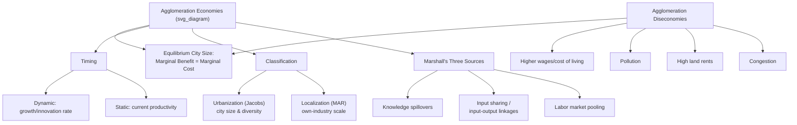

## Why Cities Exist: Agglomeration and the Urbanization Puzzle

### The Puzzle

In a frictionless neoclassical economy with constant returns to scale in production, no transportation costs, and perfectly divisible, mobile resources, there is no reason for economic activity to concentrate in space. Production could be spread evenly across the landscape, with each point of land supporting a self-sufficient unit of activity. Yet real economies exhibit the opposite: extreme spatial concentration, with a large share of output, population, and income packed into a small fraction of land area in dense urban agglomerations.

This is the "urbanization puzzle" or "agglomeration puzzle": if concentration imposes costs (higher land rents, congestion, longer commutes, pollution, higher wages), some offsetting force must generate benefits large enough to overcome them. Urban economics identifies this offsetting force as **agglomeration economies** — increasing returns that arise specifically from spatial proximity.

The puzzle can be stated formally: a model with only constant-returns-to-scale production and freely mobile, homogeneous factors predicts a "backyard capitalism" equilibrium — production spread thinly and evenly across space — because there is no incentive for two producers to locate near each other rather than in equally productive, less costly separate locations. For cities to be an equilibrium outcome, the model must introduce **some form of increasing returns or externality that operates at the local (not firm) level**.

### Necessary Condition for Cities: Increasing Returns

The formal requirement is that the production or utility function must exhibit local increasing returns — output or utility per worker rises with the density or scale of nearby economic activity, holding the worker's own inputs fixed. This is distinct from firm-level scale economies (a single large factory), which do not by themselves require spatial concentration of *different* firms or workers. Agglomeration economies are inherently *external* to the individual firm or household — they are a function of the surrounding economic mass.

$$y_i = A(N) \cdot f(k_i, l_i)$$

where $y_i$ is output per worker at firm $i$, $f(\cdot)$ is a standard constant-returns production function in the firm's own capital $k_i$ and labor $l_i$, and $A(N)$ is total factor productivity that is increasing in $N$, the scale of surrounding economic activity (employment density, city population, or number of firms). The city exists because $A(N)$ rises with $N$ — proximity itself is productive.

### Marshall's Three Sources of Agglomeration

Alfred Marshall (1890) identified three mechanisms by which spatial concentration raises productivity, and these remain the standard organizing framework in modern urban economics:

**1. Labor market pooling**

A large, concentrated labor market allows firms to find workers with specialized skills more easily, and allows workers to find well-matched jobs more easily. This pooling also provides insurance against idiosyncratic shocks: if one firm in the cluster suffers a negative shock, workers can be reabsorbed by other firms in the same local labor market without needing to relocate. Better matching quality raises average productivity.

**2. Input sharing (input-output linkages)**

Concentration allows the concentration of specialized suppliers of intermediate inputs and services, achieving efficient scale (given fixed costs in supplying those inputs) that would not be viable if demand were spread over a large territory. Firms can access a wider variety of specialized inputs than they could support individually, and suppliers benefit from a larger pool of downstream customers.

**3. Knowledge spillovers**

Proximity facilitates the exchange of tacit knowledge, ideas, and innovation — the famous claim that in an industrial district, trade secrets "are in the air" (Marshall's phrase, paraphrased). Face-to-face interaction, informal information exchange, and observation of competitors and collaborators accelerate learning and innovation diffusion in ways that are difficult to replicate over distance, particularly for non-codifiable (tacit) knowledge.

### Localization Economies vs. Urbanization Economies

Agglomeration economies are typically classified by their source:

**Localization economies (MAR externalities — Marshall-Arrow-Romer)**

Benefits that accrue to firms from the scale of *their own industry* in the local area. A firm in the semiconductor industry benefits from other semiconductor firms nearby (shared specialized labor, suppliers, and industry-specific knowledge). Localization economies predict that specialized industry clusters will be more productive as the local industry grows, holding overall city size fixed.

**Urbanization economies (Jacobs externalities)**

Benefits that accrue to firms from the overall size and *diversity* of the urban area, regardless of industry. Named after Jane Jacobs, who argued that the cross-fertilization of ideas *across* different industries — rather than within a single specialized industry — is the key driver of urban innovation and productivity. Urbanization economies predict that diverse, large cities generate more innovation than specialized ones, because novel combinations of ideas come from unrelated fields.

| Type | Source of benefit | Associated theorists | Empirical prediction |
| --- | --- | --- | --- |
| Localization (MAR) | Own-industry scale/specialization | Marshall, Arrow, Romer | Industry clusters become more productive as *that* industry grows locally |
| Urbanization (Jacobs) | Overall city size and industrial diversity | Jane Jacobs | Diverse cities generate more cross-industry innovation and growth |

Empirical work has found support for both mechanisms in different contexts, and they are not mutually exclusive — most cities exhibit some combination of localization economies in specific specialized sectors (e.g., finance in New York, entertainment in Los Angeles) alongside urbanization economies driven by overall metropolitan scale and diversity.

### Static vs. Dynamic Agglomeration Economies

- **Static agglomeration economies**: contemporaneous productivity gains from current density — e.g., current labor pooling and input sharing that raise output today
- **Dynamic agglomeration economies**: effects on the *growth rate* of productivity over time, primarily through learning and innovation — e.g., Jacobs' argument that diversity accelerates innovation, or localized learning-by-doing that compounds over time (related to Romer-style endogenous growth mechanisms applied at the city level)

This distinction matters for policy: a city might exhibit high current productivity (static agglomeration) but slow future growth if it lacks the diversity that drives dynamic gains, or vice versa.

### Agglomeration Diseconomies: The Countervailing Force

Cities do not grow without limit because increasing density also generates negative externalities that rise, often at an increasing rate, with city size:

- **Congestion costs**: traffic congestion raises commuting time and cost; congestion in the use of shared infrastructure
- **Higher land rents and cost of living**: competition for scarce central land bids up rents, raising the cost of both housing and business space
- **Pollution and environmental costs**: concentrated economic activity concentrates emissions, waste, and environmental degradation
- **Crime and social costs**: some research links higher crime rates to city size, though the causal relationship is more contested than for congestion or rents
- **Higher wages**: firms in large cities often must pay compensating wage premiums to offset higher living costs, raising labor costs

Equilibrium city size is where marginal agglomeration benefits equal marginal agglomeration costs. This is formalized in the **optimal city size** literature.

### Formal Equilibrium: Optimal and Equilibrium City Size

Let $B(N)$ represent aggregate agglomeration benefits and $C(N)$ represent aggregate congestion/diseconomy costs, both increasing in city population $N$. Utility (or productivity) per resident is:

$$u(N) = B(N) - C(N)$$

If $B(N)$ is concave (diminishing marginal benefits) and $C(N)$ is convex (increasing marginal costs), $u(N)$ is maximized at some finite $N^*$ where:

$$\frac{dB}{dN} = \frac{dC}{dN}$$

A key theoretical distinction, developed extensively in the urban systems literature, is that the **equilibrium** city size (determined by free migration equalizing utility across cities, per the spatial equilibrium condition) need not equal the **socially optimal** city size, because individual location decisions do not internalize the congestion externalities imposed on existing residents — a classic externality problem that can justify policy intervention (e.g., congestion pricing, growth management).

### Empirical Approaches to Measuring Agglomeration

- **Density-productivity elasticities**: regressing wages or output per worker on employment density, controlling for worker/firm characteristics and sorting; commonly finds that a doubling of density is associated with productivity gains, though the magnitude is sensitive to identification strategy [Inference: precise elasticity estimates vary substantially across studies and contexts]
- **Natural experiments**: using historical shocks (e.g., wartime bombing, transportation infrastructure changes) to identify causal agglomeration effects, addressing the concern that productive workers/firms may simply *sort into* dense areas rather than *becoming* more productive because of density
- **Nested/spatial regression discontinuity**: comparing outcomes just inside vs. just outside administrative or geographic boundaries defining a cluster

A persistent empirical challenge is distinguishing true agglomeration economies (density causes productivity) from selection/sorting effects (more productive firms and workers choose to locate in dense areas for reasons unrelated to the density itself). Most contemporary empirical work attempts to address this via worker/firm fixed effects, instrumental variables (e.g., historical density, geological/geographic determinants of city location), or natural experiments.

### Diagram: Sources and Limits of Agglomeration (svg_diagram)

### Key Points

- Cities exist as an economic equilibrium only if some form of local increasing returns — agglomeration economies — offsets the costs of spatial concentration; a purely constant-returns, frictionless economy predicts dispersed, not concentrated, activity.
- Marshall identified three sources of agglomeration: labor market pooling, input sharing, and knowledge spillovers.
- Agglomeration economies are classified as localization economies (own-industry, MAR) or urbanization economies (overall city diversity/scale, Jacobs), with differing predictions for cluster specialization versus diversification.
- Agglomeration diseconomies (congestion, high rents, pollution) rise with city size and set a natural limit, producing a determinate equilibrium and optimal city size.
- Equilibrium city size (from free migration) need not equal socially optimal city size, because individual location decisions do not internalize congestion externalities imposed on others.
- A central empirical challenge is separating true causal agglomeration effects from the sorting of already-productive firms and workers into dense areas.

### Related Topics

- Optimal city size models and the divergence between equilibrium and optimal size
- Empirical identification strategies for agglomeration economies (natural experiments, instrumental variables)
- New Economic Geography and core-periphery models (Krugman)
- Endogenous growth theory applied to cities (Romer-style dynamic agglomeration)
- Urban systems and the rank-size (Zipf's Law) distribution of city sizes
- Industry clustering case studies (Silicon Valley, financial districts, entertainment clusters)
- Congestion externalities and congestion pricing policy
- Spatial sorting of skilled labor and the "superstar cities" phenomenon