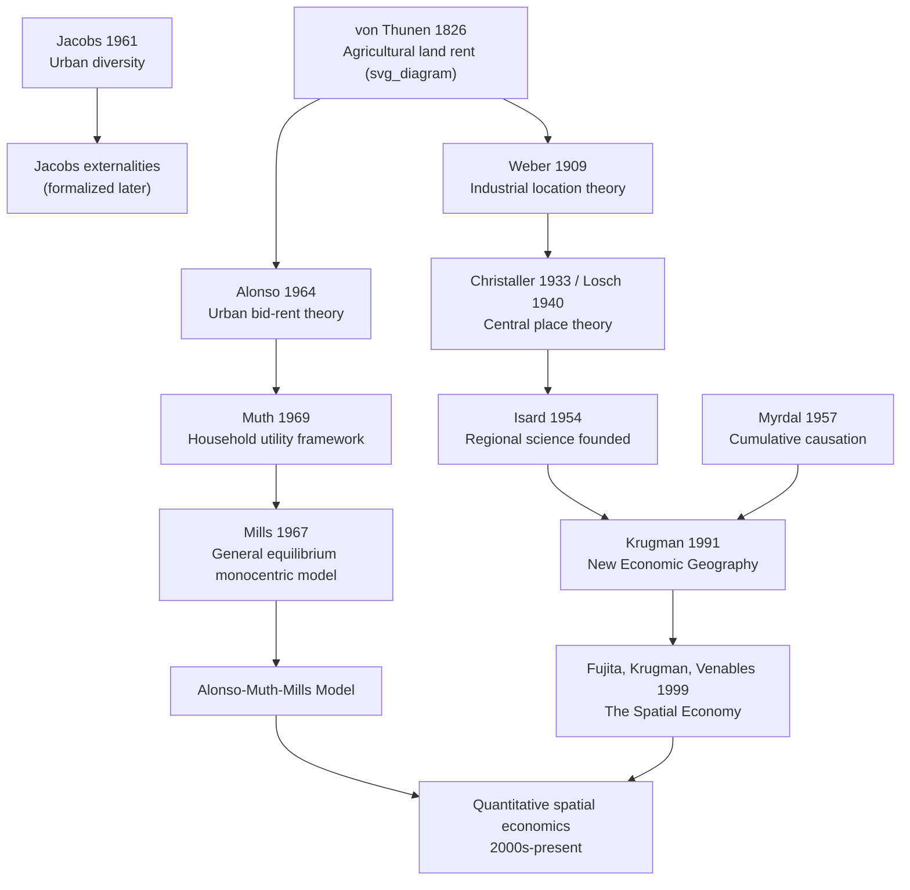

## Historical Development of Urban and Regional Economic Thought

### Overview

Urban and regional economics did not emerge as a unified discipline until the mid-twentieth century, but its intellectual roots stretch back to nineteenth-century location theory. The field's history can be organized into several overlapping phases: pre-classical spatial thinking, the German location theory tradition, the mid-twentieth century synthesis into a formal discipline, the monocentric city revolution, and the modern New Economic Geography and empirical turn.

### Phase 1: Early Location Theory (19th Century)

**Johann Heinrich von Thünen (1826, "Der isolierte Staat" / "The Isolated State")**

Von Thünen is widely regarded as the founder of location theory and the first systematic spatial economic model. He analyzed how agricultural land use would be organized around a single isolated market town, assuming a featureless plain, uniform transport costs proportional to distance, and profit-maximizing farmers. His model predicted concentric rings of land use around the central market, with each ring occupied by the crop or activity that could pay the highest rent at that distance — a function of the crop's transport cost, market price, and production cost.

The von Thünen model introduced the core concept later generalized as the **bid-rent function**: different land uses have different rent gradients (steepness reflecting transport-cost sensitivity), and the equilibrium land use pattern is determined by which use "outbids" others at each distance. This concentric-ring logic became the direct ancestor of the modern monocentric city model.

**Wilhelm Launhardt and Alfred Weber (early 20th century)**

Weber's "Theory of the Location of Industries" (1909) extended location theory to industrial (rather than agricultural) location, formalizing the **least-transport-cost location problem**: a firm chooses its location to minimize the weighted sum of transport costs to assemble raw materials and distribute finished goods, subject to labor cost and agglomeration factors as secondary modifying forces. Weber introduced the concept of the "locational triangle" (or more generally the locational polygon) and formalized ideas about "weight-losing" versus "weight-gaining" industries in determining whether firms locate near raw material sources or near markets.

### Phase 2: Central Place Theory (1930s)

**Walter Christaller (1933, "Die zentralen Orte in Süddeutschland" / "Central Places in Southern Germany")**

Christaller developed central place theory to explain the size, number, and spatial arrangement of settlements. He introduced the concepts of **range** (the maximum distance consumers will travel for a good/service) and **threshold** (the minimum market size needed to support provision of that good/service). This generated a hierarchical, hexagonal lattice of settlements, with higher-order central places (offering rarer, higher-threshold goods) more widely spaced than lower-order places.

**August Lösch (1940, "Die räumliche Ordnung der Wirtschaft")**

Lösch generalized and formalized Christaller's framework using economic equilibrium principles rather than purely geometric reasoning, deriving the hexagonal market-area structure from firms' profit-maximizing entry decisions under monopolistic competition — establishing central place theory on firmer microeconomic foundations.

### Phase 3: Formation of Regional Science (1950s)

**Walter Isard**

Isard is credited with founding **regional science** as a distinct interdisciplinary field, synthesizing location theory, central place theory, and input-output analysis into a coherent analytical framework. He founded the Regional Science Association (1954) and authored "Location and Space-Economy" (1956), which systematized prior German location theory for English-speaking economists and connected it to general equilibrium and input-output methods.

**Economic base theory**

Developed and popularized in this period (associated with work by Homer Hoyt and others in applied regional analysis), economic base theory offered a simple, empirically tractable framework — dividing regional employment into "basic" (export) and "non-basic" (local-serving) sectors — that became a workhorse tool for regional planners and remains in use as an introductory model.

### Phase 4: Urban Economics as a Distinct Field (1960s)

Urban economics crystallized as a distinct sub-discipline (separate from the broader "regional science") in the 1960s, driven by the need to explain rapid postwar suburbanization, rising automobile ownership, and the internal spatial restructuring of American cities.

**William Alonso (1964, "Location and Land Use")**

Alonso adapted von Thünen's agricultural bid-rent framework to urban residential and commercial land use, formalizing the **bid-rent curve** for urban households and firms as a function of distance from the central business district (CBD). This is considered the foundational modern work of urban land use theory.

**Richard Muth (1969, "Cities and Housing")**

Muth extended and formalized the household side of urban land use theory with an explicit utility-maximization framework, incorporating housing consumption as a substitutable good against land/lot size, providing the microeconomic household optimization underpinning later synthesized as the **Alonso-Muth-Mills model**.

**Edwin Mills (1967, and subsequent work)**

Mills developed a general equilibrium version of the monocentric city model incorporating both production (firms in the CBD) and residential location, deriving equilibrium population density gradients and testing them against empirical density data across U.S. cities. The combination of Alonso, Muth, and Mills' contributions is now conventionally referred to as the **Alonso-Muth-Mills (AMM) monocentric city model**, the central workhorse model of urban spatial economics for the following several decades.

**Jane Jacobs (1961, "The Death and Life of Great American Cities")**

Though not a formal economic model, Jacobs' work was highly influential in urban economic thought, arguing (in contrast to prevailing urban renewal orthodoxy) that urban diversity, mixed land use, and density of interaction — not top-down planning — were the source of urban vitality and innovation. Her ideas were later formalized into the concept of **urbanization economies (Jacobs externalities)**, distinguished from Marshallian localization economies, and remain central to the agglomeration literature.

### Phase 5: Formalization and the Tiebout/Public Economics Strand (1950s–1970s)

**Charles Tiebout (1956, "A Pure Theory of Local Expenditures")**

Tiebout proposed that under certain conditions (many jurisdictions, costless mobility, full information), households "vote with their feet" by choosing to live in the jurisdiction whose bundle of local public goods and taxes best matches their preferences, producing an efficient, market-like solution to local public goods provision that a single national government cannot achieve given heterogeneous preferences. This became foundational to local public finance and one pillar connecting urban economics to public economics.

### Phase 6: New Economic Geography and Formal General Equilibrium (1990s)

**Paul Krugman (1991, "Increasing Returns and Economic Geography," and related work)**

Krugman's "New Economic Geography" (NEG) formalized agglomeration and regional specialization using tractable general-equilibrium models combining increasing returns to scale, monopolistic competition (Dixit-Stiglitz), and transport costs — mechanisms that had previously been treated more informally by Marshall and the German location theorists. The resulting **core-periphery model** showed how, as transport costs fall, small initial asymmetries between regions can cumulatively self-reinforce into a stable pattern of a manufacturing "core" and an agricultural "periphery," formalizing Myrdal's earlier concept of **circular and cumulative causation** (1957). Krugman received the Nobel Memorial Prize in Economic Sciences in 2008 substantially for this body of work integrating trade theory and economic geography.

**Masahisa Fujita, Krugman, and Anthony Venables (1999, "The Spatial Economy")**

This work systematized New Economic Geography into a comprehensive theoretical framework, becoming a standard reference synthesizing the general-equilibrium approach to agglomeration and regional specialization.

### Phase 7: The Empirical and Quantitative Turn (2000s–present)

Since the 2000s, the field has shifted heavily toward empirical identification of causal effects, driven by advances in spatial econometrics, natural experiments, and quantitative spatial general equilibrium models (sometimes termed "quantitative spatial economics") that combine NEG-style theoretical structure with rich, granular geographic and administrative data for calibration and counterfactual policy analysis. [Inference: characterizing this as a distinct "phase" reflects a broadly recognized shift in methodological emphasis in the field's recent literature, though periodization of this kind is necessarily a simplification and the boundaries between phases are not sharp.]

### Timeline Summary

| Period | Key figure(s) | Core contribution |
| --- | --- | --- |
| 1826 | von Thünen | Agricultural land rent rings; origin of bid-rent logic |
| 1909 | Weber | Industrial least-transport-cost location theory |
| 1933–1940 | Christaller, Lösch | Central place theory; hierarchical settlement systems |
| 1954–1956 | Isard | Founding of regional science; synthesis with input-output analysis |
| 1956 | Tiebout | Local public goods and jurisdictional sorting |
| 1957 | Myrdal | Circular and cumulative causation |
| 1961 | Jacobs | Urban diversity and vitality; precursor to Jacobs externalities |
| 1964–1969 | Alonso, Muth, Mills | Monocentric city model (AMM); urban bid-rent and density gradients |
| 1991 | Krugman | New Economic Geography; core-periphery model |
| 1999 | Fujita, Krugman, Venables | Systematized NEG framework ("The Spatial Economy") |
| 2000s–present | Various | Empirical/quantitative spatial economics; spatial econometrics |

### Diagram: Intellectual Lineage (svg_diagram)

### Key Points

- Location theory originates with von Thünen's 1826 agricultural land-use model, which introduced the bid-rent logic later applied to cities.
- Weber, Christaller, and Lösch developed the German location-theory tradition (industrial location and central place theory) in the early 20th century.
- Walter Isard synthesized these strands into "regional science" as a formal discipline in the 1950s.
- Urban economics emerged as a distinct field in the 1960s through Alonso, Muth, and Mills, whose combined work forms the Alonso-Muth-Mills monocentric city model.
- Tiebout's 1956 model connected urban/regional economics to local public finance via jurisdictional sorting.
- Krugman's New Economic Geography (1991) formalized agglomeration and regional divergence using general-equilibrium trade theory, building on Myrdal's earlier cumulative causation concept.
- Since the 2000s, the field has emphasized empirical identification and quantitative spatial general equilibrium modeling.

### Related Topics

- Von Thünen's isolated state model in depth
- The Alonso-Muth-Mills monocentric city model
- Central place theory: Christaller vs. Lösch formalization
- Krugman's core-periphery model and New Economic Geography
- Tiebout model and local public goods sorting
- Myrdal's circular and cumulative causation
- Quantitative spatial economics and modern general equilibrium approaches
- Jane Jacobs and the urbanization-economies literature