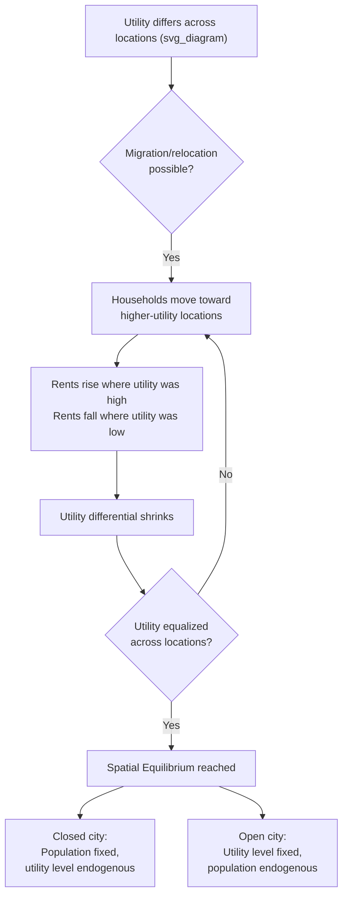

## Core Methodological Tools: Spatial Equilibrium and Comparative Statics

### Overview

Urban and regional economics relies on two closely linked methodological pillars to generate testable predictions from spatial models: the **spatial equilibrium** concept, which closes a model by specifying the condition under which economic agents have no incentive to relocate, and **comparative statics**, the technique of analyzing how equilibrium outcomes change in response to a shift in an underlying parameter (transport cost, income, population, technology, policy). Together these tools convert descriptive spatial theory (land rent gradients, location choice) into a rigorous, predictive analytical framework.

### The Spatial Equilibrium Concept

**Definition**

Spatial equilibrium is the condition that, in a system with freely mobile agents (households, firms, or both) across multiple locations, no agent can improve its position by moving. Formally, utility (for households) or profit (for firms) must be equalized across all locations that are actually occupied in equilibrium, after fully accounting for the location-specific costs and benefits (rents, wages, commuting costs, amenities).

This is the spatial analogue of the "no-arbitrage" condition in financial economics: if utility were higher in location A than location B, households would migrate from B to A, bidding up rents (or wages down) in A and bidding down rents (or wages up) in B, until the utility differential is eliminated.

**Household spatial equilibrium (within a city)**

$$V(s) = \max_{c,q} \; U(c,q) \quad \text{s.t.} \quad y - t(s) = c + R(s)\,q$$

$$V(s) = \bar{u} \quad \forall s \text{ occupied}$$

where $V(s)$ is indirect utility at distance $s$ from the CBD, $t(s)$ is commuting cost, $R(s)$ is the equilibrium land rent at distance $s$, and $\bar{u}$ is the common utility level across all occupied locations. This condition is what determines the equilibrium rent gradient: $R(s)$ must decline with $s$ at exactly the rate that compensates for rising commuting costs.

**Interregional/intercity spatial equilibrium (across cities)**

The same logic applies across an entire urban system. If workers are freely mobile between cities, then in equilibrium:

$$w_i - R_i(\text{housing cost}) + A_i(\text{amenities}) = \bar{u} \quad \forall i$$

for every city $i$ that has positive population, where $w_i$ is the nominal wage, housing/cost-of-living terms are subtracted, and $A_i$ captures local amenities (climate, culture, public goods). This is the foundation of the **Rosen-Roback model** of interregional/intercity equilibrium, used extensively to value urban amenities using observed wage and rent differentials across cities (hedonic valuation of quality of life).

**Firm-side spatial equilibrium**

An analogous zero-profit condition applies to firms:

$$\pi_i(\text{revenue}, \text{wages}, \text{rents}, \text{productivity}) = 0 \quad \forall i \text{ with positive firm entry}$$

Firms locate where profits are highest; free entry and relocation drive profits toward equality (often zero, under free entry) across all locations actually used by that industry.

### Open City vs. Closed City Models

A key modeling choice in urban economics is whether the city is modeled as **open** or **closed**, which changes what spatial equilibrium implies for comparative statics:

**Closed city model**

Total city population $N$ is fixed (exogenous); utility level $\bar{u}$ is endogenous and adjusts to clear the land/housing market given the fixed population. Migration in/out of the city is not permitted; only internal (intra-city) relocation occurs.

**Open city model**

Utility level $\bar{u}$ is fixed exogenously (pinned down by outside opportunities available to households in a national/regional system of cities); city population $N$ is endogenous and adjusts (via migration) until the utility level in this city matches the common national utility level $\bar{u}$.

| Model | Fixed (exogenous) | Endogenous | Typical use |
| --- | --- | --- | --- |
| Closed city | Population $N$ | Utility level $\bar{u}$ | A single isolated city; short-run analysis |
| Open city | Utility level $\bar{u}$ | Population $N$ | A city embedded in a national system with free migration; long-run analysis |

This distinction matters enormously for comparative statics: the same shock (e.g., an improvement in transportation technology) produces a *rise in resident welfare* in a closed city (since population cannot adjust, benefits accrue to existing residents as higher utility) but produces *population growth with no permanent change in utility* in an open city (since new migrants are drawn in until utility returns to the fixed national benchmark level) — a critical and frequently tested distinction in applied urban economics.

### Comparative Statics: Method

**Definition**

Comparative statics analyzes how the equilibrium values of a model's endogenous variables (rent, population, city size, wages) change when an exogenous parameter changes, holding the model's underlying structure fixed. The technique compares two equilibria — before and after the parameter shift — rather than modeling the (often complex) adjustment path between them.

**General procedure**

1. Write down the equilibrium conditions (e.g., spatial equilibrium, market clearing) as a system of equations in the endogenous variables, given the parameters.
2. Totally differentiate the equilibrium system with respect to the parameter of interest.
3. Solve the resulting linear system for the derivative of each endogenous variable with respect to the parameter (often using the Implicit Function Theorem when the system cannot be solved in closed form).
4. Sign the derivative (and, where possible, characterize its magnitude) to determine the direction (and strength) of the effect.

### Illustrative Comparative Statics Example: A Fall in Commuting Cost

Consider the monocentric city model with a fall in the per-unit commuting cost parameter $t$. Using the household spatial equilibrium condition, a lower $t$ has these standard predicted effects (holding city population fixed, closed-city case):

- **Rent gradient flattens**: since rent must compensate for commuting cost differentials, a smaller $t$ means rent needs to fall less steeply with distance $s$ to maintain equal utility across locations
- **City spatial extent expands**: with a flatter rent gradient, the city edge (where urban rent equals agricultural/rural land rent) moves outward, so the city becomes more spatially extensive
- **Population density falls near the center, rises at the edge**: the density gradient flattens correspondingly, consistent with observed historical suburbanization following transportation improvements (streetcars, then automobiles, then highways)

This comparative-static result — famously used to explain 20th-century suburbanization as a consequence of falling transport costs (auto ownership, highway construction) — is one of the most widely cited applications of the monocentric city framework's comparative statics.

### Illustrative Comparative Statics Example: An Increase in Income

An increase in household income $y$ has an ambiguous a priori effect on the rent gradient's steepness, depending on the relative income elasticities of the demand for land/housing versus the demand for accessibility (i.e., the disutility of commuting time, which often rises with income due to the opportunity cost of time). This ambiguity is a well-known result in the monocentric city literature: if land is a "luxury good" with high income elasticity relative to the income elasticity of the value of commuting time, rising incomes flatten the gradient (richer households move to the suburbs for more land, consistent with observed US suburbanization patterns); the reverse produces a steeper gradient (richer households concentrate near the center, as observed in many European and developing-country cities). [Inference: the empirically dominant pattern (suburbanization of the wealthy) is well-documented for many US cities but the theoretical result is genuinely ambiguous and depends on relative elasticities, which vary by context — this is not a case where the sign can be asserted unconditionally from theory alone.]

### Comparative Statics in Regional/Interregional Models

The same methodology extends to interregional and intercity models:

- **Shock to a region's productivity** (e.g., a natural-resource discovery, technology adoption): raises wages, attracts in-migration (open-city logic applied at regional scale), raises regional housing rents, until utility differentials with other regions are eliminated
- **Reduction in interregional trade/transport costs**: in New Economic Geography models, this can trigger a discontinuous shift from a symmetric equilibrium (activity spread evenly across regions) to an agglomerated core-periphery equilibrium, once trade costs fall below a critical threshold ("catastrophic agglomeration," a well-known non-linear comparative-static result in the Krugman core-periphery model, distinct from the smooth, continuous comparative statics typical of the monocentric city model)

### Stability and Multiple Equilibria

A methodological complication in spatial equilibrium models, particularly those incorporating strong agglomeration forces (increasing returns), is that comparative statics may not yield a single well-behaved, continuously-shifting equilibrium. Multiple equilibria can coexist (e.g., a symmetric dispersed equilibrium and one or more agglomerated equilibria), and comparative-static exercises must then address:

- **Existence**: does an equilibrium exist for the given parameters?
- **Uniqueness**: is the equilibrium unique, or are there multiple candidate equilibria?
- **Stability**: which equilibria are stable under a plausible adjustment process (i.e., which equilibria will actually be approached if the system starts near them), since unstable equilibria are typically not directly observable

This is a well-known feature distinguishing New Economic Geography-style models (with cumulative causation, self-reinforcing dynamics, and potential multiple equilibria) from the classical monocentric city model (which, under standard regularity assumptions on preferences, typically yields a unique, stable equilibrium and correspondingly well-behaved comparative statics).

### Diagram: Spatial Equilibrium Logic (svg_diagram)

### Key Points

- Spatial equilibrium is the condition that utility (households) or profit (firms) is equalized across all occupied locations, given the costs and benefits specific to each location; it is the spatial analogue of a no-arbitrage condition.
- The Rosen-Roback framework applies spatial equilibrium logic across cities, enabling the valuation of urban amenities through observed wage and rent differentials.
- The closed city vs. open city distinction determines whether a shock's effects show up as a change in resident welfare (closed city) or a change in city population (open city) — a critical modeling choice affecting comparative-static predictions.
- Comparative statics analyzes how equilibrium outcomes shift in response to parameter changes (transport costs, income, productivity), typically via total differentiation of the equilibrium system and the Implicit Function Theorem.
- A canonical comparative-static result is that falling commuting costs flatten the urban rent gradient and expand the spatial extent of the city — a standard explanation for historical suburbanization.
- Models with strong agglomeration forces (e.g., New Economic Geography) can generate multiple equilibria and discontinuous ("catastrophic") comparative statics, unlike the smoother comparative statics typical of the monocentric city model.

### Related Topics

- The Alonso-Muth-Mills monocentric city model in depth
- The Rosen-Roback model and intercity amenity valuation
- Open city vs. closed city model applications
- Implicit Function Theorem in economic modeling
- Krugman's core-periphery model and catastrophic agglomeration
- Suburbanization and the historical role of transportation cost declines
- Hedonic pricing methods for valuing location-specific amenities
- Multiple equilibria and stability analysis in spatial models