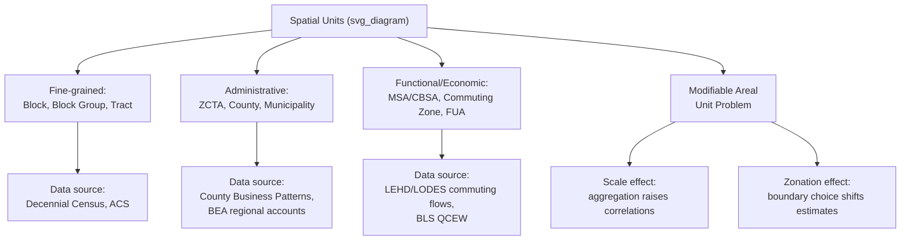

## Data Sources and Units of Spatial Analysis

### Overview

Empirical work in urban and regional economics requires choosing both a **unit of spatial analysis** (the geographic scale at which data is aggregated and measured) and a **data source** appropriate to the research question. Because urban and regional phenomena operate at multiple, often mismatched, geographic scales — labor markets, housing markets, commuting patterns, and administrative boundaries rarely coincide — the choice of spatial unit is a substantive methodological decision, not merely a data-availability convenience, and it directly affects estimated relationships (a concern formalized as the **Modifiable Areal Unit Problem**, discussed below).

### Common Units of Spatial Analysis

**Census block / census block group (United States)**

The smallest standard geographic unit in U.S. Census data, typically containing a few hundred to a few thousand residents. Used for fine-grained analysis of neighborhood composition, segregation, and very local amenities.

**Census tract**

A subdivision of a county designed to be relatively stable and homogeneous in population characteristics at the time of delineation, typically 1,200–8,000 residents. Census tracts are the most common unit for neighborhood-level economic and demographic analysis, since many datasets (income, poverty, housing characteristics) are published at this level.

**ZIP Code / ZIP Code Tabulation Area (ZCTA)**

Administrative postal delivery units, not designed for statistical or economic analysis; ZCTAs are a Census Bureau approximation of ZIP code boundaries used to enable tabulation. Frequently used due to data availability (many commercial and administrative datasets are ZIP-coded) but suffer from irregular size, non-contiguous boundaries in some cases, and boundaries that shift over time as postal service needs change — properties that make them a weaker analytical unit than tracts for many purposes. [Inference: this is a widely held methodological caution in applied urban economics rather than a strict data limitation with a single documented source.]

**Metropolitan Statistical Area (MSA) / Core-Based Statistical Area (CBSA)**

Defined by the U.S. Office of Management and Budget as a core urban area (population threshold) plus adjacent counties with high commuting integration to that core. This is the standard unit for "the city" as an economic (rather than municipal/administrative) entity, since it approximates a functional local labor market. Commuting Zones (constructed by economic researchers, notably in work associated with the USDA Economic Research Service and later academic labor-economics research) offer an alternative, purely commuting-pattern-based definition that does not rely on the population thresholds used by MSA definitions.

**County**

A stable, long-panel administrative unit widely used because of long historical data availability (decades of consistent boundaries in most U.S. states) and because many economic and demographic datasets (e.g., County Business Patterns) are reported at this level; a common trade-off is that counties can be too large to capture a single functional urban area (in low-density states) or too small (in dense metro areas with many small counties).

**City / municipality**

The legal, incorporated political jurisdiction — often does not correspond well to the economically integrated metropolitan area, since municipal boundaries frequently fail to expand alongside physical urban growth (a phenomenon central to the study of municipal fragmentation and its fiscal/political consequences).

**Functional Urban Area (FUA) / Larger Urban Zone (international contexts)**

Analogous international concepts to the MSA (e.g., used in OECD and Eurostat definitions), typically defined by combining a densely built-up urban core with its commuting hinterland, addressing the same core-plus-commuting-zone logic as U.S. MSAs but adapted to different national statistical and administrative systems.

### Comparison Table

| Unit | Typical scale | Designed for | Key limitation |
| --- | --- | --- | --- |
| Census block/block group | Few hundred–few thousand residents | Fine neighborhood detail | Small-sample noise; not economically meaningful boundaries |
| Census tract | ~1,200–8,000 residents | Neighborhood-level socioeconomic analysis | Boundaries can be redrawn between censuses, complicating panels |
| ZCTA | Varies widely | Approximating postal ZIP codes | Not designed for statistical analysis; boundary instability |
| County | Varies widely | Long historical panels; administrative data | Poor fit to functional urban areas in many contexts |
| MSA/CBSA | Metro area (core + commuting hinterland) | Functional local labor market | Boundaries redefined periodically; excludes some economically linked areas |
| Commuting Zone | Similar to MSA, commuting-based | Functional labor market, purely empirical | Less familiar to policymakers than MSA; multiple competing definitions exist |
| City/municipality | Legal jurisdiction | Political/fiscal analysis, local governance | Often does not match economic/physical urban extent |

### The Modifiable Areal Unit Problem (MAUP)

A foundational methodological concern in spatial analysis: statistical relationships estimated using areal (zone-based) data can change — sometimes substantially — depending on how the underlying geographic units are drawn, even when the underlying individual-level data are identical. MAUP has two distinct components:

**Scale effect**

Aggregating data to progressively larger spatial units (e.g., block → tract → county) tends to increase measured correlations between variables, because aggregation averages out idiosyncratic individual-level variation, leaving only the shared, systematic component of variation.

**Zonation effect**

Holding the scale (size) of spatial units roughly fixed, different ways of drawing the boundaries between units (e.g., different tract boundary configurations) can produce different estimated relationships between variables, even at the same level of aggregation.

MAUP implies that urban/regional economists should treat the choice of spatial unit as a modeling decision with real consequences for estimated coefficients, should test the sensitivity of key results to alternative levels of aggregation where feasible, and should be cautious about the **ecological fallacy** — inferring individual-level relationships from area-level (aggregated) correlations, which can be misleading if within-area heterogeneity in the relationship of interest is substantial.

### Major Data Sources

**U.S. Census Bureau data**

- **Decennial Census**: complete population count every 10 years; basic demographic variables
- **American Community Survey (ACS)**: annual survey (1-year and 5-year rolling estimates) covering income, employment, housing, commuting, and other socioeconomic variables at fine geographic resolution (down to tract level in the 5-year estimates)
- **County Business Patterns (CBP)**: establishment counts, employment, and payroll by industry and county, useful for measuring industry concentration and location quotients
- **LEHD (Longitudinal Employer-Household Dynamics) / LODES**: linked employer-employee administrative data enabling origin-destination commuting flow analysis at very fine geographic resolution (census block level), a major resource for modern urban labor market and commuting research

**Bureau of Labor Statistics (BLS)**

Regional and metro-area employment, unemployment, and wage data (e.g., the Quarterly Census of Employment and Wages, QCEW), widely used for regional business-cycle and labor market analysis.

**Bureau of Economic Analysis (BEA)**

Regional GDP, personal income, and regional economic accounts data by state and metro area, foundational for regional growth and convergence studies.

**Administrative/tax microdata**

Increasingly used in modern quantitative urban/regional economics research (e.g., matched employer-employee records, IRS migration data by county), providing very large samples and precise geographic identifiers, though typically accessed only through restricted-access research data centers due to confidentiality requirements.

**Real estate and housing transaction data**

Commercial datasets (e.g., property assessment records, multiple listing service transaction data, Zillow-published indices) used for hedonic housing price analysis and constructing repeat-sales house price indices.

**International sources**

Eurostat and OECD regional databases for cross-country regional analysis; national statistical agencies (e.g., ONS in the UK, national census bureaus elsewhere) for country-specific spatial data; satellite-derived nighttime lights data, increasingly used as a proxy for economic activity in contexts (particularly developing countries) where administrative economic data is sparse or unreliable.

**GIS and geospatial infrastructure**

Modern spatial analysis is typically conducted using Geographic Information Systems (GIS) software or geospatial statistical packages to manage, merge, and analyze data across multiple, non-matching geographic boundary systems (e.g., overlaying census tract data with commuting zone or MSA boundaries via spatial joins), and to construct explicit distance, adjacency, or spatial-weight matrices required for spatial econometric estimation.

### Practical Example: Constructing a Location Quotient

A common applied use of county- or MSA-level industry employment data (e.g., from County Business Patterns) is the **location quotient (LQ)**, which measures the relative concentration of an industry in a region compared to the national economy:

$$LQ_{i,r} = \frac{e_{i,r} / E_r}{e_{i,n} / E_n}$$

where $e_{i,r}$ is employment in industry $i$ in region $r$, $E_r$ is total regional employment, and $e_{i,n}$, $E_n$ are the corresponding national figures. An $LQ_{i,r} > 1$ indicates the region is more specialized in industry $i$ than the nation as a whole — a standard first step in identifying a region's "basic" (export) industries under economic base theory.

### Diagram: Spatial Units and Data Source Mapping (svg_diagram)

### Key Points

- The choice of spatial unit (block, tract, ZCTA, county, MSA, commuting zone) is a substantive modeling decision, not merely a data-availability issue, since economic phenomena (labor markets, commuting, housing markets) operate at scales that rarely match administrative boundaries.
- MSAs/CBSAs and commuting zones are designed to approximate functional local labor markets, in contrast to purely administrative units like counties, municipalities, and ZCTAs.
- The Modifiable Areal Unit Problem (scale effect and zonation effect) means estimated relationships can change with the choice of spatial aggregation, independent of the underlying true relationship, and researchers should be alert to the related ecological fallacy.
- Key U.S. data infrastructure includes the Census Bureau (Decennial Census, ACS, County Business Patterns, LEHD/LODES), BLS (QCEW), and BEA (regional accounts); administrative microdata and real estate transaction data are increasingly used in modern research.
- Location quotients are a standard applied tool for measuring regional industry specialization using employment data at the county or MSA level.

### Related Topics

- The Modifiable Areal Unit Problem and the ecological fallacy in depth
- Constructing and interpreting location quotients and shift-share analysis
- LEHD/LODES data and origin-destination commuting flow analysis
- Hedonic pricing models using real estate transaction data
- Spatial econometrics: spatial weight matrices and spatial autocorrelation
- Commuting zones vs. MSA definitions: methodological comparison
- GIS methods for merging mismatched geographic boundary systems
- Using nighttime lights data as a proxy for regional economic activity