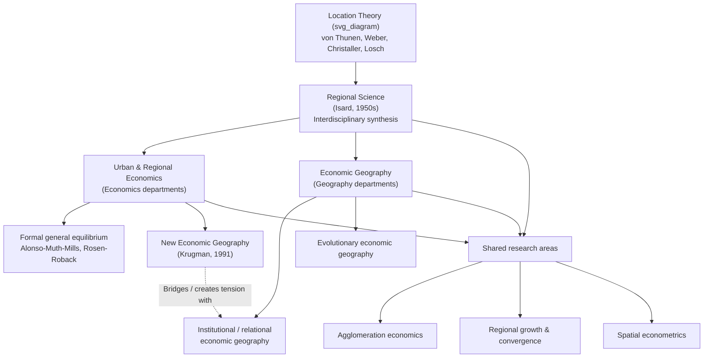

## Relationship to Economic Geography and Regional Science

### Overview

Urban and regional economics does not exist in isolation; it shares subject matter, methods, and history with two closely related fields — **economic geography** and **regional science** — while remaining distinguishable from each by disciplinary origin, methodological commitments, and typical unit of analysis. Understanding these boundaries (and their considerable overlap) helps clarify what is distinctively "economic" about urban and regional economics as opposed to adjacent spatial disciplines.

### Regional Science: The Founding Umbrella Discipline

**Origin and definition**

Regional science was founded by Walter Isard in the 1950s explicitly as an *interdisciplinary* field, synthesizing location theory (von Thünen, Weber), central place theory (Christaller, Lösch), and input-output analysis into a common analytical toolkit applicable to spatial economic problems. Isard founded the Regional Science Association in 1954 and intended the field to bridge economics, geography, sociology, and planning around a shared quantitative, formal-modeling approach to spatial questions.

**Relationship to urban/regional economics**

Regional science can be understood as the broader parent field from which modern urban and regional economics (as practiced within economics departments) emerged as the more narrowly economic strand. Where regional science retains an explicitly interdisciplinary identity (drawing on planning, sociology, geography, and operations research), urban and regional economics has increasingly converged with mainstream economics methodology — general equilibrium modeling, econometric identification strategies, and game-theoretic microfoundations — while regional science societies and journals (e.g., the *Journal of Regional Science*, *Papers in Regional Science*) continue to publish across this wider interdisciplinary range.

| Dimension | Regional Science | Urban/Regional Economics |
| --- | --- | --- |
| Origin | Isard, 1950s, explicitly interdisciplinary | Emerged from within economics, especially post-1960s |
| Disciplinary home | Standalone field spanning economics, geography, planning | Sub-field of economics departments |
| Methodological core | Location theory, input-output analysis, quantitative geography | Microeconomic theory, spatial equilibrium, applied econometrics |
| Typical publication venues | *Journal of Regional Science*, regional science association journals | Mainstream and field economics journals (e.g., *Journal of Urban Economics*, *Journal of Economic Geography*) |

### Economic Geography: The Geographic Discipline Counterpart

**Origin and definition**

Economic geography is traditionally a sub-field of the discipline of *geography*, concerned broadly with the spatial organization of economic activity — where production, trade, and economic institutions are located and why, and how spatial processes shape economic outcomes and vice versa. It has historically been less committed to formal mathematical modeling than economics-based urban/regional economics and has drawn more heavily on institutional, cultural, and qualitative methods, alongside quantitative spatial analysis.

**"New Economic Geography" as a bridge**

Paul Krugman's New Economic Geography (NEG), beginning with his 1991 core-periphery model, is a notable point of convergence: NEG imported the substantive questions long studied by economic geographers (why does economic activity cluster; why do "cores" and "peripheries" persist) into the formal, general-equilibrium modeling apparatus of mainstream trade theory (increasing returns, monopolistic competition, transport costs). This provoked some friction with traditional (geography-department) economic geographers, some of whom argued that NEG's stylized, tractable models sacrificed the richer institutional, historical, and social detail long central to geographic analysis of economic space. [Inference: this tension is a well-documented feature of the interdisciplinary reception of NEG, though characterizing the overall balance of opinion across the discipline of geography would require care not to overgeneralize.]

**Relational/institutional economic geography**

A distinct strand within geography departments (sometimes termed "relational economic geography" or associated with evolutionary economic geography) emphasizes path dependence, institutions, and the co-evolution of firms, networks, and regions, using methods drawn more from evolutionary economics, sociology of networks, and qualitative/institutional analysis than from the general-equilibrium modeling traditions of urban/regional economics or NEG.

### Comparative Summary of the Three Fields

| Dimension | Urban/Regional Economics | Economic Geography | Regional Science |
| --- | --- | --- | --- |
| Home discipline | Economics | Geography | Interdisciplinary (founded standalone) |
| Primary method | Formal microeconomic/general-equilibrium models, econometrics | Mix of quantitative and qualitative/institutional methods | Quantitative spatial modeling, input-output analysis |
| Typical unit of analysis | City, metro area, region (as economic unit) | Places, networks, and institutional spatial configurations | Regions, spatial systems, multi-region networks |
| Emphasis | Equilibrium, optimization, causal identification | Process, institutions, path dependence, power relations | Interdisciplinary synthesis of spatial economic tools |
| Key exemplar work | Alonso-Muth-Mills model; Rosen-Roback model | Path-dependence/evolutionary economic geography literature | Isard's "Location and Space-Economy" |

### Points of Convergence

Despite differing disciplinary origins, several major research areas are jointly claimed by all three fields, and much contemporary work is difficult to cleanly assign to a single discipline:

- **Agglomeration economics**: studied formally in urban economics (Marshallian externalities, localization/urbanization economies), in economic geography (clusters, industrial districts, institutional thickness), and in regional science (input-output-based cluster analysis)
- **Regional growth and convergence**: a central regional-economics topic that overlaps with economic geography's interest in uneven development and regional inequality
- **Spatial econometrics**: a methodological toolkit (spatial weight matrices, spatial autocorrelation correction) developed collaboratively across regional science and quantitative geography, now standard in applied urban/regional economics
- **Cluster and industrial district studies**: e.g., Silicon Valley, Third Italy industrial districts — studied using economic-geography institutional methods and urban-economics agglomeration-economics frameworks in parallel, often citing each other's findings

### Institutional Markers of the Distinction

A practical way to observe the boundary (albeit imperfectly) is through professional associations and journals:

- **Regional Science Association International (RSAI)** and its journals represent the interdisciplinary regional science tradition
- **Association of American Geographers (AAG)**, particularly its Economic Geography Specialty Group, and the *Journal of Economic Geography* represent the geography-department tradition (though the latter journal in practice publishes substantial economics-methodology work, illustrating the blurred boundary)
- **Journal of Urban Economics**, **Journal of Regional Science**, and mainstream economics journals (e.g., *American Economic Review*, *Quarterly Journal of Economics*) represent the economics-department tradition of urban/regional economics

### Diagram: Disciplinary Relationships (svg_diagram)

### Key Points

- Regional science, founded by Walter Isard in the 1950s, is the broader interdisciplinary field synthesizing location theory and input-output analysis, from which the more narrowly economics-based urban/regional economics emerged.
- Economic geography is traditionally housed in geography departments and has historically drawn more on institutional, qualitative, and evolutionary methods than the general-equilibrium modeling central to urban/regional economics.
- Krugman's New Economic Geography served as a major (and somewhat contested) bridge between formal economics modeling and the substantive questions long studied by economic geographers.
- Agglomeration economics, regional growth/convergence, spatial econometrics, and cluster studies are shared research areas actively pursued across all three fields, with substantial cross-citation and methodological borrowing.
- The distinction between the three fields is better understood as differing in disciplinary origin, institutional home, and characteristic methodology than as a sharp division in subject matter.

### Related Topics

- Walter Isard and the founding of regional science
- New Economic Geography and its reception among traditional economic geographers
- Evolutionary and relational economic geography frameworks
- Industrial districts and cluster theory (Marshallian districts, Third Italy)
- Spatial econometrics as a shared interdisciplinary toolkit
- Path dependence and lock-in in regional economic development
- Comparing journal traditions: Journal of Urban Economics vs. Journal of Economic Geography
- Institutional thickness and regional innovation systems