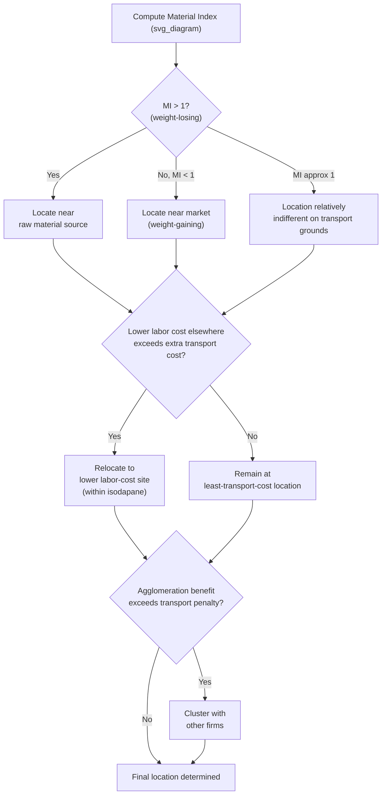

## Weber's Theory of Industrial Location

### Overview and Historical Context

Alfred Weber presented his theory of industrial location in *Über den Standort der Industrien* ("Theory of the Location of Industries," 1909). Where von Thünen's model determined *what* activity would occupy a given location on an agricultural plain, Weber inverted the question for manufacturing: given a firm producing a specific good, *where* should that firm locate to minimize total costs? Weber's framework is a **least-cost location theory**, built around minimizing the sum of transport costs, with labor cost and agglomeration economies treated as secondary modifying forces.

### Model Assumptions

Weber constructed a simplified spatial economy focused on isolating the transport-cost-minimizing location decision of an individual firm:

- Raw material sources (one or more) are located at fixed, known points in space
- A single market (point of final consumption) is located at a fixed, known point
- Transport cost is a linear function of both weight (of material shipped) and distance traveled, and may differ by material or by direction of shipment
- The firm chooses a single location for its production facility to minimize total transport cost (assembly of inputs plus distribution of output), subject to subsequent modification by labor-cost and agglomeration considerations
- Production technology has a fixed input-output ratio (fixed proportions of raw material per unit of output), determining how much material must be transported per unit of final product

### The Locational Triangle

The simplest version of Weber's model considers a firm using two raw material inputs (each at a distinct fixed location) to produce output sold at a single market location — forming a triangle of three fixed points. The firm's optimal location minimizes the total weighted transport cost:

$$\min_{\text{location}} \; TC = \sum_{i} w_i \cdot t_i \cdot d_i$$

where $w_i$ is the weight of material (or output) $i$ that must be transported, $t_i$ is the transport rate per unit weight per unit distance for that material/output, and $d_i$ is the distance from the chosen location to the relevant fixed point (material source $i$, or the market). The optimal point within the triangle is found using the **Varignon frame** solution — a physical/mechanical analogy in which weights proportional to $w_i t_i$ are attached via strings running over pulleys positioned at each of the three fixed points and joined at a common knot; the equilibrium position of the knot under gravity is the cost-minimizing location. This is mathematically equivalent to the **generalized Fermat point** (or weighted Fermat point) of the triangle, a solution technique later formalized more rigorously using vector calculus and linear programming for cases with more than three fixed points.

### The Material Index: Weight-Losing vs. Weight-Gaining Industries

Weber's most influential single concept is the **material index (MI)**, which classifies industries by whether they tend to locate near raw material sources or near the market, based on the weight relationship between inputs and outputs:

$$MI = \frac{\text{weight of localized raw materials}}{\text{weight of finished product}}$$

- **Material index > 1 (weight-losing industries)**: production consumes more weight in raw materials than it produces in final output (i.e., substantial weight is lost during processing, e.g., as waste, water, or byproducts). Weber predicted these industries locate near the raw material source, since transporting the bulky, weight-losing raw material is more costly than transporting the lighter finished product. Classic examples include ore smelting (where a large volume of ore yields a much smaller quantity of refined metal) and sugar refining from sugar beets.
- **Material index < 1 (weight-gaining industries, or "pure material" cases)**: production adds weight during processing (e.g., through the incorporation of a ubiquitous input like water, or through assembly of components sourced locally at the market), or uses only "ubiquities" — materials available everywhere at roughly equal cost. Weber predicted these industries locate near the market, since transporting the finished (heavier) product would be more costly than transporting the lighter or more localized inputs. Classic examples include soft drink bottling (water, a ubiquity, is added near the point of sale) and industries assembling many purchased components into a bulkier final product.
- **Material index ≈ 1**: transport costs of inputs and outputs are roughly balanced, and the firm's location is relatively indifferent between the raw material site and the market on transport-cost grounds alone, making it more sensitive to the secondary (labor, agglomeration) factors described below.

### Weber's Classification of Raw Materials

Weber distinguished raw materials by their spatial distribution, which directly determines whether they pull location toward a specific point or exert no locational pull at all:

- **Localized (or "pure") materials**: found only at specific locations (e.g., specific ore deposits, coal seams)
- **Ubiquities**: available everywhere at essentially the same cost (e.g., water, air, in Weber's original agrarian-industrial context), and therefore exert no locational pull, since they do not need to be "sourced" from a specific point

### Secondary Modifying Forces: Labor Cost

Having established the transport-cost-minimizing location (the point of least transport cost), Weber allowed for this location to be modified if an alternative site offers sufficiently low labor costs to offset the extra transport cost incurred by moving away from the least-transport-cost point. Weber formalized this using the concept of **isodapanes**: lines connecting locations with equal *additional* transport cost relative to the least-cost point. A firm will relocate to a lower-labor-cost site only if that site lies within the isodapane representing a transport-cost penalty smaller than the labor-cost saving available there — i.e., the labor-cost saving must exceed the extra transport cost incurred by the deviation.

$$\text{Relocate if: } \; \Delta(\text{labor cost}) > \Delta(\text{transport cost})$$

### Secondary Modifying Forces: Agglomeration

Weber also incorporated agglomeration (and deglomeration) forces as a further modifying influence: a firm might deviate from its transport-cost-minimizing (or labor-cost-adjusted) location to locate near other firms if the resulting agglomeration economies (shared infrastructure, labor pooling, input sharing — concepts elaborated more fully by Marshall and later agglomeration theorists) exceed the transport-cost penalty of the deviation, following the identical logic used for the labor-cost adjustment above.

### Diagram: The Locational Triangle (svg_diagram)

<svg xmlns="http://www.w3.org/2000/svg" viewBox="0 0 600 420">
<text x="300" y="24" text-anchor="middle" font-size="16" font-weight="bold" fill="#222">Weber's Locational Triangle (svg_diagram)</text>
<circle cx="120" cy="320" r="8" fill="#c0392b" />
<text x="90" y="350" font-size="12" fill="#333">Raw Material A</text>
<circle cx="480" cy="320" r="8" fill="#e67e22" />
<text x="440" y="350" font-size="12" fill="#333">Raw Material B</text>
<circle cx="300" cy="80" r="8" fill="#2980b9" />
<text x="270" y="65" font-size="12" fill="#333">Market</text>
<line x1="120" y1="320" x2="480" y2="320" stroke="#999" stroke-width="1.5" stroke-dasharray="4,3" />
<line x1="120" y1="320" x2="300" y2="80" stroke="#999" stroke-width="1.5" stroke-dasharray="4,3" />
<line x1="480" y1="320" x2="300" y2="80" stroke="#999" stroke-width="1.5" stroke-dasharray="4,3" />
<circle cx="305" cy="250" r="10" fill="#27ae60" stroke="#1e6e3e" stroke-width="2" />
<text x="320" y="245" font-size="12" font-weight="bold" fill="#1e6e3e">Optimal Plant Location</text>
<line x1="120" y1="320" x2="305" y2="250" stroke="#27ae60" stroke-width="2" />
<line x1="480" y1="320" x2="305" y2="250" stroke="#27ae60" stroke-width="2" />
<line x1="300" y1="80" x2="305" y2="250" stroke="#27ae60" stroke-width="2" />

<text x="300" y="390" text-anchor="middle" font-size="11" fill="#555">Location minimizes sum of weighted transport costs (w·t·d) to all three points</text>

</svg>

### Diagram: Weber's Locational Logic (svg_diagram)

### Illustrative Example

Consider a steel plant using iron ore (localized material, weight-losing due to slag removal during smelting) and coal (also localized, partially weight-losing) to produce steel sold in a distant market. Because both key inputs are weight-losing localized materials while the output (steel) is comparatively lighter per unit of value than the combined raw materials, Weber's framework predicts the plant will locate near the ore or coal source (historically observed in classic steel-producing regions located near coalfields, such as the Ruhr region in Germany or Pittsburgh in the United States), rather than near the final market for finished steel products. [Inference: Weber's own analysis, along with subsequent applications, uses classic heavy-industry cases like this as the paradigm illustration of weight-losing, material-oriented location; actual historical steel-industry siting also reflected additional factors — port access, existing infrastructure, and historical path dependence — beyond the pure Weberian material-index calculation.]

### Limitations and Later Critiques

Weber's model, while foundational, has recognized limitations subsequently addressed by later location theory:

- **Static, single-firm framework**: Weber's model does not incorporate strategic interaction between competing firms (addressed later by Hotelling's spatial competition model and subsequent industrial organization approaches to location)
- **Fixed technology assumption**: the fixed input-output (material) ratios assumed by Weber ignore the possibility of factor substitution (e.g., substituting capital or labor for transport-intensive material use), a limitation addressed by later neoclassical location models incorporating production function substitutability
- **Demand treated as fixed at a single point**: Weber's market is a single fixed point with fixed demand, ignoring that market size and demand elasticity can themselves depend on location (addressed later by demand-oriented location theories, e.g., Lösch's market-area approach)
- **Does not endogenize agglomeration**: Weber treats agglomeration economies as an exogenously given secondary force to check against transport-cost savings, rather than deriving agglomeration from an underlying microeconomic mechanism (addressed later by Marshall's three sources of agglomeration and modern New Economic Geography models)

### Significance for Later Theory

Weber's material index, locational triangle, and isodapane concepts remain standard reference points in introductory location theory and are commonly presented as the industrial-location counterpart to von Thünen's agricultural land-use model. Together, von Thünen (agricultural) and Weber (industrial) constitute the classical German location-theory tradition that Walter Isard later systematized into regional science, and that indirectly informs the modern treatment of firm location choice in urban and regional economics (e.g., the treatment of firms' location decisions in general equilibrium urban models, and transport-cost-based reasoning underlying agglomeration and industrial clustering analysis).

### Key Points

- Weber's 1909 theory determines a manufacturing firm's optimal location by minimizing total weighted transport costs to raw material sources and the market, using the locational triangle framework.
- The material index (weight of localized raw materials ÷ weight of finished product) classifies industries as weight-losing (locating near raw materials) or weight-gaining (locating near the market).
- Ubiquities (universally available materials) exert no locational pull, unlike localized materials tied to specific sites.
- Labor cost and agglomeration economies act as secondary modifying forces, causing a firm to deviate from the pure transport-cost-minimizing location only if the cost saving exceeds the resulting transport-cost penalty (formalized via isodapanes).
- Weber's model is limited by its static, single-firm, fixed-technology, single-market-point framework, later addressed by Hotelling's spatial competition model, Lösch's demand-oriented approach, and modern agglomeration theory.

### Related Topics

- Von Thünen's model of agricultural land use (the agricultural counterpart to Weber's industrial model)
- Central place theory (Christaller and Lösch) and demand-oriented location theory
- Hotelling's model of spatial competition
- Marshall's three sources of agglomeration economies
- Isard's synthesis of location theory into regional science
- Historical case studies of heavy-industry location (Ruhr, Pittsburgh, Pittsburgh-style steel regions)
- Modern firm-location choice models in urban and regional economics